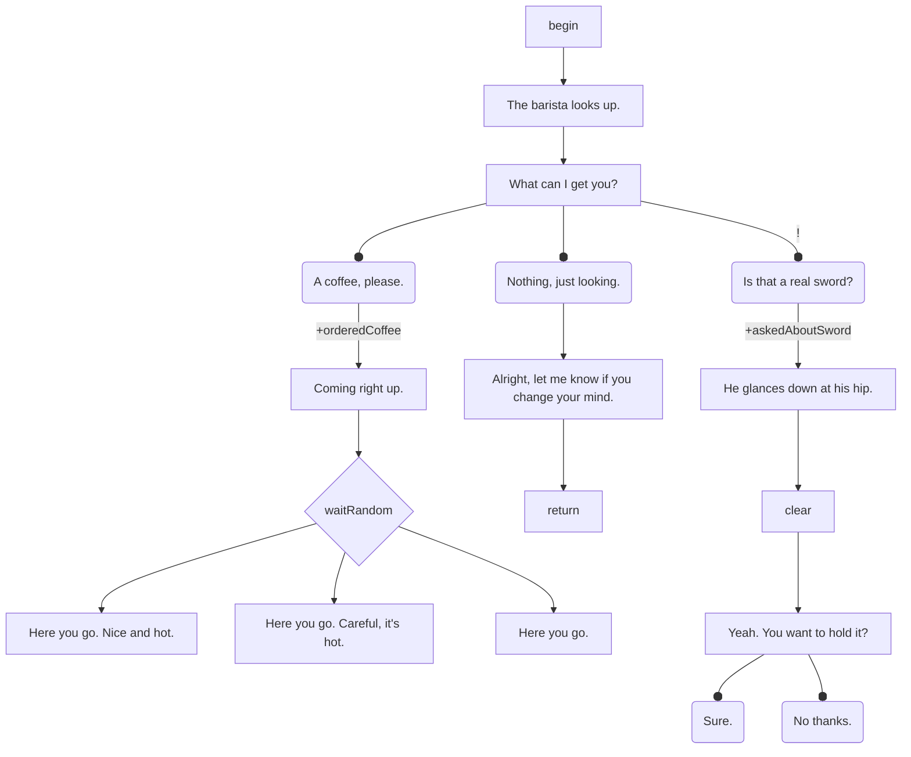

 Understory — Project Plan

> A monorepo containing packages for building static choose-your-own-adventure story websites.
> This document is the source of truth for an AI coding agent implementing this project.

---

## Table of Contents

1. [Overview](#overview)
2. [Architecture](#architecture)
3. [Schema](#schema)
4. [Package Details](#package-details)
5. [Mermaid Parser v1](#mermaid-parser-v1)
6. [Layouts & Transitions](#layouts--transitions)
7. [Client Config](#client-config)
8. [Display Modes](#display-modes)
9. [CSS & Theming](#css--theming)
10. [Project Structure](#project-structure)
11. [Setup & Development](#setup--development)
12. [Dependencies](#dependencies)
13. [CI/CD](#cicd)
14. [AI Agent Guidelines](#ai-agent-guidelines)

---

## Overview

Understory is a system for authoring and displaying interactive fiction as static websites. Stories are written as flowchart-like files (scenes), parsed at build time into JSON, and played back in the browser with a reactive UI.

**Core principles:**
- Framework-agnostic logic. Only `@probablyduncan/understory-astro` depends on a UI framework (SolidJS).
- Parsers are pluggable. The mermaid parser is the first, but others can be added trivially.
- The runtime is testable without a browser or DOM.
- Users update the package to get new features — they don't own/maintain template code.
- TDD throughout. Every package has its own test suite.
- Accessibility, reduced motion, and screen reader support are first-class concerns.
- Debug tooling is first-class, not an afterthought.

**End-user experience:**
```
pnpm create astro --template understory
```
A user gets a minimal project: a config file and a scenes directory. All logic, components, layouts, and rendering lives in the `@probablyduncan/understory-astro` package. They write `.mmd` files, and the site renders their story. To update, they run `pnpm update @probablyduncan/understory-astro`.

**A user's project looks like:**
```
my-story/
├── src/
│   ├── scenes/
│   │   ├── intro.mmd
│   │   └── chapter-1.mmd
│   └── layouts/              ← optional: custom layouts (tsx)
│       └── title-card.tsx
├── astro.config.mjs          ← ~5 lines, uses understory() integration
├── understory.config.ts      ← optional overrides
├── custom.css                ← optional CSS overrides (custom properties)
└── package.json              ← depends on @probablyduncan/understory-astro
```

The user does NOT have pages, components, or layouts in their project by default. The integration injects all of that at build time via Astro's `injectRoute` API. When you `pnpm update @probablyduncan/understory-astro`, you get new components, layouts, features, and bug fixes without touching project files.

---

## Architecture

```
┌─────────────────────────────────────────────────────────────────┐
│  @probablyduncan/understory-core                                │
│  - Types/schemas (StoryNode, Scene, etc.)                       │
│  - Parser interface                                             │
│  - Built-in parsers (mermaid v1)                                │
│  - Story validation utilities                                   │
│  - Pure TypeScript, zero framework deps                         │
└─────────────────────────┬───────────────────────────────────────┘
                          │
┌─────────────────────────┼───────────────────────────────────────┐
│  @probablyduncan/understory-runtime                             │
│  - Story traversal (pure, sync)                                 │
│  - Game state management                                        │
│  - Save/load (pluggable storage adapter)                        │
│  - Client config store (display mode, speed, theme, etc.)       │
│  - Event emitter                                                │
│  - Pure TypeScript, zero framework deps, no DOM                 │
└─────────────────────────┬───────────────────────────────────────┘
                          │
┌─────────────────────────┼───────────────────────────────────────┐
│  @probablyduncan/understory-astro                               │
│  - Astro integration (content loader, route injection)          │
│  - Static JSON endpoint generation for scenes                   │
│  - Config helper (defineStoryConfig)                            │
│  - Layout system (built-in + user-provided)                     │
│  - SolidJS UI rendering                                         │
│  - CSS themes via custom properties + cascade layers            │
│  - Text animation (typewriter, etc.)                            │
│  - Debug tools                                                  │
└─────────────────────────────────────────────────────────────────┘
```

**Dependency graph:**
- `@probablyduncan/understory-astro` → `@probablyduncan/understory-runtime` → `@probablyduncan/understory-core`
- No circular dependencies. Each layer only depends downward.

**Why 3 packages, not 4:**
- The "template" and "integration" are the same thing. The user's project is minimal config + content. Everything else lives in `@probablyduncan/understory-astro`.
- The Astro integration layer is small glue code. It's not worth separating from the UI components and layouts it serves.
- If someone wants to go headless (custom UI), they use `@probablyduncan/understory-core` + `@probablyduncan/understory-runtime` directly and skip `@probablyduncan/understory-astro` entirely.
- If a React/Vue/Svelte version is ever needed, it would be a new package (`@probablyduncan/understory-react`, etc.) consuming the same core + runtime.

---

## Schema

These types are the contract between all packages. They live in `@probablyduncan/understory-core`.

### Scene

```typescript
type Scene = {
    id: string;
    nodes: Record<string, StoryNode>;
    entryNodeId: string;
    vars: string[];
    layout?: string;
    meta?: {
        source?: string;
        title?: string;
    };
};
```

### Story Nodes

```typescript
type StoryNode =
    | TextNode
    | ChoiceNode
    | ImageNode
    | SceneNode
    | CustomNode
    | GateNode
    | ClearNode;

type NodeBase = {
    id: string;
    children: ChildRef[];
};

type TextNode = NodeBase & {
    type: "text";
    html: string;
    style?: string;  // e.g. "default", "emphasis", "whisper", "narrator"
};

type ChoiceNode = NodeBase & {
    type: "choice";
    html: string;
    label?: string;
    style?: string;
    clear?: boolean;
    repeat?: "always" | "fade" | "once";
    onChoose?: StateEffect[];
};

type ImageNode = NodeBase & {
    type: "image";
    src: string;
    alt: string;
    style?: string;
};

type SceneNode = NodeBase & {
    type: "scene";
    sceneId: string;
};

type CustomNode = NodeBase & {
    type: "custom";
    name: string;
    params?: Record<string, unknown>;
};

type GateNode = NodeBase & {
    type: "gate";
    strategy?: "first" | "random";
};

type ClearNode = NodeBase & {
    type: "clear";
};
```

**`ChoiceNode.repeat` values:**
- `"once"` — the choice is hidden after it has been selected once (condition: `visited:<nodeId>` is falsy)
- `"fade"` — the choice remains visible but is styled as visited/dimmed after selection
- `"always"` — the choice is always shown in its normal state regardless of visit history

**`ClearNode` traversal:** A `ClearNode` is handled specially by the engine — it is NOT emitted as a `render` result. When the traverser encounters a `ClearNode`, it emits a `clear` engine event (which the UI uses to wipe the dialogue history), then immediately continues traversal to the `ClearNode`'s children. A `ClearNode` may have multiple children; they are traversed normally after the clear.

**`SceneNode` traversal:** When the traverser encounters a `SceneNode`, it pushes the return position onto the scene path stack and loads the referenced scene starting from its `entryNodeId`. When that sub-scene reaches a `return` node (a `GateNode` with no eligible children), the engine pops the stack and resumes from the position after the `SceneNode`.

**`GateNode` semantics:** A `GateNode` evaluates its children's conditions and selects one to traverse:
- `strategy: "first"` — selects the first child whose condition is met (or the first unconditional child). This is the default for bare IDs and `return`.
- `strategy: "random"` — selects randomly from children **whose conditions are met** (not from all children). Unconditional children are always eligible.
- If no children have their conditions met, the gate has no eligible children. For a node with `id` starting with `return`, this triggers scene exit. For any other gate, encountering zero eligible children is a runtime error — the engine emits an `error` event.

### Edges (ChildRef)

```typescript
type ChildRef = {
    nodeId: string;
    delay?: Delay;
    condition?: StateCondition;
    effects?: StateEffect[];
};

type Delay = {
    beats: number;
    style?: "dots" | "pause" | "fade" | string;
};
```

**When `ChildRef.effects` are applied:** Effects on a `ChildRef` are applied immediately when that edge is traversed — before the target node is rendered. This means a flag set by traversing an edge is visible to any condition checks on the target node's own outgoing edges.

### State System

State variables can hold three value types:

```typescript
type StateValue = boolean | string | number;
```

A variable that hasn't been set is `undefined` (not in the state map). This is distinct from `false` — `hasKey` being `undefined` means "never encountered," while `hasKey` being `false` means "explicitly set to false."

**Conditions (checking state):**

```typescript
type StateCondition =
    | { type: "check"; name: string; op: "truthy" | "falsy" }
    | { type: "compare"; name: string; op: "==" | "!=" | ">" | "<" | ">=" | "<="; value: StateValue }
    | { type: "and"; conditions: StateCondition[] }
    | { type: "or"; conditions: StateCondition[] };
```

**Effects (mutating state):**

```typescript
type StateEffect =
    | { type: "set"; name: string; value: StateValue }
    | { type: "unset"; name: string }
    | { type: "increment"; name: string; by: number }
    | { type: "toggle"; name: string };
```

**Visited-choice tracking:** Choice visit history is stored separately from state variables, in `GameState.visitedChoices` (a `Record<string, string[]>` mapping sceneId → nodeId[]). It is NOT stored as state variables. The `visited:<nodeId>` syntax in edge text is a parser-level shorthand (see Mermaid Parser — Special shorthand) that the parser converts into a `{ type: "check", name: "visited:<sceneId>:<nodeId>", op: "falsy" }` condition. The engine writes a corresponding `visited:<sceneId>:<nodeId>` entry into the state map whenever a choice is selected, keeping the visited-choice record accessible to both the state condition evaluator and the `GameState.visitedChoices` structure.

### Runtime Types (in @probablyduncan/understory-runtime, not core)

```typescript
type NodePosition = {
    sceneId: string;
    nodeId: string;
};

type ResolvedChoice = ChoiceNode & ChildRef & NodePosition & {
    visited: boolean;
    enabled: boolean;
};

type TraversalResult =
    | { type: "render"; node: StoryNode & ChildRef & NodePosition }
    | { type: "choices"; choices: ResolvedChoice[] }
    | { type: "end" }
    | { type: "exit-scene"; returnTo: NodePosition };

interface StorageAdapter {
    get(key: string): string | null;
    set(key: string, value: string): void;
    remove(key: string): void;
}
```

**Note on `StorageAdapter` synchronicity:** The interface is intentionally synchronous. This covers `localStorage` (the default) and in-memory storage (for testing) without requiring Promise handling in the engine's traversal loop. IndexedDB or other async stores are out of scope for v1; if needed in future they would require wrapping with a sync cache layer.

**Note on `TraversalResult` and `ClearNode`:** `ClearNode` is not returned as a `render` result. The traverser handles it internally, emits the `clear` engine event, and continues to the node's children before returning the next non-clear result.

---

## Package Details

### @probablyduncan/understory-core

**Purpose:** Pure TypeScript library for story data types and parsing.

**Exports:**
- All types listed in the Schema section above
- `Parser` interface
- Built-in parsers (mermaid v1)
- `validateScene(scene: Scene): ValidationResult` — checks for dead ends, missing node references, unreachable nodes, undefined vars
- `validateStory(scenes: Scene[]): ValidationResult` — cross-scene validation (missing scene references, orphan scenes)

**Parser interface:**
```typescript
interface Parser {
    extensions: string[];
    parse(content: string, id: string, options?: ParserOptions): Scene;
}

type ParserOptions = {
    assets?: Map<string, "image" | "custom">;
    customNodes?: string[];
    smartQuotes?: boolean;
};
```

**Key constraints:**
- No Node.js APIs (no `fs`, no `path`) — parsers receive string content, not file paths
- No DOM APIs
- Synchronous parse functions — the integration layer handles async file reading

**Testing strategy:**
- Unit tests per parser with fixture files (`.mmd` files in a `__fixtures__` directory)
- Unit tests for validation utilities
- Snapshot tests for parser output (input fixture → expected Scene JSON)
- Unit tests for edge text parsing (conditions, effects, combinators, precedence, parentheses)
- Unit tests for inline markdown utility
- Tests run in Node via vitest

**Entry points:**
```
@probablyduncan/understory-core           → types + validation
@probablyduncan/understory-core/parsers   → all built-in parsers + Parser interface
```

---

### @probablyduncan/understory-runtime

**Purpose:** Framework-agnostic game engine. Manages traversal, state, save/load, config, events.

**Exports:**
- `createEngine(config: EngineConfig): StoryEngine`
- `createConfigStore(storage: StorageAdapter, defaults?: Partial<UserConfig>): ConfigStore`
- Runtime types (`NodePosition`, `ResolvedChoice`, `TraversalResult`, etc.)
- `StorageAdapter` interface
- `LocalStorageAdapter` — default browser adapter
- `MemoryStorageAdapter` — for testing
- `resolveNext(children, scene, state): TraversalResult` — the pure traversal function, exported for testing and advanced use

**StoryEngine API:**
```typescript
interface StoryEngine {
    // Lifecycle
    init(): Promise<void>;
    destroy(): void;

    // Scene loading
    registerSceneLoader(loader: (id: string) => Promise<Scene>): void;

    // Traversal
    start(sceneId?: string): Promise<void>;
    choose(choice: ResolvedChoice): Promise<void>;
    goToNode(position: NodePosition): Promise<void>;

    // State
    getState(): GameState;
    isConditionMet(condition: StateCondition): boolean;
    getVar(name: string): StateValue | undefined;
    setVar(name: string, value: StateValue): void;
    unsetVar(name: string): void;

    // Save/Load
    save(slot?: string): void;
    load(slot?: string): boolean;  // returns false if no save found
    listSaves(): string[];
    reset(): void;

    // Events
    on<K extends keyof EngineEvents>(event: K, handler: EngineEvents[K]): () => void;
    off<K extends keyof EngineEvents>(event: K, handler: EngineEvents[K]): void;
}

type EngineEvents = {
    render: (node: StoryNode & ChildRef & NodePosition) => void;
    choices: (choices: ResolvedChoice[]) => void;
    clear: () => void;
    enterScene: (scene: Scene) => void;
    exitScene: (returnTo: NodePosition) => void;
    stateChanged: (state: GameState) => void;
    end: () => void;
    error: (error: Error) => void;
};
```

**`engine.init()` and async lifecycle:** `init()` must be awaited before calling `start()`. In the Solid component layer, the root layout component calls `init()` during mount and renders a loading state until init resolves. The engine should not emit any events before `init()` completes.

**ConfigStore API:**
```typescript
interface ConfigStore {
    get(): UserConfig;
    set(partial: Partial<UserConfig>): void;
    reset(): void;
    subscribe(handler: (config: UserConfig) => void): () => void;
}

type UserConfig = {
    displayMode: "stream" | "paged" | "instant";
    textSpeed: number;        // multiplier: 0.5 = slow, 1 = default, 2 = fast, 0 = instant
    theme: "light" | "dark" | "system";
    reduceMotion: boolean;    // auto-detected from prefers-reduced-motion, user-overridable
    fontSize: "sm" | "md" | "lg";
};
```

**Internal architecture:**
- `StoryTraverser` — pure function: given (children, scene, gameState) → returns `TraversalResult`. No side effects. Exported as `resolveNext` for direct testing and advanced use.
- `GameState` — manages state variables (`Map<string, StateValue>`), visited choices (`Record<string, string[]>`), scene path stack, choice history. Fully serializable.
- `SaveManager` — handles serialization/deserialization, version field, migration functions.
- `ConfigStore` — user preferences, separate lifecycle from game state, persists across resets.
- `EventBus` — typed event emitter with `on`/`off`/`once` support.

**State evaluation:**

```typescript
// Truthy: value exists and is not false, not 0, not ""
function isTruthy(value: StateValue | undefined): boolean {
    return value !== undefined && value !== false && value !== 0 && value !== "";
}

function evaluateCondition(condition: StateCondition, state: Map<string, StateValue>): boolean {
    switch (condition.type) {
        case "check": {
            const val = state.get(condition.name);
            return condition.op === "truthy" ? isTruthy(val) : !isTruthy(val);
        }
        case "compare": {
            const current = state.get(condition.name);
            if (current === undefined) return false;  // undefined fails all comparisons
            switch (condition.op) {
                case "==": return current === condition.value;
                case "!=": return current !== condition.value;
                case ">":  return (current as number) > (condition.value as number);
                case "<":  return (current as number) < (condition.value as number);
                case ">=": return (current as number) >= (condition.value as number);
                case "<=": return (current as number) <= (condition.value as number);
            }
        }
        case "and":
            return condition.conditions.every(c => evaluateCondition(c, state));
        case "or":
            return condition.conditions.some(c => evaluateCondition(c, state));
    }
}

function applyEffect(effect: StateEffect, state: Map<string, StateValue>): void {
    switch (effect.type) {
        case "set":
            state.set(effect.name, effect.value);
            break;
        case "unset":
            state.delete(effect.name);
            break;
        case "toggle": {
            const current = state.get(effect.name);
            state.set(effect.name, !current);
            break;
        }
        case "increment": {
            const num = (state.get(effect.name) as number) ?? 0;
            state.set(effect.name, num + effect.by);
            break;
        }
    }
}
```

**Key constraints:**
- No DOM APIs (no `document`, no `window`, no `localStorage` directly — always uses `StorageAdapter`)
- No framework imports (no Solid, no React, nothing)
- Depends only on `@probablyduncan/understory-core`
- `StoryTraverser`/`resolveNext` must be pure and synchronous
- Config and save state use separate storage keys and separate stores

**Testing strategy:**
- Unit tests for `resolveNext` / `StoryTraverser` (given scene + state → expected traversal result)
- Unit tests for `GameState` (condition evaluation with all operators, effect application, serialization round-trip)
- Unit tests for `ConfigStore` (defaults, partial updates, persistence, subscribe/notify)
- Unit tests for `SaveManager` (versioning, migration between versions)
- Integration tests for `StoryEngine` (full traversal sequences using `MemoryStorageAdapter` and mock scene loader)
- All tests run in Node via vitest, no browser needed

**Save data format (v1):**
```typescript
type SaveData = {
    version: 1;
    state: Record<string, StateValue>;           // all state variables (includes visited:* entries)
    visitedChoices: Record<string, string[]>;     // sceneId → nodeId[] (redundant mirror for fast lookup)
    scenePath: NodePosition[];                   // nested scene stack
    lastClearPosition: NodePosition | null;
    choicesSinceClear: NodePosition[];           // ordered list of choices made since last clear, for replay
};
```

**Fast-forward replay:** When loading a save into a post-`clear` state, the engine replays `choicesSinceClear` to reconstruct the current dialogue without re-displaying it. The engine traverses in "silent" mode (no `render` events) until it reaches the last position, then resumes normally. This is how the displayed dialogue matches the saved state after a page reload.

**Storage keys:**
- `{prefix}:save` — default save slot (game state, cleared on reset)
- `{prefix}:save:{slotName}` — named save slots
- `{prefix}:config` — user preferences (persists forever, survives game reset)

Where `{prefix}` defaults to `"understory"`, configurable via `StoryConfig.storagePrefix`.

---

### @probablyduncan/understory-astro

**Purpose:** The complete Astro package: integration + UI rendering + themes + debug tools. This is what end users install.

**How it works (the Starlight model):**

The package exports an `understory()` function that returns an Astro integration. When the user adds it to their `astro.config.mjs`, the integration:
1. Registers a content loader that watches `.mmd` files, parses them using `@probablyduncan/understory-core`, and validates output
2. Injects routes via Astro's `injectRoute()` API — the user's project has no pages
3. Generates static JSON endpoints for each scene
4. Injects client scripts (runtime + Solid rendering)
5. Applies base styles and user's custom CSS
6. Provides a layout system (built-in + user-defined) for per-scene presentation and transitions

**User's astro.config.mjs:**
```javascript
import { defineConfig } from "astro/config";
import understory from "@probablyduncan/understory-astro";

export default defineConfig({
    integrations: [understory()],
});
```

**User's understory.config.ts (optional):**
```typescript
import { defineStoryConfig } from "@probablyduncan/understory-astro/config";

export default defineStoryConfig({
    scenes: "src/scenes",
    startScene: "intro",
    debug: true,
    defaults: {
        displayMode: "stream",
        theme: "dark",
    },
});
```

**What happens when `understory.config.ts` is absent:** The integration uses all defaults. The only required field is `startScene`. If no config file exists and no `startScene` is provided, the integration throws a descriptive error at build time (not silently at runtime): `UnderstoryConfigError: startScene is required. Create an understory.config.ts file in your project root.`

**Integration responsibilities:**
- `understory()` — Astro integration function
- `defineStoryConfig()` — typed config helper, exported from the `./config` subpath
- Content loader:
  - Watches `config.scenes` directory for `.mmd` files (and other parser extensions)
  - Reads file content, determines parser by extension, calls `parser.parse()`
  - Runs `validateScene()` on output; logs warnings/errors to terminal during dev
  - On parse error: logs error with file path + line number, skips that scene (does not crash dev server)
  - On file change (dev watcher): re-parses only the changed file
- Route injection:
  - `GET /api/scenes/[id].json` — static endpoint per scene (prerendered at build)
  - `GET /` — main story page
  - `GET /debug` — debug page, injected only when **both** `config.debug === true` **and** `import.meta.env.DEV === true`
- Provides virtual module `virtual:understory/config` for accessing resolved config in client code
- Layout system:
  - Provides at least one built-in default layout
  - Allows per-scene layout selection via `Scene.meta.layout`
  - Allows users to register and/or provide custom layouts
  - Validates unknown layout names at build time when possible, and falls back at runtime

**Build note:** The `tsc` build compiles `index.ts`, `config.ts`, `loader.ts`, and `endpoints.ts` into `dist/`. The `.astro` pages and `.tsx` components are NOT compiled by tsc — they remain as source files in the package. Astro processes them at the user's build time when resolving injected routes from `node_modules`. The `tsconfig.json` for this package excludes `.astro` files from compilation and includes JSX settings for type-checking `.tsx` files.

The `.astro` and `.tsx` source files are included in the published package via the `files` field.

**Testing strategy:**
- Unit tests for loader logic (mock filesystem, verify correct parser is called, verify validation runs)
- Integration tests: minimal Astro project in `__fixtures__/` that builds successfully and produces expected JSON output
- E2E tests with Playwright:
  - Navigate scenes, make choices, verify correct text appears
  - Save/load persistence across page reload
  - Keyboard navigation (number keys for choices, space to skip, enter to continue)
  - Display mode switching
  - Theme switching
  - Reduced motion behavior
- Accessibility audits with axe-core in Playwright tests

---

## Mermaid Parser v1

**File:** `packages/core/src/parsers/mermaid/index.ts`

**Input:** String contents of a `.mmd` file containing a Mermaid flowchart diagram.

**Output:** A `Scene` object.

### Why a Custom Parser

`@mermaid-js/parser` does NOT support flowcharts. It only supports: info, packet, pie, architecture, gitGraph, radar, railroad, treeView, treemap, wardley, cynefin. Flowcharts are still parsed by the legacy parser inside the main `mermaid` package, which requires a DOM environment and DOMPurify.

The subset of Mermaid flowchart syntax we use is small enough to parse with a custom line-by-line parser (~300 lines). This eliminates `mermaid` (2.5MB+), `dompurify`, the pnpm override hack, and makes the parser synchronous and trivially testable.

Files remain valid Mermaid flowcharts — the VS Code Mermaid preview extension renders them correctly. Our semantic layer (edge text like `|hasKey, +gold|`) appears as label text in the preview, which is fine.

### Parsing Strategy

Line-by-line parser. Each line is matched against patterns in order:

1. **Front-matter scene metadata comment**: a comment line matching `%% layout: <name>` (typically at the top of the file) → record `scene.meta.layout = <name>`
2. **Comment**: starts with `%%` → skip
3. **Header**: `flowchart TD` or `flowchart LR` → validate it's a flowchart, skip (direction is ignored)
4. **Edge statement**: matches pattern `id1 ARROW id2` or `id1 ARROW|text| id2`
5. **Standalone vertex**: matches `id[text]` or `id(text)` etc. (vertex declared without an edge)

The parser maintains:
- A `Map<string, VertexInfo>` — vertex ID → shape + text (populated when first seen)
- An `Array<EdgeInfo>` — all edges in declaration order
- Scene-level metadata from front-matter comments (currently layout only)

After all lines are parsed, a second pass converts vertices + edges into the `Scene` structure.

### Tokenizer Output (Internal)

```typescript
type VertexInfo = {
    id: string;
    text?: string;            // raw text content (before markdown processing)
    shape: "square" | "round" | "diamond" | "subroutine" | "stadium" | "none";
};

type EdgeInfo = {
    sourceId: string;
    targetId: string;
    text?: string;            // raw edge label text
    head: "arrow" | "circle" | "cross" | "open";
    stroke: "normal" | "thick" | "dotted" | "invisible";
    length: number;           // number of dashes/equals (minimum 1)
};
```

### Mapping Rules

**Vertex shape → Node type:**

| Shape | Syntax | Node type |
|---|---|---|
| Square | `id[text]` | `TextNode` |
| Round | `id(text)` | `ChoiceNode` |
| Diamond | `id{text}` | `GateNode { strategy: "random" }` |
| Subroutine | `id[[text]]` | `TextNode { style: "emphasis" }` |
| Stadium | `id([text])` | `ChoiceNode { style: "minor" }` |
| Subroutine double-bracket | `id[[sceneId]]` | `SceneNode { sceneId: text }` when text matches a known scene ID (resolved by the integration layer via `ParserOptions.assets` — see Asset Resolution below) |
| None | bare `id` | `GateNode { strategy: "first" }` OR reserved keyword |

**Reserved keywords** (bare IDs with no shape that have special meaning):

| Keyword | Behavior |
|---|---|
| `begin` | Not emitted as a node. The edge `begin --> X` sets `scene.entryNodeId = "X"`. If no `begin` keyword exists, the source of the first edge declared in the file is the entry node. |
| `return` | Emitted as `GateNode { id: "return", children: [], strategy: "first" }`. When the engine encounters a gate whose ID starts with `return` and has no eligible children, it exits the scene (pops the scene stack). |
| `clear` | Emitted as `ClearNode { id: "clear", children: [...] }`. Children are whatever edges leave this node. |
| `reset` | Emitted as `CustomNode { id: "reset", name: "reset" }`. |

**Duplicate reserved keywords:** If a reserved keyword is used multiple times, the parser uses the user's explicit suffixed form (e.g., `clear1`, `clear2`, `return_boss`) when present. When the parser auto-generates IDs for unsuffixed duplicates, it appends `_2`, `_3`, etc.: `clear`, `clear_2`, `clear_3`. The parser checks if an ID *starts with* the keyword to determine special behavior, so both `clear_2` and `clear2` are valid and treated as `ClearNode`s.

**Edge head → Semantics:**

| Head | Syntax | Meaning |
|---|---|---|
| Arrow | `-->` | Standard traversal to next node |
| Circle | `--o` | Hint that target is a choice. If target vertex has `[]` shape, override to `ChoiceNode`. If target already has `()`, redundant. |
| Cross | `--x` | Reserved for future use. Treated as standard traversal for now. |
| Open | `---` | Standard traversal (no arrowhead rendered in preview, but functionally identical to `-->`) |

**Edge stroke → Delay style:**

| Stroke | Syntax | `Delay.style` |
|---|---|---|
| Normal | `-->` | `"dots"` |
| Thick | `==>` | `"pause"` |
| Dotted | `-.->` | `"fade"` |
| Invisible | `~~~` | No delay object emitted (immediate transition) |

**Edge length → Delay beats:**

Length is determined by counting the repeated characters in the arrow body:
- `-->` = length 1, `Delay.beats = 0`
- `--->` = length 2, `Delay.beats = 1`
- `---->` = length 3, `Delay.beats = 2`
- General rule: `beats = length - 1`

For thick/dotted strokes, same counting applies to `=` or `.` characters.

### Edge Text: Conditions & Effects Syntax

Edge text (the content between `|...|` in Mermaid edge labels) is a mini-expression language for checking and mutating state.

**Combinators:**

| Syntax | Meaning |
|---|---|
| `,` | AND — all comma-separated expressions must be true |
| `OR` | OR keyword (case-insensitive) — at least one side must be true |
| `(...)` | Parentheses for explicit grouping |

**Precedence:** `,` (AND) binds tighter than `OR`. Parentheses override precedence.

Examples:
- `hasKey, level > 5` → `{ type: "and", conditions: [check(hasKey), compare(level > 5)] }`
- `hasKey OR profession == poet` → `{ type: "or", conditions: [check(hasKey), compare(profession == poet)] }`
- `(hasKey OR hasPick), !doorOpened` → `{ type: "and", conditions: [or(hasKey, hasPick), check(!doorOpened)] }`
- `hasKey, (level > 5 OR profession == thief)` → `{ type: "and", conditions: [check(hasKey), or(compare(level>5), compare(profession==thief))] }`

**Conditions (read state):**

| Syntax | Meaning | Produces |
|---|---|---|
| `hasKey` | Truthy check | `{ type: "check", name: "hasKey", op: "truthy" }` |
| `!hasKey` | Falsy check | `{ type: "check", name: "hasKey", op: "falsy" }` |
| `hasKey == true` | Strict equality to boolean | `{ type: "compare", name: "hasKey", op: "==", value: true }` |
| `hasKey == false` | Strict equality to boolean | `{ type: "compare", name: "hasKey", op: "==", value: false }` |
| `profession == poet` | String equality | `{ type: "compare", name: "profession", op: "==", value: "poet" }` |
| `profession != poet` | String inequality | `{ type: "compare", name: "profession", op: "!=", value: "poet" }` |
| `level > 5` | Numeric greater than | `{ type: "compare", name: "level", op: ">", value: 5 }` |
| `level >= 10` | Numeric greater or equal | `{ type: "compare", name: "level", op: ">=", value: 10 }` |
| `level < 3` | Numeric less than | `{ type: "compare", name: "level", op: "<", value: 3 }` |
| `visits <= 2` | Numeric less or equal | `{ type: "compare", name: "visits", op: "<=", value: 2 }` |

**Effects (write state):**

| Syntax | Meaning | Produces |
|---|---|---|
| `+hasKey` | Set to `true` | `{ type: "set", name: "hasKey", value: true }` |
| `-hasKey` | Unset (remove from state entirely) | `{ type: "unset", name: "hasKey" }` |
| `~hasKey` | Toggle boolean | `{ type: "toggle", name: "hasKey" }` |
| `hasKey = true` | Set to `true` | `{ type: "set", name: "hasKey", value: true }` |
| `hasKey = false` | Set to `false` | `{ type: "set", name: "hasKey", value: false }` |
| `profession = poet` | Set to string `"poet"` | `{ type: "set", name: "profession", value: "poet" }` |
| `level = 5` | Set to number `5` | `{ type: "set", name: "level", value: 5 }` |
| `level++` | Increment by 1 | `{ type: "increment", name: "level", by: 1 }` |
| `level--` | Decrement by 1 | `{ type: "increment", name: "level", by: -1 }` |
| `level += 3` | Increment by 3 | `{ type: "increment", name: "level", by: 3 }` |
| `level -= 2` | Decrement by 2 | `{ type: "increment", name: "level", by: -2 }` |

**Special shorthand:**

| Syntax | Meaning |
|---|---|
| `!` (bare, alone on the edge) | Shorthand for "show this choice only if it hasn't been chosen before." Produces `condition: { type: "check", name: "visited:<sceneId>:<targetId>", op: "falsy" }` on the `ChildRef`, and sets `repeat: "once"` on the target `ChoiceNode`. The `visited:<sceneId>:<targetId>` key is written into the state map by the engine when the choice is selected, so the condition evaluator can resolve it using the normal state map lookup. |

**Value type inference** (for right-hand side of `=` and `==`):
- `true` / `false` → boolean
- Matches `/^-?\d+(\.\d+)?$/` → number
- Anything else → string (no quotes needed)

Strings never need quotes. The value is everything after the operator, trimmed. Limitation: string values cannot contain `,` or the word ` OR ` (with surrounding spaces) since those are expression delimiters. This is acceptable — state values are typically simple identifiers like `poet`, `warrior`, `red`.

**Distinguishing conditions from effects** (parser logic):

The parser identifies each token by checking in this order:
1. Starts with `+` → effect (set true)
2. Starts with `-` followed by a name (not a digit) → effect (unset)
3. Starts with `~` → effect (toggle)
4. Contains `++` → effect (increment)
5. Contains `--` → effect (decrement)
6. Contains `+=` → effect (increment by N)
7. Contains `-=` → effect (decrement by N)
8. Contains `==` → condition (comparison)
9. Contains `!=` → condition (comparison)
10. Contains `>=` → condition (comparison)
11. Contains `<=` → condition (comparison)
12. Contains `>` (not `>=`) → condition (comparison)
13. Contains `<` (not `<=`) → condition (comparison)
14. Contains `=` (not `==`, `!=`, `>=`, `<=`, `+=`, `-=`) → effect (assignment)
15. Starts with `!` (with content after) → condition (falsy check)
16. Is exactly `!` → special "once" shorthand
17. Bare name → condition (truthy check)

Order matters — multi-character operators (`==`, `!=`, `>=`, `<=`, `+=`, `-=`) are checked before single-character operators (`=`, `>`, `<`).

**Where effects are placed:**
- If the target node is a `ChoiceNode`: effects go on `ChoiceNode.onChoose` (applied when choice is selected)
- Otherwise: effects go on `ChildRef.effects` (applied when edge is traversed, before the target node is rendered)

**Scope prefixing:**
- Variable names without a `:` separator are automatically prefixed with the scene ID: `hasKey` in scene `barista` → `barista:hasKey`
- Variable names containing `:` are left as-is: `global:gameStarted` remains `global:gameStarted`
- This prevents accidental collisions between scenes while allowing explicit cross-scene state
- The `visited:` shorthand uses the full `visited:<sceneId>:<targetId>` key (already contains `:`) and is therefore not prefixed again

**Text processing (for vertex text, not edge text):**
- Vertex text content is processed through the inline markdown utility (bold, italic, code, links only — no block elements)
- Smart quotes are applied by default: straight `'` and `"` → curly equivalents, contextually
- Result stored in the `html` field of the node
- Smart quotes can be disabled via `ParserOptions.smartQuotes = false`

**Asset resolution:**

The parser resolves certain vertex texts to non-text node types based on `ParserOptions`:

- If vertex text exactly matches a key in `ParserOptions.assets`:
  - `assets.get("sword.webp") === "image"` → `ImageNode { src: "sword.webp", alt: "" }`
  - `assets.get("confetti") === "custom"` → `CustomNode { name: "confetti" }`
- Keys in `ParserOptions.assets` are bare filenames or identifiers — no path prefix. The integration layer builds this map from the project's asset directory and passes it to the parser. The parser NEVER accesses the filesystem.
- `ImageNode.alt` defaults to `""` (treated as decorative by screen readers). Authors who need descriptive alt text should use a `CustomNode` handler instead, or provide alt text via a future parser syntax extension.

**`vars` field population:**
- After all nodes are built, collect all unique variable names referenced in any `StateCondition` or `StateEffect` across all `ChildRef.condition`, `ChildRef.effects`, and `ChoiceNode.onChoose` arrays in the scene
- Variable names are stored in their already-prefixed form (i.e., `barista:hasKey`, not `hasKey`)
- Cross-scene variables (those containing `:` in the original syntax, like `global:gameStarted`) are included as-is
- `visited:*` keys generated by the `!` shorthand are included in `vars`
- Store the collected names as `scene.vars`

### Full Example



### Error Handling

The parser throws descriptive errors:
- `ParseError: line 5: Unrecognized syntax "..."` — line doesn't match any pattern
- `ParseError: line 8: Unknown vertex shape in "id<text>"` — unsupported bracket type
- `ParseError: Edge references undefined vertex "xyz"` — after parsing, an edge points to a vertex never declared (this would only happen if a bare ID is used as a target but never as a source, and it's not a reserved keyword)

Errors include the line number when possible. The integration layer catches these and logs them without crashing the dev server.

---

## Layouts & Transitions

Understory supports multiple **full-screen scene layouts** in the Astro integration layer. A layout is a SolidJS component responsible for the presentation of a scene, including any mount/unmount transitions.

### Goals

- Allow different presentation styles per scene (centered dialogue, title cards, split layouts, etc.).
- Keep `@probablyduncan/understory-runtime` unaware of layouts and transitions.
- Let authors choose layouts per scene using lightweight scene metadata.
- Provide a default built-in layout.
- Allow users of the integration to supply custom layouts without forking template code.
- Keep transitions primarily an implementation detail of layouts: transitions are authored in the layout components themselves.

### Scene Layout Selection

A scene can specify a layout via a Mermaid front-matter-style comment at the top of its `.mmd` file:

- `%% layout: <layoutName>`

This value is stored as `scene.layout`.

Layout resolution order:
1. If `scene.layout` is present, use it.
2. Otherwise, use `StoryConfig.defaultLayout`.
3. If no layout is specified anywhere, use the package’s built-in default layout.

### Layout Registration (Author / User Experience)

The integration provides:
- **Built-in layouts** shipped with `@probablyduncan/understory-astro`
- **User layouts** that can be supplied by the consuming project

User layouts can be made available to the integration via:
- Explicit registration in `understory.config.ts` (preferred and most predictable)
- Optional auto-loading of default exports from `src/layouts/*.tsx` (convenience)

Layout naming in v1 is string-based and file-keyed: authors reference a layout by name (e.g., `title-card`), and the integration maps that name to a Solid component.

### Transition Ownership

Transitions are owned by layout components themselves. Layouts may choose to have:
- No transitions (seamless)
- Entry transitions (animate in)
- Exit transitions (animate out)
- Different behavior depending on whether the previous scene used the same layout

To support this, the layout can receive information about the previous scene (e.g., previous scene ID) so it can decide whether a mount represents a meaningful scene change.

### Engine Coordination Requirements

The UI layer must respect these behavioral constraints:

- **Entry:** The engine should begin rendering only after the layout’s entry transition is complete.
- **Exit:** The engine should stop rendering before the layout’s exit transition begins.

The plan intentionally does not prescribe the exact SolidJS mechanism used to coordinate this (props, signals, imperative handles, etc.). The contract is behavioral: layouts control transitions, and rendering begins/ends at the appropriate times.

### Build-Time Validation vs Runtime Fallback

- **Build-time:** If a scene references an unknown layout name, this should be surfaced as a validation error during dev/build (including the source file path).
- **Runtime:** If an unknown layout name is encountered in the client, fall back to the default layout to avoid a broken UI.

### StoryConfig

`StoryConfig` adds layout-related configuration:

```typescript
type StoryConfig = {
    /** Directory containing scene files, relative to project root. Default: "src/scenes" */
    scenes?: string;

    /** Parsers to use. Default: [mermaid()] */
    parsers?: Parser[];

    /** Starting scene ID. Required. Throws at build time if absent. */
    startScene: string;

    /** Enable debug tools. Only active when also in dev mode (import.meta.env.DEV). Default: true */
    debug?: boolean;

    /** Storage key prefix for localStorage. Default: "understory" */
    storagePrefix?: string;

    /** Default user config values. Users can override via settings UI. */
    defaults?: Partial<UserConfig>;

    /** Path to user's custom CSS file for overriding theme variables. */
    stylesheet?: string;

    /**
     * Default layout name used when a scene does not specify `%% layout: ...`.
     * If absent, uses the package’s built-in default layout.
     */
    defaultLayout?: string;

    /**
     * Optional explicit registration of custom layouts.
     * Keys are layout names (matched against `scene.meta.layout`), values are Solid components.
     */
    layouts?: Record<string, unknown>;
};
```

Notes:
- Layout values are intentionally untyped in this plan to avoid over-specifying Solid component types here.
- Custom layout discovery/registration is integration-layer behavior and should not affect `@probablyduncan/understory-core` or `@probablyduncan/understory-runtime`.

---

## Client Config

User preferences are a separate concern from game save state. They have independent lifecycles.

| Concern | Storage key | Cleared on reset? |
|---|---|---|
| Game state | `{prefix}:save` | Yes |
| Named saves | `{prefix}:save:{slot}` | Only when explicitly deleted |
| User config | `{prefix}:config` | Never (persists forever) |

Where `{prefix}` is `"understory"` by default, configurable via `StoryConfig.storagePrefix`.

**Config defaults resolution order (highest priority wins):**
1. User's localStorage override (set via settings UI)
2. Author's defaults in `understory.config.ts`
3. System preferences (`prefers-reduced-motion`, `prefers-color-scheme`)
4. Hardcoded defaults in `@probablyduncan/understory-runtime`

**System preference detection:**
- `theme: "system"` resolves to `"light"` or `"dark"` based on `prefers-color-scheme` media query
- `reduceMotion` defaults to `true` if `prefers-reduced-motion: reduce` is active
- These are detected in the Solid binding layer (which has DOM access), not in the runtime (which doesn't)

---

## CSS & Theming

### Architecture: Cascade Layers

All styles from `@probablyduncan/understory-astro` are wrapped in a CSS cascade layer named `understory`. This ensures user overrides always win without needing `!important`:

```css
/* Inside @probablyduncan/understory-astro's global.css */
@layer understory {
    :root {
        --us-color-bg: #1a1a1a;
        --us-color-text: #e0e0e0;
        --us-color-accent: #4a9eff;
        --us-color-muted: #666;
        --us-font-body: Georgia, serif;
        --us-font-size-base: 1.125rem;
        --us-font-size-sm: 0.875rem;
        --us-font-size-lg: 1.375rem;
        --us-line-height: 1.6;
        --us-max-width: 65ch;
        --us-spacing-node: 1.5rem;
        --us-spacing-choice: 0.75rem;
        --us-timing-char: 80ms;
        --us-timing-pause: 480ms;
        --us-timing-fade: 200ms;
        --us-radius: 4px;
    }

    /* All component styles use these variables */
    .st-text { color: var(--us-color-text); }
    .st-choice { color: var(--us-color-accent); }
    /* etc. */
}
```

### User Customization

Users override variables by providing a CSS file in their project. This file is loaded AFTER the understory layer, so it naturally wins the cascade:

```css
/* my-story/custom.css */
:root {
    --us-color-bg: #f5f5dc;
    --us-color-text: #2c2c2c;
    --us-color-accent: #8b0000;
    --us-font-body: "Courier New", monospace;
    --us-max-width: 50ch;
}
```

Referenced in config:
```typescript
export default defineStoryConfig({
    startScene: "intro",
    stylesheet: "./custom.css",
});
```

The integration reads this path and injects it as a stylesheet after the base styles.

### Prebuilt Themes

Themes are sets of variable overrides applied via `[data-theme]` attribute:

```css
@layer understory {
    [data-theme="terminal"] {
        --us-color-bg: #0d1117;
        --us-color-text: #00ff41;
        --us-font-body: "Fira Code", monospace;
    }

    [data-theme="paper"] {
        --us-color-bg: #faf9f6;
        --us-color-text: #333;
        --us-font-body: "Libre Baskerville", serif;
    }

    [data-theme="minimal"] {
        --us-color-bg: #fff;
        --us-color-text: #111;
        --us-font-body: system-ui, sans-serif;
    }
}
```

The Solid binding sets `document.documentElement.dataset.theme` based on the resolved theme. Dark/light variants are handled with nested selectors:

```css
@layer understory {
    [data-theme="terminal"][data-color-scheme="light"] {
        --us-color-bg: #f0f0f0;
        --us-color-text: #006400;
    }
}
```

### Reduced Motion

```css
@layer understory {
    @media (prefers-reduced-motion: reduce) {
        :root {
            --us-timing-char: 0ms;
            --us-timing-pause: 0ms;
            --us-timing-fade: 0ms;
        }
    }
}
```

When `config.reduceMotion` is true (either from media query or user toggle), the Solid binding also sets `--us-timing-char: 0ms` etc. programmatically, ensuring both CSS transitions and JS-driven animation loops respect the setting.

### Class Naming Convention

All classes emitted by understory components are prefixed with `st-`:
- `st-dialogue` — the dialogue container
- `st-text` — a text node
- `st-choice` — a choice button
- `st-choice--visited` — modifier for visited choice
- `st-choice-group` — the list of choices
- `st-debug` — debug panel container
- `st-settings` — settings panel

This avoids collisions with user styles and makes overrides predictable.

---

## Project Structure

```
understory/
├── packages/
│   ├── core/
│   │   ├── src/
│   │   │   ├── index.ts                 # Main entry: re-exports types, validation, schemas
│   │   │   ├── types.ts                 # All type definitions (StoryNode, Scene, etc.)
│   │   │   ├── validation.ts            # validateScene, validateStory
│   │   │   ├── parsers/
│   │   │   │   ├── index.ts             # Exports Parser interface + all built-in parsers
│   │   │   │   └── mermaid/
│   │   │   │       ├── index.ts         # MermaidParser class implementing Parser interface
│   │   │   │       ├── tokenizer.ts     # Line-by-line tokenizer → VertexInfo[] + EdgeInfo[]
│   │   │   │       ├── edgeText.ts      # Parses edge label string → conditions + effects
│   │   │   │       └── nodeBuilder.ts   # VertexInfo + EdgeInfo → Scene
│   │   │   └── utils/
│   │   │       ├── smartQuotes.ts       # Straight → curly quote conversion
│   │   │       └── markdownInline.ts    # Minimal inline markdown: bold, italic, code, links
│   │   ├── __fixtures__/
│   │   │   ├── basic.mmd
│   │   │   ├── choices.mmd
│   │   │   ├── state-conditions.mmd
│   │   │   ├── nested-scenes.mmd
│   │   │   ├── gate-random.mmd
│   │   │   ├── assets.mmd
│   │   │   └── expected/                # Expected Scene JSON for snapshot tests
│   │   │       ├── basic.json
│   │   │       ├── choices.json
│   │   │       └── ...
│   │   ├── __tests__/
│   │   │   ├── mermaid-parser.test.ts   # End-to-end: fixture → Scene
│   │   │   ├── tokenizer.test.ts        # Unit: line parsing
│   │   │   ├── edge-text.test.ts        # Unit: edge label parsing (conditions, effects, combinators)
│   │   │   ├── node-builder.test.ts     # Unit: vertex+edge → nodes
│   │   │   ├── validation.test.ts       # Unit: scene/story validation
│   │   │   ├── markdown-inline.test.ts  # Unit: inline markdown
│   │   │   └── smart-quotes.test.ts     # Unit: quote replacement
│   │   ├── package.json
│   │   ├── tsconfig.json
│   │   └── vitest.config.ts
│   │
│   ├── runtime/
│   │   ├── src/
│   │   │   ├── index.ts                 # Main entry: createEngine, createConfigStore, types
│   │   │   ├── types.ts                 # Runtime-specific types (NodePosition, etc.)
│   │   │   ├── engine.ts                # StoryEngine implementation
│   │   │   ├── traverser.ts             # resolveNext(): pure traversal function
│   │   │   ├── state.ts                 # GameState class
│   │   │   ├── config.ts                # ConfigStore implementation
│   │   │   ├── save.ts                  # SaveManager (serialization, versioning, migration)
│   │   │   ├── events.ts                # Typed EventBus (on/off/once)
│   │   │   └── adapters/
│   │   │       ├── localStorage.ts      # LocalStorageAdapter
│   │   │       └── memory.ts            # MemoryStorageAdapter (for testing)
│   │   ├── __tests__/
│   │   │   ├── traverser.test.ts        # Pure traversal logic
│   │   │   ├── state.test.ts            # State management, condition evaluation, effect application
│   │   │   ├── config.test.ts           # Config store behavior
│   │   │   ├── save.test.ts             # Serialization, versioning, fast-forward replay
│   │   │   ├── engine.test.ts           # Full engine integration
│   │   │   ├── events.test.ts           # EventBus behavior
│   │   │   └── helpers/
│   │   │       └── fixtures.ts          # Helper to quickly build test Scene objects
│   │   ├── package.json
│   │   ├── tsconfig.json
│   │   └── vitest.config.ts
│   │
│   └── astro/
│       ├── src/
│       │   ├── index.ts                 # understory() integration function (main export)
│       │   ├── config.ts                # defineStoryConfig(), StoryConfig type
│       │   ├── loader.ts                # Astro content loader: watches files, calls parsers
│       │   ├── endpoints.ts             # Logic for prerendering /api/scenes/[id].json
│       │   ├── virtual.d.ts             # Type declarations for virtual:understory/config
│       │   ├── pages/
│       │   │   ├── index.astro          # Main story page (injected route)
│       │   │   ├── debug.astro          # Debug page (injected in dev + debug mode only)
│       │   │   └── api/
│       │   │       └── scenes/
│       │   │           └── [id].json.ts # Static JSON endpoint per scene
│       │   ├── layouts/
│       │   │   ├── StoryLayout.astro    # Base HTML layout (head, body, script injection)
│       │   │   └── story/
│       │   │       └── default.tsx      # Built-in full-screen scene layout (Solid)
│       │   ├── engine/
│       │   │   ├── useStoryEngine.ts    # Solid binding: engine events → signals
│       │   │   ├── useConfig.ts         # Solid binding: config → signals + CSS vars
│       │   │   ├── StoryContext.tsx     # Solid context provider
│       │   │   └── customNodes.ts       # Registry + default custom node handlers
│       │   ├── animation/
│       │   │   ├── typewriter.ts        # Character-by-character reveal logic
│       │   │   └── tokens.ts            # HTML string → token array for animation
│       │   └── styles/
│       │       ├── global.css           # Base styles + custom property definitions
│       │       ├── layers.css           # @layer declarations
│       │       ├── themes/
│       │       │   ├── terminal.css
│       │       │   ├── paper.css
│       │       │   └── minimal.css
│       │       └── components/
│       │           ├── dialogue.css
│       │           ├── choices.css
│       │           ├── debug.css
│       │           └── settings.css
│       ├── __fixtures__/
│       │   └── basic-project/           # Minimal Astro project for integration tests
│       │       ├── src/scenes/
│       │       │   └── test.mmd
│       │       ├── astro.config.mjs
│       │       ├── understory.config.ts
│       │       └── package.json
│       ├── __tests__/
│       │   ├── loader.test.ts           # Content loader unit tests
│       │   ├── integration.test.ts      # Build the fixture project, verify output
│       │   └── e2e/
│       │       ├── navigation.spec.ts   # Scene traversal, choices
│       │       ├── save-load.spec.ts    # Persistence across reload
│       │       ├── display-modes.spec.ts
│       │       ├── keyboard.spec.ts     # Keyboard navigation
│       │       ├── settings.spec.ts     # Config UI + persistence
│       │       └── accessibility.spec.ts # axe-core audits
│       ├── package.json
│       ├── tsconfig.json
│       ├── vitest.config.ts
│       └── playwright.config.ts
│
├── examples/
│   └── basic-story/                     # Example project demonstrating usage
│       ├── src/
│       │   ├── scenes/
│       │   │   ├── intro.mmd
│       │   │   └── chapter-1.mmd
│       │   └── layouts/
│       │       └── title-card.tsx       # Example custom layout
│       ├── astro.config.mjs
│       ├── understory.config.ts
│       ├── custom.css
│       └── package.json
│
├── pnpm-workspace.yaml
├── package.json                          # Root: workspace scripts, shared devDeps
├── turbo.json                            # Turborepo task orchestration
├── tsconfig.base.json                    # Shared TypeScript config
├── vitest.workspace.ts                   # Vitest workspace config
├── .github/
│   └── workflows/
│       ├── ci.yml
│       └── release.yml
├── .changeset/
│   └── config.json
├── PLAN.md
└── README.md
```

---

## Setup & Development

### Initial Setup

1. **Create the repository:**
   ```bash
   mkdir understory && cd understory
   git init
   ```

2. **Root package.json:**
   ```json
   {
     "name": "understory",
     "private": true,
     "scripts": {
       "build": "turbo build",
       "test": "turbo test",
       "test:watch": "turbo test:watch",
       "test:e2e": "turbo test:e2e",
       "dev": "turbo dev",
       "changeset": "changeset",
       "release": "changeset publish"
     },
     "devDependencies": {
       "@changesets/cli": "^2.27.0",
       "turbo": "^2.0.0",
       "typescript": "^5.5.0",
       "vitest": "^3.2.0"
     },
     "packageManager": "pnpm@10.13.1"
   }
   ```

3. **pnpm-workspace.yaml:**
   ```yaml
   packages:
     - "packages/*"
     - "examples/*"
   ```

4. **turbo.json:**
   ```json
   {
     "$schema": "https://turbo.build/schema.json",
     "tasks": {
       "build": {
         "dependsOn": ["^build"],
         "outputs": ["dist/**"]
       },
       "test": {
         "dependsOn": ["^build"]
       },
       "test:watch": {
         "cache": false,
         "persistent": true
       },
       "test:e2e": {
         "dependsOn": ["build"]
       },
       "dev": {
         "cache": false,
         "persistent": true
       }
     }
   }
   ```

5. **tsconfig.base.json:**
   ```json
   {
     "compilerOptions": {
       "target": "ES2022",
       "module": "ESNext",
       "moduleResolution": "bundler",
       "strict": true,
       "declaration": true,
       "declarationMap": true,
       "sourceMap": true,
       "esModuleInterop": true,
       "skipLibCheck": true,
       "forceConsistentCasingInFileNames": true,
       "resolveJsonModule": true,
       "isolatedModules": true
     }
   }
   ```

6. **vitest.workspace.ts:**
   ```typescript
   import { defineWorkspace } from "vitest/config";

   export default defineWorkspace([
     "packages/core/vitest.config.ts",
     "packages/runtime/vitest.config.ts",
     "packages/astro/vitest.config.ts",
   ]);
   ```

7. **Each package's tsconfig.json extends the base:**
   ```json
   {
     "extends": "../../tsconfig.base.json",
     "compilerOptions": {
       "outDir": "dist",
       "rootDir": "src"
     },
     "include": ["src"]
   }
   ```

### Package package.json Patterns

**@probablyduncan/understory-core:**
```json
{
  "name": "@probablyduncan/understory-core",
  "version": "0.0.1",
  "type": "module",
  "main": "dist/index.js",
  "types": "dist/index.d.ts",
  "exports": {
    ".": {
      "types": "./dist/index.d.ts",
      "import": "./dist/index.js"
    },
    "./parsers": {
      "types": "./dist/parsers/index.d.ts",
      "import": "./dist/parsers/index.js"
    },
    "./mermaid": {
      "types": "./dist/parsers/mermaid/index.d.ts",
      "import": "./dist/parsers/mermaid/index.js"
    }
  },
  "scripts": {
    "build": "tsc",
    "test": "vitest run",
    "test:watch": "vitest"
  },
  "devDependencies": {
    "vitest": "^3.2.0",
    "typescript": "^5.5.0"
  }
}
```

**@probablyduncan/understory-runtime:**
```json
{
  "name": "@probablyduncan/understory-runtime",
  "version": "0.0.1",
  "type": "module",
  "main": "dist/index.js",
  "types": "dist/index.d.ts",
  "exports": {
    ".": {
      "types": "./dist/index.d.ts",
      "import": "./dist/index.js"
    }
  },
  "scripts": {
    "build": "tsc",
    "test": "vitest run",
    "test:watch": "vitest"
  },
  "dependencies": {
    "@probablyduncan/understory-core": "workspace:*"
  },
  "devDependencies": {
    "vitest": "^3.2.0",
    "typescript": "^5.5.0"
  }
}
```

**@probablyduncan/understory-astro:**
```json
{
  "name": "@probablyduncan/understory-astro",
  "version": "0.0.1",
  "type": "module",
  "main": "dist/index.js",
  "types": "dist/index.d.ts",
  "exports": {
    ".": {
      "types": "./dist/index.d.ts",
      "import": "./dist/index.js"
    },
    "./config": {
      "types": "./dist/config.d.ts",
      "import": "./dist/config.js"
    }
  },
  "files": ["dist/", "src/pages/", "src/layouts/", "src/engine/", "src/animation/", "src/styles/"],
  "scripts": {
    "build": "tsc",
    "test": "vitest run",
    "test:e2e": "playwright test",
    "test:watch": "vitest"
  },
  "dependencies": {
    "@probablyduncan/understory-core": "workspace:*",
    "@probablyduncan/understory-runtime": "workspace:*",
    "solid-js": "^1.9.0"
  },
  "peerDependencies": {
    "astro": "^5.0.0",
    "@astrojs/solid-js": "^5.0.0"
  },
  "devDependencies": {
    "astro": "^5.9.0",
    "@astrojs/solid-js": "^5.1.0",
    "@playwright/test": "^1.44.0",
    "vitest": "^3.2.0",
    "typescript": "^5.5.0"
  }
}
```

### Development Workflow

```bash
# Install all dependencies
pnpm install

# Build all packages (respects dependency order: core → runtime → astro)
pnpm build

# Run all unit tests
pnpm test

# Run E2E tests
pnpm test:e2e

# Watch tests for a specific package
pnpm --filter @probablyduncan/understory-core test:watch

# Dev mode: run the example project with hot reload
cd examples/basic-story && pnpm dev

# Run a specific test file
pnpm --filter @probablyduncan/understory-core vitest run __tests__/mermaid-parser.test.ts
```

### Adding a New Parser

1. Create `packages/core/src/parsers/myformat/index.ts`
2. Implement the `Parser` interface (must be synchronous, receive string, return `Scene`)
3. Add fixture files in `packages/core/__fixtures__/myformat/`
4. Add expected output in `packages/core/__fixtures__/expected/myformat/`
5. Add tests in `packages/core/__tests__/myformat-parser.test.ts`
6. Export from `packages/core/src/parsers/index.ts`
7. Add subpath export in core's `package.json`

### Adding a Custom Layout

1. Create a Solid layout component in the user's project (recommended: `src/layouts/<name>.tsx`)
2. Register it in `understory.config.ts` via `StoryConfig.layouts` (preferred)
3. Reference it from a scene using `%% layout: <name>` at the top of the `.mmd` file
4. Layout handles its own transitions and controls when to begin/end engine rendering

### Adding a Custom Node Handler

1. Add the handler function in `packages/astro/src/engine/customNodes.ts`
2. Register the name in the exported registry
3. Reference by name in `.mmd` files (vertex text matches the registered name)
4. The handler receives engine state and can trigger visual effects, sounds, etc.

---

## Dependencies

### @probablyduncan/understory-core
| Dependency | Type | Purpose |
|---|---|---|
| `vitest` | dev | Testing |
| `typescript` | dev | Build |

### @probablyduncan/understory-runtime
| Dependency | Type | Purpose |
|---|---|---|
| `@probablyduncan/understory-core` | runtime (workspace) | Types, schemas |
| `vitest` | dev | Testing |
| `typescript` | dev | Build |

### @probablyduncan/understory-astro
| Dependency | Type | Purpose |
|---|---|---|
| `@probablyduncan/understory-core` | runtime (workspace) | Parsers, types, validation |
| `@probablyduncan/understory-runtime` | runtime (workspace) | Engine, config store |
| `solid-js` | runtime | UI reactivity + layouts |
| `astro` | peer | Framework (user provides) |
| `@astrojs/solid-js` | peer | Solid integration for Astro (user provides) |
| `vitest` | dev | Unit testing |
| `@playwright/test` | dev | E2E testing |
| `typescript` | dev | Build |

### Root / Tooling
| Dependency | Type | Purpose |
|---|---|---|
| `turbo` | dev | Monorepo task orchestration + caching |
| `@changesets/cli` | dev | Version management + changelogs |
| `typescript` | dev | Shared compiler |
| `vitest` | dev | Shared test runner |

### NOT included (and why)
| Package | Reason excluded |
|---|---|
| `mermaid` | Too heavy (2.5MB), requires DOM. We write our own flowchart subset parser. |
| `dompurify` | Only needed because of mermaid. Eliminated. |
| `marked` | We only need inline markdown (bold/italic/code/links). A ~50-line utility suffices. |
| `gsap` | Nice-to-have for v2 animation. V1 uses CSS transitions + requestAnimationFrame. |
| `react` / `vue` / `svelte` | SolidJS chosen for fine-grained reactivity + small bundle. |

---

## CI/CD

### Repository

GitHub repository. Public. Main branch protected:
- Require PR for all changes to `main`
- Require CI to pass before merge
- Require at least 1 approval (optional for solo dev, enable later)

### GitHub Actions: CI (`.github/workflows/ci.yml`)

**Triggers:** Push to `main`, all pull requests.

```yaml
name: CI

on:
  push:
    branches: [main]
  pull_request:

jobs:
  test:
    runs-on: ubuntu-latest
    strategy:
      matrix:
        node-version: [20, 22]
    steps:
      - uses: actions/checkout@v4
      - uses: pnpm/action-setup@v4
      - uses: actions/setup-node@v4
        with:
          node-version: ${{ matrix.node-version }}
          cache: pnpm
      - run: pnpm install --frozen-lockfile
      - run: pnpm build
      - run: pnpm test

  e2e:
    runs-on: ubuntu-latest
    needs: test
    steps:
      - uses: actions/checkout@v4
      - uses: pnpm/action-setup@v4
      - uses: actions/setup-node@v4
        with:
          node-version: 22
          cache: pnpm
      - run: pnpm install --frozen-lockfile
      - run: pnpm build
      - run: npx playwright install --with-deps
      - run: pnpm test:e2e
```

### GitHub Actions: Release (`.github/workflows/release.yml`)

**Triggers:** Push to `main` (after PR merge).

```yaml
name: Release

on:
  push:
    branches: [main]

permissions:
  contents: write
  pull-requests: write

jobs:
  release:
    runs-on: ubuntu-latest
    steps:
      - uses: actions/checkout@v4
      - uses: pnpm/action-setup@v4
      - uses: actions/setup-node@v4
        with:
          node-version: 22
          cache: pnpm
          registry-url: "https://registry.npmjs.org"
      - run: pnpm install --frozen-lockfile
      - run: pnpm build
      - run: pnpm test
      - uses: changesets/action@v1
        with:
          publish: pnpm release
        env:
          GITHUB_TOKEN: ${{ secrets.GITHUB_TOKEN }}
          NPM_TOKEN: ${{ secrets.NPM_TOKEN }}
```

### Changeset Workflow

```bash
# After making changes to any package, describe the change:
pnpm changeset

# This prompts:
# 1. Which packages changed?
# 2. Major/minor/patch for each?
# 3. Summary of the change?
# Creates a markdown file in .changeset/ — commit it with your PR.
```

**Changeset config (`.changeset/config.json`):**
```json
{
  "$schema": "https://unpkg.com/@changesets/config@3.0.0/schema.json",
  "changelog": "@changesets/cli/changelog",
  "commit": false,
  "fixed": [],
  "linked": [
    ["@probablyduncan/understory-core", "@probablyduncan/understory-runtime", "@probablyduncan/understory-astro"]
  ],
  "access": "public",
  "baseBranch": "main",
  "updateInternalDependencies": "patch"
}
```

`linked` means: when any one package in the group is released, all are released together at the same version. This simplifies compatibility — users always know that `@probablyduncan/understory-core@0.3.0` works with `@probablyduncan/understory-runtime@0.3.0`.

---

## AI Agent Guidelines

### Package boundaries — the single most important rule:

| If you're writing code that... | It belongs in... |
|---|---|
| Defines types, schemas, or validation | `@probablyduncan/understory-core` |
| Parses a file format into a `Scene` | `@probablyduncan/understory-core` |
| Manages game state, traversal, save/load | `@probablyduncan/understory-runtime` |
| Emits or subscribes to engine events | `@probablyduncan/understory-runtime` |
| Manages user config (speed, theme, etc.) | `@probablyduncan/understory-runtime` |
| Reads files from disk | `@probablyduncan/understory-astro` |
| Uses Astro APIs (`injectRoute`, content loader) | `@probablyduncan/understory-astro` |
| Renders UI with SolidJS (including layouts) | `@probablyduncan/understory-astro` |
| Applies CSS / manages themes | `@probablyduncan/understory-astro` |
| Uses DOM APIs (`document`, `window`) | `@probablyduncan/understory-astro` |

### Dependency direction is strictly enforced:

```
core ← runtime ← astro
```

- `core` imports NOTHING from the monorepo.
- `runtime` imports ONLY from `core`.
- `astro` imports from `core` and `runtime`.
- NEVER import upward. If `runtime` needs something from `astro`, the design is wrong.

### Code style rules:

1. **Write tests first or alongside code.** Every exported function in `core` and `runtime` must have corresponding tests. No exceptions.

2. **Keep parsers pure.** A parser receives a `string` and returns a `Scene`. No file reading, no side effects, no async, no DOM. Asset resolution is passed in via options.

3. **`resolveNext` (the traverser) must be pure.** Given `(children, scene, gameState)` → returns `TraversalResult`. No mutations, no async, no side effects. The `StoryEngine` wraps it with side effects.

4. **UI code never contains game logic.** UI calls `engine.choose()`, `engine.goToNode()`, etc. UI does NOT evaluate state conditions, traverse nodes, or mutate game state directly. UI only reads signals/state and renders.

5. **Config vs save state are separate concerns.** Different storage keys. Different stores. Config survives `engine.reset()`.

6. **Display mode logic lives in the UI layer.** The engine emits events ("here's a node"). The UI decides whether to auto-advance or wait for user input based on config. The engine does not know about display modes.

7. **Layouts own transitions.** Layout components are responsible for coordinating when the engine begins rendering (after entry transitions) and when it stops rendering (before exit transitions). Keep transition and layout concerns out of `@probablyduncan/understory-runtime`.

8. **Use workspace protocol for internal deps.** Always `"@probablyduncan/understory-core": "workspace:*"`, never a pinned version.

9. **CSS classes are prefixed `st-`.** All component styles use custom properties from the `understory` cascade layer.

10. **Commit messages use conventional commits.** Format: `feat(core): add mermaid parser`, `fix(runtime): handle empty scene path`, `test(astro): add E2E for save/load`.

11. **Error handling:** Parsers throw `ParseError` with line numbers. The integration catches and logs without crashing. The engine emits `error` events — never throws in async traversal.

### Package build order:
```
core → runtime → astro
```

Turborepo handles this automatically via `dependsOn: ["^build"]`. If making changes across packages manually, always build in this order.

### Testing commands:
```bash
# All tests
pnpm test

# Single package
pnpm --filter @probablyduncan/understory-core test

# Single file
pnpm --filter @probablyduncan/understory-core vitest run __tests__/mermaid-parser.test.ts

# Watch mode
pnpm --filter @probablyduncan/understory-runtime test:watch

# E2E
pnpm test:e2e

# E2E single file
pnpm --filter @probablyduncan/understory-astro -- playwright test e2e/navigation.spec.ts
```

### Implementation order for v1:

1. **@probablyduncan/understory-core** — types → schemas → inline markdown util → smart quotes → mermaid tokenizer → edge text parser → node builder → mermaid parser → validation
2. **@probablyduncan/understory-runtime** — event bus → game state → traverser → config store → save manager → engine
3. **@probablyduncan/understory-astro** — integration entry + config helper → content loader → JSON endpoints → route injection → layout system → Solid bindings → rendering → styles/themes
4. **examples/basic-story** — validate everything works end-to-end
5. **CI/CD** — GitHub Actions workflows, changeset config

Within each package, implement in order of testability: pure functions first, then stateful classes, then side-effectful code, then UI last.
