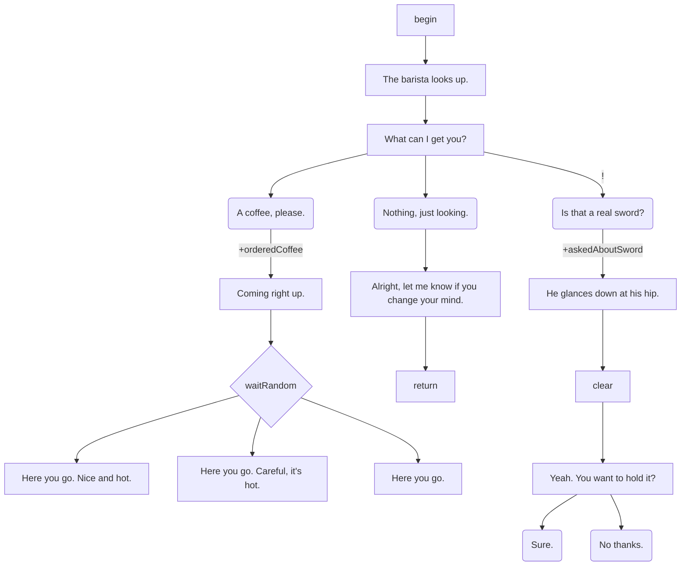

# Mermaid Flowchart Parser

Parses `.mmd` files containing Mermaid flowchart diagrams into `Scene` objects. Custom line-by-line implementation — does not use the `mermaid` npm package.

## Why a Custom Parser

`@mermaid-js/parser` does not support flowcharts. The legacy `mermaid` package does, but requires a DOM environment and DOMPurify. Our flowchart subset is small enough to parse with ~300 lines of custom code, making the parser synchronous, testable in Node, and free of heavyweight dependencies.

Files remain valid Mermaid flowcharts — VS Code's Mermaid preview extension renders them correctly. Semantic edge text (e.g., `|hasKey, +gold|`) appears as label text in the preview.

## Source Files

| File | Role |
|---|---|
| `index.ts` | `MermaidFlowchartParser` class implementing `Parser` |
| `tokenizer.ts` | Line-by-line tokenizer → `VertexInfo[]` + `EdgeInfo[]` (types defined here) |
| `nodeBuilder.ts` | `buildScene()` — converts tokens into a `Scene` |
| `../stateExpression.ts` | Shared: parses edge label text → conditions + effects (used by any parser) |

## Parsing Strategy

Line-by-line. Each line is matched in order:

1. **Front-matter comment** — `%% layout: <name>` → sets `scene.layout`
2. **Comment** — starts with `%%` → skip
3. **Header** — `flowchart TD` / `flowchart LR` → validate, skip (direction ignored)
4. **Edge statement** — `id1 ARROW id2` or `id1 ARROW|text| id2`
5. **Standalone vertex** — `id[text]`, `id(text)`, etc.

After all lines are parsed, `buildScene()` does a second pass to convert vertices + edges into the `Scene` structure.

## Vertex Shape → Node Type

| Shape | Syntax | Node type |
|---|---|---|
| Square | `id[text]` | `TextNode` |
| Round | `id(text)` | `ChoiceNode` |
| Diamond | `id{text}` | `GateNode { strategy: "random" }` |
| Subroutine | `id[[text]]` | `TextNode { style: "emphasis" }` OR `SceneNode` if text matches a known scene ID |
| Stadium | `id([text])` | `ChoiceNode { style: "minor" }` |
| None | bare `id` | `GateNode { strategy: "first" }` OR reserved keyword |

**Subroutine → SceneNode** resolution is done via `ParserOptions.assets` (value `"scene"`). The integration layer builds this map; the parser never reads the filesystem.

## Reserved Keywords (bare IDs)

| Keyword | Behavior |
|---|---|
| `begin` | Not emitted as a node. `begin --> X` sets `scene.entryNodeId = "X"`. If absent, the source of the first edge is the entry node. |
| `return` (prefix) | `GateNode { strategy: "first", children: [] }`. Zero eligible children → scene exit. |
| `clear` (prefix) | `ClearNode`. Engine emits `clear` and continues to children without rendering. |
| `reset` | `CustomNode { name: "reset" }` |

Duplicate keywords are auto-suffixed (`clear`, `clear_2`, `clear_3`). The ID only needs to *start with* the keyword, so `clearEnd` and `clear_boss` also work.

## Edge Stroke → Delay

| Stroke | Syntax | Delay |
|---|---|---|
| Normal | `-->` | `{ beats, style: "dots" }` |
| Thick | `==>` | `{ beats, style: "pause" }` |
| Dotted | `-.->` | `{ beats, style: "fade" }` |
| Invisible | `~~~` | No delay (immediate) |

**Delay beats** = (dash/equals count) − 1. `-->` = 0 beats, `--->` = 1, `---->` = 2.

## Edge Text: Conditions & Effects

Edge text between `|...|` is a mini-expression language parsed into `StateCondition[]` and `StateEffect[]` on the resulting `ChildRef`. Implementation lives in `../stateExpression.ts` (`parseStateExpression`).

### Combinators & Precedence

`,` (AND) binds tighter than `OR`. Parentheses override precedence.

```
hasKey, level > 5                    → AND(check(hasKey), compare(level > 5))
hasKey OR profession == poet         → OR(check(hasKey), compare(profession == poet))
(hasKey OR hasPick), !doorOpened     → AND(OR(hasKey, hasPick), check(!doorOpened))
```

### Conditions

| Syntax | Meaning |
|---|---|
| `hasKey` | Truthy check |
| `!hasKey` | Falsy check |
| `profession == poet` | String equality |
| `profession != poet` | String inequality |
| `level > 5` / `>= 10` / `< 3` / `<= 2` | Numeric comparison |

### Effects

| Syntax | Meaning |
|---|---|
| `+hasKey` | Set to `true` |
| `-hasKey` | Unset (remove from state) |
| `~hasKey` | Toggle boolean |
| `hasKey = true` / `= poet` / `= 5` | Set to typed value |
| `level++` / `level--` | Increment / decrement by 1 |
| `level += 3` / `level -= 2` | Increment / decrement by N |

### Special Shorthand

`!` (bare, alone on an edge) → adds a `visited:<sceneId>:<targetId>` falsy condition on the `ChildRef`, and sets `repeat: "once"` on the target `ChoiceNode`.

### Effect Placement

- Target is a `ChoiceNode` → effects go on `ChoiceNode.onChoose` (applied on selection)
- Target is anything else → effects go on `ChildRef.effects` (applied on traversal, before render)

### Value Type Inference

`true`/`false` → boolean. Matches `/^-?\d+(\.\d+)?$/` → number. Anything else → string (no quotes needed). String values cannot contain `,` or ` OR `.

### Variable Scope Prefixing

Names without `:` are prefixed with the scene ID: `hasKey` in scene `barista` → `barista:hasKey`. Names containing `:` are left as-is: `global:gameStarted` stays unchanged. `visited:*` keys already contain `:` and are not prefixed.

## Text Processing (Vertex Text)

Vertex text is run through `applyMarkdown()` (in `nodeBuilder.ts`): bold, italic, code, links only. Result stored as `html` on the node.

## Error Handling

```
ParseError: line 5: Unrecognized syntax "..."
ParseError: line 8: Unknown vertex shape in "id<text>"
ParseError: Edge references undefined vertex "xyz"
```

Line numbers included when possible. The integration layer catches `ParseError` and logs without crashing the dev server.

## Example


