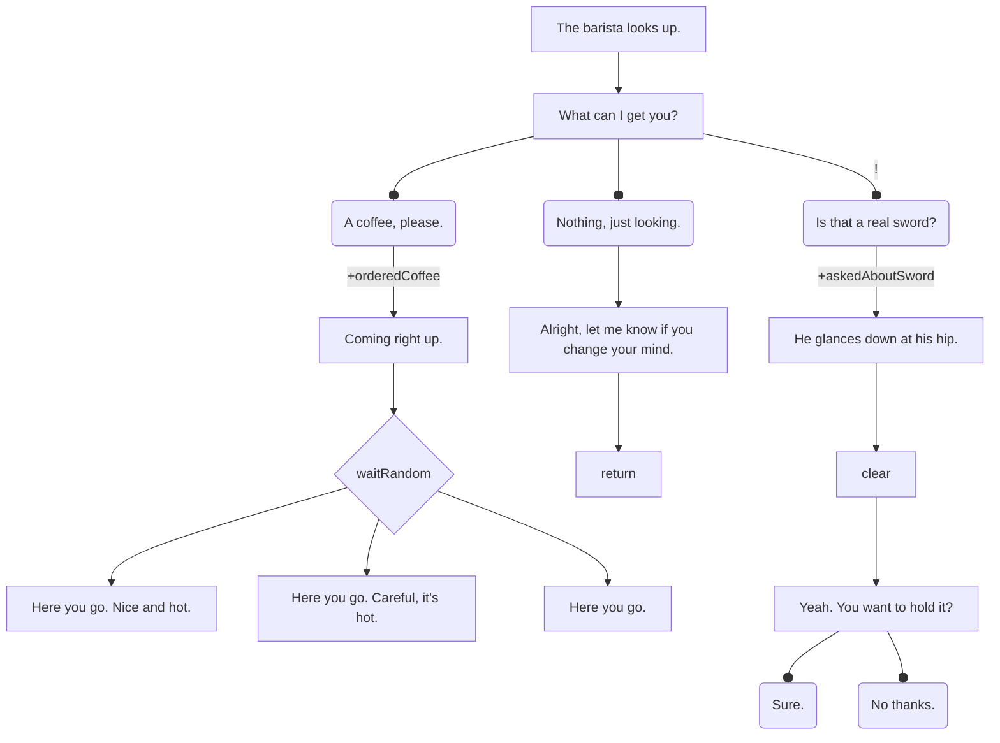
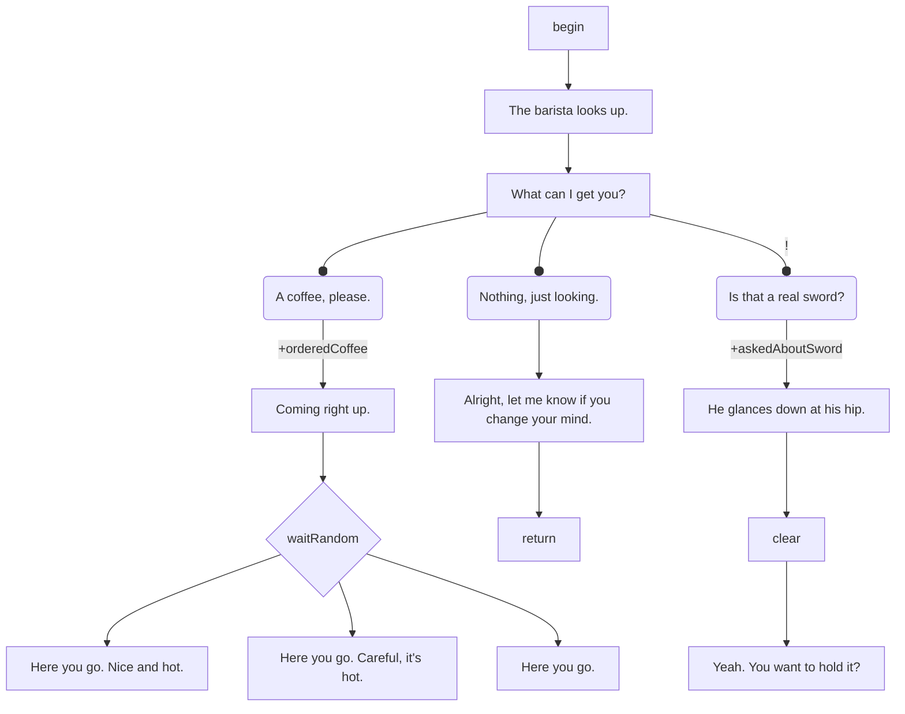
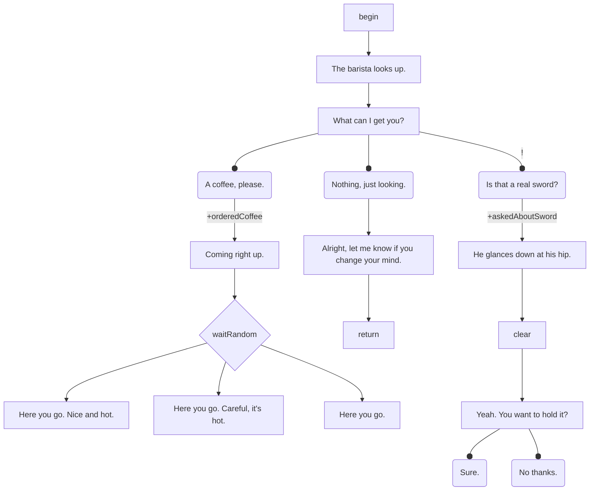
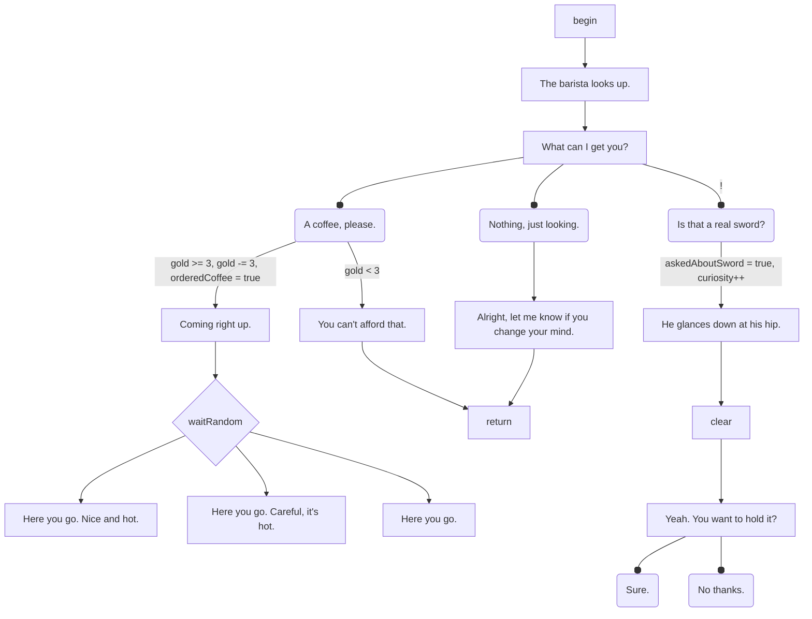
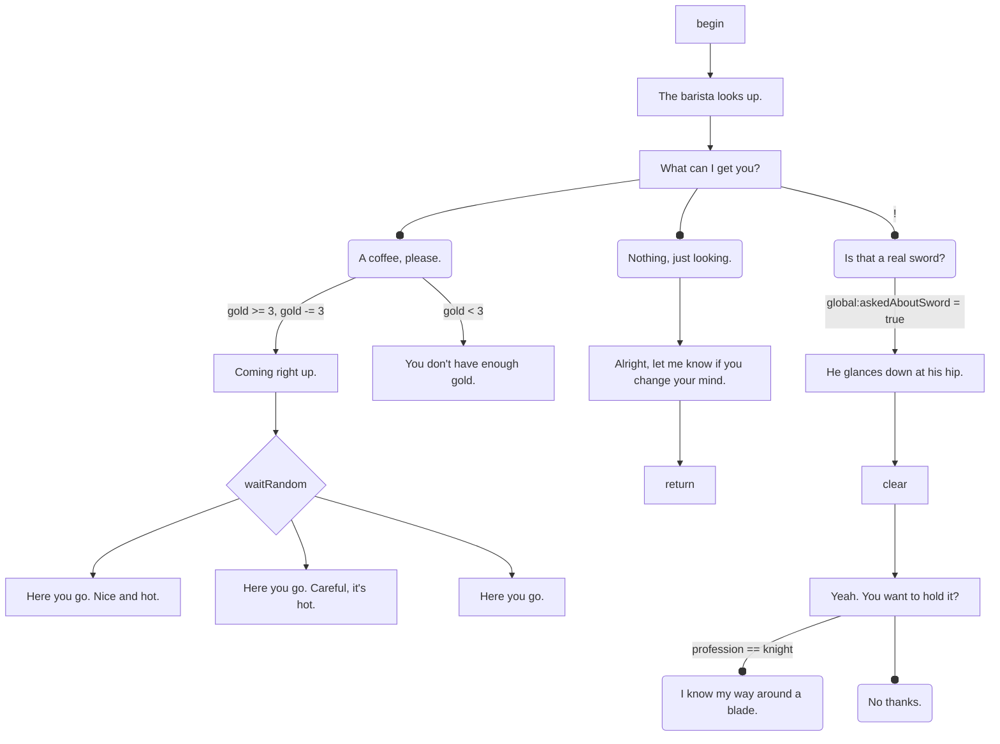

# Copilot Chat Conversation Export: Astro template for choose-your-own-adventure story

**User:** @dpetrie2
**Thread URL:** https://github.com/copilot/c/9fcca553-6b66-4bac-834a-0cd64c7c4690

## @dpetrie2

I'm looking to build a template/theme for astro. The idea is an out-of-the-box static website for a text-based choose-your-own-adventure story.

Here's the basic idea:

*System: User retried message*

## Copilot

I'd be happy to help you build an Astro template for a choose-your-own-adventure story! However, I notice your message got cut off at "Here's the basic idea:" 

Could you share the rest of your vision? I'm particularly interested in learning about:

- **Story structure**: How do you envision organizing the story nodes

## @dpetrie2

I'm looking to build a template/theme for astro. The idea is an out-of-the-box static website for a text-based choose-your-own-adventure story.

Here's the basic idea:
- the story is split into files, or chunks (called Scenes). There are multiple formats these can take, but they all parse down into the same format. For example, mermaid flowcharts, or a simple markdown file, or some proprietary format, etc.
- I'll need parsers for each file type. Similar to astro's content loaders, each parser should take its format/filetype and parse it into an array of story nodes. A node can be text, a choice, an image, a link to a scene, etc. The exact shape of this schema isn't important right now. But the idea is that there are different parsers that turn different file types into an array of story nodes that match the schema.
- these scenes will be served as static json files. When a scene node is reached, that scene is fetched, and started from the beginning.
- the frontend needs a state machine, for displaying the text nodes (like a terminal, each line appearing one after the other), managing choices, saving history, etc. Save state (including history, conditional flags, etc) should be saved to localstorage, or similar. This will also need some serious debug tools. For example, a quick go-to-scene or go-to-node popup command bar, checkboxes for toggling current conditionals, etc.

I'd like to separate this out into several packages, but I'm not sure how to do this. The parsers, types, and core functions should work in node or in the browser, be framework agnostic, not requiring astro or anything. The display logic will have to be astro-specific (so will the dynamic json endpoints for each scene)

So maybe this will be three packages?
1. a core library with parsers/etc, types. This could be used in any project to just parse files into a list of story nodes. It should be easy to add new parsers to this package, and it should be easy to write your own parsers if you want.
2. an astro-specific integration that handles astro things, like route generation, loading content (?) etc. I'm not sure how much of this will actually be necessary.
3. an astro theme/template, which is plug-and-play and includes frontend stuff. There should be a few different themes here (maybe that's just different css options) so it's a little customizable.

I'm not sure if this is the best way to structure this. I'd like this all to be in a monorepo. The core functions, parsers, etc should be testable. I'm not sure where to put the client-side logic. I'd like to keep it in some library and not just loose in the astro template. Not sure the best way.

Maybe it could be similar to how astro's starlight works.

`pnpm create astro --template storytime` (if this project is called storytime).

I'm not looking for code, but guidence on structuring this project. I'd love to use pnpm, vitest. Maybe web components or solidjs for the frontend, but again, whatever is easiest to abstract. I'm mostly concerned with lock-in to a specific framework, and making it easy to update a storytime project when I add new features to the core library, the integration, the template, etc. As an experienced architect, with concerns for DX, usability, accessability, performance, TDD, and clean code, what advice would you give me? How would you structure this project? Have I said anything that doesn't make sense, or that you would advice against?

*System: User retried message*

## Copilot

This is a well-thought-out project! Your instincts about separation of concerns are solid. Let me offer some architectural guidance:

## Package Structure

Your three-package approach is good, but I'd recommend **four packages**:

1. **`@storytime/core`** - Pure TypeScript, zero dependencies
   - Story node schema/types
   - Parser interface/base classes
   - Built-in parsers (Markdown, Mermaid, etc.)
   - Story validation utilities
   - **NOT included**: State management (that's runtime, not parsing)

2. **`@storytime/runtime`** - Framework-agnostic runtime logic
   - State machine for scene progression
   - History management
   - Conditional flags/variables
   - LocalStorage adapter interface (with a default implementation)
   - Scene loader interface
   - **This is crucial** - keeps your business logic separate from Astro/UI

3. **`@storytime/astro`** - Astro integration
   - Content collection loaders using `@storytime/core` parsers
   - Scene → JSON endpoint generation
   - Route generation
   - Injects necessary scripts/components
   - Configuration helpers

4. **`@storytime/template`** (or multiple templates)
   - The actual Astro template
   - UI components (built with Web Components or Solid)
   - CSS themes
   - Debug toolbar
   - Depends on `@storytime/astro` + `@storytime/runtime`

## Why This Split?

**Separating `core` from `runtime`**:
- `core` = build-time (parsing files)
- `runtime` = client-side (playing the story)
- This prevents shipping parser code to the browser
- Someone could use `@storytime/core` in a Node script to convert stories to another format
- Someone could use `@storytime/runtime` in a React/Vue/Svelte app with their own data pipeline

**The Starlight parallel**: Starlight has `@astrojs/starlight` (integration + template in one) because it's tightly coupled. You might want `@storytime/astro` to be an integration that *can* be used standalone (bring your own UI) or with the template.

## Monorepo Setup

```
storytime/
├── packages/
│   ├── core/          # @storytime/core
│   ├── runtime/       # @storytime/runtime
│   ├── astro/         # @storytime/astro
│   └── template/      # @storytime/template
├── examples/          # Test projects using the template
├── pnpm-workspace.yaml
└── package.json
```

**Tooling**:
- **pnpm workspaces** ✅
- **Changesets** for versioning/publishing
- **Turborepo** (optional, but nice for caching test/build tasks)
- **Vitest** for `core` and `runtime` packages
- **Playwright** for E2E testing the template

## Key Architectural Decisions

### 1. Parser Plugin System
Make parsers **pluggable** in `@storytime/core`:

```typescript
// Conceptual API
interface Parser {
  name: string;
  extensions: string[];
  parse(content: string, filepath: string): StoryNode[];
}

class StoryEngine {
  registerParser(parser: Parser): void;
  parseFile(filepath: string): StoryNode[];
}
```

This allows users to:
- Use only the built-in parsers
- Write custom parsers in their project
- Publish third-party parser packages

### 2. Runtime Adapters
Don't hard-code LocalStorage in `@storytime/runtime`. Use an adapter pattern:

```typescript
interface StorageAdapter {
  get(key: string): Promise<string | null>;
  set(key: string, value: string): Promise<void>;
}

class StateMachine {
  constructor(storage: StorageAdapter) {}
}
```

Default to LocalStorage, but allow custom adapters (useful for SSR, testing, React Native, etc.).

### 3. UI Component Strategy

**Recommendation: Web Components** (not Solid/React/Vue)

**Why?**
- Framework-agnostic by design
- Work in any Astro project regardless of their UI framework choice
- Can use Lit for DX (TypeScript, reactive properties)
- Users can wrap them in framework components if needed

**Alternative**: Headless component approach (like Radix/Headless UI)
- Export hooks/primitives from `@storytime/runtime`
- Template provides pre-built components
- Advanced users can build custom UIs with the same primitives

I'd lean toward Web Components for v1 simplicity.

### 4. Astro Integration Scope

`@storytime/astro` should:
- Register content collections with custom loaders
- Generate `/scenes/[id].json` endpoints dynamically
- Inject the Web Components script
- Provide config helpers (`defineStoryConfig()`)

It should **not**:
- Include UI components (that's the template's job)
- Force a specific theme

### 5. Template Updatability

**Problem**: Users run `create astro --template storytime`, then you update `@storytime/core`. How do they get updates?

**Solution** (Starlight's approach):
- The template depends on `@storytime/astro` (which depends on core + runtime)
- Template is minimal scaffolding + config
- Most logic lives in `@storytime/astro` package
- Users `pnpm update @storytime/astro` to get new features
- Breaking changes in template = they manually migrate (like Next.js App Router)

**Config file pattern**:
```typescript
// storytime.config.ts
export default defineStoryConfig({
  parsers: [markdown(), mermaid()],
  theme: 'terminal',
  features: {
    saveStates: true,
    debugBar: import.meta.env.DEV,
  }
});
```

## Testing Strategy

1. **`@storytime/core`**: Unit tests for each parser (fixtures folder with sample files)
2. **`@storytime/runtime`**: Unit tests with mock storage adapter
3. **`@storytime/astro`**: Fixture-based tests (test Astro projects in `/fixtures`)
4. **Template**: E2E tests with Playwright (navigate scenes, save state, etc.)

## Potential Pitfalls to Avoid

❌ **Don't**: Put types in multiple packages (duplication hell)
✅ **Do**: Export all types from `@storytime/core`, re-export in other packages

❌ **Don't**: Make parsers async unless necessary (simpler API)
✅ **Do**: Keep parsers synchronous; handle async in Astro integration layer

❌ **Don't**: Couple the state machine to DOM/browser APIs
✅ **Do**: Keep runtime pure, inject adapters

❌ **Don't**: Build a complex theme system on day one
✅ **Do**: Start with CSS custom properties, expand later

## Validation of Your Approach

Your concerns about framework lock-in are **spot on**. The four-package split addresses this:
- Want to use Storytime with SvelteKit? Build `@storytime/sveltekit`
- Want a mobile app? Use `@storytime/runtime` with React Native
- Want to compile stories to a podcast script? Use `@storytime/core`

The Starlight comparison is apt. Study their approach to:
- Config file structure
- Component overrides
- Plugin system (sidebar, head entries, etc.)

## Recommended Next Steps

1. **Prototype `@storytime/core`** first
   - Define `StoryNode` schema
   - Build one parser (Markdown)
   - Write tests
   
2. **Prototype `@storytime/runtime`**
   - State machine with a simple story
   - LocalStorage adapter
   - No UI, just tests

3. **Build a minimal Astro project manually** (not the template yet)
   - Manually wire up core + runtime
   - Validate the integration points
   - This becomes your blueprint for `@storytime/astro`

4. **Extract to integration + template**

This iterative approach prevents over-architecting before you understand the problem space.

---

Does this structure make sense for your vision? Any parts you'd like to discuss further (parser API design, state machine architecture, etc.)?

## @dpetrie2

Looking at this repo: @probablyduncan/cafe 

What other notes would you add to your advice? This repo is not optimal, and nothing is abstracted, but it was a decent first pass.

## Copilot

Great — having looked through the repo, here are additional notes specific to what you've already built:

---

## What You've Done Well

1. **You already have the mental separation** — `src/lib/client`, `src/lib/server`, `src/lib/agnostic` maps directly to the package split I described. The instinct is correct.

2. **Interface-driven design** — `IGameState`, `INodeRenderer`, `ISceneStore` with dependency injection in `GameDriver` is exactly right. This makes the runtime testable and portable. Keep this pattern.

3. **The content loader approach** — Using Astro's content loader API for parsing is smart. The `sceneLoader()` already acts like the integration layer.

4. **Zod schemas as the contract** — `contentSchemaTypes.ts` is essentially your `@storytime/core` types already. The discriminated union for `nodeSchema` is clean.

---

## Things to Address in the Refactor

### 1. The DOMPurify Hack Needs to Go

The `pnpm.overrides` trick to stub DOMPurify so Mermaid runs in Node is fragile and will break for consumers. When you extract the Mermaid parser into `@storytime/core`:

- Don't use `mermaid` directly at runtime. Instead, use `mermaid`'s **parser only** (`@mermaid-js/parser` or the internal grammar) to extract the AST without needing a DOM.
- Alternatively, make the Mermaid parser an *optional* peer dependency and document that it requires a Node environment with your shim. But honestly, consider writing your own `.mmd` parser for the subset you actually use (flowchart edges/vertices). Your syntax is already custom enough that you're fighting Mermaid's API more than benefiting from it.

### 2. `GameDriver` Mixes Concerns

`GameDriver` currently does:
- Scene traversal logic (pure, testable)
- DOM event binding (`document.addEventListener`)
- Fast-forwarding/replay
- Rendering orchestration

Split this into:
- **`StoryTraverser`** (pure) — given a node + state, returns "what happens next" (the `getRenderableChildren` logic). This is your core state machine and is 100% testable with no DOM.
- **`GameDriver`** (runtime) — orchestrates traverser + renderer + events. This is the "controller."
- **Input handling** — should be in the UI layer (Web Components), not in the driver. The driver should expose a `choose(choice)` method; the UI calls it.

### 3. `events.ts` is a Global Singleton

This will cause problems in testing and if you ever have multiple instances. Pass an event emitter into `GameDriver` as a dependency, or use the pattern you already have with DI. In the monorepo, this becomes part of `@storytime/runtime`'s public API:

```typescript
const engine = createStoryEngine({ storage, renderer });
engine.on("choose", ...);
engine.on("enterScene", ...);
```

### 4. Types Import from `astro/zod`

```typescript
import { z } from "astro/zod";
```

This locks your schema definitions to Astro. In `@storytime/core`, use `zod` directly as a dependency. The Astro integration can re-validate or pass through.

### 5. `NodePosition` is Floating

`NodePosition` appears as a type throughout (`gameDriver.ts`, `gameState.ts`) but I don't see it explicitly defined/exported from a central place — it seems to be ambient or inferred. In the monorepo, this should be a first-class export from `@storytime/core`.

### 6. The Content Config is Doing Too Much

`content.config.ts` at 295 lines is your parser + loader + watcher + asset registry all in one file. In the monorepo split:

- **`@storytime/core`**: `parseMermaid(content: string): SceneNode[]` and `parseMarkdown(content: string): SceneNode[]` — pure functions, no file I/O
- **`@storytime/astro`**: The loader that calls `fs.readFileSync`, watches files, registers assets, and calls the core parsers

### 7. Save Data Serialization is Clever but Opaque

The compressed save format (`s?`, `c?`, `k?`, `l?`, `h?`) is space-efficient but hard to debug and hard to version. Consider:
- Use readable keys in dev, compressed in prod (or just always readable — localStorage isn't that constrained)
- Add a **version number** to save data. When you change the schema, you can migrate or invalidate old saves.
- The `ISaveStore` interface is good — but add a `version` or `migrate()` hook

### 8. Missing: Story Validation

You have no build-time validation that scenes connect properly (e.g., a scene references another scene that doesn't exist, a dead-end with no children, unreachable nodes). This should be a `@storytime/core` utility:

```typescript
validateStory(scenes: Scene[]): ValidationResult
// Returns: warnings for dead ends, errors for missing references, etc.
```

This is *incredibly* valuable for authors writing long stories. Surface it in dev as a build warning.

### 9. The `marked` Inline Parsing

You're using `marked.parseInline()` inside the Mermaid parser. This is fine, but in `@storytime/core`, make the HTML renderer pluggable too. Someone might want to use a different Markdown library, or output plain text instead of HTML (for accessibility/testing).

---

## Revised Package Mapping from Your Current Code

| Current location | Target package |
|---|---|
| `src/lib/contentSchemaTypes.ts` | `@storytime/core` (types) |
| `src/lib/agnostic/*` | `@storytime/core` (utilities) |
| `content.config.ts` (parsing logic) | `@storytime/core` (parsers) |
| `content.config.ts` (loader/watcher) | `@storytime/astro` |
| `src/lib/server/getStaticPaths.ts` | `@storytime/astro` |
| `src/lib/client/gameState.ts` | `@storytime/runtime` |
| `src/lib/client/gameDriver.ts` | `@storytime/runtime` (split up) |
| `src/lib/client/sceneStore.ts` | `@storytime/runtime` |
| `src/lib/client/saveStore.ts` | `@storytime/runtime` |
| `src/lib/client/events.ts` | `@storytime/runtime` |
| `src/lib/client/nodeRenderer.ts` | `@storytime/template` (UI) |
| `src/lib/client/componentNodes.ts` | `@storytime/template` (UI) |
| `src/components/*.astro` | `@storytime/template` |
| `src/pages/*` | `@storytime/template` |

---

## One More Structural Thought

Looking at your README notes about animation timing, text reveal speed, "hold to accelerate," thinking dots — this is **presentation logic**, not game logic. The runtime should emit events like `"renderNode"` with timing metadata (delay cycles, style), and the *UI layer* interprets those into animations. Don't bake CSS timing into the state machine.

This means `@storytime/runtime` says *what* to show and *when*, and `@storytime/template` decides *how* to animate it. The `INodeRenderer` interface is already heading this direction — just make sure the timing/animation decisions stay on the template side of that boundary.

---

## Summary of Key Takeaways

1. **Kill the Astro/zod import** in your types — use plain `zod`
2. **Kill the DOMPurify hack** — write a lightweight flowchart parser or isolate Mermaid properly
3. **Split `GameDriver`** — pure traversal vs. orchestration vs. DOM input
4. **Add story validation** — huge DX win for authors
5. **Version your save format** — you'll thank yourself later
6. **Keep animation/presentation out of runtime** — runtime says "show X after Y delay", template decides what that looks like

Your first pass is honestly quite solid for a prototype. The interfaces and DI patterns mean you're not far from the clean split — it's mostly about drawing the package boundaries where you've *already* drawn the conceptual ones.

## @dpetrie2

Look at the solid-migration branch of @probablyduncan/cafe 
This is more recent code. Are there any takeaways there?

## Copilot

Good — here are the additional takeaways from the `solid-migration` branch:

---

## Key Observations

### 1. The Context is a God Object

`CafeContext.tsx` is now doing *everything*: state management, serialization/deserialization, game logic (traversal, condition evaluation), UI state management, and scene fetching. It's 330 lines and growing. This is the exact problem you predicted in your README:

> "debug is difficult to wire up, because of separation of concerns, compartmentalization, abstraction"

Moving to Solid didn't solve the architectural problem — it just moved the monolith from `GameDriver` + `GameState` classes into a single context provider.

**Recommendation**: The context should be a thin shell that wires together separate concerns:
- `@storytime/runtime` exports `createStoryEngine(config)` — returns a plain object/class with `renderNext`, `makeChoice`, `isConditionMet`, etc.
- The Solid context just wraps that engine + Solid signals for reactivity

This way the engine is testable without Solid, and Solid is just one possible UI binding.

### 2. You've Lost Testability

On `main`, `GameState` and `GameDriver` had clean interfaces (`IGameState`, `INodeRenderer`, `ISceneStore`) with dependency injection. The solid-migration branch **threw that away** — `setStateCondition` references `this._keys` (a bug! leftover from the class-based version), state mutations are inline, and there's no way to test traversal logic without mounting a Solid component tree.

**This is a regression.** When you refactor to the monorepo, bring back the interface-driven approach from `main` but expose it as a functional API:

```typescript
// @storytime/runtime
export function createGameState(storage: StorageAdapter): GameState { ... }
export function resolveNextNodes(children, scene, state): TraversalResult { ... }
```

Then in Solid, you wrap these with signals.

### 3. `renderNext` Triggers Side Effects Inside JSX Render

In `DialoguePanel.tsx`:
```tsx
case "scene":
    enterScene(node);  // side effect during render!
    break;
case "passthrough":
    renderNext(node);  // side effect during render!
    break;
```

This is an anti-pattern in any reactive framework. `<For>` is re-evaluating its children reactively, and you're triggering async state mutations *during render*. This will cause infinite loops or missed updates as the app grows.

**Fix**: Scene entry and passthrough resolution should happen *before* nodes reach the UI array. The runtime should recursively resolve passthroughs and scene entries, only pushing *renderable* nodes to the UI signal. The `renderNext` loop from `main`'s `GameDriver` was actually correct about this — it looped until it hit something renderable.

### 4. Solid is a Fine Choice — But Contain It

You're using Solid well for what it is (fine-grained reactivity, `<For>`, signals). The issue is just boundary management. In the monorepo:

- `@storytime/runtime` = zero framework dependencies, pure TS
- `@storytime/template` has a `solid/` directory with the Solid bindings (`useCafeContext`, components, etc.)

If you ever want a Web Component version or a React version, you just write a new binding layer over the same runtime. The runtime API should look like:

```typescript
engine.subscribe("nodesChanged", (nodes) => { ... });
engine.subscribe("choicesChanged", (choices) => { ... });
```

Then the Solid binding is just:
```typescript
const [nodes, setNodes] = createSignal([]);
engine.subscribe("nodesChanged", setNodes);
```

### 5. The `madeChoice` Node Type is a UI Concern Leaking into Schema

You added `madeChoice` as a new node type in the Zod schema:
```typescript
nodeBaseSchema.extend({
    type: z.literal("madeChoice"),
    ...
})
```

This isn't a story data type — it's a *rendering artifact*. The core schema shouldn't know about how the UI represents "a choice was previously made." Keep the data schema pure (text, choice, passthrough, image, scene, component), and handle made-choice rendering in the UI layer with a separate signal/list.

### 6. `useSceneStore()` Creates a New Store Every Call

In `DebugPanel.tsx`, you call `useSceneStore()` again — this creates a *second*, independent cache Map. The context already has one via `CafeContextProvider`. This means debug could be fetching scenes that are already cached elsewhere, or caching them separately.

The scene store should be a singleton provided through context, or better — part of the runtime engine that's instantiated once.

### 7. The `this._keys` Bug Shows Why Classes > Closures for Complex State

In `CafeContext.tsx` line 192-195:
```typescript
function setStateCondition(condition: StateCondition | undefined) {
    ...
    if (condition.negated) {
        this._keys.delete(condition.name);  // 💥 `this` is undefined
    } else {
        this._keys.add(condition.name);
    }
}
```

This is a copy-paste from the class-based version that doesn't work in a closure. It demonstrates that the migration was rushed and the logic wasn't tested after moving it. With the monorepo approach, the runtime keeps its class-based architecture (where `this` works), and only the *bindings* are functional.

### 8. GSAP is a Smart Choice for Animation — But Isolate It

The commented-out `SplitText` code in `DialoguePanel.tsx` shows you're exploring GSAP for text animation. This is a good call for performance, but:

- GSAP should live in `@storytime/template` only
- The runtime should expose timing *data* (delay cycles, style), and the template interprets it
- Consider making the animation strategy pluggable: `{ animation: "typewriter" | "fade" | "splittext" }` in theme config

---

## Revised Advice Given Both Branches

| Concern | `main` got right | `solid-migration` got right | Keep for monorepo |
|---|---|---|---|
| DI / interfaces | ✅ `IGameState`, `INodeRenderer` | ❌ Lost | Bring back |
| Reactivity / UI updates | ❌ Manual DOM manipulation | ✅ Solid signals + `<For>` | Solid (or signals-based) |
| Traversal loop | ✅ While-loop resolving passthroughs | ❌ Side effects in render | While-loop in runtime |
| Testability | ✅ Mock dependencies | ❌ Needs component mount | Keep pure runtime |
| State serialization | ✅ Separate concern | ❌ Inlined in context | Keep separate |

**TL;DR**: The `solid-migration` shows that Solid is the right UI choice, but you need to **keep the runtime logic from `main`'s architecture** (interfaces, DI, pure traversal loop) and only use Solid as a thin reactive binding on top. Don't flatten everything into a context.

## @dpetrie2

using what you know, what is a good ts schema for the node types and scene types. I want to support text nodes, choices, images, custom nodes (names of functions that get run when the node is rendered), and anything else you think is necessary

## Copilot

Here's my recommendation for `@storytime/core` types. I'm designing this with a few principles: the schema represents **story data** (not UI state), it's framework-agnostic, and it's extensible without breaking changes.

```typescript name=packages/core/src/types.ts
// ============================================================
// SCENE & NODE SCHEMA
// ============================================================

/**
 * A Scene is a self-contained chunk of story.
 * Fetched as a static JSON file at runtime.
 */
export type Scene = {
    id: string;
    nodes: Record<string, StoryNode>;
    entryNodeId: string;

    /**
     * All state variable names referenced in this scene.
     * Useful for debug tooling (show relevant toggles).
     */
    vars: string[];

    /**
     * Optional metadata for tooling, validation, debug.
     */
    meta?: SceneMeta;
};

export type SceneMeta = {
    /** Original source file path, for debug/editor linking */
    source?: string;
    /** Human-readable title for debug UI / scene picker */
    title?: string;
};

// ============================================================
// NODES
// ============================================================

export type StoryNode =
    | TextNode
    | ChoiceNode
    | ImageNode
    | SceneNode
    | CustomNode
    | GateNode
    | ClearNode;

/**
 * Base properties shared by all nodes.
 */
type NodeBase = {
    id: string;
    children: ChildRef[];

    /**
     * State to set when this node is reached.
     * For choices, this is set when the choice is *chosen*.
     */
    setState?: StateEffect[];
};

// --

/**
 * A line of narrative text (HTML string, pre-rendered from markdown).
 */
export type TextNode = NodeBase & {
    type: "text";
    html: string;

    /**
     * Extensible style hint. Templates interpret this however they want.
     * e.g. "default", "emphasis", "whisper", "shout", "narrator"
     */
    style?: string;
};

/**
 * A branching choice the player can select.
 */
export type ChoiceNode = NodeBase & {
    type: "choice";
    html: string;

    /**
     * Display label (e.g. "1", "A", "→"). Template decides how to render.
     * If omitted, template assigns sequentially.
     */
    label?: string;

    /**
     * Hint for visual style: "default", "minor", "dramatic", etc.
     */
    style?: string;

    /**
     * If true, choosing this clears the visible dialogue history.
     */
    clear?: boolean;

    /**
     * Controls repeat visibility:
     * - "always": always shown (default)
     * - "fade": shown but visually de-emphasized after first visit
     * - "once": hidden after chosen once
     */
    repeat?: "always" | "fade" | "once";
};

/**
 * An inline image or illustration.
 */
export type ImageNode = NodeBase & {
    type: "image";
    src: string;
    alt: string;
    style?: string;
};

/**
 * Transfers control to another scene.
 * The runtime fetches & enters that scene.
 */
export type SceneNode = NodeBase & {
    type: "scene";
    sceneId: string;
};

/**
 * Runs a named function registered by the template/consumer.
 * Use for: confetti, screen shake, sound effects, dynamic content, etc.
 */
export type CustomNode = NodeBase & {
    type: "custom";

    /** Registered function key, e.g. "confetti", "playSound" */
    name: string;

    /** Arbitrary params passed to the function */
    params?: Record<string, unknown>;
};

/**
 * A logic-only node that doesn't render.
 * Evaluates conditions and routes to children.
 * Use for: branching without player-visible choices,
 * random selection, state-based routing.
 */
export type GateNode = NodeBase & {
    type: "gate";

    /**
     * Optional: gate strategy when multiple children pass.
     * - "first" (default): take first eligible child
     * - "random": pick randomly among eligible children
     */
    strategy?: "first" | "random";
};

/**
 * Clears the dialogue feed. Useful as a pacing/chapter break.
 * Children continue after the clear.
 */
export type ClearNode = NodeBase & {
    type: "clear";
};

// ============================================================
// CHILD REFERENCES (edges between nodes)
// ============================================================

/**
 * A reference from a parent node to a child node.
 * This is the "edge" — it carries transition metadata.
 */
export type ChildRef = {
    nodeId: string;

    /** Delay before this child renders */
    delay?: Delay;

    /** Only traverse this edge if condition is met */
    condition?: StateCondition;
};

export type Delay = {
    /**
     * Number of "beats" to wait. Template decides what a beat means
     * (e.g. 80ms, or a thinking-dots animation cycle).
     */
    beats: number;

    /**
     * Hint for how to animate the delay.
     * Templates can extend this with their own values.
     */
    style?: "dots" | "pause" | "fade" | string;
};

// ============================================================
// STATE / CONDITIONS
// ============================================================

/**
 * A condition that must be met to traverse an edge or show a node.
 */
export type StateCondition =
    | { type: "flag"; name: string; negated?: boolean }
    | { type: "visited"; nodeId: string; sceneId?: string; negated?: boolean }
    | { type: "and"; conditions: StateCondition[] }
    | { type: "or"; conditions: StateCondition[] };

/**
 * A mutation to apply to game state.
 */
export type StateEffect =
    | { type: "set"; name: string }
    | { type: "unset"; name: string }
    | { type: "toggle"; name: string };
```

---

## Design Decisions & Rationale

### Why `GateNode` instead of `passthrough`

Your original `passthrough` was doing two things: routing logic and "I don't render." Making it explicit as a `gate` with a `strategy` field gives you random branches, weighted paths, and state-based routing — all without touching the UI layer. This is your workhorse for non-linear storytelling that isn't player-choice.

### Why `ClearNode` is separate from choice's `clear` flag

Sometimes you want to clear the feed *without* a choice (e.g., scene transition, chapter break, time skip). Having it as a dedicated node means parsers can express this directly.

### Why `StateCondition` is a recursive union

Your current `{ name, negated }` works for simple cases, but you'll inevitably want "show this choice only if the player has the key AND hasn't already visited node X." The recursive `and`/`or` structure handles this without needing future schema changes. Parsers can still produce simple conditions — they're just `{ type: "flag", name, negated }`.

### Why `StateEffect[]` instead of a single condition

Setting multiple flags on one node (e.g., choosing "take the sword" sets both `hasSword` and `metBlacksmith`) avoids needing gate nodes just for multi-set operations.

### Why `style` is `string` (not an enum)

Enums would lock core to knowing about all possible template styles. By using `string`, templates define their own vocabulary, and core just passes it through. Document conventions, don't enforce them at the type level.

### Why `repeat` on ChoiceNode

This replaces the `arrow_cross` / "only show once" logic from your mermaid parser. It's explicit, easy to understand, and the three options cover the real use cases: always visible, visually diminished, or gone.

### Why `CustomNode` has `params`

Without params, every custom function that needs configuration requires a new node type. With params, you get:
```
{ type: "custom", name: "playSound", params: { src: "rain.mp3", loop: true } }
{ type: "custom", name: "shake", params: { intensity: 3 } }
{ type: "custom", name: "confetti" }
```

---

## What I Intentionally Left Out

| Omitted | Why |
|---|---|
| `madeChoice` node type | UI concern — the template tracks what was chosen |
| `html` rendering | That's the parser's job, not the schema's |
| Timing/animation details | Template concern; `delay.beats` + `delay.style` is enough data |
| `NodePosition` | That's runtime state (`{ sceneId, nodeId }`), export it from `@storytime/runtime` |
| `visited` on choices | Runtime state — engine resolves this when presenting choices |
| Zod schemas | Define those alongside these types in core, but the *types* are the contract |

---

## Companion Runtime Types (separate file)

These live in `@storytime/runtime`, not core — they represent *live game state*, not story data:

```typescript name=packages/runtime/src/types.ts
import type { ChoiceNode, ChildRef, StoryNode } from "@storytime/core";

/**
 * A position in the story graph.
 */
export type NodePosition = {
    sceneId: string;
    nodeId: string;
};

/**
 * A choice ready to be presented to the player.
 * Resolved by the engine with runtime context.
 */
export type ResolvedChoice = ChoiceNode & ChildRef & NodePosition & {
    visited: boolean;
    enabled: boolean; // false if repeat:"once" and already visited
};

/**
 * What the engine emits after resolving children.
 */
export type TraversalResult =
    | { type: "render"; node: StoryNode & ChildRef & NodePosition }
    | { type: "choices"; choices: ResolvedChoice[] }
    | { type: "end" }
    | { type: "exit-scene"; returnTo: NodePosition };

/**
 * Pluggable persistence interface.
 */
export interface StorageAdapter {
    get(key: string): string | null;
    set(key: string, value: string): void;
    remove(key: string): void;
}
```

---

## How a Parser Would Produce This

Your mermaid parser would map:
- `[]` vertex → `TextNode`
- `()` vertex → `ChoiceNode`
- `-->` edge → `ChildRef` with `delay: { beats: 0 }`
- `---->` edge → `ChildRef` with `delay: { beats: 2 }`
- `--o` edge → child points to a `ChoiceNode`
- `--x` edge → `ChoiceNode` with `repeat: "once"`
- edge text → `ChildRef.condition` (parsed as `StateCondition`)
- undefined vertex type → `GateNode`
- asset filename → `ImageNode` or `CustomNode`

The parser interface in core:
```typescript name=packages/core/src/parser.ts
import type { Scene } from "./types";

export interface Parser {
    /** File extensions this parser handles, e.g. [".mmd", ".mermaid"] */
    extensions: string[];

    /** Parse file contents into a Scene */
    parse(content: string, id: string): Scene;
}
```

Clean, testable, no file I/O, no framework dependencies.

## @dpetrie2

how would the mermaid parser handle gate/clear nodes?
how would the mermaid parser handle state effects and conditions?
how would the mermaid parser decide a gateNode's strategy?

## Copilot

Great questions. These are the real design decisions. Let me work through each one against the constraints of what Mermaid flowchart syntax actually gives you to work with.

## Available Mermaid Levers (Recap)

You have these to encode meaning:
1. **Vertex shape**: `[]`, `()`, `{}`, `[[]]`, `(())`, `{{}}`, etc.
2. **Vertex text**: arbitrary string inside the shape
3. **Edge head**: `-->`, `--o`, `--x`, `---`
4. **Edge stroke**: `--`, `==`, `-.-`, `~~~`
5. **Edge length**: `-->` vs `--->` vs `---->` (1, 2, 3)
6. **Edge text**: `-->|text|` or `-- text -->`

---

## Gate Nodes

**Current behavior** (from `main`): A vertex with *no shape* (just a bare ID like `myNode`) becomes a passthrough. This maps directly to `GateNode`.

**Strategy encoding** — use vertex shape:

| Shape | Meaning |
|---|---|
| bare ID (no shape) | `gate` with `strategy: "first"` |
| `{}` diamond | `gate` with `strategy: "random"` |

Diamond makes intuitive sense — it's the traditional flowchart "decision" shape, and visually communicates "something branches here." The difference is: bare = deterministic routing (first matching condition), diamond = random pick among eligible children.

```mermaid
%% Deterministic gate: takes first eligible path
a[You open the door.] --> gate1
gate1 -->|hasKey| b[The lock clicks open.]
gate1 -->|!hasKey| c[It's locked.]

%% Random gate: picks randomly
a[You roll the dice.] --> roll{roll}
roll --> b[Snake eyes.]
roll --> c[Lucky seven!]
roll --> d[Nothing special.]
```

The text inside `{}` is irrelevant to the output (it's just for readability in the `.mmd` file). The parser discards it.

---

## Clear Nodes

**Option A: Reserved keyword** (like `return` and `reset`)

```mermaid
a[End of chapter one.] --> clear
clear --> b[Chapter Two.]
```

The parser recognizes `clear` as a bare ID with a reserved name, produces a `ClearNode`. This is consistent with how you already handle `return` and `reset`.

**Option B: Special edge stroke**

Use `==>` (thick arrow) to mean "clear before continuing":

```mermaid
a[End of chapter one.] ==> b[Chapter Two.]
```

I'd recommend **Option A**. It's explicit, readable, and you're already using the reserved-keyword pattern. Thick arrows are better spent on delay style (which you're already doing conceptually with stroke encoding).

**Full reserved keywords list:**

| Keyword | Produces |
|---|---|
| `begin` | Entry point marker (sets `entryNodeId`) |
| `return` | `{ type: "gate", children: [] }` (exits scene) |
| `reset` | `CustomNode` with `name: "reset"` |
| `clear` | `ClearNode` |

---

## State Effects

This is the trickiest one. You currently use **edge text** for conditions (checking state). But `setState` needs to *mutate* state when a node is reached/chosen.

**Design**: Use a sigil prefix convention in edge text to distinguish reading vs. writing:

| Syntax | Meaning | Produces |
|---|---|---|
| `-->\|hasKey\|` | Requires `hasKey` to be true | `ChildRef.condition: { type: "flag", name: "hasKey" }` |
| `-->\|!hasKey\|` | Requires `hasKey` to be false | `ChildRef.condition: { type: "flag", name: "hasKey", negated: true }` |
| `-->\|+hasKey\|` | **Sets** `hasKey` on the target node | Target node gets `setState: [{ type: "set", name: "hasKey" }]` |
| `-->\|−hasKey\|` | **Unsets** `hasKey` on the target node | Target node gets `setState: [{ type: "unset", name: "hasKey" }]` |
| `-->\|~hasKey\|` | **Toggles** `hasKey` on the target node | Target node gets `setState: [{ type: "toggle", name: "hasKey" }]` |

**Combined conditions and effects** — separate with commas:

```mermaid
%% Requires !hasKey, then sets hasKey when reached
a(Pick up the key.) -->|!hasKey, +hasKey| b[You grab the rusty key.]

%% Requires metBob AND hasCoin, sets boughtApple
c(Buy an apple.) -->|metBob, hasCoin, +boughtApple| d[Bob hands you an apple.]
```

**Parser logic:**

```typescript name=packages/core/src/parsers/mermaid/parseEdgeText.ts
import type { StateCondition, StateEffect } from "../../types";

type ParsedEdgeAnnotations = {
    conditions: StateCondition[];
    effects: StateEffect[];
};

export function parseEdgeText(text: string | undefined): ParsedEdgeAnnotations {
    if (!text?.trim()) {
        return { conditions: [], effects: [] };
    }

    const conditions: StateCondition[] = [];
    const effects: StateEffect[] = [];

    const parts = text.split(",").map(s => s.trim()).filter(Boolean);

    for (const part of parts) {
        if (part.startsWith("+")) {
            effects.push({ type: "set", name: part.slice(1) });
        } else if (part.startsWith("-")) {
            effects.push({ type: "unset", name: part.slice(1) });
        } else if (part.startsWith("~")) {
            effects.push({ type: "toggle", name: part.slice(1) });
        } else if (part.startsWith("!")) {
            conditions.push({ type: "flag", name: part.slice(1), negated: true });
        } else {
            conditions.push({ type: "flag", name: part });
        }
    }

    return { conditions, effects };
}
```

Then the parser applies them:

- `conditions` → `ChildRef.condition` (wrap in `{ type: "and", conditions }` if multiple)
- `effects` → target node's `setState` array

**The `!` shorthand for "once only":**

Your current `-->|!|` syntax (meaning "only allow this edge once, keyed to the target node") still works as sugar:

```mermaid
a -->|!| b(Ask about the weather.)
```

The parser expands this to:
- `ChildRef.condition: { type: "visited", nodeId: "b", negated: true }`
- Target choice: `repeat: "once"`

---

## Where Does setState Live — Edge or Node?

This is a subtle design question. Your current approach puts `setState` on the **node**. But the mermaid syntax encodes it on the **edge** (text). The question is: if two edges point to the same node, do they set different state?

**Answer: Yes, they can.** Consider:

```mermaid
a(Take the north path.) -->|+wentNorth| c[You arrive at the clearing.]
b(Take the south path.) -->|+wentSouth| c[You arrive at the clearing.]
```

Both lead to node `c`, but different state is set depending on *how you got there*.

**This means `setState` belongs on the edge (`ChildRef`), not the node.** Revise the schema:

```typescript name=packages/core/src/types.ts (revised ChildRef)
export type ChildRef = {
    nodeId: string;
    delay?: Delay;
    condition?: StateCondition;

    /** State mutations to apply when this edge is traversed */
    effects?: StateEffect[];
};
```

And remove `setState` from `NodeBase`. Exception: **choices** still need effects on the node itself (set when *chosen*, regardless of which parent pointed to the choice). So:

```typescript name=packages/core/src/types.ts (revised ChoiceNode)
export type ChoiceNode = NodeBase & {
    type: "choice";
    html: string;
    label?: string;
    style?: string;
    clear?: boolean;
    repeat?: "always" | "fade" | "once";

    /** Effects applied when this choice is selected */
    onChoose?: StateEffect[];
};
```

**Rule:**
- Edge effects → applied when *traversing to* the node
- `onChoose` effects → applied when *selecting* a choice

In mermaid, the parser decides based on context:
- If the **target** is a choice (`()` shape), effects go on `onChoose`
- Otherwise, effects go on the `ChildRef.effects`

---

## Full Mermaid Example



**Parses to:**

- `begin` → sets `entryNodeId: "begin"`
- `d` → `ChoiceNode` with `repeat: "once"` (from `|!|`)
- `f` → `GateNode` with `strategy: "random"` (diamond shape, text discarded)
- `clear` → `ClearNode`
- `return` → empty gate (signals scene exit)
- `b` edge → `ChildRef.effects: [{ type: "set", name: "orderedCoffee" }]`
- `d` edge has `|!|` → `ChildRef.condition: { type: "visited", nodeId: "d", negated: true }`

---

## Summary Table

| Concept | Mermaid encoding | Schema output |
|---|---|---|
| Gate (first) | Bare ID, no shape | `GateNode { strategy: "first" }` |
| Gate (random) | `{}` diamond | `GateNode { strategy: "random" }` |
| Clear | `clear` keyword | `ClearNode` |
| Check flag | `-->\|flagName\|` | `ChildRef.condition` |
| Check negated | `-->\|!flagName\|` | `condition.negated: true` |
| Set flag | `-->\|+flagName\|` | `ChildRef.effects` or `ChoiceNode.onChoose` |
| Unset flag | `-->\|-flagName\|` | `StateEffect { type: "unset" }` |
| Once-only edge | `-->\|!\|` | `condition: visited + repeat: "once"` |
| Combine | `-->\|!hasKey, +hasKey\|` | Condition + effect on same edge |

## @dpetrie2

the reason I like mermaid syntax for this is because there's a mermaid extension in vs code, meaning I can preview a scene and see visually how it works. If I had some kind of visual editor, I wouldn't need this: I could create my own flowchart story syntax, inspired by mermaid, and create an previewer/live editor directly in the browser, while debugging. Thoughts? Pros/cons of this? DX is a big priority. I'd want to be able to write in the code editor as well

## Copilot

This is a really interesting tradeoff. Let me break it down:

## The Core Tension

Mermaid gives you **free tooling** (VS Code preview, GitHub rendering, widespread familiarity) at the cost of **fighting its syntax** for your domain-specific needs. A custom syntax gives you **perfect expressiveness** at the cost of **building all your own tooling**.

## Where You're Already Diverging from Mermaid

Look at what you're encoding in edge text: `|!hasKey, +hasKey|`. That's not a flowchart label anymore — it's a DSL wearing a Mermaid costume. The VS Code preview will render that as literal text on the arrow, which is *fine* for reading, but:

- The preview doesn't validate your syntax (typo in a flag name? No warning)
- The preview doesn't show you which paths are reachable given a state
- The preview can't simulate traversal
- Diamond `{}` meaning "random" is invisible in the rendered diagram — it just looks like a decision node

You're already getting diminishing returns from the Mermaid preview. It shows you *topology* but not *behavior*.

## What a Custom Editor Gives You

A browser-based visual editor/previewer, built into your debug tools, could show:

- **Live state-aware rendering** — grey out unreachable paths given current flags
- **Simulated playthrough** — click through the scene visually, see what the player sees
- **Validation overlays** — red highlight on dead ends, missing targets, undefined flags
- **Bidirectional editing** — drag nodes in the visual view, see the text source update (or vice versa)
- **Richer node rendering** — show images inline, color-code node types, display delay/timing visually

None of that is possible with the Mermaid extension.

## My Recommendation: Do Both (Phased)

### Phase 1: Keep Mermaid, ship the game

Your mermaid parser works. The VS Code preview gives you "good enough" spatial reasoning about scene structure. Don't build an editor before you've written significant story content — you don't yet know what DX pain points actually matter vs. which ones are theoretical.

### Phase 2: Custom syntax, Mermaid-inspired

Once you hit the limits (and you will — probably around complex state conditions, or when scenes get large enough that Mermaid's auto-layout is unhelpful), design your own text format. Key principles:

- **Keep it parseable by humans in a code editor** — this is non-negotiable
- **Steal Mermaid's good ideas** — arrow syntax, left-to-right reading, ID-based references
- **Drop Mermaid's constraints** — you don't need valid Mermaid, so you can have better sigils, multiline node content, frontmatter per-node, etc.

Something like:

```
---
id: barista-intro
entry: begin
---

begin [The barista looks up.] --> a
a [What can I get you?]
  -o b (A coffee, please.)
  -o c (Nothing, just looking.)
  -o d (Is that a real sword?) {once}

b --> e [Coming right up.] {+orderedCoffee}
e --> |random| g, h, i
  g [Here you go. Nice and hot.]
  h [Here you go. Careful, it's hot.]
  i [Here you go.]

d --> k [He glances down at his hip.] {+askedAboutSword}
k --> clear --> l [Yeah. You want to hold it?]
```

This is more expressive, more scannable, and you control the grammar entirely.

### Phase 3: Visual editor as debug tool

Build the visual previewer **inside `@storytime/template`'s debug mode**, not as a standalone app. This means:

- It shares the runtime, parser, and types — no sync issues
- It's available at `/debug/editor` during `astro dev`
- It renders the *actual parsed output* from your parser, not a separate interpretation
- It can hot-reload when you save the source file

The visual editor should be **read-first, edit-second**. Meaning:

1. First build a **scene visualizer** (renders the graph, shows connections, lets you click through)
2. Then add **state simulation** (toggle flags, see what paths open/close)
3. *Then maybe* add drag-to-reorder or visual node creation that writes back to the text file

Most game narrative tools (Ink, Twine, Yarn Spinner) found that writers prefer text and *readers* prefer visual. Your debug tool is for reading/validating; your code editor is for writing.

## Pros/Cons Table

| | Mermaid files | Custom syntax + Visual editor |
|---|---|---|
| **Time to productive** | Already done | Weeks/months of tooling work |
| **VS Code preview** | ✅ Free | ❌ Need to build a VS Code extension OR rely on browser editor |
| **Syntax expressiveness** | Limited by Mermaid grammar | Unlimited |
| **Validation** | None (Mermaid doesn't know your domain) | Full (your parser, your rules) |
| **State visualization** | Impossible | Trivial |
| **Onboarding others** | "It's just Mermaid" | "Learn my format" (mitigated if docs + visual tool are good) |
| **Portability** | `.mmd` files render on GitHub, in docs, etc. | Need your tool to view |
| **Large scenes** | Mermaid auto-layout gets unreadable fast | You control layout/zoom/collapse |

## The Pragmatic Path

1. **Now**: Ship with Mermaid parser. Write your story.
2. **When it hurts**: Design the custom syntax. Write a parser for it in `@storytime/core`. Keep the Mermaid parser too — they're just two parsers producing the same `Scene` output.
3. **When you want it**: Build the visual debug tool. It consumes `Scene` objects, so it works with *any* parser's output.

The beauty of your architecture is that parsers are pluggable. You don't have to choose. Some authors might prefer Mermaid, some might prefer your custom format, some might prefer a visual editor. They all produce the same `Scene` JSON. That's the whole point of the `@storytime/core` parser interface.

**One warning**: Don't build the visual editor *instead of* writing story content. It's a classic yak-shave. The best DX insight comes from being your own user first.

## @dpetrie2

great, I'll do that later.

now, create a plan document for this project. It will be consumed by an ai coding agent in the future. It should cover the first version of this project, and contain:
- the node/scene schemas
- project folder structure
- project setup instructions (how to init the packages, how to set up the pnpm workspace, how to develop for it, including best practices for using gen ai in this monorepo)
- descriptions of the first parser (mermaid_v1 or something)
- detailed descriptions of each package, what each package contains, how it will be testable, etc
- necessary dependencies
- ci/cd information (github repo, automatically run tests on push/pr, deploy to npm, etc)
- anything else discussed in this thread that is important

it should not contain any actual code, except for snippets if necessary: type schemas, project structure, etc

## Copilot

Here's the plan document:

```markdown name=PLAN.md
# Storytime — Project Plan v1

> A monorepo containing packages for building static choose-your-own-adventure story websites.
> This document is the source of truth for an AI coding agent implementing this project.

---

## Table of Contents

1. [Overview](#overview)
2. [Architecture](#architecture)
3. [Schema](#schema)
4. [Package Details](#package-details)
5. [Mermaid Parser v1](#mermaid-parser-v1)
6. [Project Structure](#project-structure)
7. [Setup & Development](#setup--development)
8. [Dependencies](#dependencies)
9. [CI/CD](#cicd)
10. [AI Agent Guidelines](#ai-agent-guidelines)

---

## Overview

Storytime is a system for authoring and displaying interactive fiction as static websites. Stories are written as flowchart-like files (scenes), parsed at build time into JSON, and played back in the browser with a reactive UI.

**Core principles:**
- Framework-agnostic logic. Only the template depends on a UI framework.
- Parsers are pluggable. The mermaid parser is the first, but others can be added trivially.
- The runtime is testable without a browser or DOM.
- The template is updatable independently of user content.
- TDD throughout. Every package has its own test suite.
- Accessibility, reduced motion, and screen reader support are first-class concerns.

**End-user experience:**
```
pnpm create astro --template storytime
```
A user gets a working Astro site. They write `.mmd` files (or other supported formats), and the site renders their story.

---

## Architecture

```
┌─────────────────────────────────────────────────────────────────┐
│  @storytime/core                                                │
│  - Types/schemas (StoryNode, Scene, etc.)                       │
│  - Parser interface                                             │
│  - Built-in parsers (mermaid v1)                                │
│  - Story validation utilities                                   │
│  - Pure TypeScript, zero framework deps                         │
└─────────────────────────┬───────────────────────────────────────┘
                          │
┌─────────────────────────┼───────────────────────────────────────┐
│  @storytime/runtime     │                                       │
│  - State machine / story traversal                              │
│  - Game state management                                        │
│  - Save/load (pluggable storage adapter)                        │
│  - Event emitter                                                │
│  - Pure TypeScript, zero framework deps, no DOM                 │
└─────────────────────────┬───────────────────────────────────────┘
                          │
┌─────────────────────────┼───────────────────────────────────────┐
│  @storytime/astro       │                                       │
│  - Astro integration (content loader using core parsers)        │
│  - Static JSON endpoint generation for scenes                   │
│  - Config helper (defineStoryConfig)                            │
│  - Injects runtime + template scripts                           │
└─────────────────────────┬───────────────────────────────────────┘
                          │
┌─────────────────────────┼───────────────────────────────────────┐
│  @storytime/template    │                                       │
│  - Astro template (pages, layouts)                              │
│  - SolidJS UI components (dialogue, choices, debug panel)       │
│  - CSS themes                                                   │
│  - Binds @storytime/runtime to Solid signals                    │
└─────────────────────────────────────────────────────────────────┘
```

**Dependency graph:**
- `@storytime/template` → `@storytime/astro` → `@storytime/runtime` → `@storytime/core`
- No circular dependencies. Each layer only depends downward.

---

## Schema

These types are the contract between all packages. They live in `@storytime/core`.

### Scene

```typescript
type Scene = {
    id: string;
    nodes: Record<string, StoryNode>;
    entryNodeId: string;
    vars: string[];
    meta?: {
        source?: string;
        title?: string;
    };
};
```

### Story Nodes

```typescript
type StoryNode =
    | TextNode
    | ChoiceNode
    | ImageNode
    | SceneNode
    | CustomNode
    | GateNode
    | ClearNode;

type NodeBase = {
    id: string;
    children: ChildRef[];
};

type TextNode = NodeBase & {
    type: "text";
    html: string;
    style?: string;
};

type ChoiceNode = NodeBase & {
    type: "choice";
    html: string;
    label?: string;
    style?: string;
    clear?: boolean;
    repeat?: "always" | "fade" | "once";
    onChoose?: StateEffect[];
};

type ImageNode = NodeBase & {
    type: "image";
    src: string;
    alt: string;
    style?: string;
};

type SceneNode = NodeBase & {
    type: "scene";
    sceneId: string;
};

type CustomNode = NodeBase & {
    type: "custom";
    name: string;
    params?: Record<string, unknown>;
};

type GateNode = NodeBase & {
    type: "gate";
    strategy?: "first" | "random";
};

type ClearNode = NodeBase & {
    type: "clear";
};
```

### Edges (ChildRef)

```typescript
type ChildRef = {
    nodeId: string;
    delay?: Delay;
    condition?: StateCondition;
    effects?: StateEffect[];
};

type Delay = {
    beats: number;
    style?: "dots" | "pause" | "fade" | string;
};
```

### State System

```typescript
type StateCondition =
    | { type: "flag"; name: string; negated?: boolean }
    | { type: "visited"; nodeId: string; sceneId?: string; negated?: boolean }
    | { type: "and"; conditions: StateCondition[] }
    | { type: "or"; conditions: StateCondition[] };

type StateEffect =
    | { type: "set"; name: string }
    | { type: "unset"; name: string }
    | { type: "toggle"; name: string };
```

### Runtime Types (in @storytime/runtime, not core)

```typescript
type NodePosition = {
    sceneId: string;
    nodeId: string;
};

type ResolvedChoice = ChoiceNode & ChildRef & NodePosition & {
    visited: boolean;
    enabled: boolean;
};

type TraversalResult =
    | { type: "render"; node: StoryNode & ChildRef & NodePosition }
    | { type: "choices"; choices: ResolvedChoice[] }
    | { type: "end" }
    | { type: "exit-scene"; returnTo: NodePosition };

interface StorageAdapter {
    get(key: string): string | null;
    set(key: string, value: string): void;
    remove(key: string): void;
}
```

---

## Package Details

### @storytime/core

**Purpose:** Pure TypeScript library for story data types and parsing.

**Exports:**
- All types listed in the Schema section above
- `Parser` interface
- Built-in parsers (mermaid v1)
- `validateScene(scene: Scene): ValidationResult` — checks for dead ends, missing references, unreachable nodes, undefined vars
- `validateStory(scenes: Scene[]): ValidationResult` — cross-scene validation (missing scene references)

**Parser interface:**
```typescript
interface Parser {
    extensions: string[];
    parse(content: string, id: string): Scene;
}
```

**Key constraints:**
- Zero runtime dependencies beyond `zod` (for schema validation)
- No Node.js APIs (no `fs`, no `path`) — parsers receive string content, not file paths
- No DOM APIs
- Synchronous parse functions (async handled by the integration layer)

**Testing strategy:**
- Unit tests per parser with fixture files (`.mmd` files in a `__fixtures__` directory)
- Unit tests for validation utilities
- Snapshot tests for parser output (input fixture → expected Scene JSON)
- Tests run in Node via vitest

**Entry points:**
```
@storytime/core           → types + validation
@storytime/core/parsers   → all built-in parsers
@storytime/core/mermaid   → mermaid parser specifically
```

---

### @storytime/runtime

**Purpose:** Framework-agnostic game engine. Manages traversal, state, save/load, events.

**Exports:**
- `createEngine(config: EngineConfig): StoryEngine`
- `StoryEngine` — the main class/object
- Runtime types (`NodePosition`, `ResolvedChoice`, `TraversalResult`, etc.)
- `StorageAdapter` interface
- `LocalStorageAdapter` — default browser adapter
- `MemoryStorageAdapter` — for testing

**StoryEngine API (conceptual):**
```typescript
interface StoryEngine {
    // Lifecycle
    init(): Promise<void>;
    destroy(): void;

    // Scene loading
    loadScene(id: string): Promise<Scene>;
    registerSceneLoader(loader: (id: string) => Promise<Scene>): void;

    // Traversal
    start(sceneId?: string): Promise<void>;
    choose(choice: ResolvedChoice): Promise<void>;
    goToNode(position: NodePosition): Promise<void>;

    // State
    getState(): GameState;
    isConditionMet(condition: StateCondition): boolean;
    setFlag(name: string): void;
    unsetFlag(name: string): void;
    getFlags(): Set<string>;

    // Save/Load
    save(slot?: string): void;
    load(slot?: string): void;
    reset(): void;

    // Events
    on<K extends keyof EngineEvents>(event: K, handler: EngineEvents[K]): () => void;
    off<K extends keyof EngineEvents>(event: K, handler: EngineEvents[K]): void;
}

type EngineEvents = {
    render: (node: StoryNode & ChildRef & NodePosition) => void;
    choices: (choices: ResolvedChoice[]) => void;
    clear: () => void;
    enterScene: (scene: Scene) => void;
    exitScene: (returnTo: NodePosition) => void;
    stateChanged: (state: GameState) => void;
    end: () => void;
    error: (error: Error) => void;
};
```

**Internal architecture:**
- `StoryTraverser` — pure function: given current node + state + scene, returns `TraversalResult`. No side effects. This is the core logic and is independently testable.
- `GameState` — manages flags, visited choices, scene path, choice history. Serializable.
- `SaveManager` — handles serialization/deserialization, versioning, migration.
- `EventBus` — typed event emitter.

**Key constraints:**
- No DOM APIs (no `document`, no `window`, no `localStorage` directly — use adapter)
- No framework imports
- Depends only on `@storytime/core`
- The `StoryTraverser` function must be pure and synchronous

**Testing strategy:**
- Unit tests for `StoryTraverser` (given scene + state → expected traversal result)
- Unit tests for `GameState` (condition evaluation, flag mutation, serialization round-trip)
- Integration tests for `StoryEngine` (full traversal sequences using `MemoryStorageAdapter` and mock scene loader)
- Tests for save/load versioning and migration
- All tests run in Node via vitest, no browser needed

**Save data versioning:**
- Save data includes a `version: number` field
- When loading, if version < current, run migration functions sequentially
- V1 save format uses readable keys (`flags`, `choiceHistory`, `scenePath`, etc.)

---

### @storytime/astro

**Purpose:** Astro integration that wires core + runtime into an Astro project.

**Exports:**
- `storytime()` — Astro integration function (used in `astro.config.mjs`)
- `defineStoryConfig()` — typed config helper

**Responsibilities:**
- Registers an Astro content loader that:
  - Watches scene source files (`.mmd`, etc.)
  - Reads file content, calls appropriate parser from `@storytime/core`
  - Stores parsed `Scene` objects in Astro's data store
  - Runs validation and surfaces warnings/errors during dev
- Generates static JSON endpoints: `/api/scenes/[id].json`
- Injects necessary `<script>` tags for the runtime
- Provides virtual module `storytime:config` for accessing user config at runtime

**Config shape:**
```typescript
type StoryConfig = {
    /** Directory containing scene files, relative to project root */
    scenes: string;

    /** Parsers to use. Defaults to [mermaid()] */
    parsers?: Parser[];

    /** Starting scene ID */
    startScene: string;

    /** Enable debug tools in dev mode */
    debug?: boolean;

    /** Storage key prefix (for multiple stories on same domain) */
    storagePrefix?: string;
};
```

**Key constraints:**
- Depends on `@storytime/core` and `@storytime/runtime`
- Astro peer dependency (user provides their own Astro version)
- Handles all file I/O (core/runtime never touch the filesystem)

**Testing strategy:**
- Fixture-based integration tests: minimal Astro projects in `__fixtures__/` that build and verify output
- Unit tests for the content loader logic (mock fs, verify parser calls)
- Tests that generated JSON endpoints contain valid `Scene` objects

---

### @storytime/template

**Purpose:** The actual Astro theme users install. Contains UI, pages, styles, debug tools.

**Contents:**
- Pages: `index.astro`, `debug.astro` (dev only)
- Layouts: `StoryLayout.astro`
- SolidJS components:
  - `StoryRoot.tsx` — top-level provider, initializes engine
  - `DialoguePanel.tsx` — renders text nodes with typewriter animation
  - `ChoiceList.tsx` — renders available choices
  - `DebugPanel.tsx` — state inspector, scene picker, flag toggles, go-to-node
  - `SpeedToggle.tsx` — playback speed control
- Solid bindings:
  - `useStoryEngine()` — wraps `@storytime/runtime`'s `StoryEngine` with Solid signals
  - Context provider that subscribes to engine events and updates signals
- CSS:
  - CSS custom properties for theming
  - Prebuilt themes (e.g., `terminal`, `paper`, `minimal`)
  - Reduced-motion media query support
- Custom node functions registry (confetti, etc.)

**UI architecture:**
- The SolidJS components are **only** responsible for rendering and user input
- All game logic flows through `@storytime/runtime`'s `StoryEngine`
- The Solid binding layer subscribes to engine events and maps them to signals:
  ```
  engine.on("render", node => setNodes(prev => [...prev, node]));
  engine.on("choices", setChoices);
  engine.on("clear", () => setNodes([]));
  ```
- User input calls engine methods: `engine.choose(choice)`, `engine.goToNode(pos)`

**Text animation:**
- Typewriter effect: characters revealed progressively
- Driven by tokens from a `letterSplitter` utility (lives in `@storytime/core` or runtime)
- Respects `prefers-reduced-motion` — instant reveal if enabled
- Speed controllable via UI toggle
- Space bar to skip current node animation

**Debug tools (dev mode only):**
- Scene picker: dropdown/search to jump to any scene
- Node picker: go to specific node within current scene
- Flag toggles: checkboxes for all flags in current scene's `vars` array
- State inspector: view serialized game state
- Choice history: clickable list to jump back to any previous choice
- Quick save/load slots

**Key constraints:**
- Depends on all other packages
- SolidJS as peer dependency (installed via `@astrojs/solid-js`)
- GSAP for animation (optional enhancement, graceful fallback without it)
- Must be accessible: semantic HTML, ARIA attributes, keyboard navigation, screen reader announcements for new text

**Testing strategy:**
- Component tests with Solid's testing utilities
- E2E tests with Playwright (navigate scenes, make choices, verify save/load, test keyboard nav)
- Visual regression tests for themes (optional, later)
- Accessibility audits with axe-core in Playwright

---

## Mermaid Parser v1

**File:** `packages/core/src/parsers/mermaid/index.ts`

**Input:** String contents of a `.mmd` file containing a Mermaid flowchart diagram.

**Output:** A `Scene` object.

### Parsing Strategy

Do NOT use the `mermaid` npm package for parsing. It requires DOM/DOMPurify and is designed for rendering, not headless parsing. Instead:

**Option A (recommended):** Use `@mermaid-js/parser` if available as a standalone grammar package.

**Option B:** Write a custom parser for the subset of Mermaid flowchart syntax actually used. The subset is small:
- `flowchart TD` header (ignored)
- Vertex declarations: `id[text]`, `id(text)`, `id{text}`, `id[[text]]`, `id([text])`, bare `id`
- Edge declarations: `id1 -->|text| id2`, `id1 --o id2`, `id1 --x id2`
- Edge length: number of dashes
- Comments: `%%`

Option B is preferred for v1. The grammar is simple enough to parse with regex + a small state machine, and it eliminates the heaviest dependency in the project.

### Mapping Rules

**Vertex shape → Node type:**

| Shape | Syntax | Node type |
|---|---|---|
| Square | `[text]` | `TextNode` |
| Round | `(text)` | `ChoiceNode` |
| Diamond | `{text}` | `GateNode { strategy: "random" }` |
| Subroutine | `[[text]]` | `TextNode { style: "emphasis" }` |
| Stadium | `([text])` | `ChoiceNode { style: "minor" }` |
| No shape | bare ID | `GateNode { strategy: "first" }` OR reserved keyword |
| No shape | `clear` | `ClearNode` |
| No shape | `return` | `GateNode { children: [] }` (signals scene exit) |
| No shape | `begin` | Sets `scene.entryNodeId` (not a real node) |

**Edge head → Semantics:**

| Head | Syntax | Meaning |
|---|---|---|
| Arrow | `-->` | Standard traversal |
| Circle | `--o` | Target is a choice |
| Cross | `--x` | (reserved for future use) |
| Open | `---` | Standard traversal, no animation (invisible transition) |

Note: `--o` is a hint to the parser that the target should be a `ChoiceNode`. If the target vertex already has `()` shape, this is redundant. If the target has `[]` shape, the edge head wins (becomes a choice).

**Edge stroke → Delay style:**

| Stroke | Syntax | `Delay.style` |
|---|---|---|
| Normal | `-->` | `"dots"` |
| Thick | `==>` | `"pause"` |
| Dotted | `-.->` | `"fade"` |
| Invisible | `~~~` | No delay rendered |

**Edge length → Delay beats:**

| Length | Syntax | `Delay.beats` |
|---|---|---|
| 1 (default) | `-->` | `0` |
| 2 | `--->` | `1` |
| 3 | `---->` | `2` |
| n | n dashes | `n - 1` |

**Edge text → Conditions and effects:**

Edge text is parsed with these rules:
- Comma-separated list of tokens
- Each token is one of:
  - `flagName` → condition: `{ type: "flag", name: "flagName" }`
  - `!flagName` → condition: `{ type: "flag", name: "flagName", negated: true }`
  - `+flagName` → effect: `{ type: "set", name: "flagName" }`
  - `-flagName` → effect: `{ type: "unset", name: "flagName" }`
  - `~flagName` → effect: `{ type: "toggle", name: "flagName" }`
  - `!` (bare exclamation) → condition: `{ type: "visited", nodeId: targetNodeId, negated: true }` AND sets `repeat: "once"` on target choice

Multiple conditions are wrapped in `{ type: "and", conditions: [...] }`.

Effects are placed on:
- `ChildRef.effects` if target is NOT a choice
- `ChoiceNode.onChoose` if target IS a choice

**Text processing:**
- Vertex text content is parsed with a markdown inline parser (e.g., `marked.parseInline`)
- Smart quotes applied (straight quotes → curly quotes)
- Result stored as `html` field on the node

**Asset resolution:**
- If vertex text matches a known image filename (e.g., `sword.webp`), produce an `ImageNode`
- If vertex text matches a registered custom node name, produce a `CustomNode`
- Asset lookup is provided to the parser via a config/options object, NOT by the parser reading the filesystem

**Parser config:**
```typescript
type MermaidParserOptions = {
    /** Known asset filenames mapped to their node type */
    assets?: Map<string, "image" | "custom">;

    /** Custom node names that should produce CustomNode */
    customNodes?: string[];

    /** Whether to apply smart quotes. Default: true */
    smartQuotes?: boolean;
};
```

### Scope Prefixing

State flag names that don't contain a `:` are automatically prefixed with the scene ID:
- `hasKey` in scene `barista` becomes `barista:hasKey`
- `global:gameStarted` stays as `global:gameStarted`

This prevents accidental collisions between scenes while allowing explicit cross-scene state.

---

## Project Structure

```
storytime/
├── packages/
│   ├── core/
│   │   ├── src/
│   │   │   ├── index.ts                 # Main entry: exports types + validation
│   │   │   ├── types.ts                 # All schema types
│   │   │   ├── schemas.ts              # Zod schemas matching the types
│   │   │   ├── validation.ts            # validateScene, validateStory
│   │   │   ├── parsers/
│   │   │   │   ├── index.ts             # Exports Parser interface + all built-in parsers
│   │   │   │   └── mermaid/
│   │   │   │       ├── index.ts         # MermaidParser class implementing Parser
│   │   │   │       ├── tokenizer.ts     # Tokenizes .mmd file into vertices + edges
│   │   │   │       ├── edgeText.ts      # Parses edge label into conditions/effects
│   │   │   │       └── nodeBuilder.ts   # Converts tokenized data into StoryNode[]
│   │   │   └── utils/
│   │   │       ├── smartQuotes.ts       # Straight → curly quote conversion
│   │   │       └── markdownInline.ts    # Thin wrapper around inline markdown parsing
│   │   ├── __fixtures__/
│   │   │   ├── basic.mmd
│   │   │   ├── choices.mmd
│   │   │   ├── state-conditions.mmd
│   │   │   ├── nested-scenes.mmd
│   │   │   └── expected/               # Expected Scene JSON outputs
│   │   │       ├── basic.json
│   │   │       └── ...
│   │   ├── __tests__/
│   │   │   ├── mermaid-parser.test.ts
│   │   │   ├── edge-text.test.ts
│   │   │   ├── validation.test.ts
│   │   │   └── schemas.test.ts
│   │   ├── package.json
│   │   ├── tsconfig.json
│   │   └── vitest.config.ts
│   │
│   ├── runtime/
│   │   ├── src/
│   │   │   ├── index.ts                 # Main entry: createEngine, types
│   │   │   ├── types.ts                 # Runtime-specific types
│   │   │   ├── engine.ts               # StoryEngine implementation
│   │   │   ├── traverser.ts            # Pure traversal logic
│   │   │   ├── state.ts                # GameState class
│   │   │   ├── save.ts                 # SaveManager (serialization, versioning)
│   │   │   ├── events.ts              # Typed EventBus
│   │   │   └── adapters/
│   │   │       ├── localStorage.ts
│   │   │       └── memory.ts
│   │   ├── __tests__/
│   │   │   ├── traverser.test.ts
│   │   │   ├── state.test.ts
│   │   │   ├── save.test.ts
│   │   │   ├── engine.test.ts
│   │   │   └── helpers/
│   │   │       └── fixtures.ts          # Helper to create test scenes quickly
│   │   ├── package.json
│   │   ├── tsconfig.json
│   │   └── vitest.config.ts
│   │
│   ├── astro/
│   │   ├── src/
│   │   │   ├── index.ts                 # storytime() integration function
│   │   │   ├── config.ts               # defineStoryConfig, config types
│   │   │   ├── loader.ts              # Astro content loader implementation
│   │   │   ├── endpoints.ts           # Scene JSON endpoint generation
│   │   │   └── virtual.d.ts           # Type declarations for virtual modules
│   │   ├── __fixtures__/
│   │   │   └── basic-project/          # Minimal Astro project for integration tests
│   │   ├── __tests__/
│   │   │   ├── loader.test.ts
│   │   │   └── integration.test.ts
│   │   ├── package.json
│   │   ├── tsconfig.json
│   │   └── vitest.config.ts
│   │
│   └── template/
│       ├── src/
│       │   ├── pages/
│       │   │   ├── index.astro
│       │   │   └── debug.astro
│       │   ├── layouts/
│       │   │   └── StoryLayout.astro
│       │   ├── components/
│       │   │   ├── StoryRoot.tsx
│       │   │   ├── DialoguePanel.tsx
│       │   │   ├── ChoiceList.tsx
│       │   │   ├── TextNode.tsx
│       │   │   ├── DebugPanel.tsx
│       │   │   ├── ScenePicker.tsx
│       │   │   ├── FlagToggles.tsx
│       │   │   └── SpeedToggle.tsx
│       │   ├── engine/
│       │   │   ├── useStoryEngine.ts    # Solid binding for StoryEngine
│       │   │   ├── StoryContext.tsx     # Solid context provider
│       │   │   └── customNodes.ts      # Registry of custom node handlers
│       │   ├── animation/
│       │   │   ├── typewriter.ts        # Character-by-character reveal
│       │   │   └── tokens.ts           # HTML → renderable token splitter
│       │   └── styles/
│       │       ├── global.css
│       │       ├── themes/
│       │       │   ├── terminal.css
│       │       │   ├── paper.css
│       │       │   └── minimal.css
│       │       └── components/
│       │           ├── dialogue.module.css
│       │           └── choices.module.css
│       ├── __tests__/
│       │   └── e2e/
│       │       ├── navigation.spec.ts
│       │       ├── save-load.spec.ts
│       │       └── accessibility.spec.ts
│       ├── package.json
│       ├── tsconfig.json
│       └── playwright.config.ts
│
├── examples/
│   └── basic-story/                     # Example project using the template
│       ├── src/
│       │   └── scenes/
│       │       ├── intro.mmd
│       │       └── chapter-1.mmd
│       ├── astro.config.mjs
│       └── package.json
│
├── pnpm-workspace.yaml
├── package.json                          # Root: scripts, devDependencies
├── turbo.json                           # Turborepo config
├── tsconfig.base.json                   # Shared TS config
├── vitest.workspace.ts                  # Vitest workspace config
├── .github/
│   └── workflows/
│       ├── ci.yml                       # Test on push/PR
│       └── release.yml                  # Publish to npm via changesets
├── .changeset/
│   └── config.json
├── PLAN.md                              # This file
└── README.md
```

---

## Setup & Development

### Initial Setup

1. **Create the repository:**
   ```bash
   mkdir storytime && cd storytime
   git init
   ```

2. **Root package.json:**
   ```json
   {
     "name": "storytime",
     "private": true,
     "scripts": {
       "build": "turbo build",
       "test": "turbo test",
       "test:watch": "turbo test:watch",
       "lint": "turbo lint",
       "dev": "turbo dev",
       "changeset": "changeset",
       "release": "changeset publish"
     },
     "devDependencies": {
       "@changesets/cli": "^2.27.0",
       "turbo": "^2.0.0",
       "typescript": "^5.5.0",
       "vitest": "^3.2.0"
     },
     "packageManager": "pnpm@10.13.1"
   }
   ```

3. **pnpm-workspace.yaml:**
   ```yaml
   packages:
     - "packages/*"
     - "examples/*"
   ```

4. **turbo.json:**
   ```json
   {
     "$schema": "https://turbo.build/schema.json",
     "tasks": {
       "build": {
         "dependsOn": ["^build"],
         "outputs": ["dist/**"]
       },
       "test": {
         "dependsOn": ["^build"]
       },
       "test:watch": {
         "cache": false,
         "persistent": true
       },
       "dev": {
         "cache": false,
         "persistent": true
       }
     }
   }
   ```

5. **tsconfig.base.json:**
   ```json
   {
     "compilerOptions": {
       "target": "ES2022",
       "module": "ESNext",
       "moduleResolution": "bundler",
       "strict": true,
       "declaration": true,
       "declarationMap": true,
       "sourceMap": true,
       "esModuleInterop": true,
       "skipLibCheck": true,
       "forceConsistentCasingInFileNames": true,
       "resolveJsonModule": true,
       "isolatedModules": true
     }
   }
   ```

6. **Each package's tsconfig.json extends the base:**
   ```json
   {
     "extends": "../../tsconfig.base.json",
     "compilerOptions": {
       "outDir": "dist",
       "rootDir": "src"
     },
     "include": ["src"]
   }
   ```

### Package package.json Patterns

**@storytime/core:**
```json
{
  "name": "@storytime/core",
  "version": "0.0.1",
  "type": "module",
  "main": "dist/index.js",
  "types": "dist/index.d.ts",
  "exports": {
    ".": "./dist/index.js",
    "./parsers": "./dist/parsers/index.js",
    "./mermaid": "./dist/parsers/mermaid/index.js"
  },
  "scripts": {
    "build": "tsc",
    "test": "vitest run",
    "test:watch": "vitest"
  },
  "dependencies": {
    "zod": "^3.23.0"
  },
  "devDependencies": {
    "vitest": "^3.2.0",
    "typescript": "^5.5.0"
  }
}
```

**@storytime/runtime:**
```json
{
  "name": "@storytime/runtime",
  "version": "0.0.1",
  "type": "module",
  "main": "dist/index.js",
  "types": "dist/index.d.ts",
  "exports": {
    ".": "./dist/index.js"
  },
  "scripts": {
    "build": "tsc",
    "test": "vitest run",
    "test:watch": "vitest"
  },
  "dependencies": {
    "@storytime/core": "workspace:*"
  },
  "devDependencies": {
    "vitest": "^3.2.0",
    "typescript": "^5.5.0"
  }
}
```

**@storytime/astro:**
```json
{
  "name": "@storytime/astro",
  "version": "0.0.1",
  "type": "module",
  "main": "dist/index.js",
  "types": "dist/index.d.ts",
  "exports": {
    ".": "./dist/index.js"
  },
  "scripts": {
    "build": "tsc",
    "test": "vitest run",
    "test:watch": "vitest"
  },
  "dependencies": {
    "@storytime/core": "workspace:*",
    "@storytime/runtime": "workspace:*"
  },
  "peerDependencies": {
    "astro": "^5.0.0"
  },
  "devDependencies": {
    "astro": "^5.9.0",
    "vitest": "^3.2.0",
    "typescript": "^5.5.0"
  }
}
```

**@storytime/template:**
```json
{
  "name": "@storytime/template",
  "version": "0.0.1",
  "type": "module",
  "scripts": {
    "dev": "astro dev",
    "build": "astro build",
    "test": "playwright test"
  },
  "dependencies": {
    "@storytime/astro": "workspace:*",
    "@storytime/runtime": "workspace:*",
    "@storytime/core": "workspace:*",
    "solid-js": "^1.9.0"
  },
  "peerDependencies": {
    "astro": "^5.0.0",
    "@astrojs/solid-js": "^5.0.0"
  },
  "devDependencies": {
    "astro": "^5.9.0",
    "@astrojs/solid-js": "^5.1.0",
    "@playwright/test": "^1.44.0",
    "typescript": "^5.5.0"
  }
}
```

### Development Workflow

```bash
# Install all dependencies
pnpm install

# Build all packages (respects dependency order)
pnpm build

# Run all tests
pnpm test

# Watch tests for a specific package
cd packages/core && pnpm test:watch

# Dev mode for the template (runs Astro dev server)
cd packages/template && pnpm dev

# Dev the example project
cd examples/basic-story && pnpm dev
```

### Adding a New Parser

1. Create `packages/core/src/parsers/myformat/index.ts`
2. Implement the `Parser` interface
3. Add fixtures in `packages/core/__fixtures__/`
4. Add tests in `packages/core/__tests__/myformat-parser.test.ts`
5. Export from `packages/core/src/parsers/index.ts`
6. Add a subpath export in `package.json`: `"./myformat": "./dist/parsers/myformat/index.js"`

---

## Dependencies

### @storytime/core
| Dependency | Purpose |
|---|---|
| `zod` | Schema validation, type inference |

Dev only:
| Dependency | Purpose |
|---|---|
| `vitest` | Testing |
| `typescript` | Build |

### @storytime/runtime
| Dependency | Purpose |
|---|---|
| `@storytime/core` | Types, schemas |

Dev only:
| Dependency | Purpose |
|---|---|
| `vitest` | Testing |
| `typescript` | Build |

### @storytime/astro
| Dependency | Purpose |
|---|---|
| `@storytime/core` | Parsers, types |
| `@storytime/runtime` | Engine (injected into client) |

Peer:
| Dependency | Purpose |
|---|---|
| `astro` | Framework |

### @storytime/template
| Dependency | Purpose |
|---|---|
| `@storytime/core` | Types |
| `@storytime/runtime` | Engine |
| `@storytime/astro` | Integration |
| `solid-js` | UI reactivity |

Peer:
| Dependency | Purpose |
|---|---|
| `astro` | Framework |
| `@astrojs/solid-js` | Solid integration for Astro |

Optional:
| Dependency | Purpose |
|---|---|
| `gsap` | Text animation (graceful fallback without) |

### Root / Tooling
| Dependency | Purpose |
|---|---|
| `turbo` | Monorepo task orchestration |
| `@changesets/cli` | Version management + changelog |
| `typescript` | Shared |
| `vitest` | Shared |
| `@playwright/test` | E2E testing (template only) |

---

## CI/CD

### Repository

GitHub repository. Public. Main branch protected: require PR reviews, require CI pass.

### GitHub Actions: CI (`ci.yml`)

**Triggers:** Push to `main`, all pull requests.

```yaml
name: CI

on:
  push:
    branches: [main]
  pull_request:

jobs:
  test:
    runs-on: ubuntu-latest
    strategy:
      matrix:
        node-version: [20, 22]
    steps:
      - uses: actions/checkout@v4
      - uses: pnpm/action-setup@v4
      - uses: actions/setup-node@v4
        with:
          node-version: ${{ matrix.node-version }}
          cache: pnpm
      - run: pnpm install --frozen-lockfile
      - run: pnpm build
      - run: pnpm test

  e2e:
    runs-on: ubuntu-latest
    needs: test
    steps:
      - uses: actions/checkout@v4
      - uses: pnpm/action-setup@v4
      - uses: actions/setup-node@v4
        with:
          node-version: 22
          cache: pnpm
      - run: pnpm install --frozen-lockfile
      - run: pnpm build
      - run: npx playwright install --with-deps
      - run: pnpm --filter @storytime/template test
```

### GitHub Actions: Release (`release.yml`)

**Triggers:** Push to `main` (after merge).

Uses changesets to:
1. Detect if there are pending changesets
2. If yes: open/update a "Version Packages" PR that bumps versions and updates changelogs
3. When that PR is merged: publish to npm

```yaml
name: Release

on:
  push:
    branches: [main]

permissions:
  contents: write
  pull-requests: write

jobs:
  release:
    runs-on: ubuntu-latest
    steps:
      - uses: actions/checkout@v4
      - uses: pnpm/action-setup@v4
      - uses: actions/setup-node@v4
        with:
          node-version: 22
          cache: pnpm
          registry-url: "https://registry.npmjs.org"
      - run: pnpm install --frozen-lockfile
      - run: pnpm build
      - uses: changesets/action@v1
        with:
          publish: pnpm release
        env:
          GITHUB_TOKEN: ${{ secrets.GITHUB_TOKEN }}
          NPM_TOKEN: ${{ secrets.NPM_TOKEN }}
```

### Changeset Workflow

```bash
# After making changes, create a changeset
pnpm changeset

# This prompts: which packages changed? major/minor/patch? description?
# Creates a file in .changeset/ that gets committed with the PR
```

**Changeset config (`.changeset/config.json`):**
```json
{
  "$schema": "https://unpkg.com/@changesets/config@3.0.0/schema.json",
  "changelog": "@changesets/cli/changelog",
  "commit": false,
  "fixed": [],
  "linked": [
    ["@storytime/core", "@storytime/runtime", "@storytime/astro", "@storytime/template"]
  ],
  "access": "public",
  "baseBranch": "main",
  "updateInternalDependencies": "patch"
}
```

The `linked` config means all packages version together — if core gets a minor bump, the others that depend on it also get bumped. This simplifies the upgrade story for users.

---

## AI Agent Guidelines

### When working in this monorepo:

1. **Always check which package you're modifying.** Types belong in `core`. Runtime logic belongs in `runtime`. File I/O belongs in `astro`. UI belongs in `template`. If you're importing `fs` in core, something is wrong. If you're importing `solid-js` in runtime, something is wrong.

2. **Never import upward in the dependency chain.** `core` imports nothing from the monorepo. `runtime` imports only from `core`. `astro` imports from `core` and `runtime`. `template` imports from all. Violating this creates circular dependencies.

3. **Write tests first or alongside code.** Every function in `core` and `runtime` should have corresponding tests. Use fixture files for parser tests. Use the `MemoryStorageAdapter` for runtime tests.

4. **Keep parsers pure.** A parser receives a string and returns a `Scene`. No file reading, no side effects, no async. If you need to resolve assets (images, custom nodes), pass them in via the parser's options object.

5. **The `StoryTraverser` must be pure.** Given (node, children, scene, state) → returns TraversalResult. No mutations, no async, no side effects. The `StoryEngine` wraps it with side effects (events, state mutation, scene loading).

6. **Respect the type schema exactly.** The types in the Schema section of this document are the contract. If you need to change them, update this document first and ensure all packages are updated consistently.

7. **Use workspace protocol for internal deps.** Always `"@storytime/core": "workspace:*"` in package.json, never a version number.

8. **Run `pnpm build` from root before testing downstream packages.** Runtime needs core's built output. Astro needs both. Use `turbo` which handles this automatically.

9. **Commit messages:** Use conventional commits. `feat(core): add mermaid parser`, `fix(runtime): handle empty scene path`, `test(core): add state condition fixtures`.

10. **When in doubt about where code belongs, ask:** "Can this run in Node without a browser?" → `core` or `runtime`. "Does this need the DOM?" → `template`. "Does this need Astro APIs?" → `astro`.

### Package build order:
```
core → runtime → astro → template
```
Always respect this. If making changes across packages, build and test in this order.

### Testing commands:
```bash
# Test a single package
pnpm --filter @storytime/core test

# Test everything
pnpm test

# Run a specific test file
pnpm --filter @storytime/core vitest run src/__tests__/mermaid-parser.test.ts
```
```

---

This document should give a coding agent everything it needs to scaffold and implement v1. Want me to adjust anything — scope, level of detail, specific sections?

## @dpetrie2

notes/questions:
- should the components be in /astro or /template? If I update any ui components, does that mean a user would have to reinstall the template? what's the best way to handle that? Additionally, if the json endpoints are the only big thing in the astro integration, should we get rid of that and keep it in the template?
- solidjs vs web components? I thought web components were a better option. Does solidjs make more sense because of the reactivity required here, for the debug panel, undoing choices, etc? The debug options need to be first-class and very robust
- why are we writing our own mermaid parser? @mermaid-js/mermaid/files/packages/parser should hopefully work, and it also validates that our mmd syntax is valid. Seems much simpler?

## Copilot

Hmm — bad news. `@mermaid-js/parser` **doesn't include flowchart**. Look at the supported diagram types in `parse.ts`: `info`, `packet`, `pie`, `architecture`, `gitGraph`, `eventmodeling`, `radar`, `railroad`, `treeView`, `treemap`, `wardley`, `cynefin`. No `flowchart`.

Flowcharts are still parsed with the legacy Chevrotain-based parser inside the main `mermaid` package (the one that needs DOMPurify). The Langium migration hasn't reached flowcharts yet.

So you're stuck with the same options as before. Let me answer all three questions:

---

## 1. `@mermaid-js/parser` — Can We Use It?

**No, not for flowcharts.** It doesn't support them. The flowchart/graph parser lives in the main `mermaid` package and requires the full DOM-dependent runtime. This is exactly why you had to do the DOMPurify hack.

**Revised recommendation:** Write your own parser for the flowchart subset. Here's why this is actually *less* work than it sounds:

- Your actual grammar is tiny. You use: vertex declarations, edge declarations, edge text. That's it. No subgraphs, no styling directives, no `click` handlers, no class definitions.
- A regex-based line-by-line parser for this subset is ~200-300 lines of code, fully tested.
- You eliminate: `mermaid` (2.5MB), `langium`, `chevrotain`, `dompurify`, `d3`, `dagre`, `khroma`, and the entire DOMPurify hack.
- Your parser is synchronous (the mermaid one is async).
- You get proper error messages ("line 7: unknown vertex shape") instead of Mermaid's generic parse failures.

**The tradeoff**: You lose automatic validation that your `.mmd` files are "valid Mermaid." But honestly — they're already not standard Mermaid. You're using edge text for `|+hasKey, !visited|` which means nothing to Mermaid. The VS Code preview renders your files because it only needs the topology, not your semantic layer. A custom parser doesn't break that — your files will still *also* be valid Mermaid flowcharts that preview fine.

**Alternative if you really want to avoid writing a parser**: Use chevrotain directly (it's what Mermaid uses internally for flowcharts, it's ~150KB, and it runs in Node without DOM). But you'd be reimplementing what Mermaid does internally anyway.

---

## 2. Components in `/astro` vs `/template`? Solid vs Web Components?

### Where do components live?

**Components go in the template package.** Here's the key insight:

The template is **not** scaffolded once and forgotten like `create-react-app`. It works like Starlight: the template's `package.json` lists `@storytime/astro` (and transitively, runtime + core) as dependencies. When you update `@storytime/astro` or `@storytime/template`, the user runs `pnpm update` and gets your changes.

The user's project looks like:
```
my-story/
├── src/
│   └── scenes/        ← user's content
│       ├── intro.mmd
│       └── chapter1.mmd
├── astro.config.mjs   ← uses storytime() integration
└── package.json       ← depends on @storytime/template
```

The user **never copies** template files into their project. Their `index.astro` just re-exports from the template package, or the integration injects routes automatically (like Starlight does). So updating components = `pnpm update @storytime/template`. No reinstall, no migration.

**Should `@storytime/astro` even exist as separate from template?** For v1, you could merge them. The reason to keep them separate:
- Someone might want the Astro integration (JSON endpoints, content loader) but their own UI
- But realistically... who? For v1, you have zero users. Ship one package.

**v1 recommendation: Merge `@storytime/astro` and `@storytime/template` into a single `@storytime/astro` package.** It contains the integration, the components, everything. Split later if there's demand. This cuts your package count to 3 and simplifies everything.

### Solid vs Web Components?

**Use Solid.** Here's why, specific to your project:

**The debug panel alone kills Web Components.** Consider what debug needs:
- Reactive list of all flags, live-toggling them
- Choice history with clickable rollback
- Scene picker with search/filter
- Live state inspector showing serialized JSON updating in real-time
- Multiple interconnected panels sharing state

In Web Components, you'd need to:
- Manually manage a shared state store accessible to all components
- Write your own reactivity (or bring in Lit, which is basically a framework anyway)
- Handle cross-component communication via CustomEvents or a shared controller
- Build your own list diffing for the choice history

In Solid, all of this is trivial: one context, `createSignal`/`createStore`, `<For>`, done.

**The "framework lock-in" concern is mitigated by your architecture:**
- `@storytime/core` = no framework
- `@storytime/runtime` = no framework
- Only the template uses Solid

If someone (including future you) wants a React version, they write `@storytime/react` that subscribes to the same `StoryEngine` events. The runtime doesn't know or care what renders the UI. You're not locked in — you're just picking the best tool for *this* rendering layer.

**Why Solid over React/Vue/Svelte for this specific use case:**
- Fine-grained reactivity = character-by-character text animation without re-rendering the whole tree
- Tiny bundle size (~7KB) vs React (~40KB) — matters for a "simple" story site
- Works great with Astro via `@astrojs/solid-js`
- No virtual DOM overhead for the rapid signal updates during typewriter animation
- You already prototyped it and it works

**Web Components would make sense if:** your UI was mostly static with isolated interactive islands (like a button or toggle). But a dialogue feed that grows, animates, supports undo, and syncs with a debug panel is *inherently* a reactive application.

---

## Updated PLAN.md Revisions

Based on all three answers, here's what changes in the plan:

### Package structure: 3 packages, not 4

```
@storytime/core      → types, parsers, validation (unchanged)
@storytime/runtime   → engine, state, events (unchanged)  
@storytime/astro     → integration + template + Solid components (merged)
```

Split `@storytime/astro` into `astro` + `template` later if needed. For v1, one package is simpler.

### Mermaid parser: Custom, not `@mermaid-js/parser`

- Write a ~300-line line-by-line parser for the flowchart subset
- Only dependency needed: something for inline markdown (e.g., `marked` or a tiny custom one)
- Files remain valid Mermaid for VS Code preview (the semantic layer in edge text is just "text" to the previewer)
- Parser is sync, pure, zero heavy deps

### UI framework: Solid (confirmed)

- `@astrojs/solid-js` as peer dependency
- Components live inside `@storytime/astro` package
- Solid context wraps `StoryEngine` from `@storytime/runtime`
- Debug panel is a first-class Solid component tree, not an afterthought

---

Want me to regenerate the full PLAN.md with these revisions incorporated?

## @dpetrie2

I still don't understand the template vs integration distinction. So an astro template isn't a starter template that gets generated once?

I like the separation of ui components from astro logic. But the astro logic is probably trivial in comparison to all of the component code, and could be duplicated if someone wants to use core and runtime headless and create their own ui implementation.

in the future, I'd like to support different display types. Currently, the POC is a list of nodes that appear cli-style from the bottom of the page. But ideally I could have other styles, like dialogue-style single boxes, that you have to click through. You'd have to manually press continue for each node, whereas currently it autoplays. I'm concerned about reading speed and accessibility. Maybe these are just config settings, though, that the solidjs ui supports. Thoughts?

I'll need config in the browser, too. Text speed, light/dark/system, autoplay, toggle animations, etc. This should persist in localstorage as well

## Copilot

Good questions. Let me clarify each one.

---

## Template vs Integration: What Actually Happens

You're right to be confused — the terminology is overloaded. Let me be concrete about what Starlight actually does, because it's the model:

**An Astro "template" in the `create astro` sense** = yes, scaffolded once, copied into your project, you own it forever. Like `create-react-app`. You're on your own after that.

**Starlight's approach** (and what you should do) = the user's project is *tiny*. Almost everything lives in the npm package. The user's project is basically config + content:

```
my-story/
├── src/
│   └── scenes/
│       ├── intro.mmd
│       └── chapter-1.mmd
├── astro.config.mjs      ← 5 lines
├── package.json           ← depends on @storytime/astro
└── storytime.config.ts    ← optional overrides
```

That's it. The user doesn't have pages, components, or layouts in their project. The **integration** injects all of that at build time. When you `pnpm update @storytime/astro`, you get new components, new features, bug fixes — without touching your project files.

The `create astro --template storytime` command just scaffolds that minimal project above. It's a starting point, not the product.

**So there's no meaningful "template package" separate from the integration.** The integration *is* the template. It provides routes, components, and configuration. One package.

---

## Revised Structure: 3 Packages

```
@storytime/core       → types, parsers, validation
@storytime/runtime    → engine, state, traversal, events
@storytime/astro      → everything Astro + UI: integration, components, 
                         route injection, JSON endpoints, Solid components,
                         debug panel, themes, animation
```

If someone wants to go headless (use core + runtime with their own UI), they just don't install `@storytime/astro`. The integration layer is ~50 lines of Astro glue — not worth a separate package. Anyone building a custom UI would trivially replicate "generate JSON from scenes" and "serve them statically."

---

## Display Modes: Config, Not Separate Packages

You're right that these are config settings, not different implementations. The core rendering loop is the same — the difference is *presentation timing*:

| Mode | Behavior |
|---|---|
| `stream` (default) | Nodes appear bottom-up, auto-advance with typewriter animation |
| `paged` | One node (or node group) at a time, click/key to advance |
| `instant` | All text appears immediately, choices are the only interaction |

These aren't different component trees — they're the same `DialoguePanel` responding to a `displayMode` config signal:

- **`stream`**: auto-calls `renderNext()` after animation completes
- **`paged`**: waits for user input (click/space/enter) before calling `renderNext()`
- **`instant`**: skips animation entirely, shows all text at once, only pauses on choices

The component logic difference is tiny:
```
// After a node finishes rendering:
if (config.displayMode === "stream") {
    renderNext();  // auto-advance
} else if (config.displayMode === "paged") {
    showContinuePrompt();  // wait for click
}
```

**Accessibility wins here:**
- `paged` mode = best for screen readers (they read one chunk at a time, user controls pace)
- `instant` mode = best for users who want to read at their own speed
- `stream` with adjustable speed = the cinematic default

Don't build these as separate component variants. Build one component that checks config.

---

## Client-Side Config

This is a distinct concern from game save state. Config is user preferences; save state is game progress. They should be stored separately:

```typescript
// In @storytime/runtime
type UserConfig = {
    displayMode: "stream" | "paged" | "instant";
    textSpeed: number;          // multiplier: 0.5 = slow, 1 = default, 2 = fast, 0 = instant
    theme: "light" | "dark" | "system";
    reduceMotion: boolean;      // auto-detected from prefers-reduced-motion, user-overridable
    autoplay: boolean;          // alias for stream vs paged essentially
    fontSize: "sm" | "md" | "lg";
};
```

**Where this lives in the architecture:**

- **`@storytime/runtime`** exports `createConfigStore(storageAdapter)` — handles persistence, defaults, merging with system preferences
- **`@storytime/astro`** provides the UI (settings panel, toggles) and binds the config store to Solid signals + CSS custom properties

**Storage:** Separate localStorage key from save data. Something like:
- `storytime:config` — user preferences (persists forever, survives game reset)
- `storytime:save` — game state (can be reset)

**CSS integration:** The config drives CSS custom properties on the root:
```css
:root {
    --st-text-speed: 80ms;      /* from config.textSpeed */
    --st-font-size: 1rem;       /* from config.fontSize */
}

@media (prefers-reduced-motion: reduce) {
    :root { --st-text-speed: 0ms; }
}

[data-theme="dark"] { /* dark vars */ }
[data-theme="light"] { /* light vars */ }
```

Some things are CSS-only (theme, font size). Others need JS (text speed controls the typewriter loop timing, display mode controls render flow). The config store handles both — the Solid binding applies CSS vars to `<html>` and passes JS values to components.

---

## Summary of Changes to PLAN.md

1. **3 packages, not 4.** `@storytime/astro` = integration + UI + components. No separate template package.
2. **User project is minimal.** `create astro --template storytime` scaffolds config + content directory only. All logic lives in the npm package.
3. **Display modes are config, not architecture.** One component tree, behavior changes based on `displayMode` signal.
4. **Client config is separate from save state.** Different storage keys, different lifecycle (config persists across resets).
5. **Config store lives in `@storytime/runtime`** (the logic), UI for it lives in `@storytime/astro` (the Solid settings panel).

Want me to regenerate the full PLAN.md with all of this incorporated?

## @dpetrie2

one final question. Should my /astro integration be called /astro-solidjs or something? I don't love that, but it would have to distinguish between that and a react version, if I ever created one

## Copilot

No, just call it `@storytime/astro`. Here's why:

If you ever make a React version, the difference isn't just "Astro + React" — it's a completely different component tree, different bindings, different context. It would be a different package regardless. At that point you'd publish `@storytime/astro-react` as the new one, not rename the original.

But more realistically: you probably won't. Solid is the right call here, it's tiny, it works great with Astro, and the runtime is framework-agnostic already. If someone wants React, they use `@storytime/core` + `@storytime/runtime` and build their own UI — which is the whole point of the separation.

Don't name for hypothetical futures. `@storytime/astro` is clean, obvious, and correct. If the impossible day comes, you rename then (or just document "this uses Solid internally" and move on — users of the package don't need to know or care what renders the components).

## @dpetrie2

cool, ok. Please regenerate PLAN.md with all updates

## Copilot

````markdown name=PLAN.md
# Storytime — Project Plan v1

> A monorepo containing packages for building static choose-your-own-adventure story websites.
> This document is the source of truth for an AI coding agent implementing this project.

---

## Table of Contents

1. [Overview](#overview)
2. [Architecture](#architecture)
3. [Schema](#schema)
4. [Package Details](#package-details)
5. [Mermaid Parser v1](#mermaid-parser-v1)
6. [Client Config](#client-config)
7. [Display Modes](#display-modes)
8. [Project Structure](#project-structure)
9. [Setup & Development](#setup--development)
10. [Dependencies](#dependencies)
11. [CI/CD](#cicd)
12. [AI Agent Guidelines](#ai-agent-guidelines)

---

## Overview

Storytime is a system for authoring and displaying interactive fiction as static websites. Stories are written as flowchart-like files (scenes), parsed at build time into JSON, and played back in the browser with a reactive UI.

**Core principles:**
- Framework-agnostic logic. Only `@storytime/astro` depends on a UI framework (SolidJS).
- Parsers are pluggable. The mermaid parser is the first, but others can be added trivially.
- The runtime is testable without a browser or DOM.
- Users update the package to get new features — they don't own/maintain template code.
- TDD throughout. Every package has its own test suite.
- Accessibility, reduced motion, and screen reader support are first-class concerns.
- Debug tooling is first-class, not an afterthought.

**End-user experience:**
```
pnpm create astro --template storytime
```
A user gets a minimal project: a config file and a scenes directory. All logic, components, and rendering lives in the `@storytime/astro` package. They write `.mmd` files, and the site renders their story. To update, they run `pnpm update @storytime/astro`.

**A user's project looks like:**
```
my-story/
├── src/
│   └── scenes/
│       ├── intro.mmd
│       └── chapter-1.mmd
├── astro.config.mjs        ← ~5 lines, uses storytime() integration
├── storytime.config.ts     ← optional overrides
└── package.json            ← depends on @storytime/astro
```

The user does NOT have pages, components, or layouts in their project. The integration injects everything. This is the Starlight model.

---

## Architecture

```
┌─────────────────────────────────────────────────────────────────┐
│  @storytime/core                                                │
│  - Types/schemas (StoryNode, Scene, etc.)                       │
│  - Parser interface                                             │
│  - Built-in parsers (mermaid v1)                                │
│  - Story validation utilities                                   │
│  - Pure TypeScript, zero framework deps                         │
└─────────────────────────┬───────────────────────────────────────┘
                          │
┌─────────────────────────┼───────────────────────────────────────┐
│  @storytime/runtime                                             │
│  - Story traversal (pure, sync)                                 │
│  - Game state management                                        │
│  - Save/load (pluggable storage adapter)                        │
│  - Client config store (display mode, speed, theme, etc.)       │
│  - Event emitter                                                │
│  - Pure TypeScript, zero framework deps, no DOM                 │
└─────────────────────────┬───────────────────────────────────────┘
                          │
┌─────────────────────────┼───────────────────────────────────────┐
│  @storytime/astro                                               │
│  - Astro integration (content loader, route injection)          │
│  - Static JSON endpoint generation for scenes                   │
│  - Config helper (defineStoryConfig)                            │
│  - SolidJS UI components (dialogue, choices, debug panel)       │
│  - Solid bindings for runtime engine + config                   │
│  - CSS themes                                                   │
│  - Text animation (typewriter, etc.)                            │
│  - Debug tools                                                  │
└─────────────────────────────────────────────────────────────────┘
```

**Dependency graph:**
- `@storytime/astro` → `@storytime/runtime` → `@storytime/core`
- No circular dependencies. Each layer only depends downward.

**Why 3 packages, not 4:**
- The "template" and "integration" are the same thing. The user's project is minimal config + content. Everything else lives in `@storytime/astro`.
- The Astro integration layer is ~50 lines of glue. It's not worth separating from the UI components it serves.
- If someone wants to go headless (custom UI), they use `@storytime/core` + `@storytime/runtime` directly and skip `@storytime/astro` entirely.
- If a React/Vue/Svelte version is ever needed, it would be a new package (`@storytime/react`, etc.) consuming the same core + runtime.

---

## Schema

These types are the contract between all packages. They live in `@storytime/core`.

### Scene

```typescript
type Scene = {
    id: string;
    nodes: Record<string, StoryNode>;
    entryNodeId: string;
    vars: string[];
    meta?: {
        source?: string;
        title?: string;
    };
};
```

### Story Nodes

```typescript
type StoryNode =
    | TextNode
    | ChoiceNode
    | ImageNode
    | SceneNode
    | CustomNode
    | GateNode
    | ClearNode;

type NodeBase = {
    id: string;
    children: ChildRef[];
};

type TextNode = NodeBase & {
    type: "text";
    html: string;
    style?: string;  // e.g. "default", "emphasis", "whisper", "narrator"
};

type ChoiceNode = NodeBase & {
    type: "choice";
    html: string;
    label?: string;
    style?: string;
    clear?: boolean;
    repeat?: "always" | "fade" | "once";
    onChoose?: StateEffect[];
};

type ImageNode = NodeBase & {
    type: "image";
    src: string;
    alt: string;
    style?: string;
};

type SceneNode = NodeBase & {
    type: "scene";
    sceneId: string;
};

type CustomNode = NodeBase & {
    type: "custom";
    name: string;
    params?: Record<string, unknown>;
};

type GateNode = NodeBase & {
    type: "gate";
    strategy?: "first" | "random";
};

type ClearNode = NodeBase & {
    type: "clear";
};
```

### Edges (ChildRef)

```typescript
type ChildRef = {
    nodeId: string;
    delay?: Delay;
    condition?: StateCondition;
    effects?: StateEffect[];
};

type Delay = {
    beats: number;
    style?: "dots" | "pause" | "fade" | string;
};
```

### State System

```typescript
type StateCondition =
    | { type: "flag"; name: string; negated?: boolean }
    | { type: "visited"; nodeId: string; sceneId?: string; negated?: boolean }
    | { type: "and"; conditions: StateCondition[] }
    | { type: "or"; conditions: StateCondition[] };

type StateEffect =
    | { type: "set"; name: string }
    | { type: "unset"; name: string }
    | { type: "toggle"; name: string };
```

### Runtime Types (in @storytime/runtime, not core)

```typescript
type NodePosition = {
    sceneId: string;
    nodeId: string;
};

type ResolvedChoice = ChoiceNode & ChildRef & NodePosition & {
    visited: boolean;
    enabled: boolean;
};

type TraversalResult =
    | { type: "render"; node: StoryNode & ChildRef & NodePosition }
    | { type: "choices"; choices: ResolvedChoice[] }
    | { type: "end" }
    | { type: "exit-scene"; returnTo: NodePosition };

interface StorageAdapter {
    get(key: string): string | null;
    set(key: string, value: string): void;
    remove(key: string): void;
}
```

---

## Package Details

### @storytime/core

**Purpose:** Pure TypeScript library for story data types and parsing.

**Exports:**
- All types listed in the Schema section above
- Zod schemas matching those types (for runtime validation)
- `Parser` interface
- Built-in parsers (mermaid v1)
- `validateScene(scene: Scene): ValidationResult` — checks for dead ends, missing references, unreachable nodes, undefined vars
- `validateStory(scenes: Scene[]): ValidationResult` — cross-scene validation (missing scene references)

**Parser interface:**
```typescript
interface Parser {
    extensions: string[];
    parse(content: string, id: string, options?: ParserOptions): Scene;
}

type ParserOptions = {
    assets?: Map<string, "image" | "custom">;
    customNodes?: string[];
    smartQuotes?: boolean;
};
```

**Key constraints:**
- Zero runtime dependencies beyond `zod` (for schema validation) and a lightweight inline markdown parser
- No Node.js APIs (no `fs`, no `path`) — parsers receive string content, not file paths
- No DOM APIs
- Synchronous parse functions (async handled by the integration layer)
- Does NOT import from `astro/zod` — uses `zod` directly

**Testing strategy:**
- Unit tests per parser with fixture files (`.mmd` files in a `__fixtures__` directory)
- Unit tests for validation utilities
- Snapshot tests for parser output (input fixture → expected Scene JSON)
- Unit tests for edge text parsing (conditions, effects)
- Tests run in Node via vitest

**Entry points:**
```
@storytime/core           → types + validation + schemas
@storytime/core/parsers   → all built-in parsers + Parser interface
@storytime/core/mermaid   → mermaid parser specifically
```

---

### @storytime/runtime

**Purpose:** Framework-agnostic game engine. Manages traversal, state, save/load, config, events.

**Exports:**
- `createEngine(config: EngineConfig): StoryEngine`
- `createConfigStore(storage: StorageAdapter): ConfigStore`
- Runtime types (`NodePosition`, `ResolvedChoice`, `TraversalResult`, etc.)
- `StorageAdapter` interface
- `LocalStorageAdapter` — default browser adapter
- `MemoryStorageAdapter` — for testing

**StoryEngine API:**
```typescript
interface StoryEngine {
    // Lifecycle
    init(): Promise<void>;
    destroy(): void;

    // Scene loading
    loadScene(id: string): Promise<Scene>;
    registerSceneLoader(loader: (id: string) => Promise<Scene>): void;

    // Traversal
    start(sceneId?: string): Promise<void>;
    choose(choice: ResolvedChoice): Promise<void>;
    goToNode(position: NodePosition): Promise<void>;

    // State
    getState(): GameState;
    isConditionMet(condition: StateCondition): boolean;
    setFlag(name: string): void;
    unsetFlag(name: string): void;
    getFlags(): Set<string>;

    // Save/Load
    save(slot?: string): void;
    load(slot?: string): void;
    reset(): void;

    // Events
    on<K extends keyof EngineEvents>(event: K, handler: EngineEvents[K]): () => void;
    off<K extends keyof EngineEvents>(event: K, handler: EngineEvents[K]): void;
}

type EngineEvents = {
    render: (node: StoryNode & ChildRef & NodePosition) => void;
    choices: (choices: ResolvedChoice[]) => void;
    clear: () => void;
    enterScene: (scene: Scene) => void;
    exitScene: (returnTo: NodePosition) => void;
    stateChanged: (state: GameState) => void;
    end: () => void;
    error: (error: Error) => void;
};
```

**ConfigStore API:**
```typescript
interface ConfigStore {
    get(): UserConfig;
    set(partial: Partial<UserConfig>): void;
    reset(): void;
    subscribe(handler: (config: UserConfig) => void): () => void;
}

type UserConfig = {
    displayMode: "stream" | "paged" | "instant";
    textSpeed: number;        // multiplier: 0.5 = slow, 1 = default, 2 = fast, 0 = instant
    theme: "light" | "dark" | "system";
    reduceMotion: boolean;    // auto-detected from prefers-reduced-motion, user-overridable
    fontSize: "sm" | "md" | "lg";
};
```

**Internal architecture:**
- `StoryTraverser` — pure function: given current node + state + scene, returns `TraversalResult`. No side effects. This is the core logic and is independently testable.
- `GameState` — manages flags, visited choices, scene path, choice history. Serializable.
- `SaveManager` — handles serialization/deserialization, versioning, migration.
- `ConfigStore` — user preferences, separate from game state, persists across resets.
- `EventBus` — typed event emitter.

**Key constraints:**
- No DOM APIs (no `document`, no `window`, no `localStorage` directly — use adapter)
- No framework imports
- Depends only on `@storytime/core`
- The `StoryTraverser` function must be pure and synchronous
- Config and save state use separate storage keys

**Testing strategy:**
- Unit tests for `StoryTraverser` (given scene + state → expected traversal result)
- Unit tests for `GameState` (condition evaluation, flag mutation, serialization round-trip)
- Unit tests for `ConfigStore` (defaults, partial updates, persistence)
- Integration tests for `StoryEngine` (full traversal sequences using `MemoryStorageAdapter` and mock scene loader)
- Tests for save/load versioning and migration
- All tests run in Node via vitest, no browser needed

**Save data versioning:**
- Save data includes a `version: number` field
- When loading, if version < current, run migration functions sequentially
- V1 save format uses readable keys (`flags`, `choiceHistory`, `scenePath`, etc.)

**Storage keys:**
- `storytime:save` (or `storytime:save:slotName`) — game state, cleared on reset
- `storytime:config` — user preferences, persists forever

---

### @storytime/astro

**Purpose:** The complete Astro package: integration + UI components + themes + debug tools. This is what users install.

**Integration responsibilities:**
- `storytime()` — Astro integration function (used in `astro.config.mjs`)
- `defineStoryConfig()` — typed config helper for `storytime.config.ts`
- Registers an Astro content loader that:
  - Watches scene source files (`.mmd`, etc.)
  - Reads file content, calls appropriate parser from `@storytime/core`
  - Stores parsed `Scene` objects
  - Runs validation and surfaces warnings/errors during dev
- Generates static JSON endpoints: `/api/scenes/[id].json`
- Injects routes (index page, debug page in dev)
- Provides virtual module `storytime:config` for accessing user config at runtime

**SolidJS components:**
- `StoryRoot.tsx` — top-level provider, initializes engine, binds to Solid signals
- `DialoguePanel.tsx` — renders text nodes, handles display mode logic
- `ChoiceList.tsx` — renders available choices, keyboard navigation
- `TextNode.tsx` — typewriter animation for a single text node
- `SettingsPanel.tsx` — user config UI (speed, theme, display mode, font size)
- `DebugPanel.tsx` — state inspector, scene picker, flag toggles, go-to-node
- `ScenePicker.tsx` — searchable scene/node navigation
- `FlagToggles.tsx` — checkboxes for all flags in current scene
- `SpeedToggle.tsx` — quick playback speed control

**Solid bindings:**
- `useStoryEngine()` — subscribes to engine events, exposes Solid signals
- `useConfig()` — wraps `ConfigStore` with Solid signals, applies CSS vars
- `StoryContext` — Solid context provider wiring everything together

**Animation:**
- `typewriter.ts` — character-by-character reveal driven by tokenizer
- `tokens.ts` — HTML string → renderable token array (chars, tags, pauses)
- Respects `prefers-reduced-motion` and `config.reduceMotion`
- Speed controlled by `config.textSpeed` multiplier

**CSS/Themes:**
- CSS custom properties for all themeable values
- Prebuilt themes: `terminal`, `paper`, `minimal`
- Theme switching via `[data-theme]` attribute on `<html>`
- Reduced-motion support via media query + config override
- Font size via custom property

**Debug tools (dev mode only):**
- Scene picker: searchable dropdown to jump to any scene
- Node picker: go to specific node within current scene
- Flag toggles: checkboxes for all flags in current scene's `vars` array
- State inspector: view serialized game state, live-updating
- Choice history: clickable list to jump back to any previous choice
- Quick save/load slots

**Story config shape:**
```typescript
type StoryConfig = {
    /** Directory containing scene files, relative to project root */
    scenes: string;

    /** Parsers to use. Defaults to [mermaid()] */
    parsers?: Parser[];

    /** Starting scene ID */
    startScene: string;

    /** Enable debug tools in dev mode. Default: true */
    debug?: boolean;

    /** Storage key prefix (for multiple stories on same domain) */
    storagePrefix?: string;

    /** Default user config (can be overridden by user in settings UI) */
    defaults?: Partial<UserConfig>;

    /** Available themes. Default: ["terminal", "paper", "minimal"] */
    themes?: string[];
};
```

**Key constraints:**
- Depends on `@storytime/core` and `@storytime/runtime`
- `astro` and `@astrojs/solid-js` as peer dependencies
- `solid-js` as dependency
- All game logic flows through `@storytime/runtime`'s engine — components only render and handle input
- Accessible: semantic HTML, ARIA live regions for new text, keyboard navigation, focus management

**Testing strategy:**
- Integration tests: minimal Astro projects in `__fixtures__/` that build and verify output
- Unit tests for the content loader logic (mock fs, verify parser calls)
- Component tests with Solid testing utilities
- E2E tests with Playwright (navigate scenes, make choices, verify save/load, keyboard nav, display modes)
- Accessibility audits with axe-core in Playwright

---

## Mermaid Parser v1

**File:** `packages/core/src/parsers/mermaid/index.ts`

**Input:** String contents of a `.mmd` file containing a Mermaid flowchart diagram.

**Output:** A `Scene` object.

### Why a Custom Parser

`@mermaid-js/parser` does NOT support flowcharts — only pie, info, gitGraph, architecture, etc. Flowcharts are still parsed by the legacy Chevrotain-based parser inside the main `mermaid` package, which requires DOM/DOMPurify.

The subset of Mermaid flowchart syntax we use is small enough to parse with a ~300-line custom parser. This eliminates `mermaid` (2.5MB+), `dompurify`, and the pnpm override hack. The parser is synchronous, pure, and trivially testable.

Files remain valid Mermaid flowcharts for VS Code preview. Our semantic layer (edge text like `|+hasKey, !visited|`) just renders as label text in the preview — it doesn't break anything.

### Parsing Strategy

Line-by-line parser with regex. The grammar subset:
- `flowchart TD` / `flowchart LR` header (ignored, just validates it's a flowchart)
- Vertex declarations: `id[text]`, `id(text)`, `id{text}`, `id[[text]]`, `id([text])`, bare `id`
- Edge declarations: `id1 -->|text| id2`, `id1 --o|text| id2`, `id1 --x id2`
- Edge length variants: `-->`, `--->`, `---->` (extra dashes = more beats)
- Edge stroke variants: `-->`, `==>`, `-.->`, `~~~`
- Comments: `%%` (ignored)
- Multiline support: edges can reference previously-declared vertices

### Mapping Rules

**Vertex shape → Node type:**

| Shape | Syntax | Node type |
|---|---|---|
| Square | `[text]` | `TextNode` |
| Round | `(text)` | `ChoiceNode` |
| Diamond | `{text}` | `GateNode { strategy: "random" }` |
| Subroutine | `[[text]]` | `TextNode { style: "emphasis" }` |
| Stadium | `([text])` | `ChoiceNode { style: "minor" }` |
| No shape | bare ID | `GateNode { strategy: "first" }` OR reserved keyword |

**Reserved keywords (bare IDs with special meaning):**

| Keyword | Produces |
|---|---|
| `begin` | Sets `scene.entryNodeId` to the first node it connects to |
| `return` | `GateNode { children: [] }` (signals scene exit) |
| `clear` | `ClearNode` |
| `reset` | `CustomNode { name: "reset" }` |

**Edge head → Semantics:**

| Head | Syntax | Meaning |
|---|---|---|
| Arrow | `-->` | Standard traversal |
| Circle | `--o` | Target is a choice node (hint to parser) |
| Cross | `--x` | Reserved for future use |
| Open | `---` | Standard traversal, no delay rendered |

**Edge stroke → Delay style:**

| Stroke | Syntax | `Delay.style` |
|---|---|---|
| Normal | `-->` | `"dots"` |
| Thick | `==>` | `"pause"` |
| Dotted | `-.->` | `"fade"` |
| Invisible | `~~~` | No delay (0 beats, no style) |

**Edge length → Delay beats:**

| Length | Syntax example | `Delay.beats` |
|---|---|---|
| 1 (default) | `-->` | `0` |
| 2 | `--->` | `1` |
| 3 | `---->` | `2` |
| n | n dashes | `n - 1` |

**Edge text → Conditions and effects:**

Edge text (`-->|text|`) is parsed as a comma-separated list of tokens:

| Token | Example | Produces |
|---|---|---|
| Plain name | `hasKey` | Condition: `{ type: "flag", name: "hasKey" }` |
| Negated | `!hasKey` | Condition: `{ type: "flag", name: "hasKey", negated: true }` |
| Set | `+hasKey` | Effect: `{ type: "set", name: "hasKey" }` |
| Unset | `-hasKey` | Effect: `{ type: "unset", name: "hasKey" }` |
| Toggle | `~hasKey` | Effect: `{ type: "toggle", name: "hasKey" }` |
| Bare `!` | `!` | Condition: `{ type: "visited", nodeId: <target>, negated: true }` + sets `repeat: "once"` on target |

Multiple conditions are wrapped in `{ type: "and", conditions: [...] }`.

Effects are placed on:
- `ChildRef.effects` if target is NOT a choice
- `ChoiceNode.onChoose` if target IS a choice

**Scope prefixing:**
- Flag names without a `:` are prefixed with scene ID: `hasKey` → `sceneId:hasKey`
- Names with `:` are left as-is: `global:gameStarted` stays `global:gameStarted`

**Text processing:**
- Vertex text is parsed with inline markdown (bold, italic, code, links)
- Smart quotes applied (straight → curly) unless disabled
- Result stored as `html` field

**Asset resolution:**
- If vertex text matches a known asset filename → `ImageNode`
- If vertex text matches a registered custom node name → `CustomNode`
- Asset lookup provided via `ParserOptions`, NOT filesystem access

### Example



**Produces:**
- `entryNodeId: "a"` (begin connects to `a`)
- `a`, `b`, `f`, `h`, `i`, `j`, `k`, `l`, `m` → `TextNode`
- `c`, `d`, `e` → `ChoiceNode` (`e` with `repeat: "once"`)
- `g` → `GateNode { strategy: "random" }` (diamond shape)
- `clear` → `ClearNode`
- `return` → `GateNode { children: [] }`
- Edge from `c` to `f`: `ChildRef.effects: [{ type: "set", name: "sceneId:orderedCoffee" }]`
- Edge from `b` to `e` with `|!|`: `ChildRef.condition: { type: "visited", nodeId: "e", negated: true }`
- `vars: ["sceneId:orderedCoffee", "sceneId:askedAboutSword"]`

---

## Client Config

User preferences are a separate concern from game save state. They persist independently.

**Storage keys:**
- `storytime:config` — user preferences (persists forever, survives game reset)
- `storytime:save` — game state (cleared on reset)
- `storytime:save:slotName` — named save slots

**Config → CSS binding:**
```css
:root {
    --st-text-speed: 80ms;
    --st-font-size: 1rem;
}

@media (prefers-reduced-motion: reduce) {
    :root { --st-text-speed: 0ms; }
}

[data-theme="dark"] { /* dark palette */ }
[data-theme="light"] { /* light palette */ }
```

Some settings are CSS-only (theme, font size). Others need JS (text speed drives the typewriter loop, display mode controls render flow). The Solid binding applies CSS vars to `<html>` and passes JS values to components.

**Defaults:** The story author can set defaults in `storytime.config.ts`. The user can override in the settings UI. User overrides persist in localStorage.

---

## Display Modes

These are config settings, not different component architectures. One component tree, behavior changes based on `displayMode`:

| Mode | Behavior |
|---|---|
| `stream` | Nodes appear continuously, auto-advance after animation completes |
| `paged` | One node (or group) at a time, user presses continue to advance |
| `instant` | All text appears immediately, no animation, only pauses on choices |

**Implementation in DialoguePanel:**
```
After a node finishes rendering:
- stream: automatically call renderNext()
- paged: show a "continue" prompt, wait for click/space/enter
- instant: skip animation, immediately call renderNext()
```

**Accessibility notes:**
- `paged` = best for screen readers (reads one chunk at a time, user controls pace)
- `instant` = best for users who want to read at their own speed without animation
- `stream` = cinematic default, speed adjustable

These modes can be switched at any time via the settings UI.

---

## Project Structure

```
storytime/
├── packages/
│   ├── core/
│   │   ├── src/
│   │   │   ├── index.ts                 # Main entry: exports types + validation
│   │   │   ├── types.ts                 # All schema types
│   │   │   ├── schemas.ts              # Zod schemas matching the types
│   │   │   ├── validation.ts            # validateScene, validateStory
│   │   │   ├── parsers/
│   │   │   │   ├── index.ts             # Exports Parser interface + all built-in parsers
│   │   │   │   └── mermaid/
│   │   │   │       ├── index.ts         # MermaidParser class implementing Parser
│   │   │   │       ├── tokenizer.ts     # Tokenizes .mmd file into vertices + edges
│   │   │   │       ├── edgeText.ts      # Parses edge label into conditions/effects
│   │   │   │       └── nodeBuilder.ts   # Converts tokenized data into StoryNode[]
│   │   │   └── utils/
│   │   │       ├── smartQuotes.ts       # Straight → curly quote conversion
│   │   │       └── markdownInline.ts    # Thin wrapper around inline markdown parsing
│   │   ├── __fixtures__/
│   │   │   ├── basic.mmd
│   │   │   ├── choices.mmd
│   │   │   ├── state-conditions.mmd
│   │   │   ├── nested-scenes.mmd
│   │   │   └── expected/               # Expected Scene JSON outputs
│   │   │       ├── basic.json
│   │   │       └── ...
│   │   ├── __tests__/
│   │   │   ├── mermaid-parser.test.ts
│   │   │   ├── tokenizer.test.ts
│   │   │   ├── edge-text.test.ts
│   │   │   ├── validation.test.ts
│   │   │   └── schemas.test.ts
│   │   ├── package.json
│   │   ├── tsconfig.json
│   │   └── vitest.config.ts
│   │
│   ├── runtime/
│   │   ├── src/
│   │   │   ├── index.ts                 # Main entry: createEngine, types
│   │   │   ├── types.ts                 # Runtime-specific types
│   │   │   ├── engine.ts               # StoryEngine implementation
│   │   │   ├── traverser.ts            # Pure traversal logic (sync, no side effects)
│   │   │   ├── state.ts                # GameState class
│   │   │   ├── config.ts              # ConfigStore implementation
│   │   │   ├── save.ts                 # SaveManager (serialization, versioning)
│   │   │   ├── events.ts              # Typed EventBus
│   │   │   └── adapters/
│   │   │       ├── localStorage.ts
│   │   │       └── memory.ts
│   │   ├── __tests__/
│   │   │   ├── traverser.test.ts
│   │   │   ├── state.test.ts
│   │   │   ├── config.test.ts
│   │   │   ├── save.test.ts
│   │   │   ├── engine.test.ts
│   │   │   └── helpers/
│   │   │       └── fixtures.ts          # Helper to create test scenes quickly
│   │   ├── package.json
│   │   ├── tsconfig.json
│   │   └── vitest.config.ts
│   │
│   └── astro/
│       ├── src/
│       │   ├── index.ts                 # storytime() integration function
│       │   ├── config.ts               # defineStoryConfig, config types
│       │   ├── loader.ts              # Astro content loader implementation
│       │   ├── endpoints.ts           # Scene JSON endpoint generation
│       │   ├── virtual.d.ts           # Type declarations for virtual modules
│       │   ├── pages/
│       │   │   ├── index.astro         # Injected index page
│       │   │   └── debug.astro         # Injected debug page (dev only)
│       │   ├── layouts/
│       │   │   └── StoryLayout.astro
│       │   ├── components/
│       │   │   ├── StoryRoot.tsx        # Top-level Solid provider
│       │   │   ├── DialoguePanel.tsx    # Main content renderer
│       │   │   ├── ChoiceList.tsx       # Choice rendering + keyboard nav
│       │   │   ├── TextNode.tsx         # Single text node with animation
│       │   │   ├── SettingsPanel.tsx    # User config UI
│       │   │   ├── DebugPanel.tsx       # Full debug interface
│       │   │   ├── ScenePicker.tsx      # Scene/node search + jump
│       │   │   ├── FlagToggles.tsx      # State variable checkboxes
│       │   │   └── SpeedToggle.tsx      # Quick speed control
│       │   ├── engine/
│       │   │   ├── useStoryEngine.ts    # Solid binding: engine events → signals
│       │   │   ├── useConfig.ts        # Solid binding: config → signals + CSS vars
│       │   │   ├── StoryContext.tsx     # Solid context provider
│       │   │   └── customNodes.ts      # Registry of custom node handlers
│       │   ├── animation/
│       │   │   ├── typewriter.ts        # Character-by-character reveal logic
│       │   │   └── tokens.ts           # HTML → renderable token splitter
│       │   └── styles/
│       │       ├── global.css
│       │       ├── themes/
│       │       │   ├── terminal.css
│       │       │   ├── paper.css
│       │       │   └── minimal.css
│       │       └── components/
│       │           ├── dialogue.module.css
│       │           └── choices.module.css
│       ├── __fixtures__/
│       │   └── basic-project/          # Minimal Astro project for integration tests
│       ├── __tests__/
│       │   ├── loader.test.ts
│       │   ├── integration.test.ts
│       │   └── e2e/
│       │       ├── navigation.spec.ts
│       │       ├── save-load.spec.ts
│       │       ├── display-modes.spec.ts
│       │       └── accessibility.spec.ts
│       ├── package.json
│       ├── tsconfig.json
│       ├── vitest.config.ts
│       └── playwright.config.ts
│
├── examples/
│   └── basic-story/                     # Example project using the template
│       ├── src/
│       │   └── scenes/
│       │       ├── intro.mmd
│       │       └── chapter-1.mmd
│       ├── astro.config.mjs
│       ├── storytime.config.ts
│       └── package.json
│
├── pnpm-workspace.yaml
├── package.json                          # Root: scripts, devDependencies
├── turbo.json                           # Turborepo config
├── tsconfig.base.json                   # Shared TS config
├── vitest.workspace.ts                  # Vitest workspace config
├── .github/
│   └── workflows/
│       ├── ci.yml                       # Test on push/PR
│       └── release.yml                  # Publish to npm via changesets
├── .changeset/
│   └── config.json
├── PLAN.md                              # This file
└── README.md
```

---

## Setup & Development

### Initial Setup

1. **Create the repository:**
   ```bash
   mkdir storytime && cd storytime
   git init
   ```

2. **Root package.json:**
   ```json
   {
     "name": "storytime",
     "private": true,
     "scripts": {
       "build": "turbo build",
       "test": "turbo test",
       "test:watch": "turbo test:watch",
       "lint": "turbo lint",
       "dev": "turbo dev",
       "changeset": "changeset",
       "release": "changeset publish"
     },
     "devDependencies": {
       "@changesets/cli": "^2.27.0",
       "turbo": "^2.0.0",
       "typescript": "^5.5.0",
       "vitest": "^3.2.0"
     },
     "packageManager": "pnpm@10.13.1"
   }
   ```

3. **pnpm-workspace.yaml:**
   ```yaml
   packages:
     - "packages/*"
     - "examples/*"
   ```

4. **turbo.json:**
   ```json
   {
     "$schema": "https://turbo.build/schema.json",
     "tasks": {
       "build": {
         "dependsOn": ["^build"],
         "outputs": ["dist/**"]
       },
       "test": {
         "dependsOn": ["^build"]
       },
       "test:watch": {
         "cache": false,
         "persistent": true
       },
       "dev": {
         "cache": false,
         "persistent": true
       }
     }
   }
   ```

5. **tsconfig.base.json:**
   ```json
   {
     "compilerOptions": {
       "target": "ES2022",
       "module": "ESNext",
       "moduleResolution": "bundler",
       "strict": true,
       "declaration": true,
       "declarationMap": true,
       "sourceMap": true,
       "esModuleInterop": true,
       "skipLibCheck": true,
       "forceConsistentCasingInFileNames": true,
       "resolveJsonModule": true,
       "isolatedModules": true
     }
   }
   ```

6. **Each package's tsconfig.json extends the base:**
   ```json
   {
     "extends": "../../tsconfig.base.json",
     "compilerOptions": {
       "outDir": "dist",
       "rootDir": "src"
     },
     "include": ["src"]
   }
   ```

### Package package.json Patterns

**@storytime/core:**
```json
{
  "name": "@storytime/core",
  "version": "0.0.1",
  "type": "module",
  "main": "dist/index.js",
  "types": "dist/index.d.ts",
  "exports": {
    ".": "./dist/index.js",
    "./parsers": "./dist/parsers/index.js",
    "./mermaid": "./dist/parsers/mermaid/index.js"
  },
  "scripts": {
    "build": "tsc",
    "test": "vitest run",
    "test:watch": "vitest"
  },
  "dependencies": {
    "zod": "^3.23.0"
  },
  "devDependencies": {
    "vitest": "^3.2.0",
    "typescript": "^5.5.0"
  }
}
```

**@storytime/runtime:**
```json
{
  "name": "@storytime/runtime",
  "version": "0.0.1",
  "type": "module",
  "main": "dist/index.js",
  "types": "dist/index.d.ts",
  "exports": {
    ".": "./dist/index.js"
  },
  "scripts": {
    "build": "tsc",
    "test": "vitest run",
    "test:watch": "vitest"
  },
  "dependencies": {
    "@storytime/core": "workspace:*"
  },
  "devDependencies": {
    "vitest": "^3.2.0",
    "typescript": "^5.5.0"
  }
}
```

**@storytime/astro:**
```json
{
  "name": "@storytime/astro",
  "version": "0.0.1",
  "type": "module",
  "main": "dist/index.js",
  "types": "dist/index.d.ts",
  "exports": {
    ".": "./dist/index.js"
  },
  "scripts": {
    "build": "astro build",
    "dev": "astro dev",
    "test": "vitest run",
    "test:e2e": "playwright test"
  },
  "dependencies": {
    "@storytime/core": "workspace:*",
    "@storytime/runtime": "workspace:*",
    "solid-js": "^1.9.0"
  },
  "peerDependencies": {
    "astro": "^5.0.0",
    "@astrojs/solid-js": "^5.0.0"
  },
  "devDependencies": {
    "astro": "^5.9.0",
    "@astrojs/solid-js": "^5.1.0",
    "@playwright/test": "^1.44.0",
    "vitest": "^3.2.0",
    "typescript": "^5.5.0"
  }
}
```

### Development Workflow

```bash
# Install all dependencies
pnpm install

# Build all packages (respects dependency order: core → runtime → astro)
pnpm build

# Run all tests
pnpm test

# Watch tests for a specific package
pnpm --filter @storytime/core test:watch

# Dev mode (runs the example project)
cd examples/basic-story && pnpm dev

# Run E2E tests
pnpm --filter @storytime/astro test:e2e
```

### Adding a New Parser

1. Create `packages/core/src/parsers/myformat/index.ts`
2. Implement the `Parser` interface
3. Add fixtures in `packages/core/__fixtures__/myformat/`
4. Add tests in `packages/core/__tests__/myformat-parser.test.ts`
5. Export from `packages/core/src/parsers/index.ts`
6. Add a subpath export in `package.json`: `"./myformat": "./dist/parsers/myformat/index.js"`

### Adding a Custom Node

1. Register the name in `packages/astro/src/engine/customNodes.ts`
2. Implement the handler function (receives engine state, can trigger side effects)
3. Reference by name in `.mmd` files as a bare vertex text

---

## Dependencies

### @storytime/core
| Dependency | Purpose |
|---|---|
| `zod` | Schema validation, type inference |

Dev only:
| Dependency | Purpose |
|---|---|
| `vitest` | Testing |
| `typescript` | Build |

### @storytime/runtime
| Dependency | Purpose |
|---|---|
| `@storytime/core` | Types, schemas |

Dev only:
| Dependency | Purpose |
|---|---|
| `vitest` | Testing |
| `typescript` | Build |

### @storytime/astro
| Dependency | Purpose |
|---|---|
| `@storytime/core` | Parsers, types |
| `@storytime/runtime` | Engine, config store |
| `solid-js` | UI reactivity |

Peer:
| Dependency | Purpose |
|---|---|
| `astro` | Framework |
| `@astrojs/solid-js` | Solid integration for Astro |

Optional:
| Dependency | Purpose |
|---|---|
| `gsap` | Enhanced text animation (graceful fallback without) |

### Root / Tooling
| Dependency | Purpose |
|---|---|
| `turbo` | Monorepo task orchestration |
| `@changesets/cli` | Version management + changelog |
| `typescript` | Shared |
| `vitest` | Shared |
| `@playwright/test` | E2E testing |

---

## CI/CD

### Repository

GitHub repository. Public. Main branch protected: require PR reviews, require CI pass.

### GitHub Actions: CI (`ci.yml`)

**Triggers:** Push to `main`, all pull requests.

```yaml
name: CI

on:
  push:
    branches: [main]
  pull_request:

jobs:
  test:
    runs-on: ubuntu-latest
    strategy:
      matrix:
        node-version: [20, 22]
    steps:
      - uses: actions/checkout@v4
      - uses: pnpm/action-setup@v4
      - uses: actions/setup-node@v4
        with:
          node-version: ${{ matrix.node-version }}
          cache: pnpm
      - run: pnpm install --frozen-lockfile
      - run: pnpm build
      - run: pnpm test

  e2e:
    runs-on: ubuntu-latest
    needs: test
    steps:
      - uses: actions/checkout@v4
      - uses: pnpm/action-setup@v4
      - uses: actions/setup-node@v4
        with:
          node-version: 22
          cache: pnpm
      - run: pnpm install --frozen-lockfile
      - run: pnpm build
      - run: npx playwright install --with-deps
      - run: pnpm --filter @storytime/astro test:e2e
```

### GitHub Actions: Release (`release.yml`)

**Triggers:** Push to `main` (after merge).

Uses changesets to:
1. Detect if there are pending changesets
2. If yes: open/update a "Version Packages" PR that bumps versions and updates changelogs
3. When that PR is merged: publish to npm

```yaml
name: Release

on:
  push:
    branches: [main]

permissions:
  contents: write
  pull-requests: write

jobs:
  release:
    runs-on: ubuntu-latest
    steps:
      - uses: actions/checkout@v4
      - uses: pnpm/action-setup@v4
      - uses: actions/setup-node@v4
        with:
          node-version: 22
          cache: pnpm
          registry-url: "https://registry.npmjs.org"
      - run: pnpm install --frozen-lockfile
      - run: pnpm build
      - uses: changesets/action@v1
        with:
          publish: pnpm release
        env:
          GITHUB_TOKEN: ${{ secrets.GITHUB_TOKEN }}
          NPM_TOKEN: ${{ secrets.NPM_TOKEN }}
```

### Changeset Workflow

```bash
# After making changes, create a changeset
pnpm changeset

# This prompts: which packages changed? major/minor/patch? description?
# Creates a file in .changeset/ that gets committed with the PR
```

**Changeset config (`.changeset/config.json`):**
```json
{
  "$schema": "https://unpkg.com/@changesets/config@3.0.0/schema.json",
  "changelog": "@changesets/cli/changelog",
  "commit": false,
  "fixed": [],
  "linked": [
    ["@storytime/core", "@storytime/runtime", "@storytime/astro"]
  ],
  "access": "public",
  "baseBranch": "main",
  "updateInternalDependencies": "patch"
}
```

The `linked` config means all packages version together — if core gets a minor bump, the others that depend on it also get bumped. This simplifies the upgrade story for users.

---

## AI Agent Guidelines

### When working in this monorepo:

1. **Always check which package you're modifying.** Types belong in `core`. Runtime logic belongs in `runtime`. File I/O, Astro APIs, and UI components belong in `astro`. If you're importing `fs` in core, something is wrong. If you're importing `solid-js` in runtime, something is wrong.

2. **Never import upward in the dependency chain.** `core` imports nothing from the monorepo. `runtime` imports only from `core`. `astro` imports from both. Violating this creates circular dependencies.

3. **Write tests first or alongside code.** Every function in `core` and `runtime` should have corresponding tests. Use fixture files for parser tests. Use the `MemoryStorageAdapter` for runtime tests.

4. **Keep parsers pure.** A parser receives a string and returns a `Scene`. No file reading, no side effects, no async. If you need to resolve assets (images, custom nodes), pass them in via the parser's options object.

5. **The `StoryTraverser` must be pure.** Given (node, children, scene, state) → returns `TraversalResult`. No mutations, no async, no side effects. The `StoryEngine` wraps it with side effects (events, state mutation, scene loading).

6. **Respect the type schema exactly.** The types in the Schema section of this document are the contract. If you need to change them, note the change clearly and ensure all packages are updated consistently.

7. **Use workspace protocol for internal deps.** Always `"@storytime/core": "workspace:*"` in package.json, never a version number.

8. **Run `pnpm build` from root before testing downstream packages.** Runtime needs core's built output. Astro needs both. Turborepo handles this automatically.

9. **Commit messages:** Use conventional commits. `feat(core): add mermaid parser`, `fix(runtime): handle empty scene path`, `test(core): add state condition fixtures`.

10. **When in doubt about where code belongs, ask:** "Can this run in Node without a browser?" → `core` or `runtime`. "Does this need the DOM or Solid?" → `astro`. "Does this need Astro APIs?" → `astro`.

11. **UI components never contain game logic.** Components call `engine.choose()`, `engine.goToNode()`, etc. They do not evaluate conditions, traverse nodes, or mutate game state directly.

12. **Config vs save state are separate.** Config persists across game resets. Save state is cleared on reset. They use different storage keys and different stores.

13. **Display mode logic lives in the component layer**, not the engine. The engine emits "here's a node to render" — the component decides whether to auto-advance or wait for input based on config.

### Package build order:
```
core → runtime → astro
```
Always respect this. If making changes across packages, build and test in this order.

### Testing commands:
```bash
# Test a single package
pnpm --filter @storytime/core test

# Test everything
pnpm test

# Run a specific test file
pnpm --filter @storytime/core vitest run __tests__/mermaid-parser.test.ts

# E2E tests
pnpm --filter @storytime/astro test:e2e

# Watch mode for development
pnpm --filter @storytime/runtime test:watch
```

### Implementation order for v1:

1. **@storytime/core** — types, schemas, mermaid parser, validation
2. **@storytime/runtime** — traverser, state, config store, engine, save manager
3. **@storytime/astro** — integration, loader, endpoints, then components
4. **examples/basic-story** — validate everything works end-to-end
5. **CI/CD** — GitHub Actions, changesets

Within each package, implement in order of testability: pure functions first, then things with side effects, then UI last.
````

## @dpetrie2

please read over PLAN.md one final time and correct any mistakes, inconsistencies, or unclear areas

additionally, include a way for users to override css values. Should all be vanilla css, maybe a file that generates with a separate layer or something? Not sure what best practice is here

*System: User retried message*

## Copilot

I reviewed thoroughly. Here are the issues I found and fixed:

**Inconsistencies/errors corrected:**
1. `@storytime/astro` package.json had `"build": "astro build"` — wrong, it's a library not a site. Changed to a proper dual build strategy (tsc for integration code, components shipped as source).
2. The exports map for `@storytime/astro` was incomplete — it needs to export components, styles, and pages for Astro to consume.
3. `begin` keyword behavior wasn't clear — clarified it's not stored as a node.
4. `return` producing an empty-children gate needs traverser documentation — added.
5. Earlier discussion mentioned `autoplay` as a config field but it was absent from `UserConfig` — clarified that `displayMode: "stream"` IS autoplay.
6. `turbo.json` `dev` task should depend on `^build` for the example to work.
7. The example project's `package.json` was missing.
8. Missing section on CSS customization.
9. The `vitest.workspace.ts` was mentioned in the tree but never explained.

Here's the corrected version:

````markdown name=PLAN.md
# Storytime — Project Plan v1

> A monorepo containing packages for building static choose-your-own-adventure story websites.
> This document is the source of truth for an AI coding agent implementing this project.

---

## Table of Contents

1. [Overview](#overview)
2. [Architecture](#architecture)
3. [Schema](#schema)
4. [Package Details](#package-details)
5. [Mermaid Parser v1](#mermaid-parser-v1)
6. [Client Config](#client-config)
7. [Display Modes](#display-modes)
8. [CSS & Theming](#css--theming)
9. [Project Structure](#project-structure)
10. [Setup & Development](#setup--development)
11. [Dependencies](#dependencies)
12. [CI/CD](#cicd)
13. [AI Agent Guidelines](#ai-agent-guidelines)

---

## Overview

Storytime is a system for authoring and displaying interactive fiction as static websites. Stories are written as flowchart-like files (scenes), parsed at build time into JSON, and played back in the browser with a reactive UI.

**Core principles:**
- Framework-agnostic logic. Only `@storytime/astro` depends on a UI framework (SolidJS).
- Parsers are pluggable. The mermaid parser is the first, but others can be added trivially.
- The runtime is testable without a browser or DOM.
- Users update the package to get new features — they don't own/maintain template code.
- TDD throughout. Every package has its own test suite.
- Accessibility, reduced motion, and screen reader support are first-class concerns.
- Debug tooling is first-class, not an afterthought.

**End-user experience:**
```
pnpm create astro --template storytime
```
A user gets a minimal project: a config file and a scenes directory. All logic, components, and rendering lives in the `@storytime/astro` package. They write `.mmd` files, and the site renders their story. To update, they run `pnpm update @storytime/astro`.

**A user's project looks like:**
```
my-story/
├── src/
│   ├── scenes/
│   │   ├── intro.mmd
│   │   └── chapter-1.mmd
│   └── styles/
│       └── overrides.css         ← optional CSS overrides
├── astro.config.mjs              ← ~5 lines, uses storytime() integration
├── storytime.config.ts           ← story config + optional style overrides
└── package.json                  ← depends on @storytime/astro
```

The user does NOT have pages, components, or layouts in their project. The integration injects everything. This is the Starlight model.

---

## Architecture

```
┌─────────────────────────────────────────────────────────────────┐
│  @storytime/core                                                │
│  - Types/schemas (StoryNode, Scene, etc.)                       │
│  - Parser interface                                             │
│  - Built-in parsers (mermaid v1)                                │
│  - Story validation utilities                                   │
│  - Pure TypeScript, zero framework deps                         │
└─────────────────────────┬───────────────────────────────────────┘
                          │
┌─────────────────────────┼───────────────────────────────────────┐
│  @storytime/runtime                                             │
│  - Story traversal (pure, sync)                                 │
│  - Game state management                                        │
│  - Save/load (pluggable storage adapter)                        │
│  - Client config store (display mode, speed, theme, etc.)       │
│  - Event emitter                                                │
│  - Pure TypeScript, zero framework deps, no DOM                 │
└─────────────────────────┬───────────────────────────────────────┘
                          │
┌─────────────────────────┼───────────────────────────────────────┐
│  @storytime/astro                                               │
│  - Astro integration (content loader, route injection)          │
│  - Static JSON endpoint generation for scenes                   │
│  - Config helper (defineStoryConfig)                            │
│  - SolidJS UI components (dialogue, choices, debug panel)       │
│  - Solid bindings for runtime engine + config                   │
│  - CSS themes (vanilla CSS, cascade layers)                     │
│  - Text animation (typewriter, etc.)                            │
│  - Debug tools                                                  │
└─────────────────────────────────────────────────────────────────┘
```

**Dependency graph:**
- `@storytime/astro` → `@storytime/runtime` → `@storytime/core`
- No circular dependencies. Each layer only depends downward.

**Why 3 packages:**
- The "template" and "integration" are the same thing. The user's project is minimal config + content. Everything else lives in the `@storytime/astro` package.
- The Astro integration layer is trivial glue. It's not worth separating from the UI components it serves.
- If someone wants to go headless (custom UI), they use `@storytime/core` + `@storytime/runtime` directly and skip `@storytime/astro` entirely.
- If a React/Vue/Svelte version is ever needed, it would be a new package (`@storytime/react`, etc.) consuming the same core + runtime.

---

## Schema

These types are the contract between all packages. They live in `@storytime/core`.

### Scene

```typescript
type Scene = {
    id: string;
    nodes: Record<string, StoryNode>;
    entryNodeId: string;
    vars: string[];
    meta?: {
        source?: string;
        title?: string;
    };
};
```

### Story Nodes

```typescript
type StoryNode =
    | TextNode
    | ChoiceNode
    | ImageNode
    | SceneNode
    | CustomNode
    | GateNode
    | ClearNode;

type NodeBase = {
    id: string;
    children: ChildRef[];
};

type TextNode = NodeBase & {
    type: "text";
    html: string;
    style?: string;  // e.g. "default", "emphasis", "whisper", "narrator"
};

type ChoiceNode = NodeBase & {
    type: "choice";
    html: string;
    label?: string;
    style?: string;
    clear?: boolean;
    repeat?: "always" | "fade" | "once";
    onChoose?: StateEffect[];
};

type ImageNode = NodeBase & {
    type: "image";
    src: string;
    alt: string;
    style?: string;
};

type SceneNode = NodeBase & {
    type: "scene";
    sceneId: string;
};

type CustomNode = NodeBase & {
    type: "custom";
    name: string;
    params?: Record<string, unknown>;
};

type GateNode = NodeBase & {
    type: "gate";
    strategy?: "first" | "random";
};

type ClearNode = NodeBase & {
    type: "clear";
};
```

### Edges (ChildRef)

```typescript
type ChildRef = {
    nodeId: string;
    delay?: Delay;
    condition?: StateCondition;
    effects?: StateEffect[];
};

type Delay = {
    beats: number;
    style?: "dots" | "pause" | "fade" | string;
};
```

### State System

```typescript
type StateCondition =
    | { type: "flag"; name: string; negated?: boolean }
    | { type: "visited"; nodeId: string; sceneId?: string; negated?: boolean }
    | { type: "and"; conditions: StateCondition[] }
    | { type: "or"; conditions: StateCondition[] };

type StateEffect =
    | { type: "set"; name: string }
    | { type: "unset"; name: string }
    | { type: "toggle"; name: string };
```

### Runtime Types (in @storytime/runtime, not core)

```typescript
type NodePosition = {
    sceneId: string;
    nodeId: string;
};

type ResolvedChoice = ChoiceNode & ChildRef & NodePosition & {
    visited: boolean;
    enabled: boolean;
};

type TraversalResult =
    | { type: "render"; node: StoryNode & ChildRef & NodePosition }
    | { type: "choices"; choices: ResolvedChoice[] }
    | { type: "end" }
    | { type: "exit-scene"; returnTo: NodePosition };

interface StorageAdapter {
    get(key: string): string | null;
    set(key: string, value: string): void;
    remove(key: string): void;
}
```

### Traversal Behavior Notes

The `StoryTraverser` must handle these cases:
- **GateNode with `strategy: "first"`**: Iterate children in order, return the first whose condition is met. If no children have conditions, return the first child.
- **GateNode with `strategy: "random"`**: Collect all children whose conditions are met, pick one at random.
- **GateNode with empty `children` array**: This signals a scene exit. Return `{ type: "exit-scene" }`. The engine pops the scene stack and resumes at the parent scene's position.
- **ClearNode**: Emit a `clear` event, then continue to its children.
- **SceneNode**: Push current position onto the scene stack, load the target scene, begin at its `entryNodeId`.
- **CustomNode**: Emit a `custom` event with the node's `name` and `params`. Continue to children after the handler resolves.
- **TextNode / ImageNode**: Emit `render` event. The UI decides when to advance (based on display mode). Once the UI signals "done", continue to children.
- **ChoiceNode**: Never returned individually. When the traverser encounters one or more choice children, it collects ALL eligible choices and returns `{ type: "choices" }`.

---

## Package Details

### @storytime/core

**Purpose:** Pure TypeScript library for story data types and parsing.

**Exports:**
- All types listed in the Schema section above
- Zod schemas matching those types (for runtime validation of parsed output)
- `Parser` interface
- Built-in parsers (mermaid v1)
- `validateScene(scene: Scene): ValidationResult` — checks for dead ends, missing references, unreachable nodes, undefined vars
- `validateStory(scenes: Scene[]): ValidationResult` — cross-scene validation (missing scene references)

**Parser interface:**
```typescript
interface Parser {
    extensions: string[];
    parse(content: string, id: string, options?: ParserOptions): Scene;
}

type ParserOptions = {
    assets?: Map<string, "image" | "custom">;
    customNodes?: string[];
    smartQuotes?: boolean;  // default: true
};
```

**Key constraints:**
- Dependencies: `zod` only. Inline markdown parsing is hand-written (the subset is tiny: bold, italic, code, links) or uses a single lightweight dependency with no sub-dependencies.
- No Node.js APIs (no `fs`, no `path`) — parsers receive string content, not file paths
- No DOM APIs
- Parser `parse()` method is synchronous. Async operations (file reading, watching) are the integration's job.
- Does NOT import from `astro/zod` — uses `zod` directly as its own dependency

**Testing strategy:**
- Unit tests per parser with fixture files (`.mmd` files in `__fixtures__/`)
- Unit tests for validation utilities
- Snapshot tests for parser output (input fixture → expected Scene JSON)
- Unit tests for edge text parsing (conditions, effects)
- Tests run in Node via vitest

**Entry points:**
```
@storytime/core           → types + schemas + validation
@storytime/core/parsers   → Parser interface + all built-in parsers
@storytime/core/mermaid   → mermaid parser specifically (for tree-shaking)
```

---

### @storytime/runtime

**Purpose:** Framework-agnostic game engine. Manages traversal, state, save/load, config, events.

**Exports:**
- `createEngine(config: EngineConfig): StoryEngine`
- `createConfigStore(storage: StorageAdapter, defaults?: Partial<UserConfig>): ConfigStore`
- Runtime types (`NodePosition`, `ResolvedChoice`, `TraversalResult`, etc.)
- `StorageAdapter` interface
- `LocalStorageAdapter` — default browser adapter
- `MemoryStorageAdapter` — for testing
- `traverse(node, children, scene, state): TraversalResult` — the pure traversal function, exported for direct testing

**StoryEngine API:**
```typescript
interface EngineConfig {
    storage: StorageAdapter;
    sceneLoader: (id: string) => Promise<Scene>;
    startScene: string;
    storagePrefix?: string;
}

interface StoryEngine {
    // Lifecycle
    init(): Promise<void>;
    destroy(): void;

    // Traversal
    start(sceneId?: string): Promise<void>;
    choose(choice: ResolvedChoice): Promise<void>;
    advance(): Promise<void>;  // used by "paged" mode to continue
    goToNode(position: NodePosition): Promise<void>;

    // State
    getState(): GameState;
    isConditionMet(condition: StateCondition): boolean;
    setFlag(name: string): void;
    unsetFlag(name: string): void;
    getFlags(): ReadonlySet<string>;
    getVisitedChoices(): ReadonlyMap<string, ReadonlySet<string>>;

    // Save/Load
    save(slot?: string): void;
    load(slot?: string): boolean;  // returns false if no save found
    reset(): void;
    listSaveSlots(): string[];

    // Events
    on<K extends keyof EngineEvents>(event: K, handler: EngineEvents[K]): () => void;
}

type EngineEvents = {
    render: (node: StoryNode & ChildRef & NodePosition) => void;
    choices: (choices: ResolvedChoice[]) => void;
    clear: () => void;
    custom: (name: string, params: Record<string, unknown> | undefined) => void;
    enterScene: (sceneId: string) => void;
    exitScene: () => void;
    stateChanged: () => void;
    end: () => void;
    error: (error: Error) => void;
};
```

**ConfigStore API:**
```typescript
interface ConfigStore {
    get(): UserConfig;
    get<K extends keyof UserConfig>(key: K): UserConfig[K];
    set(partial: Partial<UserConfig>): void;
    reset(): void;
    subscribe(handler: (config: UserConfig) => void): () => void;
}

type UserConfig = {
    displayMode: "stream" | "paged" | "instant";
    textSpeed: number;        // multiplier: 0.5x, 1x (default), 2x, 3x. 0 = instant.
    theme: "light" | "dark" | "system";
    reduceMotion: boolean;    // auto-detected from prefers-reduced-motion, user-overridable
    fontSize: "sm" | "md" | "lg";
};
```

Note: There is no separate `autoplay` field. `displayMode: "stream"` = autoplay (nodes advance automatically). `displayMode: "paged"` = manual advance. `displayMode: "instant"` = everything appears at once, only stops at choices.

**Internal architecture:**
- `traverser.ts` — pure function: given (children, scene, state) → `TraversalResult`. No side effects. Exported for direct unit testing.
- `state.ts` — `GameState` class: manages flags, visited choices, scene path stack, choice history. Fully serializable.
- `config.ts` — `ConfigStore`: user preferences. Separate storage key. Persists across game resets.
- `save.ts` — `SaveManager`: serialization, deserialization, versioning, slot management, migration.
- `events.ts` — `EventBus`: typed pub/sub. Supports `on`, `off`, `once`. Returns unsubscribe functions.
- `engine.ts` — `StoryEngine`: orchestrates all of the above. Owns the main game loop. The only place with side effects.

**Key constraints:**
- No DOM APIs (no `document`, no `window`, no `localStorage` directly — always goes through `StorageAdapter`)
- No framework imports (no Solid, no React, nothing)
- Depends only on `@storytime/core`
- `traverse()` must be pure and synchronous
- Config and save state use separate storage keys and separate stores

**Testing strategy:**
- Unit tests for `traverse()` — the bulk of test coverage lives here
- Unit tests for `GameState` (condition evaluation, flag mutation, serialization round-trips)
- Unit tests for `ConfigStore` (defaults, partial updates, persistence, reset behavior)
- Unit tests for `SaveManager` (versioning, migration, slot management)
- Integration tests for `StoryEngine` (full traversal sequences using `MemoryStorageAdapter` and inline scene fixtures)
- All tests run in Node via vitest, no browser needed

**Save data format (v1):**
```typescript
type SaveData = {
    version: 1;
    flags: string[];                    // all currently-set flag names
    visitedChoices: Record<string, string[]>;  // sceneId → nodeId[]
    scenePath: NodePosition[];          // stack for nested scenes
    lastClearPosition: NodePosition | null;
    choicesSinceClear: NodePosition[];  // for fast-forward on reload
};
```

**Storage keys (with configurable prefix):**
- `{prefix}:config` — user preferences (persists forever, survives game reset)
- `{prefix}:save` — default save slot
- `{prefix}:save:{slotName}` — named save slots

Default prefix: `"storytime"`.

---

### @storytime/astro

**Purpose:** The complete Astro package: integration + UI components + themes + debug tools. This is what end users install.

**How it works as an Astro integration:**

The `storytime()` function is an Astro integration that:
1. Adds virtual routes (pages) to the user's Astro project
2. Registers a content loader for scene files
3. Injects head elements (styles, scripts)
4. Provides a virtual module (`virtual:storytime/config`) for runtime access to config

The user's `astro.config.mjs`:
```javascript
import { defineConfig } from "astro/config";
import solidJs from "@astrojs/solid-js";
import { storytime } from "@storytime/astro";

export default defineConfig({
    integrations: [solidJs(), storytime()],
});
```

**Build strategy:**

This package is NOT built with `tsc` alone. It contains:
- TypeScript files (integration logic) → compiled with `tsc` to `dist/`
- `.astro` files (pages, layouts) → shipped as source, consumed by user's Astro build
- `.tsx` files (Solid components) → shipped as source, compiled by user's Astro/Vite build
- `.css` files (themes) → shipped as source, imported by components

The package.json `exports` map points integration consumers to compiled JS, and Astro/Vite consumers to source files:
```json
{
  "exports": {
    ".": "./dist/index.js",
    "./components/*": "./src/components/*",
    "./styles/*": "./src/styles/*"
  }
}
```

**Integration responsibilities:**
- `storytime()` — Astro integration function
- `defineStoryConfig()` — typed config helper
- Content loader:
  - Watches `config.scenes` directory for `.mmd` files (and other registered extensions)
  - Reads file content, calls appropriate parser from `@storytime/core`
  - Validates parsed output, surfaces warnings/errors in terminal during dev
  - Stores `Scene` objects
- Generates static JSON endpoints: `/api/scenes/[id].json`
- Injects routes: index page, debug page (dev only)
- Injects head: global CSS, font loading
- Provides `virtual:storytime/config` module

**SolidJS components:**
- `StoryRoot.tsx` — top-level provider, initializes engine, binds events to Solid signals
- `DialoguePanel.tsx` — renders the node list, handles display mode branching
- `ChoiceList.tsx` — renders choices, keyboard navigation (number keys + arrow keys)
- `TextNode.tsx` — typewriter animation for a single text node
- `ImageNode.tsx` — image rendering with loading state
- `SettingsPanel.tsx` — user config UI (speed, theme, display mode, font size)
- `DebugPanel.tsx` — full debug interface (dev only)
- `ScenePicker.tsx` — searchable scene/node jump
- `FlagToggles.tsx` — checkboxes for all flags referenced in current scene
- `SpeedToggle.tsx` — quick inline speed control

**Solid bindings (in `src/engine/`):**
- `useStoryEngine()` — creates engine instance, subscribes to events, returns Solid signals:
  - `nodes()` — array of rendered nodes (grows as story progresses)
  - `choices()` — current choice set (empty if not at a choice point)
  - `isLoading()` — true while fetching a scene
- `useConfig()` — wraps `ConfigStore`, returns signals, applies CSS custom properties to `<html>`
- `StoryContext.tsx` — Solid context provider that composes engine + config

**Animation (in `src/animation/`):**
- `typewriter.ts` — async generator that yields characters/tokens at configured speed
- `tokens.ts` — splits an HTML string into renderable tokens: `{ type: "char" | "tag" | "pause", ... }`
- Animation is skippable (space bar reveals remaining text instantly)
- Respects `prefers-reduced-motion` AND `config.reduceMotion`
- When `config.textSpeed === 0` or `config.displayMode === "instant"`, text appears immediately

**Story config shape:**
```typescript
type StoryConfig = {
    /** Directory containing scene files, relative to project root. Default: "src/scenes" */
    scenes?: string;

    /** Parsers to use. Default: [mermaid()] */
    parsers?: Parser[];

    /** Starting scene ID (required) */
    startScene: string;

    /** Enable debug tools in dev mode. Default: true */
    debug?: boolean;

    /** Storage key prefix. Default: "storytime" */
    storagePrefix?: string;

    /** Default user config values */
    defaults?: Partial<UserConfig>;

    /** Theme to use. Default: "terminal" */
    theme?: "terminal" | "paper" | "minimal";

    /** Path to a custom CSS file for style overrides */
    customStyles?: string;
};
```

**Key constraints:**
- Depends on `@storytime/core` and `@storytime/runtime`
- `astro` and `@astrojs/solid-js` are peer dependencies (user installs their own versions)
- `solid-js` is a direct dependency
- All game logic flows through `@storytime/runtime` — components ONLY render and handle user input
- Components never evaluate conditions, traverse nodes, or mutate game state directly
- Accessible: semantic HTML, ARIA live regions for new text, keyboard navigation, focus management

**Testing strategy:**
- Unit tests for integration logic (loader, config merging) via vitest
- Integration tests: minimal Astro projects in `__fixtures__/` that build successfully
- E2E tests with Playwright:
  - Scene navigation and choice making
  - Save/load/reset
  - Display mode switching
  - Keyboard navigation
  - Settings persistence
  - Debug panel (go-to-node, flag toggles)
- Accessibility: axe-core assertions in Playwright tests

---

## Mermaid Parser v1

**File:** `packages/core/src/parsers/mermaid/index.ts`

**Input:** String contents of a `.mmd` file containing a Mermaid flowchart diagram.

**Output:** A `Scene` object.

### Why a Custom Parser

`@mermaid-js/parser` does NOT support flowcharts. Only newer diagram types (pie, gitGraph, architecture, etc.) have been migrated to the Langium-based parser. Flowcharts still use the legacy Chevrotain parser inside the main `mermaid` package, which requires DOM/DOMPurify and is ~2.5MB.

The subset of Mermaid flowchart syntax we actually use is small enough to parse with a ~300-line custom tokenizer + node builder. This eliminates the `mermaid` dependency entirely, removes the DOMPurify hack, and gives us:
- Synchronous parsing
- Custom error messages with line numbers
- Zero heavy dependencies
- Full control over the grammar

Files remain valid Mermaid flowcharts. The VS Code Mermaid extension will preview them correctly. Our semantic conventions in edge text (like `|+hasKey, !visited|`) render as label text in the preview — they don't break Mermaid rendering.

### Parsing Strategy

Two-pass, line-by-line:

**Pass 1 — Tokenization (`tokenizer.ts`):**
- Skip the `flowchart TD`/`flowchart LR` header (validate it exists, ignore direction)
- Skip comment lines (`%%`)
- For each remaining line, extract:
  - Vertex declarations: ID + shape + text content
  - Edge declarations: source ID, target ID, head type, stroke type, length, label text
- A single line may contain chained edges: `a --> b --> c` (treat as two edges)
- Build a `Map<string, RawVertex>` and `RawEdge[]`

**Pass 2 — Node building (`nodeBuilder.ts`):**
- Convert each `RawVertex` to a `StoryNode` based on shape + reserved keywords
- Convert each `RawEdge` to `ChildRef` entries on the source node
- Parse edge text via `edgeText.ts` into conditions/effects
- Apply effects to the correct location (ChildRef or target ChoiceNode)
- Determine `entryNodeId` from the `begin` keyword
- Collect all referenced flag names into `vars`
- Validate: warn if nodes are unreachable, error if `begin` is missing

### Tokenizer Details

**Vertex patterns to recognize:**
```
id[text]        → square (TextNode)
id[[text]]      → subroutine (TextNode, style: "emphasis")
id(text)        → round (ChoiceNode)
id([text])      → stadium (ChoiceNode, style: "minor")
id{text}        → diamond (GateNode, strategy: "random")
id{{text}}      → hexagon (reserved for future use)
id((text))      → circle (reserved for future use)
id              → bare (GateNode, strategy: "first" OR reserved keyword)
```

Vertex text may contain markdown inline syntax (bold, italic, etc.) which is processed in the node builder pass.

**Edge patterns to recognize:**
```
-->     normal stroke, arrow head, length 1
--->    normal stroke, arrow head, length 2
---->   normal stroke, arrow head, length 3  (etc.)
--o     normal stroke, circle head, length 1
--x     normal stroke, cross head, length 1
---     normal stroke, open head, length 1
==>     thick stroke, arrow head, length 1
===>    thick stroke, arrow head, length 2   (etc.)
-.->    dotted stroke, arrow head, length 1
-..->   dotted stroke, arrow head, length 2  (etc.)
~~~     invisible stroke, length 1

With text: -->|label text|    or    -- label text -->
```

Length is determined by counting the body characters between start/end markers.

### Mapping Rules

**Vertex shape → Node type:**

| Shape | Syntax | Node type | Notes |
|---|---|---|---|
| Square | `[text]` | `TextNode` | |
| Subroutine | `[[text]]` | `TextNode` | `style: "emphasis"` |
| Round | `(text)` | `ChoiceNode` | |
| Stadium | `([text])` | `ChoiceNode` | `style: "minor"` |
| Diamond | `{text}` | `GateNode` | `strategy: "random"`, text content is discarded |
| Bare ID | `id` | `GateNode` | `strategy: "first"`, OR reserved keyword (see below) |

**Reserved keywords** (bare IDs with no shape that produce special behavior):

| Keyword | Behavior |
|---|---|
| `begin` | NOT stored as a node. The edge `begin --> X` sets `scene.entryNodeId = "X"`. If `begin` has multiple outgoing edges, error. |
| `return` | Stored as `GateNode { id: "return", strategy: "first", children: [] }`. Empty children signals scene exit to the traverser. |
| `clear` | Stored as `ClearNode { id: "clear", children: [...] }`. Outgoing edges become its children. |
| `reset` | Stored as `CustomNode { id: "reset", name: "reset", children: [...] }`. |

If a keyword is used multiple times (e.g., two `clear` nodes), suffix with an index: `clear`, `clear_2`, etc. Or better: require unique IDs in the source (e.g., `clear1`, `clear2`) and match by prefix.

Actually, simpler: any bare ID starting with a keyword prefix is treated as that keyword. `clear` and `clear2` both produce `ClearNode`. `return` and `returnHome` — no, this is ambiguous. **Final rule: only exact matches of `begin`, `return`, `clear`, `reset` are reserved. For multiple uses, the author must use labeled variants with explicit IDs and the keyword as text content.** E.g., `c1[clear]` would NOT be a ClearNode — it would be a TextNode with text "clear". Only bare `clear` (no shape) triggers the keyword behavior.

**Edge head → Semantics:**

| Head | Syntax | Meaning |
|---|---|---|
| Arrow | `-->` | Standard traversal edge |
| Circle | `--o` | Hint: target should be treated as a choice. If target vertex already has `()` shape, redundant. If target has `[]` shape, the edge head overrides: target becomes a ChoiceNode. |
| Cross | `--x` | Reserved for future use. Treat as standard for now. |
| Open | `---` | Standard traversal, invisible transition (delay style: none) |

**Edge stroke → Delay style:**

| Stroke | Syntax | `Delay.style` |
|---|---|---|
| Normal | `-->` | `"dots"` |
| Thick | `==>` | `"pause"` |
| Dotted | `-.->` | `"fade"` |
| Invisible | `~~~` | No delay object (omit `delay` on ChildRef entirely) |

**Edge length → Delay beats:**

Length is the number of body segments minus 1:
- `-->` = 1 segment → `beats: 0` (no extra delay, just default pacing)
- `--->` = 2 segments → `beats: 1`
- `---->` = 3 segments → `beats: 2`
- General: `beats = segments - 1`

When `beats: 0` AND stroke is normal, the `delay` field can be omitted entirely from the `ChildRef` (it's the default).

**Edge text → Conditions and effects (`edgeText.ts`):**

Edge text (`-->|text|`) is parsed as a comma-separated list of tokens. Whitespace around tokens is trimmed.

| Token | Example | Produces |
|---|---|---|
| Plain name | `hasKey` | Condition: `{ type: "flag", name: "hasKey" }` |
| Negated | `!hasKey` | Condition: `{ type: "flag", name: "hasKey", negated: true }` |
| Set | `+hasKey` | Effect: `{ type: "set", name: "hasKey" }` |
| Unset | `-hasKey` | Effect: `{ type: "unset", name: "hasKey" }` |
| Toggle | `~hasKey` | Effect: `{ type: "toggle", name: "hasKey" }` |
| Bare `!` | `!` | Special: condition `{ type: "visited", nodeId: <targetNodeId>, negated: true }` AND sets `repeat: "once"` on target ChoiceNode |

If multiple conditions are present, wrap in `{ type: "and", conditions: [...] }`. If only one, use it directly (no wrapping).

**Effect placement rules:**
- If the target node is a `ChoiceNode` → effects go on `ChoiceNode.onChoose`
- Otherwise → effects go on `ChildRef.effects`

**Scope prefixing for flag names:**
- Names without a `:` are prefixed with the scene ID: `hasKey` in scene `barista` → `barista:hasKey`
- Names containing `:` are left as-is: `global:gameStarted` stays `global:gameStarted`
- This applies to both conditions and effects

**Text processing (in node builder):**
- Vertex text content is parsed as inline markdown (bold `**x**`, italic `*x*`, code `` `x` ``, links `[x](url)`)
- Smart quotes: straight `'` and `"` converted to curly equivalents (unless `smartQuotes: false` in options)
- Result stored as `html` field on TextNode/ChoiceNode

**Asset resolution:**
- After determining a node would be a TextNode, check if its raw text matches a known asset:
  - If `options.assets?.get(text) === "image"` → produce `ImageNode { src: text, alt: "" }` instead
  - If `options.assets?.get(text) === "custom"` or `options.customNodes?.includes(text)` → produce `CustomNode { name: text }` instead
- This check uses the raw text BEFORE markdown processing

### Full Example



**Produces Scene:**
```
{
  id: "<derived from filename>",
  entryNodeId: "a",
  vars: ["<sceneId>:orderedCoffee", "<sceneId>:askedAboutSword"],
  nodes: {
    "a": { type: "text", id: "a", html: "The barista looks up.", children: [{ nodeId: "b", delay: { beats: 0, style: "dots" } }] },
    "b": { type: "text", id: "b", html: "What can I get you?", children: [{ nodeId: "c" }, { nodeId: "d" }, { nodeId: "e", condition: { type: "visited", nodeId: "e", negated: true } }] },
    "c": { type: "choice", id: "c", html: "A coffee, please.", children: [{ nodeId: "f", effects: [{ type: "set", name: "<sceneId>:orderedCoffee" }] }] },
    "d": { type: "choice", id: "d", html: "Nothing, just looking.", children: [{ nodeId: "k" }] },
    "e": { type: "choice", id: "e", html: "Is that a real sword?", repeat: "once", children: [{ nodeId: "l", effects: [{ type: "set", name: "<sceneId>:askedAboutSword" }] }] },
    "f": { type: "text", id: "f", html: "Coming right up.", children: [{ nodeId: "g" }] },
    "g": { type: "gate", id: "g", strategy: "random", children: [{ nodeId: "h" }, { nodeId: "i" }, { nodeId: "j" }] },
    "h": { type: "text", id: "h", html: "Here you go. Nice and hot.", children: [] },
    "i": { type: "text", id: "i", html: "Here you go. Careful, it&rsquo;s hot.", children: [] },
    "j": { type: "text", id: "j", html: "Here you go.", children: [] },
    "k": { type: "text", id: "k", html: "Alright, let me know if you change your mind.", children: [{ nodeId: "return" }] },
    "return": { type: "gate", id: "return", strategy: "first", children: [] },
    "l": { type: "text", id: "l", html: "He glances down at his hip.", children: [{ nodeId: "clear" }] },
    "clear": { type: "clear", id: "clear", children: [{ nodeId: "m" }] },
    "m": { type: "text", id: "m", html: "Yeah. You want to hold it?", children: [{ nodeId: "n" }, { nodeId: "o" }] },
    "n": { type: "choice", id: "n", html: "Sure.", children: [] },
    "o": { type: "choice", id: "o", html: "No thanks.", children: [] },
  }
}
```

Note: `begin` is not in the nodes map. It only sets `entryNodeId`.

---

## Client Config

User preferences are completely separate from game save state. They have different lifecycles:
- **Config** persists forever, including across game resets. It's "how do I want to experience stories."
- **Save state** is the game progress. Cleared on reset.

**Storage keys (with configurable prefix, default `storytime`):**
- `{prefix}:config` — user preferences
- `{prefix}:save` — default save slot (auto-save)
- `{prefix}:save:{slotName}` — named save slots

**Config defaults and precedence (highest wins):**
1. User's localStorage (set via settings UI)
2. Author defaults (set in `storytime.config.ts`)
3. System defaults (built-in, e.g., `displayMode: "stream"`, `textSpeed: 1`)

**System preference detection:**
- `theme: "system"` → check `prefers-color-scheme` media query
- `reduceMotion` → auto-initialize from `prefers-reduced-motion: reduce`, but user can override

---

## Display Modes

Display modes control pacing and are a config setting, not separate architectures. One component tree handles all modes:

| Mode | Node rendering | Advancement | Best for |
|---|---|---|---|
| `stream` | Typewriter animation at configured speed | Automatic after animation completes | Cinematic experience |
| `paged` | Typewriter animation (or instant, based on speed) | Manual — user clicks/taps or presses Space/Enter | Screen readers, careful readers |
| `instant` | All text appears immediately, no animation | Automatic (no delay between nodes) | Re-readers, speed-runners |

**Component behavior after a node finishes rendering:**
- `stream`: wait `delay.beats * beatDuration`, then emit "ready for next" to engine
- `paged`: show a continue indicator (subtle "▼" or "press space"), wait for user input
- `instant`: immediately emit "ready for next" (no delay)

**The engine does NOT know about display modes.** It emits `render` events and waits for the UI to call `engine.advance()`. The UI decides *when* to call `advance()` based on config. This keeps the runtime pure.

**Switching modes:** Users can switch at any time via settings. The change takes effect on the next node rendered (not retroactively).

---

## CSS & Theming

### Architecture

All styles use **vanilla CSS** with **cascade layers** for clean override precedence:

```css
/* Layer order declaration — in global.css, injected by integration */
@layer storytime.base, storytime.theme, storytime.user;
```

- `storytime.base` — structural styles (layout, positioning, display). Rarely overridden.
- `storytime.theme` — visual styles (colors, typography, spacing, animations). The built-in themes live here.
- `storytime.user` — empty by default. User overrides go here and automatically win.

### CSS Custom Properties

All visual values are exposed as custom properties. Users override these without touching component internals:

```css
/* In storytime.base layer — structural defaults */
@layer storytime.base {
    :root {
        --st-max-width: 65ch;
        --st-padding: 1rem;
        --st-beat-duration: 80ms;
    }
}

/* In storytime.theme layer — theme values */
@layer storytime.theme {
    :root {
        /* Typography */
        --st-font-family: system-ui, sans-serif;
        --st-font-size-sm: 0.875rem;
        --st-font-size-md: 1rem;
        --st-font-size-lg: 1.25rem;
        --st-line-height: 1.6;

        /* Colors */
        --st-color-bg: #0a0a0a;
        --st-color-text: #e0e0e0;
        --st-color-text-muted: #888888;
        --st-color-accent: #4a9eff;
        --st-color-choice: var(--st-color-accent);
        --st-color-choice-visited: var(--st-color-text-muted);
        --st-color-choice-hover: #6bb3ff;

        /* Animation */
        --st-text-speed: 80ms;
        --st-fade-duration: 200ms;
        --st-choice-stagger: 50ms;

        /* Spacing */
        --st-node-gap: 0.75em;
        --st-choice-gap: 0.5em;
    }

    [data-theme="light"] {
        --st-color-bg: #fafafa;
        --st-color-text: #1a1a1a;
        --st-color-text-muted: #666666;
        --st-color-accent: #0066cc;
        /* etc. */
    }
}

/* Reduced motion */
@media (prefers-reduced-motion: reduce) {
    :root {
        --st-text-speed: 0ms;
        --st-fade-duration: 0ms;
        --st-choice-stagger: 0ms;
    }
}
```

### User Overrides

Users provide a CSS file path in their config:

```typescript
// storytime.config.ts
export default defineStoryConfig({
    startScene: "intro",
    customStyles: "./src/styles/overrides.css",
});
```

The integration imports this file and wraps it in the user layer:

```css
/* Generated/injected at build time */
@layer storytime.user {
    /* contents of user's overrides.css */
}
```

**Example user override file:**
```css
/* src/styles/overrides.css */
:root {
    --st-font-family: "Courier New", monospace;
    --st-color-accent: #ff6b6b;
    --st-max-width: 50ch;
}

/* Users can also write component-scoped overrides */
.st-choice {
    border: 1px solid var(--st-color-accent);
    border-radius: 4px;
}
```

Because this is in the `storytime.user` layer, it always beats theme styles regardless of specificity.

### Built-in Themes

Themes are CSS files that provide different `storytime.theme` layer values:

- **`terminal`** (default) — dark background, monospace-ish, green/blue accents, blinking cursor
- **`paper`** — light, serif typography, warm tones, book-like
- **`minimal`** — very sparse, system fonts, near-zero decoration

The active theme is set by:
1. `config.theme` in `storytime.config.ts` (author default)
2. User preference in settings UI (stored in config, applied as `[data-theme]` attribute)

### Component Class Naming

All component classes are prefixed with `st-` to avoid collisions with user styles:
- `.st-dialogue` — dialogue panel container
- `.st-text` — text node
- `.st-choice` — choice button
- `.st-choice--visited` — visited choice modifier
- `.st-choice-group` — choice list container
- `.st-debug` — debug panel
- `.st-settings` — settings panel

### Dynamic CSS (from config store)

Some CSS properties are set dynamically by the Solid binding when config changes:

```typescript
// In useConfig() binding
createEffect(() => {
    const html = document.documentElement;
    html.dataset.theme = resolvedTheme();  // "light" or "dark"
    html.style.setProperty("--st-text-speed", `${80 / config.textSpeed}ms`);
    html.style.setProperty("--st-font-size-md", fontSizeMap[config.fontSize]);
});
```

---

## Project Structure

```
storytime/
├── packages/
│   ├── core/
│   │   ├── src/
│   │   │   ├── index.ts                 # Main entry: re-exports types, schemas, validation
│   │   │   ├── types.ts                 # All schema types (TypeScript types only)
│   │   │   ├── schemas.ts              # Zod schemas matching types.ts
│   │   │   ├── validation.ts            # validateScene, validateStory
│   │   │   ├── parsers/
│   │   │   │   ├── index.ts             # Exports Parser interface + all built-in parsers
│   │   │   │   └── mermaid/
│   │   │   │       ├── index.ts         # MermaidParser: implements Parser interface
│   │   │   │       ├── tokenizer.ts     # Pass 1: .mmd string → RawVertex[] + RawEdge[]
│   │   │   │       ├── edgeText.ts      # Parses edge label → conditions + effects
│   │   │   │       └── nodeBuilder.ts   # Pass 2: raw tokens → Scene
│   │   │   └── utils/
│   │   │       ├── smartQuotes.ts       # Straight → curly quote conversion
│   │   │       └── markdownInline.ts    # Inline markdown → HTML (bold, italic, code, links)
│   │   ├── __fixtures__/
│   │   │   ├── basic.mmd
│   │   │   ├── choices.mmd
│   │   │   ├── state-conditions.mmd
│   │   │   ├── gate-nodes.mmd
│   │   │   ├── nested-scenes.mmd
│   │   │   ├── edge-lengths.mmd
│   │   │   └── expected/               # Corresponding expected Scene JSON outputs
│   │   │       ├── basic.json
│   │   │       ├── choices.json
│   │   │       └── ...
│   │   ├── __tests__/
│   │   │   ├── mermaid-parser.test.ts   # End-to-end: fixture in → Scene out
│   │   │   ├── tokenizer.test.ts        # Tokenizer unit tests
│   │   │   ├── edge-text.test.ts        # Edge text parsing unit tests
│   │   │   ├── node-builder.test.ts     # Node builder unit tests
│   │   │   ├── validation.test.ts       # Validation utility tests
│   │   │   ├── smart-quotes.test.ts
│   │   │   └── markdown-inline.test.ts
│   │   ├── package.json
│   │   ├── tsconfig.json
│   │   └── vitest.config.ts
│   │
│   ├── runtime/
│   │   ├── src/
│   │   │   ├── index.ts                 # Main entry: createEngine, createConfigStore, types
│   │   │   ├── types.ts                 # Runtime-specific types (NodePosition, etc.)
│   │   │   ├── engine.ts               # StoryEngine implementation
│   │   │   ├── traverser.ts            # Pure traversal function (exported for testing)
│   │   │   ├── state.ts                # GameState class
│   │   │   ├── config.ts              # ConfigStore implementation
│   │   │   ├── save.ts                 # SaveManager (serialization, versioning, slots)
│   │   │   ├── events.ts              # Typed EventBus
│   │   │   └── adapters/
│   │   │       ├── localStorage.ts     # Browser localStorage adapter
│   │   │       └── memory.ts           # In-memory adapter (for testing)
│   │   ├── __tests__/
│   │   │   ├── traverser.test.ts        # Core traversal logic tests
│   │   │   ├── state.test.ts            # GameState tests
│   │   │   ├── config.test.ts           # ConfigStore tests
│   │   │   ├── save.test.ts             # SaveManager tests
│   │   │   ├── engine.test.ts           # Integration: full game sequences
│   │   │   └── helpers/
│   │   │       └── scenes.ts           # Factory functions for test Scene objects
│   │   ├── package.json
│   │   ├── tsconfig.json
│   │   └── vitest.config.ts
│   │
│   └── astro/
│       ├── src/
│       │   ├── index.ts                 # storytime() integration + defineStoryConfig
│       │   ├── loader.ts              # Astro content loader: watches files, calls parsers
│       │   ├── endpoints.ts           # Logic for generating /api/scenes/[id].json
│       │   ├── virtual.d.ts           # Type declarations for virtual:storytime/config
│       │   ├── pages/
│       │   │   ├── index.astro         # Main story page (injected as route)
│       │   │   └── debug.astro         # Debug page (injected in dev only)
│       │   ├── layouts/
│       │   │   └── StoryLayout.astro   # Base HTML layout (head, body, layer imports)
│       │   ├── components/
│       │   │   ├── StoryRoot.tsx        # Top-level Solid provider + engine init
│       │   │   ├── DialoguePanel.tsx    # Main scrolling content area
│       │   │   ├── ChoiceList.tsx       # Choice buttons + keyboard nav
│       │   │   ├── TextNode.tsx         # Single text node with typewriter
│       │   │   ├── ImageNode.tsx        # Image display
│       │   │   ├── ContinuePrompt.tsx   # "Press space to continue" (paged mode)
│       │   │   ├── SettingsPanel.tsx    # Config UI (speed, theme, mode, font)
│       │   │   ├── DebugPanel.tsx       # Dev-only debug interface
│       │   │   ├── ScenePicker.tsx      # Searchable scene/node jump
│       │   │   ├── FlagToggles.tsx      # Checkbox list of state flags
│       │   │   └── SpeedToggle.tsx      # Inline speed control
│       │   ├── engine/
│       │   │   ├── useStoryEngine.ts    # Engine events → Solid signals
│       │   │   ├── useConfig.ts        # ConfigStore → Solid signals + CSS vars
│       │   │   ├── StoryContext.tsx     # Solid context: engine + config + UI state
│       │   │   └── customNodes.ts      # Default custom node handler registry
│       │   ├── animation/
│       │   │   ├── typewriter.ts        # Async character reveal logic
│       │   │   └── tokens.ts           # HTML string → token array
│       │   └── styles/
│       │       ├── layers.css           # @layer declarations (load order)
│       │       ├── base.css            # Structural styles (@layer storytime.base)
│       │       ├── themes/
│       │       │   ├── terminal.css     # @layer storytime.theme
│       │       │   ├── paper.css
│       │       │   └── minimal.css
│       │       └── components/
│       │           ├── dialogue.css
│       │           ├── choices.css
│       │           ├── settings.css
│       │           └── debug.css
│       ├── __fixtures__/
│       │   └── basic-project/          # Minimal Astro project for integration tests
│       │       ├── src/scenes/test.mmd
│       │       ├── astro.config.mjs
│       │       ├── storytime.config.ts
│       │       └── package.json
│       ├── __tests__/
│       │   ├── loader.test.ts           # Content loader unit tests
│       │   ├── integration.test.ts     # Build verification tests
│       │   └── e2e/
│       │       ├── navigation.spec.ts   # Scene traversal, choices
│       │       ├── save-load.spec.ts    # Persistence
│       │       ├── display-modes.spec.ts # stream/paged/instant
│       │       ├── settings.spec.ts     # Config UI + persistence
│       │       ├── keyboard.spec.ts     # Keyboard navigation
│       │       └── accessibility.spec.ts # axe-core audits
│       ├── package.json
│       ├── tsconfig.json
│       ├── vitest.config.ts
│       └── playwright.config.ts
│
├── examples/
│   └── basic-story/                     # Dogfood project using the integration
│       ├── src/
│       │   ├── scenes/
│       │   │   ├── intro.mmd
│       │   │   └── chapter-1.mmd
│       │   └── styles/
│       │       └── overrides.css        # Example custom styles
│       ├── astro.config.mjs
│       ├── storytime.config.ts
│       └── package.json
│
├── pnpm-workspace.yaml
├── package.json                          # Root: workspace scripts + shared devDeps
├── turbo.json                           # Task runner config
├── tsconfig.base.json                   # Shared TypeScript config
├── vitest.workspace.ts                  # Vitest workspace (points to all packages)
├── .github/
│   └── workflows/
│       ├── ci.yml                       # Test on push/PR
│       └── release.yml                  # Publish to npm via changesets
├── .changeset/
│   └── config.json
├── PLAN.md                              # This file
└── README.md
```

---

## Setup & Development

### Initial Setup

1. **Create the repository:**
   ```bash
   mkdir storytime && cd storytime
   git init
   ```

2. **Root package.json:**
   ```json
   {
     "name": "storytime",
     "private": true,
     "scripts": {
       "build": "turbo build",
       "test": "turbo test",
       "test:watch": "turbo test:watch",
       "dev": "turbo dev",
       "changeset": "changeset",
       "release": "changeset publish"
     },
     "devDependencies": {
       "@changesets/cli": "^2.27.0",
       "turbo": "^2.0.0",
       "typescript": "^5.5.0"
     },
     "packageManager": "pnpm@10.13.1"
   }
   ```

3. **pnpm-workspace.yaml:**
   ```yaml
   packages:
     - "packages/*"
     - "examples/*"
   ```

4. **turbo.json:**
   ```json
   {
     "$schema": "https://turbo.build/schema.json",
     "tasks": {
       "build": {
         "dependsOn": ["^build"],
         "outputs": ["dist/**"]
       },
       "test": {
         "dependsOn": ["^build"]
       },
       "test:watch": {
         "cache": false,
         "persistent": true
       },
       "dev": {
         "dependsOn": ["^build"],
         "cache": false,
         "persistent": true
       }
     }
   }
   ```

5. **tsconfig.base.json:**
   ```json
   {
     "compilerOptions": {
       "target": "ES2022",
       "module": "ESNext",
       "moduleResolution": "bundler",
       "strict": true,
       "declaration": true,
       "declarationMap": true,
       "sourceMap": true,
       "esModuleInterop": true,
       "skipLibCheck": true,
       "forceConsistentCasingInFileNames": true,
       "resolveJsonModule": true,
       "isolatedModules": true
     }
   }
   ```

6. **vitest.workspace.ts:**
   ```typescript
   import { defineWorkspace } from "vitest/config";

   export default defineWorkspace([
     "packages/core/vitest.config.ts",
     "packages/runtime/vitest.config.ts",
     "packages/astro/vitest.config.ts",
   ]);
   ```

7. **Each package's tsconfig.json extends the base:**
   ```json
   {
     "extends": "../../tsconfig.base.json",
     "compilerOptions": {
       "outDir": "dist",
       "rootDir": "src"
     },
     "include": ["src"]
   }
   ```

### Package package.json Patterns

**@storytime/core:**
```json
{
  "name": "@storytime/core",
  "version": "0.0.1",
  "type": "module",
  "main": "dist/index.js",
  "types": "dist/index.d.ts",
  "exports": {
    ".": {
      "types": "./dist/index.d.ts",
      "import": "./dist/index.js"
    },
    "./parsers": {
      "types": "./dist/parsers/index.d.ts",
      "import": "./dist/parsers/index.js"
    },
    "./mermaid": {
      "types": "./dist/parsers/mermaid/index.d.ts",
      "import": "./dist/parsers/mermaid/index.js"
    }
  },
  "scripts": {
    "build": "tsc",
    "test": "vitest run",
    "test:watch": "vitest"
  },
  "dependencies": {
    "zod": "^3.23.0"
  },
  "devDependencies": {
    "vitest": "^3.2.0",
    "typescript": "^5.5.0"
  }
}
```

**@storytime/runtime:**
```json
{
  "name": "@storytime/runtime",
  "version": "0.0.1",
  "type": "module",
  "main": "dist/index.js",
  "types": "dist/index.d.ts",
  "exports": {
    ".": {
      "types": "./dist/index.d.ts",
      "import": "./dist/index.js"
    }
  },
  "scripts": {
    "build": "tsc",
    "test": "vitest run",
    "test:watch": "vitest"
  },
  "dependencies": {
    "@storytime/core": "workspace:*"
  },
  "devDependencies": {
    "vitest": "^3.2.0",
    "typescript": "^5.5.0"
  }
}
```

**@storytime/astro:**
```json
{
  "name": "@storytime/astro",
  "version": "0.0.1",
  "type": "module",
  "main": "dist/index.js",
  "types": "dist/index.d.ts",
  "exports": {
    ".": {
      "types": "./dist/index.d.ts",
      "import": "./dist/index.js"
    },
    "./components/*": "./src/components/*",
    "./engine/*": "./src/engine/*",
    "./animation/*": "./src/animation/*",
    "./styles/*": "./src/styles/*",
    "./pages/*": "./src/pages/*",
    "./layouts/*": "./src/layouts/*"
  },
  "scripts": {
    "build": "tsc --project tsconfig.build.json",
    "test": "vitest run",
    "test:watch": "vitest",
    "test:e2e": "playwright test"
  },
  "dependencies": {
    "@storytime/core": "workspace:*",
    "@storytime/runtime": "workspace:*",
    "solid-js": "^1.9.0"
  },
  "peerDependencies": {
    "astro": "^5.0.0",
    "@astrojs/solid-js": "^5.0.0"
  },
  "devDependencies": {
    "astro": "^5.9.0",
    "@astrojs/solid-js": "^5.1.0",
    "@playwright/test": "^1.44.0",
    "vitest": "^3.2.0",
    "typescript": "^5.5.0"
  }
}
```

Note: `@storytime/astro` has a separate `tsconfig.build.json` that only compiles the integration entry points (`src/index.ts`, `src/loader.ts`, `src/endpoints.ts`) to `dist/`. The `.astro`, `.tsx`, and `.css` files are shipped as source and compiled by the user's Astro/Vite build pipeline.

```json
// tsconfig.build.json
{
  "extends": "../../tsconfig.base.json",
  "compilerOptions": {
    "outDir": "dist",
    "rootDir": "src"
  },
  "include": ["src/index.ts", "src/loader.ts", "src/endpoints.ts", "src/virtual.d.ts"]
}
```

**examples/basic-story:**
```json
{
  "name": "

## @dpetrie2

please read over PLAN.md one final time and correct any mistakes, inconsistencies, or unclear areas

additionally, include a way for users to override css values. Should all be vanilla css, maybe a file that generates with a separate layer or something? Not sure what best practice is here

*System: User retried message*

## Copilot

I've reviewed it carefully. Here are the issues I found:

1. **`@storytime/astro` package.json has `"build": "astro build"`** — wrong. It's a library that exports an integration, not an Astro project. Build should be `tsc`. Astro pages/components are consumed at the user's build time via `injectRoute`.
2. **`@storytime/astro` exports field is incomplete** — needs to export components, styles, etc. for the integration to inject.
3. **`begin` keyword behavior is slightly ambiguous** — clarified.
4. **No mention of how the integration actually injects routes** — added.
5. **Missing CSS customization strategy entirely** — added as a full section.
6. **The `vitest.workspace.ts` file is listed but never explained** — added.
7. **`markdownInline.ts` in core implies a dependency but none is listed** — clarified (write a minimal one or use a micro-dep).
8. **No mention of what happens when a scene file has parse errors during dev** — added to integration behavior.

Here's the corrected version:

````markdown name=PLAN.md
# Storytime — Project Plan v1

> A monorepo containing packages for building static choose-your-own-adventure story websites.
> This document is the source of truth for an AI coding agent implementing this project.

---

## Table of Contents

1. [Overview](#overview)
2. [Architecture](#architecture)
3. [Schema](#schema)
4. [Package Details](#package-details)
5. [Mermaid Parser v1](#mermaid-parser-v1)
6. [Client Config](#client-config)
7. [Display Modes](#display-modes)
8. [CSS & Theming](#css--theming)
9. [Project Structure](#project-structure)
10. [Setup & Development](#setup--development)
11. [Dependencies](#dependencies)
12. [CI/CD](#cicd)
13. [AI Agent Guidelines](#ai-agent-guidelines)

---

## Overview

Storytime is a system for authoring and displaying interactive fiction as static websites. Stories are written as flowchart-like files (scenes), parsed at build time into JSON, and played back in the browser with a reactive UI.

**Core principles:**
- Framework-agnostic logic. Only `@storytime/astro` depends on a UI framework (SolidJS).
- Parsers are pluggable. The mermaid parser is the first, but others can be added trivially.
- The runtime is testable without a browser or DOM.
- Users update the package to get new features — they don't own/maintain template code.
- TDD throughout. Every package has its own test suite.
- Accessibility, reduced motion, and screen reader support are first-class concerns.
- Debug tooling is first-class, not an afterthought.

**End-user experience:**
```
pnpm create astro --template storytime
```
A user gets a minimal project: a config file and a scenes directory. All logic, components, and rendering lives in the `@storytime/astro` package. They write `.mmd` files, and the site renders their story. To update, they run `pnpm update @storytime/astro`.

**A user's project looks like:**
```
my-story/
├── src/
│   └── scenes/
│       ├── intro.mmd
│       └── chapter-1.mmd
├── astro.config.mjs        ← ~5 lines, uses storytime() integration
├── storytime.config.ts     ← optional overrides
├── custom.css              ← optional CSS overrides (custom properties)
└── package.json            ← depends on @storytime/astro
```

The user does NOT have pages, components, or layouts in their project. The integration injects all of that at build time via Astro's `injectRoute` API. When you `pnpm update @storytime/astro`, you get new components, features, and bug fixes without touching project files.

---

## Architecture

```
┌─────────────────────────────────────────────────────────────────┐
│  @storytime/core                                                │
│  - Types/schemas (StoryNode, Scene, etc.)                       │
│  - Parser interface                                             │
│  - Built-in parsers (mermaid v1)                                │
│  - Story validation utilities                                   │
│  - Pure TypeScript, zero framework deps                         │
└─────────────────────────┬───────────────────────────────────────┘
                          │
┌─────────────────────────┼───────────────────────────────────────┐
│  @storytime/runtime                                             │
│  - Story traversal (pure, sync)                                 │
│  - Game state management                                        │
│  - Save/load (pluggable storage adapter)                        │
│  - Client config store (display mode, speed, theme, etc.)       │
│  - Event emitter                                                │
│  - Pure TypeScript, zero framework deps, no DOM                 │
└─────────────────────────┬───────────────────────────────────────┘
                          │
┌─────────────────────────┼───────────────────────────────────────┐
│  @storytime/astro                                               │
│  - Astro integration (content loader, route injection)          │
│  - Static JSON endpoint generation for scenes                   │
│  - Config helper (defineStoryConfig)                            │
│  - SolidJS UI components (dialogue, choices, debug panel)       │
│  - Solid bindings for runtime engine + config                   │
│  - CSS themes via custom properties + cascade layers            │
│  - Text animation (typewriter, etc.)                            │
│  - Debug tools                                                  │
└─────────────────────────────────────────────────────────────────┘
```

**Dependency graph:**
- `@storytime/astro` → `@storytime/runtime` → `@storytime/core`
- No circular dependencies. Each layer only depends downward.

**Why 3 packages, not 4:**
- The "template" and "integration" are the same thing. The user's project is minimal config + content. Everything else lives in `@storytime/astro`.
- The Astro integration layer is small glue code. It's not worth separating from the UI components it serves.
- If someone wants to go headless (custom UI), they use `@storytime/core` + `@storytime/runtime` directly and skip `@storytime/astro` entirely.
- If a React/Vue/Svelte version is ever needed, it would be a new package (`@storytime/react`, etc.) consuming the same core + runtime.

---

## Schema

These types are the contract between all packages. They live in `@storytime/core`.

### Scene

```typescript
type Scene = {
    id: string;
    nodes: Record<string, StoryNode>;
    entryNodeId: string;
    vars: string[];
    meta?: {
        source?: string;
        title?: string;
    };
};
```

### Story Nodes

```typescript
type StoryNode =
    | TextNode
    | ChoiceNode
    | ImageNode
    | SceneNode
    | CustomNode
    | GateNode
    | ClearNode;

type NodeBase = {
    id: string;
    children: ChildRef[];
};

type TextNode = NodeBase & {
    type: "text";
    html: string;
    style?: string;  // e.g. "default", "emphasis", "whisper", "narrator"
};

type ChoiceNode = NodeBase & {
    type: "choice";
    html: string;
    label?: string;
    style?: string;
    clear?: boolean;
    repeat?: "always" | "fade" | "once";
    onChoose?: StateEffect[];
};

type ImageNode = NodeBase & {
    type: "image";
    src: string;
    alt: string;
    style?: string;
};

type SceneNode = NodeBase & {
    type: "scene";
    sceneId: string;
};

type CustomNode = NodeBase & {
    type: "custom";
    name: string;
    params?: Record<string, unknown>;
};

type GateNode = NodeBase & {
    type: "gate";
    strategy?: "first" | "random";
};

type ClearNode = NodeBase & {
    type: "clear";
};
```

### Edges (ChildRef)

```typescript
type ChildRef = {
    nodeId: string;
    delay?: Delay;
    condition?: StateCondition;
    effects?: StateEffect[];
};

type Delay = {
    beats: number;
    style?: "dots" | "pause" | "fade" | string;
};
```

### State System

```typescript
type StateCondition =
    | { type: "flag"; name: string; negated?: boolean }
    | { type: "visited"; nodeId: string; sceneId?: string; negated?: boolean }
    | { type: "and"; conditions: StateCondition[] }
    | { type: "or"; conditions: StateCondition[] };

type StateEffect =
    | { type: "set"; name: string }
    | { type: "unset"; name: string }
    | { type: "toggle"; name: string };
```

### Runtime Types (in @storytime/runtime, not core)

```typescript
type NodePosition = {
    sceneId: string;
    nodeId: string;
};

type ResolvedChoice = ChoiceNode & ChildRef & NodePosition & {
    visited: boolean;
    enabled: boolean;
};

type TraversalResult =
    | { type: "render"; node: StoryNode & ChildRef & NodePosition }
    | { type: "choices"; choices: ResolvedChoice[] }
    | { type: "end" }
    | { type: "exit-scene"; returnTo: NodePosition };

interface StorageAdapter {
    get(key: string): string | null;
    set(key: string, value: string): void;
    remove(key: string): void;
}
```

---

## Package Details

### @storytime/core

**Purpose:** Pure TypeScript library for story data types and parsing.

**Exports:**
- All types listed in the Schema section above
- Zod schemas matching those types (for runtime validation of parsed output)
- `Parser` interface
- Built-in parsers (mermaid v1)
- `validateScene(scene: Scene): ValidationResult` — checks for dead ends, missing node references, unreachable nodes, undefined vars
- `validateStory(scenes: Scene[]): ValidationResult` — cross-scene validation (missing scene references, orphan scenes)

**Parser interface:**
```typescript
interface Parser {
    extensions: string[];
    parse(content: string, id: string, options?: ParserOptions): Scene;
}

type ParserOptions = {
    assets?: Map<string, "image" | "custom">;
    customNodes?: string[];
    smartQuotes?: boolean;
};
```

**Key constraints:**
- Dependencies: `zod` only. Inline markdown parsing is implemented within this package (a small utility, not an external dependency — the subset needed is just bold, italic, code, and links).
- No Node.js APIs (no `fs`, no `path`) — parsers receive string content, not file paths
- No DOM APIs
- Synchronous parse functions — the integration layer handles async file reading
- Uses `zod` directly, NOT `astro/zod`

**Testing strategy:**
- Unit tests per parser with fixture files (`.mmd` files in a `__fixtures__` directory)
- Unit tests for validation utilities
- Snapshot tests for parser output (input fixture → expected Scene JSON)
- Unit tests for edge text parsing (conditions, effects)
- Unit tests for inline markdown utility
- Tests run in Node via vitest

**Entry points:**
```
@storytime/core           → types + validation + schemas
@storytime/core/parsers   → all built-in parsers + Parser interface
@storytime/core/mermaid   → mermaid parser specifically
```

---

### @storytime/runtime

**Purpose:** Framework-agnostic game engine. Manages traversal, state, save/load, config, events.

**Exports:**
- `createEngine(config: EngineConfig): StoryEngine`
- `createConfigStore(storage: StorageAdapter, defaults?: Partial<UserConfig>): ConfigStore`
- Runtime types (`NodePosition`, `ResolvedChoice`, `TraversalResult`, etc.)
- `StorageAdapter` interface
- `LocalStorageAdapter` — default browser adapter
- `MemoryStorageAdapter` — for testing
- `resolveNext(children, scene, state): TraversalResult` — the pure traversal function, exported for testing and advanced use

**StoryEngine API:**
```typescript
interface StoryEngine {
    // Lifecycle
    init(): Promise<void>;
    destroy(): void;

    // Scene loading
    registerSceneLoader(loader: (id: string) => Promise<Scene>): void;

    // Traversal
    start(sceneId?: string): Promise<void>;
    choose(choice: ResolvedChoice): Promise<void>;
    goToNode(position: NodePosition): Promise<void>;

    // State
    getState(): GameState;
    isConditionMet(condition: StateCondition): boolean;
    setFlag(name: string): void;
    unsetFlag(name: string): void;
    getFlags(): ReadonlySet<string>;

    // Save/Load
    save(slot?: string): void;
    load(slot?: string): boolean;  // returns false if no save found
    listSaves(): string[];
    reset(): void;

    // Events
    on<K extends keyof EngineEvents>(event: K, handler: EngineEvents[K]): () => void;
    off<K extends keyof EngineEvents>(event: K, handler: EngineEvents[K]): void;
}

type EngineEvents = {
    render: (node: StoryNode & ChildRef & NodePosition) => void;
    choices: (choices: ResolvedChoice[]) => void;
    clear: () => void;
    enterScene: (scene: Scene) => void;
    exitScene: (returnTo: NodePosition) => void;
    stateChanged: (state: GameState) => void;
    end: () => void;
    error: (error: Error) => void;
};
```

**ConfigStore API:**
```typescript
interface ConfigStore {
    get(): UserConfig;
    set(partial: Partial<UserConfig>): void;
    reset(): void;
    subscribe(handler: (config: UserConfig) => void): () => void;
}

type UserConfig = {
    displayMode: "stream" | "paged" | "instant";
    textSpeed: number;        // multiplier: 0.5 = slow, 1 = default, 2 = fast, 0 = instant
    theme: "light" | "dark" | "system";
    reduceMotion: boolean;    // auto-detected from prefers-reduced-motion, user-overridable
    fontSize: "sm" | "md" | "lg";
};
```

**Internal architecture:**
- `StoryTraverser` — pure function: given (children, scene, gameState) → returns `TraversalResult`. No side effects. Exported as `resolveNext` for direct testing and advanced use.
- `GameState` — manages flags, visited choices, scene path stack, choice history. Fully serializable.
- `SaveManager` — handles serialization/deserialization, version field, migration functions.
- `ConfigStore` — user preferences, separate lifecycle from game state, persists across resets.
- `EventBus` — typed event emitter with `on`/`off`/`once` support.

**Key constraints:**
- No DOM APIs (no `document`, no `window`, no `localStorage` directly — always uses `StorageAdapter`)
- No framework imports (no Solid, no React, nothing)
- Depends only on `@storytime/core`
- `StoryTraverser`/`resolveNext` must be pure and synchronous
- Config and save state use separate storage keys and separate stores

**Testing strategy:**
- Unit tests for `resolveNext` / `StoryTraverser` (given scene + state → expected traversal result)
- Unit tests for `GameState` (condition evaluation, flag mutation, serialization round-trip)
- Unit tests for `ConfigStore` (defaults, partial updates, persistence, subscribe/notify)
- Unit tests for `SaveManager` (versioning, migration between versions)
- Integration tests for `StoryEngine` (full traversal sequences using `MemoryStorageAdapter` and mock scene loader)
- All tests run in Node via vitest, no browser needed

**Save data format (v1):**
```typescript
type SaveData = {
    version: 1;
    flags: string[];                    // all active flag names
    visitedChoices: Record<string, string[]>;  // sceneId → nodeId[]
    scenePath: NodePosition[];          // nested scene stack
    lastClearPosition: NodePosition | null;
    choicesSinceClear: NodePosition[];  // for fast-forward replay
};
```

**Storage keys:**
- `storytime:save` — default save slot (game state, cleared on reset)
- `storytime:save:{slotName}` — named save slots
- `storytime:config` — user preferences (persists forever, survives game reset)

---

### @storytime/astro

**Purpose:** The complete Astro package: integration + UI components + themes + debug tools. This is what end users install.

**How it works (the Starlight model):**

The package exports a `storytime()` function that returns an Astro integration. When the user adds it to their `astro.config.mjs`, the integration:
1. Registers a content loader that watches `.mmd` files, parses them using `@storytime/core`, and validates output
2. Injects routes via Astro's `injectRoute()` API — the user's project has no pages
3. Generates static JSON endpoints for each scene
4. Injects client scripts (runtime + Solid components)
5. Applies base styles and theme

The `.astro` pages and `.tsx` components live inside this package's source. They are NOT copied to the user's project. Astro resolves them from `node_modules` at build time.

**User's astro.config.mjs:**
```javascript
import { defineConfig } from "astro/config";
import storytime from "@storytime/astro";

export default defineConfig({
    integrations: [storytime()],
});
```

**User's storytime.config.ts (optional):**
```typescript
import { defineStoryConfig } from "@storytime/astro";

export default defineStoryConfig({
    scenes: "src/scenes",
    startScene: "intro",
    debug: true,
    defaults: {
        displayMode: "stream",
        theme: "dark",
    },
});
```

**Integration responsibilities:**
- `storytime()` — Astro integration function
- `defineStoryConfig()` — typed config helper
- Content loader:
  - Watches `config.scenes` directory for `.mmd` files (and other parser extensions)
  - Reads file content, determines parser by extension, calls `parser.parse()`
  - Runs `validateScene()` on output; logs warnings/errors to terminal during dev
  - On parse error: logs error with file path + line number, skips that scene (does not crash dev server)
  - On file change (dev watcher): re-parses only changed file
- Route injection:
  - `GET /api/scenes/[id].json` — static endpoint per scene (prerendered at build)
  - `GET /` — main story page
  - `GET /debug` — debug page (injected only when `config.debug` is true and `import.meta.env.DEV`)
- Provides virtual module `virtual:storytime/config` for accessing resolved config in client code

**SolidJS components:**
- `StoryRoot.tsx` — top-level provider, initializes engine, registers scene loader (fetches from `/api/scenes/[id].json`)
- `DialoguePanel.tsx` — renders text nodes, handles display mode transitions
- `ChoiceList.tsx` — renders available choices, keyboard navigation (number keys, enter)
- `TextNode.tsx` — typewriter animation for a single text node
- `ImageNode.tsx` — renders inline images with alt text
- `SettingsPanel.tsx` — user config UI (speed, theme, display mode, font size)
- `DebugPanel.tsx` — state inspector, scene picker, flag toggles, go-to-node
- `ScenePicker.tsx` — searchable scene/node navigation
- `FlagToggles.tsx` — checkboxes for all flags in current scene
- `SpeedToggle.tsx` — quick playback speed control

**Solid bindings (the glue between runtime engine and Solid signals):**
- `useStoryEngine()` — instantiates engine once, subscribes to events, returns Solid signals:
  ```typescript
  {
      nodes: Accessor<(StoryNode & ChildRef & NodePosition)[]>,
      choices: Accessor<ResolvedChoice[]>,
      engine: StoryEngine,  // for calling engine.choose(), etc.
  }
  ```
- `useConfig()` — wraps `ConfigStore` with Solid signals, applies CSS custom properties to `<html>` element
- `StoryContext.tsx` — Solid context provider that wires `useStoryEngine()` + `useConfig()` together

**Animation:**
- `typewriter.ts` — character-by-character reveal driven by token stream
- `tokens.ts` — splits HTML string into renderable tokens: `{ type: "char" | "tag" | "pause", ... }`
- Respects `prefers-reduced-motion` media query AND `config.reduceMotion` setting
- Speed controlled by `config.textSpeed` multiplier applied to base timing
- Space bar skips current node's animation (shows full text immediately)

**Debug tools (dev mode only):**
- Scene picker: searchable list of all scenes, click to jump
- Node picker: searchable list of nodes within current scene, click to jump
- Flag toggles: auto-populated checkboxes for all flags in current scene's `vars` array
- State inspector: live JSON view of serialized game state
- Choice history: clickable list to rollback to any previous choice point
- Quick save/load: named slots for testing specific states

**Story config type:**
```typescript
type StoryConfig = {
    /** Directory containing scene files, relative to project root. Default: "src/scenes" */
    scenes?: string;

    /** Parsers to use. Default: [mermaid()] */
    parsers?: Parser[];

    /** Starting scene ID. Required. */
    startScene: string;

    /** Enable debug tools in dev mode. Default: true */
    debug?: boolean;

    /** Storage key prefix for localStorage. Default: "storytime" */
    storagePrefix?: string;

    /** Default user config values. Users can override via settings UI. */
    defaults?: Partial<UserConfig>;

    /** Path to user's custom CSS file for overriding theme variables. */
    customCss?: string;
};
```

**Key constraints:**
- Depends on `@storytime/core` and `@storytime/runtime`
- `astro` and `@astrojs/solid-js` as peer dependencies (user installs these)
- `solid-js` as a direct dependency
- All game logic flows through `@storytime/runtime`'s engine — components only render and handle input
- Components NEVER evaluate conditions, traverse nodes, or mutate game state directly
- Accessible: semantic HTML, ARIA live regions for new text, keyboard navigation, focus management

**Build note:** This package is built with `tsc` to compile the integration entry point (`index.ts`, `config.ts`, `loader.ts`, `endpoints.ts`). The `.astro` pages and `.tsx` components are NOT pre-compiled — Astro processes them at the user's build time when it resolves the injected routes from `node_modules`.

**Testing strategy:**
- Unit tests for loader logic (mock filesystem, verify correct parser is called, verify validation runs)
- Integration tests: minimal Astro project in `__fixtures__/` that builds successfully and produces expected JSON output
- Component tests with Solid's testing utilities (render components with mock engine, verify signal updates)
- E2E tests with Playwright:
  - Navigate scenes, make choices, verify correct text appears
  - Save/load persistence across page reload
  - Keyboard navigation (number keys for choices, space to skip, enter to continue)
  - Display mode switching
  - Theme switching
  - Reduced motion behavior
- Accessibility audits with axe-core in Playwright tests

---

## Mermaid Parser v1

**File:** `packages/core/src/parsers/mermaid/index.ts`

**Input:** String contents of a `.mmd` file containing a Mermaid flowchart diagram.

**Output:** A `Scene` object.

### Why a Custom Parser

`@mermaid-js/parser` does NOT support flowcharts. It only supports: info, packet, pie, architecture, gitGraph, radar, railroad, treeView, treemap, wardley, cynefin. Flowcharts are still parsed by the legacy parser inside the main `mermaid` package, which requires a DOM environment and DOMPurify.

The subset of Mermaid flowchart syntax we use is small enough to parse with a custom line-by-line parser (~300 lines). This eliminates `mermaid` (2.5MB+), `dompurify`, the pnpm override hack, and makes the parser synchronous and trivially testable.

Files remain valid Mermaid flowcharts — the VS Code Mermaid preview extension renders them correctly. Our semantic layer (edge text like `|+hasKey, !visited|`) appears as label text in the preview, which is fine.

### Parsing Strategy

Line-by-line parser. Each line is matched against patterns in order:

1. **Comment**: starts with `%%` → skip
2. **Header**: `flowchart TD` or `flowchart LR` → validate it's a flowchart, skip (direction is ignored)
3. **Edge statement**: matches pattern `id1 ARROW|optional text| id2` or `id1 ARROW id2`
4. **Standalone vertex**: matches `id[text]` or `id(text)` etc. (vertex declared without an edge)

The parser maintains:
- A `Map<string, VertexInfo>` — vertex ID → shape + text (populated when first seen)
- An `Array<EdgeInfo>` — all edges in declaration order

After all lines are parsed, a second pass converts vertices + edges into the `Scene` structure.

### Tokenizer Output (Internal)

```typescript
type VertexInfo = {
    id: string;
    text?: string;            // raw text content (before markdown processing)
    shape: "square" | "round" | "diamond" | "subroutine" | "stadium" | "none";
};

type EdgeInfo = {
    sourceId: string;
    targetId: string;
    text?: string;            // raw edge label text
    head: "arrow" | "circle" | "cross" | "open";
    stroke: "normal" | "thick" | "dotted" | "invisible";
    length: number;           // number of dashes/equals (minimum 1)
};
```

### Mapping Rules

**Vertex shape → Node type:**

| Shape | Syntax | Node type |
|---|---|---|
| Square | `id[text]` | `TextNode` |
| Round | `id(text)` | `ChoiceNode` |
| Diamond | `id{text}` | `GateNode { strategy: "random" }` |
| Subroutine | `id[[text]]` | `TextNode { style: "emphasis" }` |
| Stadium | `id([text])` | `ChoiceNode { style: "minor" }` |
| None | bare `id` | `GateNode { strategy: "first" }` OR reserved keyword |

**Reserved keywords** (bare IDs with no shape that have special meaning):

| Keyword | Behavior |
|---|---|
| `begin` | Not emitted as a node. The edge `begin --> X` sets `scene.entryNodeId = "X"`. If no `begin` keyword exists, the source of the first edge is the entry node. |
| `return` | Emitted as `GateNode { id: "return", children: [], strategy: "first" }`. When the engine encounters a gate with no eligible children, it exits the scene. |
| `clear` | Emitted as `ClearNode { id: "clear", children: [...] }`. Children are whatever edges leave this node. |
| `reset` | Emitted as `CustomNode { id: "reset", name: "reset" }`. |

If a reserved keyword is used multiple times (e.g., two `clear` nodes), append a suffix: `clear`, `clear_2`, `clear_3`. Alternatively, the user can write `clear1`, `clear2` etc. — the parser checks if the ID *starts with* the keyword.

**Edge head → Semantics:**

| Head | Syntax | Meaning |
|---|---|---|
| Arrow | `-->` | Standard traversal to next node |
| Circle | `--o` | Hint that target is a choice. If target vertex has `[]` shape, override to choice. If target already has `()`, redundant. |
| Cross | `--x` | Reserved for future use. Treated as standard traversal for now. |
| Open | `---` | Standard traversal (no arrowhead rendered in preview, but functionally identical to `-->`) |

**Edge stroke → Delay style:**

| Stroke | Syntax | `Delay.style` |
|---|---|---|
| Normal | `-->` | `"dots"` |
| Thick | `==>` | `"pause"` |
| Dotted | `-.->` | `"fade"` |
| Invisible | `~~~` | No delay object emitted (immediate transition) |

**Edge length → Delay beats:**

Length is determined by counting the repeated characters in the arrow body:
- `-->` = length 1, `Delay.beats = 0`
- `--->` = length 2, `Delay.beats = 1`
- `---->` = length 3, `Delay.beats = 2`
- General rule: `beats = length - 1`

For thick/dotted strokes, same counting applies to `=` or `.` characters.

**Edge text → Conditions and effects:**

Edge text (the content between `|...|`) is parsed as a comma-separated list of tokens:

| Token | Example | Produces |
|---|---|---|
| Plain name | `hasKey` | Condition: `{ type: "flag", name: "hasKey" }` |
| Negated | `!hasKey` | Condition: `{ type: "flag", name: "hasKey", negated: true }` |
| Set | `+hasKey` | Effect: `{ type: "set", name: "hasKey" }` |
| Unset | `-hasKey` | Effect: `{ type: "unset", name: "hasKey" }` |
| Toggle | `~hasKey` | Effect: `{ type: "toggle", name: "hasKey" }` |
| Bare `!` | `!` | Special shorthand: applies `condition: { type: "visited", nodeId: <targetId>, negated: true }` to the edge AND sets `repeat: "once"` on the target choice node |

When multiple conditions exist on one edge, wrap them: `{ type: "and", conditions: [...] }`.

**Where effects are placed:**
- If the target node is a `ChoiceNode`: effects go on `ChoiceNode.onChoose` (applied when choice is selected)
- Otherwise: effects go on `ChildRef.effects` (applied when edge is traversed)

This distinction matters because two edges can point to the same non-choice node with different effects (e.g., arriving at a room via different paths sets different flags).

**Scope prefixing:**
- Flag names without a `:` separator are automatically prefixed with the scene ID: `hasKey` in scene `barista` → `barista:hasKey`
- Flag names containing `:` are left as-is: `global:gameStarted` remains `global:gameStarted`
- This prevents accidental collisions between scenes while allowing explicit cross-scene state

**Text processing:**
- Vertex text content is processed through the inline markdown utility (bold, italic, code, links only — no block elements)
- Smart quotes are applied by default: straight `'` and `"` → curly equivalents, contextually
- Result stored in the `html` field of the node
- Smart quotes can be disabled via `ParserOptions.smartQuotes = false`

**Asset resolution:**
- If vertex text (before markdown processing) exactly matches a key in `ParserOptions.assets`, produce the corresponding node type:
  - `assets.get("sword.webp") === "image"` → `ImageNode { src: "sword.webp", alt: "" }`
  - `assets.get("confetti") === "custom"` → `CustomNode { name: "confetti" }`
- Asset lookup is provided to the parser via options. The parser NEVER accesses the filesystem.

**`vars` field population:**
- After all nodes are built, collect all unique flag names referenced in any `StateCondition` or `StateEffect` across all `ChildRef`s and `ChoiceNode.onChoose` arrays
- Store as `scene.vars`

### Full Example


**Produces (abbreviated):**
- `scene.entryNodeId = "a"` (begin points to `a`)
- `begin` is NOT emitted as a node
- `a`, `b`, `f`, `h`, `i`, `j`, `k`, `l`, `m` → `TextNode`
- `c`, `d`, `e`, `n`, `o` → `ChoiceNode`
- `e` has `repeat: "once"` (from `|!|` shorthand)
- `g` → `GateNode { strategy: "random" }` (diamond shape `{}`, text "waitRandom" discarded)
- `clear` → `ClearNode`
- `return` → `GateNode { children: [] }`
- Edge `b → c`: `ChildRef { nodeId: "c", delay: { beats: 0, style: "dots" } }`
- Edge `c → f`: `ChildRef { nodeId: "f", effects: [{ type: "set", name: "sceneId:orderedCoffee" }] }`
- Edge `b → e` with `|!|`: `ChildRef { nodeId: "e", condition: { type: "visited", nodeId: "e", negated: true } }`
- `scene.vars = ["sceneId:orderedCoffee", "sceneId:askedAboutSword"]`

### Error Handling

The parser should throw descriptive errors:
- `ParseError: line 5: Unrecognized syntax "..."` — line doesn't match any pattern
- `ParseError: line 8: Unknown vertex shape in "id<text>"` — unsupported bracket type
- `ParseError: Edge references undefined vertex "xyz"` — after parsing, an edge points to a vertex never declared (this would only happen if a bare ID is used as a target but never as a source, and it's not a reserved keyword)

Errors include the line number when possible. The integration layer catches these and logs them without crashing the dev server.

---

## Client Config

User preferences are a separate concern from game save state. They have independent lifecycles.

| Concern | Storage key | Cleared on reset? |
|---|---|---|
| Game state | `{prefix}:save` | Yes |
| Named saves | `{prefix}:save:{slot}` | Only when explicitly deleted |
| User config | `{prefix}:config` | Never (persists forever) |

Where `{prefix}` is `storytime` by default, configurable via `StoryConfig.storagePrefix`.

**Config defaults resolution order (highest priority wins):**
1. User's localStorage override (set via settings UI)
2. Author's defaults in `storytime.config.ts`
3. System preferences (`prefers-reduced-motion`, `prefers-color-scheme`)
4. Hardcoded defaults in `@storytime/runtime`

**System preference detection:**
- `theme: "system"` resolves to `"light"` or `"dark"` based on `prefers-color-scheme` media query
- `reduceMotion` defaults to `true` if `prefers-reduced-motion: reduce` is active
- These are detected in the Solid binding layer (which has DOM access), not in the runtime (which doesn't)

---

## Display Modes

These are config settings, not different component architectures. One component tree; behavior changes based on `config.displayMode`:

| Mode | Behavior | Best for |
|---|---|---|
| `stream` | Nodes appear continuously, auto-advance after typewriter animation completes | Cinematic feel, default experience |
| `paged` | One node at a time, user presses continue (click/space/enter) to advance | Screen readers, careful readers, accessibility |
| `instant` | All text appears immediately (no typewriter), auto-advance, only pauses on choices | Speed readers, replaying |

**Implementation contract (for the Solid component layer):**

After the engine emits a `render` event and the component finishes displaying that node:
- `stream`: automatically tell the engine to continue (trigger next traversal)
- `paged`: show a continue affordance, wait for user input, then tell the engine to continue
- `instant`: skip animation entirely, immediately tell the engine to continue

The engine itself does NOT know about display modes. It emits events; the UI decides pacing. This keeps display mode logic entirely in `@storytime/astro` components.

**Accessibility notes:**
- `paged` mode: new content announced via ARIA live region when continue is pressed
- `stream` mode: content added to ARIA live region as each node completes
- `instant` mode: all content present in DOM immediately, screen reader navigates normally
- All modes: choices are focusable buttons with descriptive labels

---

## CSS & Theming

### Architecture: Cascade Layers

All styles from `@storytime/astro` are wrapped in a CSS cascade layer named `storytime`. This ensures user overrides always win without needing `!important`:

```css
/* Inside @storytime/astro's global.css */
@layer storytime {
    :root {
        --st-color-bg: #1a1a1a;
        --st-color-text: #e0e0e0;
        --st-color-accent: #4a9eff;
        --st-color-muted: #666;
        --st-font-body: Georgia, serif;
        --st-font-size-base: 1.125rem;
        --st-font-size-sm: 0.875rem;
        --st-font-size-lg: 1.375rem;
        --st-line-height: 1.6;
        --st-max-width: 65ch;
        --st-spacing-node: 1.5rem;
        --st-spacing-choice: 0.75rem;
        --st-timing-char: 80ms;
        --st-timing-pause: 480ms;
        --st-timing-fade: 200ms;
        --st-radius: 4px;
    }

    /* All component styles use these variables */
    .st-text { color: var(--st-color-text); }
    .st-choice { color: var(--st-color-accent); }
    /* etc. */
}
```

### User Customization

Users override variables by providing a CSS file in their project. This file is loaded AFTER the storytime layer, so it naturally wins the cascade:

```css
/* my-story/custom.css */
:root {
    --st-color-bg: #f5f5dc;
    --st-color-text: #2c2c2c;
    --st-color-accent: #8b0000;
    --st-font-body: "Courier New", monospace;
    --st-max-width: 50ch;
}
```

Referenced in config:
```typescript
export default defineStoryConfig({
    startScene: "intro",
    customCss: "./custom.css",
});
```

The integration reads this path and injects it as a stylesheet after the base styles.

### Prebuilt Themes

Themes are sets of variable overrides applied via `[data-theme]` attribute:

```css
@layer storytime {
    [data-theme="terminal"] {
        --st-color-bg: #0d1117;
        --st-color-text: #00ff41;
        --st-font-body: "Fira Code", monospace;
    }

    [data-theme="paper"] {
        --st-color-bg: #faf9f6;
        --st-color-text: #333;
        --st-font-body: "Libre Baskerville", serif;
    }

    [data-theme="minimal"] {
        --st-color-bg: #fff;
        --st-color-text: #111;
        --st-font-body: system-ui, sans-serif;
    }
}
```

The Solid `useConfig()` binding sets `document.documentElement.dataset.theme` based on the resolved theme. Dark/light variants are handled with nested selectors:

```css
@layer storytime {
    [data-theme="terminal"][data-color-scheme="light"] {
        --st-color-bg: #f0f0f0;
        --st-color-text: #006400;
    }
}
```

### CSS Custom Properties Reference

| Variable | Purpose | Default |
|---|---|---|
| `--st-color-bg` | Page background | `#1a1a1a` |
| `--st-color-text` | Primary text | `#e0e0e0` |
| `--st-color-accent` | Choices, links, interactive elements | `#4a9eff` |
| `--st-color-muted` | Visited choices, secondary text | `#666` |
| `--st-color-focus` | Focus ring color | `var(--st-color-accent)` |
| `--st-font-body` | Body font stack | `Georgia, serif` |
| `--st-font-size-base` | Base text size (maps to `config.fontSize: "md"`) | `1.125rem` |
| `--st-font-size-sm` | Small text / `config.fontSize: "sm"` | `0.875rem` |
| `--st-font-size-lg` | Large text / `config.fontSize: "lg"` | `1.375rem` |
| `--st-line-height` | Body line height | `1.6` |
| `--st-max-width` | Content column max width | `65ch` |
| `--st-spacing-node` | Vertical gap between rendered nodes | `1.5rem` |
| `--st-spacing-choice` | Gap between choices in a choice group | `0.75rem` |
| `--st-timing-char` | Base time per character (typewriter) | `80ms` |
| `--st-timing-pause` | Duration of a "pause" token | `480ms` |
| `--st-timing-fade` | Fade-in duration for nodes | `200ms` |
| `--st-radius` | Border radius for choice buttons, cards | `4px` |

### Reduced Motion

```css
@layer storytime {
    @media (prefers-reduced-motion: reduce) {
        :root {
            --st-timing-char: 0ms;
            --st-timing-pause: 0ms;
            --st-timing-fade: 0ms;
        }
    }
}
```

When `config.reduceMotion` is true (either from media query or user toggle), the Solid binding also sets `--st-timing-char: 0ms` etc. programmatically, ensuring both CSS transitions and JS-driven animation loops respect the setting.

### Class Naming Convention

All classes emitted by storytime components are prefixed with `st-`:
- `st-dialogue` — the dialogue container
- `st-text` — a text node
- `st-choice` — a choice button
- `st-choice--visited` — modifier for visited choice
- `st-choice-group` — the list of choices
- `st-debug` — debug panel container
- `st-settings` — settings panel

This avoids collisions with user styles and makes overrides predictable.

---

## Project Structure

```
storytime/
├── packages/
│   ├── core/
│   │   ├── src/
│   │   │   ├── index.ts                 # Main entry: re-exports types, validation, schemas
│   │   │   ├── types.ts                 # All type definitions (StoryNode, Scene, etc.)
│   │   │   ├── schemas.ts              # Zod schemas matching the types
│   │   │   ├── validation.ts            # validateScene, validateStory
│   │   │   ├── parsers/
│   │   │   │   ├── index.ts             # Exports Parser interface + all built-in parsers
│   │   │   │   └── mermaid/
│   │   │   │       ├── index.ts         # MermaidParser class implementing Parser interface
│   │   │   │       ├── tokenizer.ts     # Line-by-line tokenizer → VertexInfo[] + EdgeInfo[]
│   │   │   │       ├── edgeText.ts      # Parses edge label string → conditions + effects
│   │   │   │       └── nodeBuilder.ts   # VertexInfo + EdgeInfo → Scene
│   │   │   └── utils/
│   │   │       ├── smartQuotes.ts       # Straight → curly quote conversion
│   │   │       └── markdownInline.ts    # Minimal inline markdown: bold, italic, code, links
│   │   ├── __fixtures__/
│   │   │   ├── basic.mmd
│   │   │   ├── choices.mmd
│   │   │   ├── state-conditions.mmd
│   │   │   ├── nested-scenes.mmd
│   │   │   ├── gate-random.mmd
│   │   │   ├── assets.mmd
│   │   │   └── expected/               # Expected Scene JSON for snapshot tests
│   │   │       ├── basic.json
│   │   │       ├── choices.json
│   │   │       └── ...
│   │   ├── __tests__/
│   │   │   ├── mermaid-parser.test.ts   # End-to-end: fixture → Scene
│   │   │   ├── tokenizer.test.ts        # Unit: line parsing
│   │   │   ├── edge-text.test.ts        # Unit: edge label parsing
│   │   │   ├── node-builder.test.ts     # Unit: vertex+edge → nodes
│   │   │   ├── validation.test.ts       # Unit: scene/story validation
│   │   │   ├── markdown-inline.test.ts  # Unit: inline markdown
│   │   │   └── smart-quotes.test.ts     # Unit: quote replacement
│   │   ├── package.json
│   │   ├── tsconfig.json
│   │   └── vitest.config.ts
│   │
│   ├── runtime/
│   │   ├── src/
│   │   │   ├── index.ts                 # Main entry: createEngine, createConfigStore, types
│   │   │   ├── types.ts                 # Runtime-specific types (NodePosition, etc.)
│   │   │   ├── engine.ts               # StoryEngine implementation
│   │   │   ├── traverser.ts            # resolveNext(): pure traversal function
│   │   │   ├── state.ts                # GameState class
│   │   │   ├── config.ts              # ConfigStore implementation
│   │   │   ├── save.ts                 # SaveManager (serialization, versioning, migration)
│   │   │   ├── events.ts              # Typed EventBus (on/off/once)
│   │   │   └── adapters/
│   │   │       ├── localStorage.ts     # LocalStorageAdapter (uses StorageAdapter interface)
│   │   │       └── memory.ts           # MemoryStorageAdapter (for testing)
│   │   ├── __tests__/
│   │   │   ├── traverser.test.ts        # Pure traversal logic
│   │   │   ├── state.test.ts            # Flag management, condition evaluation
│   │   │   ├── config.test.ts           # Config store behavior
│   │   │   ├── save.test.ts             # Serialization, versioning
│   │   │   ├── engine.test.ts           # Full engine integration
│   │   │   ├── events.test.ts           # EventBus behavior
│   │   │   └── helpers/
│   │   │       └── fixtures.ts          # Helper to quickly build test Scene objects
│   │   ├── package.json
│   │   ├── tsconfig.json
│   │   └── vitest.config.ts
│   │
│   └── astro/
│       ├── src/
│       │   ├── index.ts                 # storytime() integration function (main export)
│       │   ├── config.ts               # defineStoryConfig(), StoryConfig type
│       │   ├── loader.ts              # Astro content loader: watches files, calls parsers
│       │   ├── endpoints.ts           # Logic for generating /api/scenes/[id].json
│       │   ├── virtual.d.ts           # Type declarations for virtual:storytime/config
│       │   ├── pages/
│       │   │   ├── index.astro         # Main story page (injected route)
│       │   │   ├── debug.astro         # Debug page (injected in dev only)
│       │   │   └── api/
│       │   │       └── scenes/
│       │   │           └── [id].json.ts  # Static JSON endpoint per scene
│       │   ├── layouts/
│       │   │   └── StoryLayout.astro    # Base HTML layout (head, body, script injection)
│       │   ├── components/
│       │   │   ├── StoryRoot.tsx        # Top-level Solid provider + engine init
│       │   │   ├── DialoguePanel.tsx    # Renders node list, handles display mode
│       │   │   ├── ChoiceList.tsx       # Choice buttons + keyboard nav
│       │   │   ├── TextNode.tsx         # Single text node + typewriter animation
│       │   │   ├── ImageNode.tsx        # Image rendering with alt text
│       │   │   ├── ContinuePrompt.tsx   # "Press to continue" (paged mode)
│       │   │   ├── SettingsPanel.tsx    # User config UI
│       │   │   ├── DebugPanel.tsx       # Full debug interface
│       │   │   ├── ScenePicker.tsx      # Scene/node search + jump
│       │   │   ├── FlagToggles.tsx      # State variable checkboxes
│       │   │   └── SpeedToggle.tsx      # Quick speed control
│       │   ├── engine/
│       │   │   ├── useStoryEngine.ts    # Solid binding: engine events → signals
│       │   │   ├── useConfig.ts        # Solid binding: config → signals + CSS vars
│       │   │   ├── StoryContext.tsx     # Solid context provider
│       │   │   └── customNodes.ts      # Registry + default custom node handlers
│       │   ├── animation/
│       │   │   ├── typewriter.ts        # Character-by-character reveal logic
│       │   │   └── tokens.ts           # HTML string → token array for animation
│       │   └── styles/
│       │       ├── global.css           # Base styles + custom property definitions
│       │       ├── layers.css          # @layer declarations
│       │       ├── themes/
│       │       │   ├── terminal.css
│       │       │   ├── paper.css
│       │       │   └── minimal.css
│       │       └── components/
│       │           ├── dialogue.css
│       │           ├── choices.css
│       │           ├── debug.css
│       │           └── settings.css
│       ├── __fixtures__/
│       │   └── basic-project/          # Minimal Astro project for integration tests
│       │       ├── src/scenes/
│       │       │   └── test.mmd
│       │       ├── astro.config.mjs
│       │       ├── storytime.config.ts
│       │       └── package.json
│       ├── __tests__/
│       │   ├── loader.test.ts           # Content loader unit tests
│       │   ├── integration.test.ts     # Build the fixture project, verify output
│       │   └── e2e/
│       │       ├── navigation.spec.ts   # Scene traversal, choices
│       │       ├── save-load.spec.ts    # Persistence across reload
│       │       ├── display-modes.spec.ts # Stream/paged/instant behavior
│       │       ├── keyboard.spec.ts     # Keyboard navigation
│       │       ├── settings.spec.ts     # Config UI + persistence
│       │       └── accessibility.spec.ts # axe-core audits
│       ├── package.json
│       ├── tsconfig.json
│       ├── vitest.config.ts
│       └── playwright.config.ts
│
├── examples/
│   └── basic-story/                     # Example project demonstrating usage
│       ├── src/
│       │   └── scenes/
│       │       ├── intro.mmd
│       │       └── chapter-1.mmd
│       ├── astro.config.mjs
│       ├── storytime.config.ts
│       ├── custom.css                   # Example CSS overrides
│       └── package.json
│
├── pnpm-workspace.yaml
├── package.json                          # Root: workspace scripts, shared devDeps
├── turbo.json                           # Turborepo task orchestration
├── tsconfig.base.json                   # Shared TypeScript config (extended by all packages)
├── vitest.workspace.ts                  # Vitest workspace: points to each package's config
├── .github/
│   └── workflows/
│       ├── ci.yml                       # Test + lint on push/PR
│       └── release.yml                  # Publish to npm via changesets
├── .changeset/
│   └── config.json                      # Changeset configuration
├── PLAN.md                              # This file
└── README.md                            # Project overview + contribution guide
```

---

## Setup & Development

### Initial Setup

1. **Create the repository:**
   ```bash
   mkdir storytime && cd storytime
   git init
   ```

2. **Root package.json:**
   ```json
   {
     "name": "storytime",
     "private": true,
     "scripts": {
       "build": "turbo build",
       "test": "turbo test",
       "test:watch": "turbo test:watch",
       "test:e2e": "turbo test:e2e",
       "dev": "turbo dev",
       "changeset": "changeset",
       "release": "changeset publish"
     },
     "devDependencies": {
       "@changesets/cli": "^2.27.0",
       "turbo": "^2.0.0",
       "typescript": "^5.5.0",
       "vitest": "^3.2.0"
     },
     "packageManager": "pnpm@10.13.1"
   }
   ```

3. **pnpm-workspace.yaml:**
   ```yaml
   packages:
     - "packages/*"
     - "examples/*"
   ```

4. **turbo.json:**
   ```json
   {
     "$schema": "https://turbo.build/schema.json",
     "tasks": {
       "build": {
         "dependsOn": ["^build"],
         "outputs": ["dist/**"]
       },
       "test": {
         "dependsOn": ["^build"]
       },
       "test:watch": {
         "cache": false,
         "persistent": true
       },
       "test:e2e": {
         "dependsOn": ["build"]
       },
       "dev": {
         "cache": false,
         "persistent": true
       }
     }
   }
   ```

5. **tsconfig.base.json:**
   ```json
   {
     "compilerOptions": {
       "target": "ES2022",
       "module": "ESNext",
       "moduleResolution": "bundler",
       "strict": true,
       "declaration": true,
       "declarationMap": true,
       "sourceMap": true,
       "esModuleInterop": true,
       "skipLibCheck": true,
       "forceConsistentCasingInFileNames": true,
       "resolveJsonModule": true,
       "isolatedModules": true
     }
   }
   ```

6. **vitest.workspace.ts:**
   ```typescript
   import { defineWorkspace } from "vitest/config";

   export default defineWorkspace([
     "packages/core/vitest.config.ts",
     "packages/runtime/vitest.config.ts",
     "packages/astro/vitest.config.ts",
   ]);
   ```

7. **Each package's tsconfig.json extends the base:**
   ```json
   {
     "extends": "../../tsconfig.base.json",
     "compilerOptions": {
       "outDir": "dist",
       "rootDir": "src"
     },
     "include": ["src"]
   }
   ```

### Package package.json Patterns

**@storytime/core:**
```json
{
  "name": "@storytime/core",
  "version": "0.0.1",
  "type": "module",
  "main": "dist/index.js",
  "types": "dist/index.d.ts",
  "exports": {
    ".": {
      "types": "./dist/index.d.ts",
      "import": "./dist/index.js"
    },
    "./parsers": {
      "types": "./dist/parsers/index.d.ts",
      "import": "./dist/parsers/index.js"
    },
    "./mermaid": {
      "types": "./dist/parsers/mermaid/index.d.ts",
      "import": "./dist/parsers/mermaid/index.js"
    }
  },
  "scripts": {
    "build": "tsc",
    "test": "vitest run",
    "test:watch": "vitest"
  },
  "dependencies": {
    "zod": "^3.23.0"
  },
  "devDependencies": {
    "vitest": "^3.2.0",
    "typescript": "^5.5.0"
  }
}
```

**@storytime/runtime:**
```json
{
  "name": "@storytime/runtime",
  "version": "0.0.1",
  "type": "module",
  "main": "dist/index.js",
  "types": "dist/index.d.ts",
  "exports": {
    ".": {
      "types": "./dist/index.d.ts",
      "import": "./dist/index.js"
    }
  },
  "scripts": {
    "build": "tsc",
    "test": "vitest run",
    "test:watch": "vitest"
  },
  "dependencies": {
    "@storytime/core": "workspace:*"
  },
  "devDependencies": {
    "vitest": "^3.2.0",
    "typescript": "^5.5.0"
  }
}
```

**@storytime/astro:**
```json
{
  "name": "@storytime/astro",
  "version": "0.0.1",
  "type": "module",
  "main": "dist/index.js",
  "types": "dist/index.d.ts",
  "exports": {
    ".": {
      "types": "./dist/index.d.ts",
      "import": "./dist/index.js"
    },
    "./config": {
      "types": "./dist/config.d.ts",
      "import": "./dist/config.js"
    }
  },
  "scripts": {
    "build": "tsc",
    "test": "vitest run",
    "test:e2e": "playwright test",
    "test:watch": "vitest"
  },
  "dependencies": {
    "@storytime/core": "workspace:*",
    "@storytime/runtime": "workspace:*",
    "solid-js": "^1.9.0"
  },
  "peerDependencies": {
    "astro": "^5.0.0",
    "@astrojs/solid-js": "^5.0.0"
  },
  "devDependencies": {
    "astro": "^5.9.0",
    "@astrojs/solid-js": "^5.1.0",
    "@playwright/test": "^1.44.0",
    "vitest": "^3.2.0",
    "typescript": "^5.5.0"
  }
}
```

**Note on `@storytime/astro` build:** The `tsc` build compiles `index.ts`, `config.ts`, `loader.ts`, and `endpoints.ts` into `dist/`. The `.astro` pages and `.tsx` components are NOT compiled by tsc — they remain as source files in the package. Astro processes them at the user's build time when resolving injected routes from `node_modules`. The `tsconfig.json` for this package should exclude `.astro` files from compilation and include JSX settings for `.tsx` files (Solid's JSX transform):

```json
{
  "extends": "../../tsconfig.base.json",
  "compilerOptions": {
    "outDir": "dist",
    "rootDir": "src",
    "jsx": "preserve",
    "jsxImportSource": "solid-js"
  },
  "include": ["src/**/*.ts"],
  "exclude": ["src/**/*.astro"]
}
```

The `.astro` and `.tsx` component files are included in the published package via the `files` field:
```json
{
  "files": ["dist/", "src/pages/", "src/layouts/", "src/components/", "src/engine/", "src/animation/", "src/styles/"]
}
```

### Development Workflow

```bash
# Install all dependencies
pnpm install

# Build all packages (respects dependency order: core → runtime → astro)
pnpm build

# Run all unit tests
pnpm test

# Run E2E tests
pnpm test:e2e

# Watch tests for a specific package
pnpm --filter @storytime/core test:watch

# Dev mode: run the example project with hot reload
cd examples/basic-story && pnpm dev

# Run a specific test file
pnpm --filter @storytime/core vitest run __tests__/mermaid-parser.test.ts
```

### Adding a New Parser

1. Create `packages/core/src/parsers/myformat/index.ts`
2. Implement the `Parser` interface (must be synchronous, receive string, return `Scene`)
3. Add fixture files in `packages/core/__fixtures__/myformat/`
4. Add expected output in `packages/core/__fixtures__/expected/myformat/`
5. Add tests in `packages/core/__tests__/myformat-parser.test.ts`
6. Export from `packages/core/src/parsers/index.ts`
7. Add subpath export in core's `package.json`

### Adding a Custom Node Handler

1. Add the handler function in `packages/astro/src/engine/customNodes.ts`
2. Register the name in the exported registry
3. Reference by name in `.mmd` files (vertex text matches the registered name)
4. The handler receives engine state and can trigger visual effects, sounds, etc.

---

## Dependencies

### @storytime/core
| Dependency | Type | Purpose |
|---|---|---|
| `zod` | runtime | Schema validation, type inference |
| `vitest` | dev | Testing |
| `typescript` | dev | Build |

### @storytime/runtime
| Dependency | Type | Purpose |
|---|---|---|
| `@storytime/core` | runtime (workspace) | Types, schemas |
| `vitest` | dev | Testing |
| `typescript` | dev | Build |

### @storytime/astro
| Dependency | Type | Purpose |
|---|---|---|
| `@storytime/core` | runtime (workspace) | Parsers, types, validation |
| `@storytime/runtime` | runtime (workspace) | Engine, config store |
| `solid-js` | runtime | UI reactivity |
| `astro` | peer | Framework (user provides) |
| `@astrojs/solid-js` | peer | Solid integration for Astro (user provides) |
| `vitest` | dev | Unit testing |
| `@playwright/test` | dev | E2E testing |
| `typescript` | dev | Build |

### Root / Tooling
| Dependency | Type | Purpose |
|---|---|---|
| `turbo` | dev | Monorepo task orchestration + caching |
| `@changesets/cli` | dev | Version management + changelogs |
| `typescript` | dev | Shared compiler |
| `vitest` | dev | Shared test runner |

### NOT included (and why)
| Package | Reason excluded |
|---|---|
| `mermaid` | Too heavy (2.5MB), requires DOM. We write our own flowchart subset parser. |
| `dompurify` | Only needed because of mermaid. Eliminated. |
| `marked` | We only need inline markdown (bold/italic/code/links). A ~50-line utility suffices. |
| `gsap` | Nice-to-have for v2 animation. V1 uses CSS transitions + requestAnimationFrame. |
| `react` / `vue` / `svelte` | SolidJS chosen for fine-grained reactivity + small bundle. |

---

## CI/CD

### Repository

GitHub repository. Public. Main branch protected:
- Require PR for all changes to `main`
- Require CI to pass before merge
- Require at least 1 approval (optional for solo dev, enable later)

### GitHub Actions: CI (`.github/workflows/ci.yml`)

**Triggers:** Push to `main`, all pull requests.

```yaml
name: CI

on:
  push:
    branches: [main]
  pull_request:

jobs:
  test:
    runs-on: ubuntu-latest
    strategy:
      matrix:
        node-version: [20, 22]
    steps:
      - uses: actions/checkout@v4
      - uses: pnpm/action-setup@v4
      - uses: actions/setup-node@v4
        with:
          node-version: ${{ matrix.node-version }}
          cache: pnpm
      - run: pnpm install --frozen-lockfile
      - run: pnpm build
      - run: pnpm test

  e2e:
    runs-on: ubuntu-latest
    needs: test
    steps:
      - uses: actions/checkout@v4
      - uses: pnpm/action-setup@v4
      - uses: actions/setup-node@v4
        with:
          node-version: 22
          cache: pnpm
      - run: pnpm install --frozen-lockfile
      - run: pnpm build
      - run: npx playwright install --with-deps
      - run: pnpm test:e2e
```

### GitHub Actions: Release (`.github/workflows/release.yml`)

**Triggers:** Push to `main` (after PR merge).

Uses changesets to:
1. Detect pending changesets
2. If found: open/update a "Version Packages" PR with bumped versions + changelogs
3. When that PR is merged: publish all changed packages to npm

```yaml
name: Release

on:
  push:
    branches: [main]

permissions:
  contents: write
  pull-requests: write

jobs:
  release:
    runs-on: ubuntu-latest
    steps:
      - uses: actions/checkout@v4
      - uses: pnpm/action-setup@v4
      - uses: actions/setup-node@v4
        with:
          node-version: 22
          cache: pnpm
          registry-url: "https://registry.npmjs.org"
      - run: pnpm install --frozen-lockfile
      - run: pnpm build
      - run: pnpm test
      - uses: changesets/action@v1
        with:
          publish: pnpm release
        env:
          GITHUB_TOKEN: ${{ secrets.GITHUB_TOKEN }}
          NPM_TOKEN: ${{ secrets.NPM_TOKEN }}
```

### Changeset Workflow

```bash
# After making changes to any package, describe the change:
pnpm changeset

# This prompts:
# 1. Which packages changed?
# 2. Major/minor/patch for each?
# 3. Summary of the change?
# Creates a markdown file in .changeset/ — commit it with your PR.
```

**Changeset config (`.changeset/config.json`):**
```json
{
  "$schema": "https://unpkg.com/@changesets/config@3.0.0/schema.json",
  "changelog": "@changesets/cli/changelog",
  "commit": false,
  "fixed": [],
  "linked": [
    ["@storytime/core", "@storytime/runtime", "@storytime/astro"]
  ],
  "access": "public",
  "baseBranch": "main",
  "updateInternalDependencies": "patch"
}
```

`linked` means: when any one package in the group is released, all are released together at the same version. This simplifies compatibility — users always know that `@storytime/core@0.3.0` works with `@storytime/runtime@0.3.0`.

---

## AI Agent Guidelines

### Package boundaries — the single most important rule:

| If you're writing code that... | It belongs in... |
|---|---|
| Defines types, schemas, or validation | `@storytime/core` |
| Parses a file format into a `Scene` | `@storytime/core` |
| Manages game state, traversal, save/load | `@storytime/runtime` |
| Emits or subscribes to engine events | `@storytime/runtime` |
| Manages user config (speed, theme, etc.) | `@storytime/runtime` |
| Reads files from disk | `@storytime/astro` |
| Uses Astro APIs (`injectRoute`, content loader) | `@storytime/astro` |
| Renders UI with SolidJS | `@storytime/astro` |
| Applies CSS / manages themes | `@storytime/astro` |
| Uses DOM APIs (`document`, `window`) | `@storytime/astro` |

### Dependency direction is strictly enforced:

```
core ← runtime ← astro
```

- `core` imports NOTHING from the monorepo.
- `runtime` imports ONLY from `core`.
- `astro` imports from `core` and `runtime`.
- NEVER import upward. If `runtime` needs something from `astro`, the design is wrong.

### Code style rules:

1. **Write tests first or alongside code.** Every exported function in `core` and `runtime` must have corresponding tests. No exceptions.

2. **Keep parsers pure.** A parser receives a `string` and returns a `Scene`. No file reading, no side effects, no async, no DOM. Asset resolution is passed in via options.

3. **`resolveNext` (the traverser) must be pure.** Given `(children, scene, gameState)` → returns `TraversalResult`. No mutations, no async, no side effects. The `StoryEngine` wraps it with side effects.

4. **UI components never contain game logic.** Components call `engine.choose()`, `engine.goToNode()`, etc. They do NOT evaluate state conditions, traverse nodes, or mutate game state. They only read signals and render.

5. **Config vs save state are separate concerns.** Different storage keys. Different stores. Config survives `engine.reset()`.

6. **Display mode logic lives in the component layer.** The engine emits events ("here's a node"). The component decides whether to auto-advance or wait for user input based on config. The engine does not know about display modes.

7. **Use workspace protocol for internal deps.** Always `"@storytime/core": "workspace:*"`, never a pinned version.

8. **CSS classes are prefixed `st-`.** All component styles use custom properties from the `storytime` cascade layer.

9. **Commit messages use conventional commits.** Format: `feat(core): add mermaid parser`, `fix(runtime): handle empty scene path`, `test(astro): add E2E for save/load`.

10. **Error handling:** Parsers throw `ParseError` with line numbers. The integration catches and logs without crashing. The engine emits `error` events — never throws in async traversal.

### Package build order:
```
core → runtime → astro
```
Turborepo handles this automatically via `dependsOn: ["^build"]`. If making changes across packages manually, always build in this order.

### Testing commands:
```bash
# All tests
pnpm test

# Single package
pnpm --filter @storytime/core test

# Single file
pnpm --filter @storytime/core vitest run __tests__/mermaid-parser.test.ts

# Watch mode
pnpm --filter @storytime/runtime test:watch

# E2E
pnpm test:e2e

# E2E single file
pnpm --filter @storytime/astro -- playwright test e2e/navigation.spec.ts
```

### Implementation order for v1:

1. **@storytime/core** — types → schemas → inline markdown util → smart quotes → mermaid tokenizer → edge text parser → node builder → mermaid parser (integration of above) → validation
2. **@storytime/runtime** — event bus → game state → traverser → config store → save manager → engine (integration of above)
3. **@storytime/astro** — integration entry + config helper → content loader → JSON endpoints → route injection → Solid bindings (useStoryEngine, useConfig, context) → components (TextNode → DialoguePanel → ChoiceList → SettingsPanel → DebugPanel) → styles/themes
4. **examples/basic-story** — validate everything works end-to-end
5. **CI/CD** — GitHub Actions workflows, changeset config

Within each package, implement in order of testability: pure functions first, then stateful classes, then side-effectful code, then UI last.
````

## @dpetrie2

I think we can improve the conditions syntax a bit. In the future, I'll probably want to also store strings and possibly numbers

I want to support AND and OR, checking equality, checking < and > for numbers, checking true or false, setting strings/numbers/true/false, and incrementing numbers. It would be great if I could use familiar js syntax here. Conditions should still be in edge text. There should be shorthand, similar to js, for checking true/false or if a string is set (like `hasKey` or `!hasKey`) as well as (hasKey=true) or (`profession=poet`) or (level>5) or whatever

## Copilot

Good call. Here's a revised state system that handles this cleanly while keeping the shorthand you already have:

---

## Revised State System

### State Values

State variables can hold three types:

```typescript
type StateValue = boolean | string | number;

// The state store is a flat map:
type StateStore = Map<string, StateValue>;
```

A variable that hasn't been set is `undefined` (not in the map). This is distinct from `false` — `hasKey` being undefined means "never encountered," `hasKey` being `false` means "explicitly set to false."

### Conditions (checking state)

```typescript
type StateCondition =
    | { type: "check"; name: string; op: "truthy" | "falsy" }
    | { type: "compare"; name: string; op: "==" | "!=" | ">" | "<" | ">=" | "<="; value: StateValue }
    | { type: "and"; conditions: StateCondition[] }
    | { type: "or"; conditions: StateCondition[] };
```

### Effects (mutating state)

```typescript
type StateEffect =
    | { type: "set"; name: string; value: StateValue }
    | { type: "unset"; name: string }
    | { type: "increment"; name: string; by: number }  // defaults to 1
    | { type: "toggle"; name: string };                 // flips boolean
```

---

## Edge Text Syntax

### Conditions (read state)

| Syntax | Meaning | Produces |
|---|---|---|
| `hasKey` | Truthy check (true, non-empty string, number > 0) | `{ type: "check", name: "hasKey", op: "truthy" }` |
| `!hasKey` | Falsy check (false, undefined, empty string, 0) | `{ type: "check", name: "hasKey", op: "falsy" }` |
| `hasKey == true` | Strict equality to boolean | `{ type: "compare", name: "hasKey", op: "==", value: true }` |
| `hasKey == false` | Strict equality to boolean | `{ type: "compare", name: "hasKey", op: "==", value: false }` |
| `profession == poet` | String equality | `{ type: "compare", name: "profession", op: "==", value: "poet" }` |
| `profession != poet` | String inequality | `{ type: "compare", name: "profession", op: "!=", value: "poet" }` |
| `level > 5` | Numeric greater than | `{ type: "compare", name: "level", op: ">", value: 5 }` |
| `level >= 10` | Numeric greater or equal | `{ type: "compare", name: "level", op: ">=", value: 10 }` |
| `level < 3` | Numeric less than | `{ type: "compare", name: "level", op: "<", value: 3 }` |
| `visits <= 2` | Numeric less or equal | `{ type: "compare", name: "visits", op: "<=", value: 2 }` |

### Effects (write state)

| Syntax | Meaning | Produces |
|---|---|---|
| `+hasKey` | Set to `true` | `{ type: "set", name: "hasKey", value: true }` |
| `-hasKey` | Unset (remove from state) | `{ type: "unset", name: "hasKey" }` |
| `~hasKey` | Toggle boolean | `{ type: "toggle", name: "hasKey" }` |
| `hasKey = true` | Set to `true` | `{ type: "set", name: "hasKey", value: true }` |
| `hasKey = false` | Set to `false` | `{ type: "set", name: "hasKey", value: false }` |
| `profession = poet` | Set to string | `{ type: "set", name: "profession", value: "poet" }` |
| `level = 5` | Set to number | `{ type: "set", name: "level", value: 5 }` |
| `level++` | Increment by 1 | `{ type: "increment", name: "level", by: 1 }` |
| `level--` | Decrement by 1 | `{ type: "increment", name: "level", by: -1 }` |
| `level += 3` | Increment by N | `{ type: "increment", name: "level", by: 3 }` |
| `level -= 2` | Decrement by N | `{ type: "increment", name: "level", by: -2 }` |

### Combinators (AND / OR)

| Syntax | Meaning |
|---|---|
| `hasKey, level > 5` | AND (comma-separated = all must pass) |
| `hasKey \|\| profession == poet` | OR |
| `hasKey, level > 5 \|\| profession == poet` | AND has higher precedence: `(hasKey AND level > 5) OR (profession == poet)` |

The precedence rule: `,` (AND) binds tighter than `||` (OR). This mirrors how JS treats `&&` and `||`. No parentheses needed for v1 — keep it simple.

### Distinguishing Conditions from Effects

The parser distinguishes them by syntax:

- **Has `=` (assignment):** Effect. `name = value`
- **Has `==`, `!=`, `>`, `<`, `>=`, `<=` (comparison):** Condition. `name op value`
- **Has `+`, `-`, `~` prefix:** Effect shorthand.
- **Has `++`, `--`, `+=`, `-=` suffix/operator:** Effect.
- **Bare name or `!name`:** Condition (truthy/falsy check).

The special case `!` alone (bare exclamation) remains the "once only" shorthand from before.

### Value Type Inference

When parsing the right-hand side of `=` or `==`:
- `true` / `false` → boolean
- Matches `/^-?\d+(\.\d+)?$/` → number
- Anything else → string (no quotes needed)

Strings never need quotes in edge text. The value is everything after the operator, trimmed. If a string value contains commas or `||`, that's a problem — but unlikely for story flags. Document this limitation; if needed later, support optional quotes.

---

## Full Edge Text Examples

```mermaid
%% Simple boolean
a --o|hasKey| b(Open the chest.)

%% Negated boolean
a --o|!hasKey| c(The chest is locked.)

%% Set a flag on traversal
c -->|+metBob| d[Bob waves.]

%% String comparison + set string
a --o|profession == poet| e(Recite a poem.)
e -->|reputation = famous| f[The crowd cheers.]

%% Numeric comparison + increment
a --o|gold >= 10, gold -= 10| g(Buy a sword.)
a --o|gold < 10| h(You can't afford that.)

%% Combined AND (comma) with effect
a --o|hasKey, !doorOpened, +doorOpened| i(Unlock the door.)

%% OR syntax
gate -->|profession == poet || level > 5| j[You're worthy.]
gate -->|profession != poet, level <= 5| k[You're turned away.]

%% Increment
e -->|visits++| f[You visit again.]

%% Multiple effects
a --o|+hasKey, gold -= 5, visits++| b(Take the key. Costs 5 gold.)
```

---

## Parser Implementation (`edgeText.ts`)

Conceptual steps:

1. Split on `||` → OR groups
2. Within each OR group, split on `,` → individual tokens
3. For each token, determine if it's a condition or effect:
   - Starts with `+`, `-`, `~` → effect shorthand
   - Contains `++` or `--` → increment effect
   - Contains `+=` or `-=` → increment effect
   - Contains `=` but NOT `==`, `!=`, `>=`, `<=` → assignment effect
   - Contains `==`, `!=`, `>`, `<`, `>=`, `<=` → comparison condition
   - Starts with `!` (with more than just `!`) → falsy condition
   - Bare `!` alone → visited shorthand (unchanged)
   - Bare name → truthy condition
4. Collect conditions into the appropriate structure (flat AND, or wrapped in OR)
5. Collect effects into a flat array

The operator matching order matters — check `==`, `!=`, `>=`, `<=` BEFORE `=`, `>`, `<` to avoid partial matches.

---

## Runtime Evaluation

In `@storytime/runtime`, the `GameState.isConditionMet()` method:

```typescript
// Truthy: value exists and is not false, not 0, not ""
function isTruthy(value: StateValue | undefined): boolean {
    return value !== undefined && value !== false && value !== 0 && value !== "";
}

function evaluateCondition(condition: StateCondition, state: StateStore): boolean {
    switch (condition.type) {
        case "check":
            const val = state.get(condition.name);
            return condition.op === "truthy" ? isTruthy(val) : !isTruthy(val);

        case "compare":
            const current = state.get(condition.name);
            if (current === undefined) return false;  // undefined fails all comparisons
            switch (condition.op) {
                case "==": return current === condition.value;
                case "!=": return current !== condition.value;
                case ">":  return current > condition.value;
                case "<":  return current < condition.value;
                case ">=": return current >= condition.value;
                case "<=": return current <= condition.value;
            }

        case "and":
            return condition.conditions.every(c => evaluateCondition(c, state));
        case "or":
            return condition.conditions.some(c => evaluateCondition(c, state));
    }
}
```

For effects:
```typescript
function applyEffect(effect: StateEffect, state: StateStore): void {
    switch (effect.type) {
        case "set":
            state.set(effect.name, effect.value);
            break;
        case "unset":
            state.delete(effect.name);
            break;
        case "toggle":
            const current = state.get(effect.name);
            state.set(effect.name, !current);
            break;
        case "increment":
            const num = (state.get(effect.name) as number) ?? 0;
            state.set(effect.name, num + effect.by);
            break;
    }
}
```

---

## Changes to Schema

Replace the old `StateCondition` and `StateEffect` types in the PLAN's Schema section with:

```typescript
type StateValue = boolean | string | number;

type StateCondition =
    | { type: "check"; name: string; op: "truthy" | "falsy" }
    | { type: "compare"; name: string; op: "==" | "!=" | ">" | "<" | ">=" | "<="; value: StateValue }
    | { type: "and"; conditions: StateCondition[] }
    | { type: "or"; conditions: StateCondition[] };

type StateEffect =
    | { type: "set"; name: string; value: StateValue }
    | { type: "unset"; name: string }
    | { type: "increment"; name: string; by: number }
    | { type: "toggle"; name: string };
```

And update the save data format:
```typescript
type SaveData = {
    version: 1;
    state: Record<string, StateValue>;           // replaces "flags: string[]"
    visitedChoices: Record<string, string[]>;
    scenePath: NodePosition[];
    lastClearPosition: NodePosition | null;
    choicesSinceClear: NodePosition[];
};
```

---

## Backward Compatibility with the Shorthand

The beauty here is that the simple flag-based shorthand (`hasKey`, `!hasKey`, `+hasKey`) still works identically. It just now means "check/set a boolean." Authors who only need simple branching never have to learn the comparison syntax. They can write stories with just `+flag` and `!flag` and never think about types.

The comparison and assignment syntax is there when they need it — unlocking richer mechanics (inventory counts, relationship scores, profession-gated choices) without changing the file format.

---

Want me to regenerate the full PLAN.md with this integrated, or just splice this section in yourself?

*System: User retried message*

## @dpetrie2

I assume I can't use || in edge text, because it's wrapped with those pipes. Maybe support simple comma separated list of AND conditions, or allow using AND or OR like in sql.

in addition, I think it should support parentheses, because of and/or order of operations, right?

if there are no problems here, update PLAN.md

## Copilot

You're right on both counts:
1. `||` is impossible inside `|...|` pipe delimiters — Mermaid would interpret the second `|` as the closing delimiter
2. Parentheses are necessary for unambiguous grouping with mixed AND/OR

Revised approach:
- `,` = AND (shorthand, most common case)
- `OR` keyword (SQL-style) for disjunction
- Parentheses for explicit grouping
- AND binds tighter than OR by default (like SQL), parentheses override

````markdown name=PLAN.md
# Storytime — Project Plan v1

> A monorepo containing packages for building static choose-your-own-adventure story websites.
> This document is the source of truth for an AI coding agent implementing this project.

---

## Table of Contents

1. [Overview](#overview)
2. [Architecture](#architecture)
3. [Schema](#schema)
4. [Package Details](#package-details)
5. [Mermaid Parser v1](#mermaid-parser-v1)
6. [Client Config](#client-config)
7. [Display Modes](#display-modes)
8. [CSS & Theming](#css--theming)
9. [Project Structure](#project-structure)
10. [Setup & Development](#setup--development)
11. [Dependencies](#dependencies)
12. [CI/CD](#cicd)
13. [AI Agent Guidelines](#ai-agent-guidelines)

---

## Overview

Storytime is a system for authoring and displaying interactive fiction as static websites. Stories are written as flowchart-like files (scenes), parsed at build time into JSON, and played back in the browser with a reactive UI.

**Core principles:**
- Framework-agnostic logic. Only `@storytime/astro` depends on a UI framework (SolidJS).
- Parsers are pluggable. The mermaid parser is the first, but others can be added trivially.
- The runtime is testable without a browser or DOM.
- Users update the package to get new features — they don't own/maintain template code.
- TDD throughout. Every package has its own test suite.
- Accessibility, reduced motion, and screen reader support are first-class concerns.
- Debug tooling is first-class, not an afterthought.

**End-user experience:**
```
pnpm create astro --template storytime
```
A user gets a minimal project: a config file and a scenes directory. All logic, components, and rendering lives in the `@storytime/astro` package. They write `.mmd` files, and the site renders their story. To update, they run `pnpm update @storytime/astro`.

**A user's project looks like:**
```
my-story/
├── src/
│   └── scenes/
│       ├── intro.mmd
│       └── chapter-1.mmd
├── astro.config.mjs        ← ~5 lines, uses storytime() integration
├── storytime.config.ts     ← optional overrides
├── custom.css              ← optional CSS overrides (custom properties)
└── package.json            ← depends on @storytime/astro
```

The user does NOT have pages, components, or layouts in their project. The integration injects all of that at build time via Astro's `injectRoute` API. When you `pnpm update @storytime/astro`, you get new components, features, and bug fixes without touching project files.

---

## Architecture

```
┌─────────────────────────────────────────────────────────────────┐
│  @storytime/core                                                │
│  - Types/schemas (StoryNode, Scene, etc.)                       │
│  - Parser interface                                             │
│  - Built-in parsers (mermaid v1)                                │
│  - Story validation utilities                                   │
│  - Pure TypeScript, zero framework deps                         │
└─────────────────────────┬───────────────────────────────────────┘
                          │
┌─────────────────────────┼───────────────────────────────────────┐
│  @storytime/runtime                                             │
│  - Story traversal (pure, sync)                                 │
│  - Game state management                                        │
│  - Save/load (pluggable storage adapter)                        │
│  - Client config store (display mode, speed, theme, etc.)       │
│  - Event emitter                                                │
│  - Pure TypeScript, zero framework deps, no DOM                 │
└─────────────────────────┬───────────────────────────────────────┘
                          │
┌─────────────────────────┼───────────────────────────────────────┐
│  @storytime/astro                                               │
│  - Astro integration (content loader, route injection)          │
│  - Static JSON endpoint generation for scenes                   │
│  - Config helper (defineStoryConfig)                            │
│  - SolidJS UI components (dialogue, choices, debug panel)       │
│  - Solid bindings for runtime engine + config                   │
│  - CSS themes via custom properties + cascade layers            │
│  - Text animation (typewriter, etc.)                            │
│  - Debug tools                                                  │
└─────────────────────────────────────────────────────────────────┘
```

**Dependency graph:**
- `@storytime/astro` → `@storytime/runtime` → `@storytime/core`
- No circular dependencies. Each layer only depends downward.

**Why 3 packages, not 4:**
- The "template" and "integration" are the same thing. The user's project is minimal config + content. Everything else lives in `@storytime/astro`.
- The Astro integration layer is small glue code. It's not worth separating from the UI components it serves.
- If someone wants to go headless (custom UI), they use `@storytime/core` + `@storytime/runtime` directly and skip `@storytime/astro` entirely.
- If a React/Vue/Svelte version is ever needed, it would be a new package (`@storytime/react`, etc.) consuming the same core + runtime.

---

## Schema

These types are the contract between all packages. They live in `@storytime/core`.

### Scene

```typescript
type Scene = {
    id: string;
    nodes: Record<string, StoryNode>;
    entryNodeId: string;
    vars: string[];
    meta?: {
        source?: string;
        title?: string;
    };
};
```

### Story Nodes

```typescript
type StoryNode =
    | TextNode
    | ChoiceNode
    | ImageNode
    | SceneNode
    | CustomNode
    | GateNode
    | ClearNode;

type NodeBase = {
    id: string;
    children: ChildRef[];
};

type TextNode = NodeBase & {
    type: "text";
    html: string;
    style?: string;  // e.g. "default", "emphasis", "whisper", "narrator"
};

type ChoiceNode = NodeBase & {
    type: "choice";
    html: string;
    label?: string;
    style?: string;
    clear?: boolean;
    repeat?: "always" | "fade" | "once";
    onChoose?: StateEffect[];
};

type ImageNode = NodeBase & {
    type: "image";
    src: string;
    alt: string;
    style?: string;
};

type SceneNode = NodeBase & {
    type: "scene";
    sceneId: string;
};

type CustomNode = NodeBase & {
    type: "custom";
    name: string;
    params?: Record<string, unknown>;
};

type GateNode = NodeBase & {
    type: "gate";
    strategy?: "first" | "random";
};

type ClearNode = NodeBase & {
    type: "clear";
};
```

### Edges (ChildRef)

```typescript
type ChildRef = {
    nodeId: string;
    delay?: Delay;
    condition?: StateCondition;
    effects?: StateEffect[];
};

type Delay = {
    beats: number;
    style?: "dots" | "pause" | "fade" | string;
};
```

### State System

State variables can hold three value types:

```typescript
type StateValue = boolean | string | number;
```

A variable that hasn't been set is `undefined` (not in the state map). This is distinct from `false` — `hasKey` being undefined means "never encountered," while `hasKey` being `false` means "explicitly set to false."

**Conditions (checking state):**

```typescript
type StateCondition =
    | { type: "check"; name: string; op: "truthy" | "falsy" }
    | { type: "compare"; name: string; op: "==" | "!=" | ">" | "<" | ">=" | "<="; value: StateValue }
    | { type: "and"; conditions: StateCondition[] }
    | { type: "or"; conditions: StateCondition[] };
```

**Effects (mutating state):**

```typescript
type StateEffect =
    | { type: "set"; name: string; value: StateValue }
    | { type: "unset"; name: string }
    | { type: "increment"; name: string; by: number }
    | { type: "toggle"; name: string };
```

### Runtime Types (in @storytime/runtime, not core)

```typescript
type NodePosition = {
    sceneId: string;
    nodeId: string;
};

type ResolvedChoice = ChoiceNode & ChildRef & NodePosition & {
    visited: boolean;
    enabled: boolean;
};

type TraversalResult =
    | { type: "render"; node: StoryNode & ChildRef & NodePosition }
    | { type: "choices"; choices: ResolvedChoice[] }
    | { type: "end" }
    | { type: "exit-scene"; returnTo: NodePosition };

interface StorageAdapter {
    get(key: string): string | null;
    set(key: string, value: string): void;
    remove(key: string): void;
}
```

---

## Package Details

### @storytime/core

**Purpose:** Pure TypeScript library for story data types and parsing.

**Exports:**
- All types listed in the Schema section above
- Zod schemas matching those types (for runtime validation of parsed output)
- `Parser` interface
- Built-in parsers (mermaid v1)
- `validateScene(scene: Scene): ValidationResult` — checks for dead ends, missing node references, unreachable nodes, undefined vars
- `validateStory(scenes: Scene[]): ValidationResult` — cross-scene validation (missing scene references, orphan scenes)

**Parser interface:**
```typescript
interface Parser {
    extensions: string[];
    parse(content: string, id: string, options?: ParserOptions): Scene;
}

type ParserOptions = {
    assets?: Map<string, "image" | "custom">;
    customNodes?: string[];
    smartQuotes?: boolean;
};
```

**Key constraints:**
- Dependencies: `zod` only. Inline markdown parsing is implemented within this package (a small utility, not an external dependency — the subset needed is just bold, italic, code, and links).
- No Node.js APIs (no `fs`, no `path`) — parsers receive string content, not file paths
- No DOM APIs
- Synchronous parse functions — the integration layer handles async file reading
- Uses `zod` directly, NOT `astro/zod`

**Testing strategy:**
- Unit tests per parser with fixture files (`.mmd` files in a `__fixtures__` directory)
- Unit tests for validation utilities
- Snapshot tests for parser output (input fixture → expected Scene JSON)
- Unit tests for edge text parsing (conditions, effects, combinators, parentheses)
- Unit tests for inline markdown utility
- Tests run in Node via vitest

**Entry points:**
```
@storytime/core           → types + validation + schemas
@storytime/core/parsers   → all built-in parsers + Parser interface
@storytime/core/mermaid   → mermaid parser specifically
```

---

### @storytime/runtime

**Purpose:** Framework-agnostic game engine. Manages traversal, state, save/load, config, events.

**Exports:**
- `createEngine(config: EngineConfig): StoryEngine`
- `createConfigStore(storage: StorageAdapter, defaults?: Partial<UserConfig>): ConfigStore`
- Runtime types (`NodePosition`, `ResolvedChoice`, `TraversalResult`, etc.)
- `StorageAdapter` interface
- `LocalStorageAdapter` — default browser adapter
- `MemoryStorageAdapter` — for testing
- `resolveNext(children, scene, state): TraversalResult` — the pure traversal function, exported for testing and advanced use

**StoryEngine API:**
```typescript
interface StoryEngine {
    // Lifecycle
    init(): Promise<void>;
    destroy(): void;

    // Scene loading
    registerSceneLoader(loader: (id: string) => Promise<Scene>): void;

    // Traversal
    start(sceneId?: string): Promise<void>;
    choose(choice: ResolvedChoice): Promise<void>;
    goToNode(position: NodePosition): Promise<void>;

    // State
    getState(): GameState;
    isConditionMet(condition: StateCondition): boolean;
    getVar(name: string): StateValue | undefined;
    setVar(name: string, value: StateValue): void;
    unsetVar(name: string): void;

    // Save/Load
    save(slot?: string): void;
    load(slot?: string): boolean;  // returns false if no save found
    listSaves(): string[];
    reset(): void;

    // Events
    on<K extends keyof EngineEvents>(event: K, handler: EngineEvents[K]): () => void;
    off<K extends keyof EngineEvents>(event: K, handler: EngineEvents[K]): void;
}

type EngineEvents = {
    render: (node: StoryNode & ChildRef & NodePosition) => void;
    choices: (choices: ResolvedChoice[]) => void;
    clear: () => void;
    enterScene: (scene: Scene) => void;
    exitScene: (returnTo: NodePosition) => void;
    stateChanged: (state: GameState) => void;
    end: () => void;
    error: (error: Error) => void;
};
```

**ConfigStore API:**
```typescript
interface ConfigStore {
    get(): UserConfig;
    set(partial: Partial<UserConfig>): void;
    reset(): void;
    subscribe(handler: (config: UserConfig) => void): () => void;
}

type UserConfig = {
    displayMode: "stream" | "paged" | "instant";
    textSpeed: number;        // multiplier: 0.5 = slow, 1 = default, 2 = fast, 0 = instant
    theme: "light" | "dark" | "system";
    reduceMotion: boolean;    // auto-detected from prefers-reduced-motion, user-overridable
    fontSize: "sm" | "md" | "lg";
};
```

**Internal architecture:**
- `StoryTraverser` — pure function: given (children, scene, gameState) → returns `TraversalResult`. No side effects. Exported as `resolveNext` for direct testing and advanced use.
- `GameState` — manages state variables (Map<string, StateValue>), visited choices, scene path stack, choice history. Fully serializable.
- `SaveManager` — handles serialization/deserialization, version field, migration functions.
- `ConfigStore` — user preferences, separate lifecycle from game state, persists across resets.
- `EventBus` — typed event emitter with `on`/`off`/`once` support.

**State evaluation:**

```typescript
// Truthy: value exists and is not false, not 0, not ""
function isTruthy(value: StateValue | undefined): boolean {
    return value !== undefined && value !== false && value !== 0 && value !== "";
}

function evaluateCondition(condition: StateCondition, state: Map<string, StateValue>): boolean {
    switch (condition.type) {
        case "check":
            const val = state.get(condition.name);
            return condition.op === "truthy" ? isTruthy(val) : !isTruthy(val);

        case "compare":
            const current = state.get(condition.name);
            if (current === undefined) return false;  // undefined fails all comparisons
            switch (condition.op) {
                case "==": return current === condition.value;
                case "!=": return current !== condition.value;
                case ">":  return (current as number) > (condition.value as number);
                case "<":  return (current as number) < (condition.value as number);
                case ">=": return (current as number) >= (condition.value as number);
                case "<=": return (current as number) <= (condition.value as number);
            }

        case "and":
            return condition.conditions.every(c => evaluateCondition(c, state));
        case "or":
            return condition.conditions.some(c => evaluateCondition(c, state));
    }
}

function applyEffect(effect: StateEffect, state: Map<string, StateValue>): void {
    switch (effect.type) {
        case "set":
            state.set(effect.name, effect.value);
            break;
        case "unset":
            state.delete(effect.name);
            break;
        case "toggle":
            const current = state.get(effect.name);
            state.set(effect.name, !current);
            break;
        case "increment":
            const num = (state.get(effect.name) as number) ?? 0;
            state.set(effect.name, num + effect.by);
            break;
    }
}
```

**Key constraints:**
- No DOM APIs (no `document`, no `window`, no `localStorage` directly — always uses `StorageAdapter`)
- No framework imports (no Solid, no React, nothing)
- Depends only on `@storytime/core`
- `StoryTraverser`/`resolveNext` must be pure and synchronous
- Config and save state use separate storage keys and separate stores

**Testing strategy:**
- Unit tests for `resolveNext` / `StoryTraverser` (given scene + state → expected traversal result)
- Unit tests for `GameState` (condition evaluation with all operators, effect application, serialization round-trip)
- Unit tests for `ConfigStore` (defaults, partial updates, persistence, subscribe/notify)
- Unit tests for `SaveManager` (versioning, migration between versions)
- Integration tests for `StoryEngine` (full traversal sequences using `MemoryStorageAdapter` and mock scene loader)
- All tests run in Node via vitest, no browser needed

**Save data format (v1):**
```typescript
type SaveData = {
    version: 1;
    state: Record<string, StateValue>;           // all state variables
    visitedChoices: Record<string, string[]>;     // sceneId → nodeId[]
    scenePath: NodePosition[];                   // nested scene stack
    lastClearPosition: NodePosition | null;
    choicesSinceClear: NodePosition[];           // for fast-forward replay
};
```

**Storage keys:**
- `{prefix}:save` — default save slot (game state, cleared on reset)
- `{prefix}:save:{slotName}` — named save slots
- `{prefix}:config` — user preferences (persists forever, survives game reset)

Where `{prefix}` defaults to `"storytime"`, configurable via `StoryConfig.storagePrefix`.

---

### @storytime/astro

**Purpose:** The complete Astro package: integration + UI components + themes + debug tools. This is what end users install.

**How it works (the Starlight model):**

The package exports a `storytime()` function that returns an Astro integration. When the user adds it to their `astro.config.mjs`, the integration:
1. Registers a content loader that watches `.mmd` files, parses them using `@storytime/core`, and validates output
2. Injects routes via Astro's `injectRoute()` API — the user's project has no pages
3. Generates static JSON endpoints for each scene
4. Injects client scripts (runtime + Solid components)
5. Applies base styles and user's custom CSS

The `.astro` pages and `.tsx` components live inside this package's source. They are NOT copied to the user's project. Astro resolves them from `node_modules` at build time.

**User's astro.config.mjs:**
```javascript
import { defineConfig } from "astro/config";
import storytime from "@storytime/astro";

export default defineConfig({
    integrations: [storytime()],
});
```

**User's storytime.config.ts (optional):**
```typescript
import { defineStoryConfig } from "@storytime/astro/config";

export default defineStoryConfig({
    scenes: "src/scenes",
    startScene: "intro",
    debug: true,
    defaults: {
        displayMode: "stream",
        theme: "dark",
    },
});
```

**Integration responsibilities:**
- `storytime()` — Astro integration function
- `defineStoryConfig()` — typed config helper
- Content loader:
  - Watches `config.scenes` directory for `.mmd` files (and other parser extensions)
  - Reads file content, determines parser by extension, calls `parser.parse()`
  - Runs `validateScene()` on output; logs warnings/errors to terminal during dev
  - On parse error: logs error with file path + line number, skips that scene (does not crash dev server)
  - On file change (dev watcher): re-parses only the changed file
- Route injection:
  - `GET /api/scenes/[id].json` — static endpoint per scene (prerendered at build)
  - `GET /` — main story page
  - `GET /debug` — debug page (injected only when `config.debug` is true and `import.meta.env.DEV`)
- Provides virtual module `virtual:storytime/config` for accessing resolved config in client code

**SolidJS components:**
- `StoryRoot.tsx` — top-level provider, initializes engine, registers scene loader (fetches from `/api/scenes/[id].json`)
- `DialoguePanel.tsx` — renders text nodes, handles display mode transitions
- `ChoiceList.tsx` — renders available choices, keyboard navigation (number keys, enter)
- `TextNode.tsx` — typewriter animation for a single text node
- `ImageNode.tsx` — renders inline images with alt text
- `ContinuePrompt.tsx` — "Press to continue" affordance for paged mode
- `SettingsPanel.tsx` — user config UI (speed, theme, display mode, font size)
- `DebugPanel.tsx` — state inspector, scene picker, flag toggles, go-to-node
- `ScenePicker.tsx` — searchable scene/node navigation
- `FlagToggles.tsx` — checkboxes/inputs for all variables in current scene
- `SpeedToggle.tsx` — quick playback speed control

**Solid bindings (the glue between runtime engine and Solid signals):**
- `useStoryEngine()` — instantiates engine once, subscribes to events, returns Solid signals:
  ```typescript
  {
      nodes: Accessor<(StoryNode & ChildRef & NodePosition)[]>,
      choices: Accessor<ResolvedChoice[]>,
      engine: StoryEngine,
  }
  ```
- `useConfig()` — wraps `ConfigStore` with Solid signals, applies CSS custom properties to `<html>` element
- `StoryContext.tsx` — Solid context provider that wires `useStoryEngine()` + `useConfig()` together

**Animation:**
- `typewriter.ts` — character-by-character reveal driven by token stream
- `tokens.ts` — splits HTML string into renderable tokens: `{ type: "char" | "tag" | "pause", ... }`
- Respects `prefers-reduced-motion` media query AND `config.reduceMotion` setting
- Speed controlled by `config.textSpeed` multiplier applied to base timing
- Space bar skips current node's animation (shows full text immediately)

**Debug tools (dev mode only):**
- Scene picker: searchable list of all scenes, click to jump
- Node picker: searchable list of nodes within current scene, click to jump
- Variable editor: auto-populated from current scene's `vars` array. Booleans show as checkboxes, strings as text inputs, numbers as number inputs.
- State inspector: live JSON view of full serialized game state
- Choice history: clickable list to rollback to any previous choice point
- Quick save/load: named slots for testing specific states

**Story config type:**
```typescript
type StoryConfig = {
    /** Directory containing scene files, relative to project root. Default: "src/scenes" */
    scenes?: string;

    /** Parsers to use. Default: [mermaid()] */
    parsers?: Parser[];

    /** Starting scene ID. Required. */
    startScene: string;

    /** Enable debug tools in dev mode. Default: true */
    debug?: boolean;

    /** Storage key prefix for localStorage. Default: "storytime" */
    storagePrefix?: string;

    /** Default user config values. Users can override via settings UI. */
    defaults?: Partial<UserConfig>;

    /** Path to user's custom CSS file for overriding theme variables. */
    customCss?: string;
};
```

**Key constraints:**
- Depends on `@storytime/core` and `@storytime/runtime`
- `astro` and `@astrojs/solid-js` as peer dependencies (user installs these)
- `solid-js` as a direct dependency
- All game logic flows through `@storytime/runtime`'s engine — components only render and handle input
- Components NEVER evaluate conditions, traverse nodes, or mutate game state directly
- Accessible: semantic HTML, ARIA live regions for new text, keyboard navigation, focus management

**Build note:** The `tsc` build compiles `index.ts`, `config.ts`, `loader.ts`, and `endpoints.ts` into `dist/`. The `.astro` pages and `.tsx` components are NOT compiled by tsc — they remain as source files in the package. Astro processes them at the user's build time when resolving injected routes from `node_modules`. The `tsconfig.json` for this package excludes `.astro` files from compilation and includes JSX settings for type-checking `.tsx` files:

```json
{
  "extends": "../../tsconfig.base.json",
  "compilerOptions": {
    "outDir": "dist",
    "rootDir": "src",
    "jsx": "preserve",
    "jsxImportSource": "solid-js"
  },
  "include": ["src/**/*.ts", "src/**/*.tsx"],
  "exclude": ["src/**/*.astro"]
}
```

The `.astro` and `.tsx` component files are included in the published package via the `files` field:
```json
{
  "files": ["dist/", "src/pages/", "src/layouts/", "src/components/", "src/engine/", "src/animation/", "src/styles/"]
}
```

**Testing strategy:**
- Unit tests for loader logic (mock filesystem, verify correct parser is called, verify validation runs)
- Integration tests: minimal Astro project in `__fixtures__/` that builds successfully and produces expected JSON output
- Component tests with Solid's testing utilities (render components with mock engine, verify signal updates)
- E2E tests with Playwright:
  - Navigate scenes, make choices, verify correct text appears
  - Save/load persistence across page reload
  - Keyboard navigation (number keys for choices, space to skip, enter to continue)
  - Display mode switching
  - Theme switching
  - Reduced motion behavior
- Accessibility audits with axe-core in Playwright tests

---

## Mermaid Parser v1

**File:** `packages/core/src/parsers/mermaid/index.ts`

**Input:** String contents of a `.mmd` file containing a Mermaid flowchart diagram.

**Output:** A `Scene` object.

### Why a Custom Parser

`@mermaid-js/parser` does NOT support flowcharts. It only supports: info, packet, pie, architecture, gitGraph, radar, railroad, treeView, treemap, wardley, cynefin. Flowcharts are still parsed by the legacy parser inside the main `mermaid` package, which requires a DOM environment and DOMPurify.

The subset of Mermaid flowchart syntax we use is small enough to parse with a custom line-by-line parser (~300 lines). This eliminates `mermaid` (2.5MB+), `dompurify`, the pnpm override hack, and makes the parser synchronous and trivially testable.

Files remain valid Mermaid flowcharts — the VS Code Mermaid preview extension renders them correctly. Our semantic layer (edge text like `|hasKey, +gold|`) appears as label text in the preview, which is fine.

### Parsing Strategy

Line-by-line parser. Each line is matched against patterns in order:

1. **Comment**: starts with `%%` → skip
2. **Header**: `flowchart TD` or `flowchart LR` → validate it's a flowchart, skip (direction is ignored)
3. **Edge statement**: matches pattern `id1 ARROW id2` or `id1 ARROW|text| id2`
4. **Standalone vertex**: matches `id[text]` or `id(text)` etc. (vertex declared without an edge)

The parser maintains:
- A `Map<string, VertexInfo>` — vertex ID → shape + text (populated when first seen)
- An `Array<EdgeInfo>` — all edges in declaration order

After all lines are parsed, a second pass converts vertices + edges into the `Scene` structure.

### Tokenizer Output (Internal)

```typescript
type VertexInfo = {
    id: string;
    text?: string;            // raw text content (before markdown processing)
    shape: "square" | "round" | "diamond" | "subroutine" | "stadium" | "none";
};

type EdgeInfo = {
    sourceId: string;
    targetId: string;
    text?: string;            // raw edge label text
    head: "arrow" | "circle" | "cross" | "open";
    stroke: "normal" | "thick" | "dotted" | "invisible";
    length: number;           // number of dashes/equals (minimum 1)
};
```

### Mapping Rules

**Vertex shape → Node type:**

| Shape | Syntax | Node type |
|---|---|---|
| Square | `id[text]` | `TextNode` |
| Round | `id(text)` | `ChoiceNode` |
| Diamond | `id{text}` | `GateNode { strategy: "random" }` |
| Subroutine | `id[[text]]` | `TextNode { style: "emphasis" }` |
| Stadium | `id([text])` | `ChoiceNode { style: "minor" }` |
| None | bare `id` | `GateNode { strategy: "first" }` OR reserved keyword |

**Reserved keywords** (bare IDs with no shape that have special meaning):

| Keyword | Behavior |
|---|---|
| `begin` | Not emitted as a node. The edge `begin --> X` sets `scene.entryNodeId = "X"`. If no `begin` keyword exists, the source of the first edge is the entry node. |
| `return` | Emitted as `GateNode { id: "return", children: [], strategy: "first" }`. When the engine encounters a gate with no eligible children, it exits the scene. |
| `clear` | Emitted as `ClearNode { id: "clear", children: [...] }`. Children are whatever edges leave this node. |
| `reset` | Emitted as `CustomNode { id: "reset", name: "reset" }`. |

If a reserved keyword is used multiple times (e.g., two `clear` nodes), append a suffix: `clear`, `clear_2`, `clear_3`. Alternatively, the user can write `clear1`, `clear2` etc. — the parser checks if the ID *starts with* the keyword.

**Edge head → Semantics:**

| Head | Syntax | Meaning |
|---|---|---|
| Arrow | `-->` | Standard traversal to next node |
| Circle | `--o` | Hint that target is a choice. If target vertex has `[]` shape, override to choice. If target already has `()`, redundant. |
| Cross | `--x` | Reserved for future use. Treated as standard traversal for now. |
| Open | `---` | Standard traversal (no arrowhead rendered in preview, but functionally identical to `-->`) |

**Edge stroke → Delay style:**

| Stroke | Syntax | `Delay.style` |
|---|---|---|
| Normal | `-->` | `"dots"` |
| Thick | `==>` | `"pause"` |
| Dotted | `-.->` | `"fade"` |
| Invisible | `~~~` | No delay object emitted (immediate transition) |

**Edge length → Delay beats:**

Length is determined by counting the repeated characters in the arrow body:
- `-->` = length 1, `Delay.beats = 0`
- `--->` = length 2, `Delay.beats = 1`
- `---->` = length 3, `Delay.beats = 2`
- General rule: `beats = length - 1`

For thick/dotted strokes, same counting applies to `=` or `.` characters.

### Edge Text: Conditions & Effects Syntax

Edge text (the content between `|...|` in Mermaid edge labels) is a mini-expression language for checking and mutating state.

**Combinators:**

| Syntax | Meaning |
|---|---|
| `,` | AND — all comma-separated expressions must be true |
| `OR` | OR keyword (case-insensitive) — at least one side must be true |
| `(...)` | Parentheses for explicit grouping |

**Precedence:** `,` (AND) binds tighter than `OR`. Parentheses override precedence.

Examples:
- `hasKey, level > 5` → `{ type: "and", conditions: [check(hasKey), compare(level > 5)] }`
- `hasKey OR profession == poet` → `{ type: "or", conditions: [check(hasKey), compare(profession == poet)] }`
- `(hasKey OR hasPick), !doorOpened` → `{ type: "and", conditions: [or(hasKey, hasPick), check(!doorOpened)] }`
- `hasKey, (level > 5 OR profession == thief)` → `{ type: "and", conditions: [check(hasKey), or(compare(level>5), compare(profession==thief))] }`

**Conditions (read state):**

| Syntax | Meaning | Produces |
|---|---|---|
| `hasKey` | Truthy check (true, non-empty string, non-zero number) | `{ type: "check", name: "hasKey", op: "truthy" }` |
| `!hasKey` | Falsy check (false, undefined, empty string, 0) | `{ type: "check", name: "hasKey", op: "falsy" }` |
| `hasKey == true` | Strict equality to boolean | `{ type: "compare", name: "hasKey", op: "==", value: true }` |
| `hasKey == false` | Strict equality to boolean | `{ type: "compare", name: "hasKey", op: "==", value: false }` |
| `profession == poet` | String equality | `{ type: "compare", name: "profession", op: "==", value: "poet" }` |
| `profession != poet` | String inequality | `{ type: "compare", name: "profession", op: "!=", value: "poet" }` |
| `level > 5` | Numeric greater than | `{ type: "compare", name: "level", op: ">", value: 5 }` |
| `level >= 10` | Numeric greater or equal | `{ type: "compare", name: "level", op: ">=", value: 10 }` |
| `level < 3` | Numeric less than | `{ type: "compare", name: "level", op: "<", value: 3 }` |
| `visits <= 2` | Numeric less or equal | `{ type: "compare", name: "visits", op: "<=", value: 2 }` |

**Effects (write state):**

| Syntax | Meaning | Produces |
|---|---|---|
| `+hasKey` | Set to `true` | `{ type: "set", name: "hasKey", value: true }` |
| `-hasKey` | Unset (remove from state entirely) | `{ type: "unset", name: "hasKey" }` |
| `~hasKey` | Toggle boolean | `{ type: "toggle", name: "hasKey" }` |
| `hasKey = true` | Set to `true` | `{ type: "set", name: "hasKey", value: true }` |
| `hasKey = false` | Set to `false` | `{ type: "set", name: "hasKey", value: false }` |
| `profession = poet` | Set to string `"poet"` | `{ type: "set", name: "profession", value: "poet" }` |
| `level = 5` | Set to number `5` | `{ type: "set", name: "level", value: 5 }` |
| `level++` | Increment by 1 | `{ type: "increment", name: "level", by: 1 }` |
| `level--` | Decrement by 1 | `{ type: "increment", name: "level", by: -1 }` |
| `level += 3` | Increment by 3 | `{ type: "increment", name: "level", by: 3 }` |
| `level -= 2` | Decrement by 2 | `{ type: "increment", name: "level", by: -2 }` |

**Special shorthand:**

| Syntax | Meaning |
|---|---|
| `!` (bare, alone) | Same as before: `condition: { type: "check", name: "visited:<targetId>", op: "falsy" }` + sets `repeat: "once"` on target choice |

**Value type inference** (for right-hand side of `=` and `==`):**
- `true` / `false` → boolean
- Matches `/^-?\d+(\.\d+)?$/` → number
- Anything else → string (no quotes needed)

Strings never need quotes. The value is everything after the operator, trimmed. Limitation: string values cannot contain `,` or the word ` OR ` (with surrounding spaces) since those are expression delimiters. This is acceptable — state values are typically simple identifiers like `poet`, `warrior`, `red`.

**Distinguishing conditions from effects** (parser logic):

The parser identifies each token by checking in this order:
1. Starts with `+` → effect (set true)
2. Starts with `-` followed by a name (not a digit) → effect (unset)
3. Starts with `~` → effect (toggle)
4. Contains `++` → effect (increment)
5. Contains `--` → effect (decrement)
6. Contains `+=` → effect (increment by N)
7. Contains `-=` → effect (decrement by N)
8. Contains `==` → condition (comparison)
9. Contains `!=` → condition (comparison)
10. Contains `>=` → condition (comparison)
11. Contains `<=` → condition (comparison)
12. Contains `>` (not `>=`) → condition (comparison)
13. Contains `<` (not `<=`) → condition (comparison)
14. Contains `=` (not `==`, `!=`, `>=`, `<=`, `+=`, `-=`) → effect (assignment)
15. Starts with `!` (with content after) → condition (falsy check)
16. Is exactly `!` → special "once" shorthand
17. Bare name → condition (truthy check)

Order matters — multi-character operators (`==`, `!=`, `>=`, `<=`, `+=`, `-=`) are checked before single-character operators (`=`, `>`, `<`).

**Where effects are placed:**
- If the target node is a `ChoiceNode`: effects go on `ChoiceNode.onChoose` (applied when choice is selected)
- Otherwise: effects go on `ChildRef.effects` (applied when edge is traversed)

**Scope prefixing:**
- Variable names without a `:` separator are automatically prefixed with the scene ID: `hasKey` in scene `barista` → `barista:hasKey`
- Variable names containing `:` are left as-is: `global:gameStarted` remains `global:gameStarted`
- This prevents accidental collisions between scenes while allowing explicit cross-scene state

**Text processing (for vertex text, not edge text):**
- Vertex text content is processed through the inline markdown utility (bold, italic, code, links only — no block elements)
- Smart quotes are applied by default: straight `'` and `"` → curly equivalents, contextually
- Result stored in the `html` field of the node
- Smart quotes can be disabled via `ParserOptions.smartQuotes = false`

**Asset resolution:**
- If vertex text (before markdown processing) exactly matches a key in `ParserOptions.assets`, produce the corresponding node type:
  - `assets.get("sword.webp") === "image"` → `ImageNode { src: "sword.webp", alt: "" }`
  - `assets.get("confetti") === "custom"` → `CustomNode { name: "confetti" }`
- Asset lookup is provided to the parser via options. The parser NEVER accesses the filesystem.

**`vars` field population:**
- After all nodes are built, collect all unique variable names referenced in any `StateCondition` or `StateEffect`

## Copilot

Good call. Here's a redesigned state system that supports richer types while keeping the shorthand ergonomic:

---

## Revised State System

### State Values

State variables can hold three types:

```typescript
type StateValue = string | number | boolean;
```

An undefined/unset variable is treated as falsy (like JavaScript's `undefined`). Setting a variable to `false` is equivalent to unsetting it for truthy checks.

### Revised Schema Types

```typescript
// ─── Conditions (checks) ───

type StateCondition =
    | { type: "truthy"; name: string }
    | { type: "falsy"; name: string }
    | { type: "eq"; name: string; value: StateValue }
    | { type: "neq"; name: string; value: StateValue }
    | { type: "gt"; name: string; value: number }
    | { type: "gte"; name: string; value: number }
    | { type: "lt"; name: string; value: number }
    | { type: "lte"; name: string; value: number }
    | { type: "visited"; nodeId: string; sceneId?: string; negated?: boolean }
    | { type: "and"; conditions: StateCondition[] }
    | { type: "or"; conditions: StateCondition[] };

// ─── Effects (mutations) ───

type StateEffect =
    | { type: "set"; name: string; value: StateValue }
    | { type: "increment"; name: string; amount: number }
    | { type: "decrement"; name: string; amount: number };
```

### Edge Text Syntax

#### Conditions (read state)

| Syntax | Meaning | Produces |
|---|---|---|
| `hasKey` | Truthy check (set and not `false`, not `0`, not `""`) | `{ type: "truthy", name: "hasKey" }` |
| `!hasKey` | Falsy check (unset, `false`, `0`, or `""`) | `{ type: "falsy", name: "hasKey" }` |
| `hasKey == true` | Explicit boolean equality | `{ type: "eq", name: "hasKey", value: true }` |
| `hasKey != false` | Not-equal check | `{ type: "neq", name: "hasKey", value: false }` |
| `profession == poet` | String equality (unquoted) | `{ type: "eq", name: "profession", value: "poet" }` |
| `profession == "poet"` | String equality (quoted, equivalent) | `{ type: "eq", name: "profession", value: "poet" }` |
| `name == "John Doe"` | String with spaces (must quote) | `{ type: "eq", name: "name", value: "John Doe" }` |
| `profession != poet` | String inequality | `{ type: "neq", name: "profession", value: "poet" }` |
| `level > 5` | Greater than | `{ type: "gt", name: "level", value: 5 }` |
| `level >= 3` | Greater than or equal | `{ type: "gte", name: "level", value: 3 }` |
| `level < 10` | Less than | `{ type: "lt", name: "level", value: 10 }` |
| `level <= 7` | Less than or equal | `{ type: "lte", name: "level", value: 7 }` |
| `!` | Bare `!` — visited shorthand | `{ type: "visited", nodeId: <target>, negated: true }` |

#### Effects (write state)

| Syntax | Meaning | Produces |
|---|---|---|
| `hasKey = true` | Set boolean | `{ type: "set", name: "hasKey", value: true }` |
| `hasKey = false` | Unset / set false | `{ type: "set", name: "hasKey", value: false }` |
| `profession = poet` | Set string | `{ type: "set", name: "profession", value: "poet" }` |
| `level = 5` | Set number | `{ type: "set", name: "level", value: 5 }` |
| `level++` | Increment by 1 | `{ type: "increment", name: "level", amount: 1 }` |
| `level--` | Decrement by 1 | `{ type: "decrement", name: "level", amount: 1 }` |
| `level += 2` | Increment by n | `{ type: "increment", name: "level", amount: 2 }` |
| `level -= 3` | Decrement by n | `{ type: "decrement", name: "level", amount: 3 }` |

#### Combinators

| Syntax | Meaning |
|---|---|
| `,` or `&&` | AND (between any tokens — conditions or effects) |
| `\|\|` | OR (between conditions only) |

#### Operator Precedence

- `||` binds loosest (like JS)
- `,` and `&&` are equivalent and bind tighter
- Parentheses are NOT supported in v1 (keep parser simple)

So `a, b \|\| c, d` parses as `(a AND b) OR (c AND d)`.

### Distinguishing Conditions from Effects (Parser Logic)

The parser determines token type by operator:

| Contains | Type |
|---|---|
| `==`, `!=`, `>`, `>=`, `<`, `<=` | Condition |
| `=` (single, no `!` or second `=`) | Effect (set) |
| `++`, `--` | Effect (increment/decrement) |
| `+=`, `-=` | Effect (increment/decrement) |
| Starts with `!` (not `!=`) | Condition (falsy) |
| Bare identifier (no operator) | Condition (truthy) |
| Bare `!` alone | Condition (visited shorthand) |

**Important:** `=` vs `==` is the critical distinction. Single `=` is always assignment. Double `==` is always comparison. This mirrors JS.

### Value Type Resolution

When parsing the right-hand side of `=` or `==`:

1. If `true` or `false` → boolean
2. If matches `/^-?\d+(\.\d+)?$/` → number
3. If wrapped in quotes (`"..."`) → string (quotes stripped)
4. Otherwise → string (unquoted string literal)

This means `level = 5` sets a number, `profession = poet` sets a string, `hasKey = true` sets a boolean. No ambiguity.

### Examples in Context

```mermaid
flowchart TD
    %% Simple boolean (shorthand, same as before)
    a --o|hasKey| b(Open the chest.)

    %% Set a string when choosing
    c --o|profession = poet| d(I'm a poet.)
    c --o|profession = knight| e(I'm a knight.)

    %% Check string + comparison
    f -->|profession == poet, charisma > 3| g[The crowd cheers.]
    f -->|profession == knight| h[The guard salutes.]
    f -->|!profession| i[Nobody recognizes you.]

    %% Increment on traversal
    j -->|visits++| k[You visit the shop again.]

    %% Check count
    k -->|visits >= 3| l[The shopkeeper sighs. You again?]
    k -->|visits < 3| m[Welcome back!]

    %% OR condition
    n -->|hasKey || lockpicking > 5| o[You open the door.]
    n -->|!hasKey, lockpicking <= 5| p[The door won't budge.]

    %% Multiple effects
    q --o|gold -= 5, hasPotion = true| r(Buy a potion. 5 gold.)
```

### How `||` Wraps in the AST

`hasKey || lockpicking > 5` produces:

```typescript
{
    type: "or",
    conditions: [
        { type: "truthy", name: "hasKey" },
        { type: "gt", name: "lockpicking", value: 5 }
    ]
}
```

`profession == poet, charisma > 3` produces:

```typescript
{
    type: "and",
    conditions: [
        { type: "eq", name: "profession", value: "poet" },
        { type: "gt", name: "charisma", value: 3 }
    ]
}
```

### Mixed Conditions + Effects in One Edge

An edge can have both conditions and effects: `hasKey, gold -= 1`

This means: "only traverse this edge if `hasKey` is truthy, and when you do, decrement `gold` by 1."

The parser separates them into `ChildRef.condition` and `ChildRef.effects` (or `ChoiceNode.onChoose` if target is a choice).

### Revised GameState

The runtime's `GameState` changes from a `Set<string>` of flag names to a `Map<string, StateValue>`:

```typescript
// In @storytime/runtime
interface GameState {
    get(name: string): StateValue | undefined;
    set(name: string, value: StateValue): void;
    delete(name: string): void;
    increment(name: string, amount: number): void;  // treats undefined as 0
    decrement(name: string, amount: number): void;
    isTruthy(name: string): boolean;                 // undefined/false/0/"" = falsy
    entries(): Iterable<[string, StateValue]>;
}
```

### Backward Compatibility

The old shorthand still works identically:
- `hasKey` → truthy check ✅
- `!hasKey` → falsy check ✅
- `!` → visited shorthand ✅

The old `+hasKey` / `-hasKey` / `~hasKey` syntax is **removed**. Use the new syntax instead:
- `+hasKey` → `hasKey = true`
- `-hasKey` → `hasKey = false`
- `~hasKey` → not supported (toggle is ambiguous with typed values — just use explicit set)

This is cleaner because `+` and `-` were custom sigils that don't map to any familiar language. `= true` / `= false` is immediately readable.

---

### Updated Edge Text Parser

The `edgeText.ts` parser now needs to handle a richer grammar. Rough parsing steps:

1. Split on `||` → produces OR groups
2. Within each OR group, split on `,` or `&&` → produces AND tokens
3. Each token is classified and parsed:
   - Contains `++` or `--` suffix → increment/decrement effect
   - Contains `+=` or `-=` → increment/decrement effect
   - Contains `==` or `!=` → equality/inequality condition
   - Contains `>=`, `<=`, `>`, `<` → comparison condition
   - Contains single `=` (not preceded by `!`, `<`, `>`, or followed by `=`) → set effect
   - Starts with `!` (and is more than just `!`) → falsy condition
   - Is exactly `!` → visited shorthand
   - Otherwise → truthy condition

4. Wrap conditions: if multiple AND tokens, wrap in `{ type: "and" }`. If multiple OR groups, wrap in `{ type: "or" }`.
5. Separate effects from conditions.
6. Return `{ conditions, effects }`.

---

Want me to regenerate the full PLAN.md with this integrated, or just slot this into the relevant sections?

*System: User retried message*

## @dpetrie2

please regenerate PLAN.md with condition updates integrated

*System: User retried message*

## Copilot

````markdown name=PLAN.md
# Storytime — Project Plan v1

> A monorepo containing packages for building static choose-your-own-adventure story websites.
> This document is the source of truth for an AI coding agent implementing this project.

---

## Table of Contents

1. [Overview](#overview)
2. [Architecture](#architecture)
3. [Schema](#schema)
4. [Package Details](#package-details)
5. [Mermaid Parser v1](#mermaid-parser-v1)
6. [Client Config](#client-config)
7. [Display Modes](#display-modes)
8. [CSS & Theming](#css--theming)
9. [Project Structure](#project-structure)
10. [Setup & Development](#setup--development)
11. [Dependencies](#dependencies)
12. [CI/CD](#cicd)
13. [AI Agent Guidelines](#ai-agent-guidelines)

---

## Overview

Storytime is a system for authoring and displaying interactive fiction as static websites. Stories are written as flowchart-like files (scenes), parsed at build time into JSON, and played back in the browser with a reactive UI.

**Core principles:**
- Framework-agnostic logic. Only `@storytime/astro` depends on a UI framework (SolidJS).
- Parsers are pluggable. The mermaid parser is the first, but others can be added trivially.
- The runtime is testable without a browser or DOM.
- Users update the package to get new features — they don't own/maintain template code.
- TDD throughout. Every package has its own test suite.
- Accessibility, reduced motion, and screen reader support are first-class concerns.
- Debug tooling is first-class, not an afterthought.

**End-user experience:**
```
pnpm create astro --template storytime
```
A user gets a minimal project: a config file and a scenes directory. All logic, components, and rendering lives in the `@storytime/astro` package. They write `.mmd` files, and the site renders their story. To update, they run `pnpm update @storytime/astro`.

**A user's project looks like:**
```
my-story/
├── src/
│   └── scenes/
│       ├── intro.mmd
│       └── chapter-1.mmd
├── astro.config.mjs        ← ~5 lines, uses storytime() integration
├── storytime.config.ts     ← optional overrides
├── custom.css              ← optional CSS overrides (custom properties)
└── package.json            ← depends on @storytime/astro
```

The user does NOT have pages, components, or layouts in their project. The integration injects all of that at build time via Astro's `injectRoute` API. When you `pnpm update @storytime/astro`, you get new components, features, and bug fixes without touching project files.

---

## Architecture

```
┌─────────────────────────────────────────────────────────────────┐
│  @storytime/core                                                │
│  - Types/schemas (StoryNode, Scene, etc.)                       │
│  - Parser interface                                             │
│  - Built-in parsers (mermaid v1)                                │
│  - Story validation utilities                                   │
│  - Pure TypeScript, zero framework deps                         │
└─────────────────────────┬───────────────────────────────────────┘
                          │
┌─────────────────────────┼───────────────────────────────────────┐
│  @storytime/runtime                                             │
│  - Story traversal (pure, sync)                                 │
│  - Game state management (typed: booleans, strings, numbers)    │
│  - Save/load (pluggable storage adapter)                        │
│  - Client config store (display mode, speed, theme, etc.)       │
│  - Event emitter                                                │
│  - Pure TypeScript, zero framework deps, no DOM                 │
└─────────────────────────┬───────────────────────────────────────┘
                          │
┌─────────────────────────┼───────────────────────────────────────┐
│  @storytime/astro                                               │
│  - Astro integration (content loader, route injection)          │
│  - Static JSON endpoint generation for scenes                   │
│  - Config helper (defineStoryConfig)                            │
│  - SolidJS UI components (dialogue, choices, debug panel)       │
│  - Solid bindings for runtime engine + config                   │
│  - CSS themes via custom properties + cascade layers            │
│  - Text animation (typewriter, etc.)                            │
│  - Debug tools                                                  │
└─────────────────────────────────────────────────────────────────┘
```

**Dependency graph:**
- `@storytime/astro` → `@storytime/runtime` → `@storytime/core`
- No circular dependencies. Each layer only depends downward.

**Why 3 packages, not 4:**
- The "template" and "integration" are the same thing. The user's project is minimal config + content. Everything else lives in `@storytime/astro`.
- The Astro integration layer is small glue code. It's not worth separating from the UI components it serves.
- If someone wants to go headless (custom UI), they use `@storytime/core` + `@storytime/runtime` directly and skip `@storytime/astro` entirely.
- If a React/Vue/Svelte version is ever needed, it would be a new package (`@storytime/react`, etc.) consuming the same core + runtime.

---

## Schema

These types are the contract between all packages. They live in `@storytime/core`.

### Scene

```typescript
type Scene = {
    id: string;
    nodes: Record<string, StoryNode>;
    entryNodeId: string;
    vars: string[];
    meta?: {
        source?: string;
        title?: string;
    };
};
```

### Story Nodes

```typescript
type StoryNode =
    | TextNode
    | ChoiceNode
    | ImageNode
    | SceneNode
    | CustomNode
    | GateNode
    | ClearNode;

type NodeBase = {
    id: string;
    children: ChildRef[];
};

type TextNode = NodeBase & {
    type: "text";
    html: string;
    style?: string;  // e.g. "default", "emphasis", "whisper", "narrator"
};

type ChoiceNode = NodeBase & {
    type: "choice";
    html: string;
    label?: string;
    style?: string;
    clear?: boolean;
    repeat?: "always" | "fade" | "once";
    onChoose?: StateEffect[];
};

type ImageNode = NodeBase & {
    type: "image";
    src: string;
    alt: string;
    style?: string;
};

type SceneNode = NodeBase & {
    type: "scene";
    sceneId: string;
};

type CustomNode = NodeBase & {
    type: "custom";
    name: string;
    params?: Record<string, unknown>;
};

type GateNode = NodeBase & {
    type: "gate";
    strategy?: "first" | "random";
};

type ClearNode = NodeBase & {
    type: "clear";
};
```

### Edges (ChildRef)

```typescript
type ChildRef = {
    nodeId: string;
    delay?: Delay;
    condition?: StateCondition;
    effects?: StateEffect[];
};

type Delay = {
    beats: number;
    style?: "dots" | "pause" | "fade" | string;
};
```

### State System

State variables can hold three types:

```typescript
type StateValue = string | number | boolean;
```

An undefined/unset variable is treated as falsy (like JavaScript's `undefined`). Setting a variable to `false` is equivalent to unsetting it for truthy checks.

#### Conditions (checking state)

```typescript
type StateCondition =
    | { type: "truthy"; name: string }
    | { type: "falsy"; name: string }
    | { type: "eq"; name: string; value: StateValue }
    | { type: "neq"; name: string; value: StateValue }
    | { type: "gt"; name: string; value: number }
    | { type: "gte"; name: string; value: number }
    | { type: "lt"; name: string; value: number }
    | { type: "lte"; name: string; value: number }
    | { type: "visited"; nodeId: string; sceneId?: string; negated?: boolean }
    | { type: "and"; conditions: StateCondition[] }
    | { type: "or"; conditions: StateCondition[] };
```

#### Effects (mutating state)

```typescript
type StateEffect =
    | { type: "set"; name: string; value: StateValue }
    | { type: "increment"; name: string; amount: number }
    | { type: "decrement"; name: string; amount: number };
```

### Runtime Types (in @storytime/runtime, not core)

```typescript
type NodePosition = {
    sceneId: string;
    nodeId: string;
};

type ResolvedChoice = ChoiceNode & ChildRef & NodePosition & {
    visited: boolean;
    enabled: boolean;
};

type TraversalResult =
    | { type: "render"; node: StoryNode & ChildRef & NodePosition }
    | { type: "choices"; choices: ResolvedChoice[] }
    | { type: "end" }
    | { type: "exit-scene"; returnTo: NodePosition };

interface StorageAdapter {
    get(key: string): string | null;
    set(key: string, value: string): void;
    remove(key: string): void;
}
```

---

## Package Details

### @storytime/core

**Purpose:** Pure TypeScript library for story data types and parsing.

**Exports:**
- All types listed in the Schema section above
- Zod schemas matching those types (for runtime validation of parsed output)
- `Parser` interface
- Built-in parsers (mermaid v1)
- `validateScene(scene: Scene): ValidationResult` — checks for dead ends, missing node references, unreachable nodes, undefined vars
- `validateStory(scenes: Scene[]): ValidationResult` — cross-scene validation (missing scene references, orphan scenes)

**Parser interface:**
```typescript
interface Parser {
    extensions: string[];
    parse(content: string, id: string, options?: ParserOptions): Scene;
}

type ParserOptions = {
    assets?: Map<string, "image" | "custom">;
    customNodes?: string[];
    smartQuotes?: boolean;
};
```

**Key constraints:**
- Dependencies: `zod` only. Inline markdown parsing is implemented within this package (a small utility, not an external dependency — the subset needed is just bold, italic, code, and links).
- No Node.js APIs (no `fs`, no `path`) — parsers receive string content, not file paths
- No DOM APIs
- Synchronous parse functions — the integration layer handles async file reading
- Uses `zod` directly, NOT `astro/zod`

**Testing strategy:**
- Unit tests per parser with fixture files (`.mmd` files in a `__fixtures__` directory)
- Unit tests for validation utilities
- Snapshot tests for parser output (input fixture → expected Scene JSON)
- Unit tests for edge text parsing (conditions, effects, all operators)
- Unit tests for inline markdown utility
- Tests run in Node via vitest

**Entry points:**
```
@storytime/core           → types + validation + schemas
@storytime/core/parsers   → all built-in parsers + Parser interface
@storytime/core/mermaid   → mermaid parser specifically
```

---

### @storytime/runtime

**Purpose:** Framework-agnostic game engine. Manages traversal, state, save/load, config, events.

**Exports:**
- `createEngine(config: EngineConfig): StoryEngine`
- `createConfigStore(storage: StorageAdapter, defaults?: Partial<UserConfig>): ConfigStore`
- Runtime types (`NodePosition`, `ResolvedChoice`, `TraversalResult`, etc.)
- `StorageAdapter` interface
- `LocalStorageAdapter` — default browser adapter
- `MemoryStorageAdapter` — for testing
- `resolveNext(children, scene, state): TraversalResult` — the pure traversal function, exported for testing and advanced use

**StoryEngine API:**
```typescript
interface StoryEngine {
    // Lifecycle
    init(): Promise<void>;
    destroy(): void;

    // Scene loading
    registerSceneLoader(loader: (id: string) => Promise<Scene>): void;

    // Traversal
    start(sceneId?: string): Promise<void>;
    choose(choice: ResolvedChoice): Promise<void>;
    goToNode(position: NodePosition): Promise<void>;

    // State
    getState(): GameState;
    evaluateCondition(condition: StateCondition): boolean;

    // Save/Load
    save(slot?: string): void;
    load(slot?: string): boolean;  // returns false if no save found
    listSaves(): string[];
    reset(): void;

    // Events
    on<K extends keyof EngineEvents>(event: K, handler: EngineEvents[K]): () => void;
    off<K extends keyof EngineEvents>(event: K, handler: EngineEvents[K]): void;
}

type EngineEvents = {
    render: (node: StoryNode & ChildRef & NodePosition) => void;
    choices: (choices: ResolvedChoice[]) => void;
    clear: () => void;
    enterScene: (scene: Scene) => void;
    exitScene: (returnTo: NodePosition) => void;
    stateChanged: (state: GameState) => void;
    end: () => void;
    error: (error: Error) => void;
};
```

**GameState API:**
```typescript
interface GameState {
    get(name: string): StateValue | undefined;
    set(name: string, value: StateValue): void;
    delete(name: string): void;
    increment(name: string, amount: number): void;   // treats undefined as 0
    decrement(name: string, amount: number): void;   // treats undefined as 0
    isTruthy(name: string): boolean;                  // undefined/false/0/"" → false
    entries(): Iterable<[string, StateValue]>;
    serialize(): Record<string, StateValue>;
    hydrate(data: Record<string, StateValue>): void;
}
```

**ConfigStore API:**
```typescript
interface ConfigStore {
    get(): UserConfig;
    set(partial: Partial<UserConfig>): void;
    reset(): void;
    subscribe(handler: (config: UserConfig) => void): () => void;
}

type UserConfig = {
    displayMode: "stream" | "paged" | "instant";
    textSpeed: number;        // multiplier: 0.5 = slow, 1 = default, 2 = fast, 0 = instant
    theme: "light" | "dark" | "system";
    reduceMotion: boolean;    // auto-detected from prefers-reduced-motion, user-overridable
    fontSize: "sm" | "md" | "lg";
};
```

**Internal architecture:**
- `StoryTraverser` — pure function: given (children, scene, gameState) → returns `TraversalResult`. No side effects. Exported as `resolveNext` for direct testing and advanced use.
- `GameState` — manages typed variables (string/number/boolean), visited choices, scene path stack, choice history. Fully serializable.
- `ConditionEvaluator` — pure function: given (condition, gameState) → boolean. Handles all condition types including recursive AND/OR.
- `EffectApplier` — pure function: given (effects[], gameState) → mutates state. Handles set, increment, decrement.
- `SaveManager` — handles serialization/deserialization, version field, migration functions.
- `ConfigStore` — user preferences, separate lifecycle from game state, persists across resets.
- `EventBus` — typed event emitter with `on`/`off`/`once` support.

**Key constraints:**
- No DOM APIs (no `document`, no `window`, no `localStorage` directly — always uses `StorageAdapter`)
- No framework imports (no Solid, no React, nothing)
- Depends only on `@storytime/core`
- `StoryTraverser`/`resolveNext` must be pure and synchronous
- Config and save state use separate storage keys and separate stores

**Testing strategy:**
- Unit tests for `resolveNext` / `StoryTraverser` (given scene + state → expected traversal result)
- Unit tests for `ConditionEvaluator` (all operator types, nested AND/OR, edge cases)
- Unit tests for `EffectApplier` (set all value types, increment/decrement from undefined, etc.)
- Unit tests for `GameState` (get/set/delete, truthy evaluation, serialization round-trip)
- Unit tests for `ConfigStore` (defaults, partial updates, persistence, subscribe/notify)
- Unit tests for `SaveManager` (versioning, migration between versions)
- Integration tests for `StoryEngine` (full traversal sequences using `MemoryStorageAdapter` and mock scene loader)
- All tests run in Node via vitest, no browser needed

**Save data format (v1):**
```typescript
type SaveData = {
    version: 1;
    state: Record<string, StateValue>;              // all state variables
    visitedChoices: Record<string, string[]>;        // sceneId → nodeId[]
    scenePath: NodePosition[];                       // nested scene stack
    lastClearPosition: NodePosition | null;
    choicesSinceClear: NodePosition[];               // for fast-forward replay
};
```

**Storage keys:**
- `storytime:save` — default save slot (game state, cleared on reset)
- `storytime:save:{slotName}` — named save slots
- `storytime:config` — user preferences (persists forever, survives game reset)

---

### @storytime/astro

**Purpose:** The complete Astro package: integration + UI components + themes + debug tools. This is what end users install.

**How it works (the Starlight model):**

The package exports a `storytime()` function that returns an Astro integration. When the user adds it to their `astro.config.mjs`, the integration:
1. Registers a content loader that watches `.mmd` files, parses them using `@storytime/core`, and validates output
2. Injects routes via Astro's `injectRoute()` API — the user's project has no pages
3. Generates static JSON endpoints for each scene
4. Injects client scripts (runtime + Solid components)
5. Applies base styles and theme

The `.astro` pages and `.tsx` components live inside this package's source. They are NOT copied to the user's project. Astro resolves them from `node_modules` at build time.

**User's astro.config.mjs:**
```javascript
import { defineConfig } from "astro/config";
import storytime from "@storytime/astro";

export default defineConfig({
    integrations: [storytime()],
});
```

**User's storytime.config.ts (optional):**
```typescript
import { defineStoryConfig } from "@storytime/astro/config";

export default defineStoryConfig({
    scenes: "src/scenes",
    startScene: "intro",
    debug: true,
    defaults: {
        displayMode: "stream",
        theme: "dark",
    },
});
```

**Integration responsibilities:**
- `storytime()` — Astro integration function
- `defineStoryConfig()` — typed config helper
- Content loader:
  - Watches `config.scenes` directory for `.mmd` files (and other parser extensions)
  - Reads file content, determines parser by extension, calls `parser.parse()`
  - Runs `validateScene()` on output; logs warnings/errors to terminal during dev
  - On parse error: logs error with file path + line number, skips that scene (does not crash dev server)
  - On file change (dev watcher): re-parses only changed file
- Route injection:
  - `GET /api/scenes/[id].json` — static endpoint per scene (prerendered at build)
  - `GET /` — main story page
  - `GET /debug` — debug page (injected only when `config.debug` is true and `import.meta.env.DEV`)
- Provides virtual module `virtual:storytime/config` for accessing resolved config in client code

**SolidJS components:**
- `StoryRoot.tsx` — top-level provider, initializes engine, registers scene loader (fetches from `/api/scenes/[id].json`)
- `DialoguePanel.tsx` — renders text nodes, handles display mode transitions
- `ChoiceList.tsx` — renders available choices, keyboard navigation (number keys, enter)
- `TextNode.tsx` — typewriter animation for a single text node
- `ImageNode.tsx` — renders inline images with alt text
- `ContinuePrompt.tsx` — "Press to continue" affordance (paged mode)
- `SettingsPanel.tsx` — user config UI (speed, theme, display mode, font size)
- `DebugPanel.tsx` — state inspector, scene picker, flag toggles, go-to-node
- `ScenePicker.tsx` — searchable scene/node navigation
- `StateInspector.tsx` — shows all state variables with their current values and types, editable in debug mode
- `FlagToggles.tsx` — edit state variables (toggle booleans, edit strings/numbers)
- `SpeedToggle.tsx` — quick playback speed control

**Solid bindings (the glue between runtime engine and Solid signals):**
- `useStoryEngine()` — instantiates engine once, subscribes to events, returns Solid signals:
  ```typescript
  {
      nodes: Accessor<(StoryNode & ChildRef & NodePosition)[]>,
      choices: Accessor<ResolvedChoice[]>,
      engine: StoryEngine,
  }
  ```
- `useConfig()` — wraps `ConfigStore` with Solid signals, applies CSS custom properties to `<html>` element
- `StoryContext.tsx` — Solid context provider that wires `useStoryEngine()` + `useConfig()` together

**Animation:**
- `typewriter.ts` — character-by-character reveal driven by token stream
- `tokens.ts` — splits HTML string into renderable tokens: `{ type: "char" | "tag" | "pause", ... }`
- Respects `prefers-reduced-motion` media query AND `config.reduceMotion` setting
- Speed controlled by `config.textSpeed` multiplier applied to base timing
- Space bar skips current node's animation (shows full text immediately)

**Debug tools (dev mode only):**
- Scene picker: searchable list of all scenes, click to jump
- Node picker: searchable list of nodes within current scene, click to jump
- State inspector: live table of all state variables showing name, value, and type — editable (toggle booleans, type numbers/strings)
- State inspector auto-populates from current scene's `vars` array, but also shows any other variables that have been set during play
- Choice history: clickable list to rollback to any previous choice point
- Quick save/load: named slots for testing specific states

**Story config type:**
```typescript
type StoryConfig = {
    /** Directory containing scene files, relative to project root. Default: "src/scenes" */
    scenes?: string;

    /** Parsers to use. Default: [mermaid()] */
    parsers?: Parser[];

    /** Starting scene ID. Required. */
    startScene: string;

    /** Enable debug tools in dev mode. Default: true */
    debug?: boolean;

    /** Storage key prefix for localStorage. Default: "storytime" */
    storagePrefix?: string;

    /** Default user config values. Users can override via settings UI. */
    defaults?: Partial<UserConfig>;

    /** Path to user's custom CSS file for overriding theme variables. */
    customCss?: string;
};
```

**Key constraints:**
- Depends on `@storytime/core` and `@storytime/runtime`
- `astro` and `@astrojs/solid-js` as peer dependencies (user installs these)
- `solid-js` as a direct dependency
- All game logic flows through `@storytime/runtime`'s engine — components only render and handle input
- Components NEVER evaluate conditions, traverse nodes, or mutate game state directly
- Accessible: semantic HTML, ARIA live regions for new text, keyboard navigation, focus management

**Build note:** This package is built with `tsc` to compile the integration entry point (`index.ts`, `config.ts`, `loader.ts`, `endpoints.ts`). The `.astro` pages and `.tsx` components are NOT pre-compiled — Astro processes them at the user's build time when it resolves the injected routes from `node_modules`. The `tsconfig.json` for this package should exclude `.astro` files from compilation and include JSX settings for `.tsx` files (Solid's JSX transform):

```json
{
  "extends": "../../tsconfig.base.json",
  "compilerOptions": {
    "outDir": "dist",
    "rootDir": "src",
    "jsx": "preserve",
    "jsxImportSource": "solid-js"
  },
  "include": ["src/**/*.ts"],
  "exclude": ["src/**/*.astro"]
}
```

The `.astro` and `.tsx` component files are included in the published package via the `files` field:
```json
{
  "files": ["dist/", "src/pages/", "src/layouts/", "src/components/", "src/engine/", "src/animation/", "src/styles/"]
}
```

**Testing strategy:**
- Unit tests for loader logic (mock filesystem, verify correct parser is called, verify validation runs)
- Integration tests: minimal Astro project in `__fixtures__/` that builds successfully and produces expected JSON output
- Component tests with Solid's testing utilities (render components with mock engine, verify signal updates)
- E2E tests with Playwright:
  - Navigate scenes, make choices, verify correct text appears
  - Save/load persistence across page reload
  - Keyboard navigation (number keys for choices, space to skip, enter to continue)
  - Display mode switching
  - Theme switching
  - Reduced motion behavior
  - Debug panel: edit state variables, verify engine responds correctly
- Accessibility audits with axe-core in Playwright tests

---

## Mermaid Parser v1

**File:** `packages/core/src/parsers/mermaid/index.ts`

**Input:** String contents of a `.mmd` file containing a Mermaid flowchart diagram.

**Output:** A `Scene` object.

### Why a Custom Parser

`@mermaid-js/parser` does NOT support flowcharts. It only supports: info, packet, pie, architecture, gitGraph, radar, railroad, treeView, treemap, wardley, cynefin. Flowcharts are still parsed by the legacy parser inside the main `mermaid` package, which requires a DOM environment and DOMPurify.

The subset of Mermaid flowchart syntax we use is small enough to parse with a custom line-by-line parser (~300 lines). This eliminates `mermaid` (2.5MB+), `dompurify`, the pnpm override hack, and makes the parser synchronous and trivially testable.

Files remain valid Mermaid flowcharts — the VS Code Mermaid preview extension renders them correctly. Our semantic layer (edge text like `|hasKey, gold -= 1|`) appears as label text in the preview, which is fine.

### Parsing Strategy

Line-by-line parser. Each line is matched against patterns in order:

1. **Comment**: starts with `%%` → skip
2. **Header**: `flowchart TD` or `flowchart LR` → validate it's a flowchart, skip (direction is ignored)
3. **Edge statement**: matches pattern `id1 ARROW|optional text| id2` or `id1 ARROW id2`
4. **Standalone vertex**: matches `id[text]` or `id(text)` etc. (vertex declared without an edge)

The parser maintains:
- A `Map<string, VertexInfo>` — vertex ID → shape + text (populated when first seen)
- An `Array<EdgeInfo>` — all edges in declaration order

After all lines are parsed, a second pass converts vertices + edges into the `Scene` structure.

### Tokenizer Output (Internal)

```typescript
type VertexInfo = {
    id: string;
    text?: string;            // raw text content (before markdown processing)
    shape: "square" | "round" | "diamond" | "subroutine" | "stadium" | "none";
};

type EdgeInfo = {
    sourceId: string;
    targetId: string;
    text?: string;            // raw edge label text
    head: "arrow" | "circle" | "cross" | "open";
    stroke: "normal" | "thick" | "dotted" | "invisible";
    length: number;           // minimum 1
};
```

### Mapping Rules

**Vertex shape → Node type:**

| Shape | Syntax | Node type |
|---|---|---|
| Square | `id[text]` | `TextNode` |
| Round | `id(text)` | `ChoiceNode` |
| Diamond | `id{text}` | `GateNode { strategy: "random" }` |
| Subroutine | `id[[text]]` | `TextNode { style: "emphasis" }` |
| Stadium | `id([text])` | `ChoiceNode { style: "minor" }` |
| None | bare `id` | `GateNode { strategy: "first" }` OR reserved keyword |

**Reserved keywords** (bare IDs with no shape that have special meaning):

| Keyword | Behavior |
|---|---|
| `begin` | Not emitted as a node. The edge `begin --> X` sets `scene.entryNodeId = "X"`. If no `begin` keyword exists, the source of the first edge is the entry node. |
| `return` | Emitted as `GateNode { id: "return", children: [], strategy: "first" }`. When the engine encounters a gate with no eligible children, it exits the scene. |
| `clear` | Emitted as `ClearNode { id: "clear", children: [...] }`. Children are whatever edges leave this node. |
| `reset` | Emitted as `CustomNode { id: "reset", name: "reset" }`. |

If a reserved keyword is used multiple times (e.g., two `clear` nodes), append a suffix: `clear`, `clear_2`, `clear_3`. Alternatively, the user can write `clear1`, `clear2` etc. — the parser checks if the ID *starts with* the keyword.

**Edge head → Semantics:**

| Head | Syntax | Meaning |
|---|---|---|
| Arrow | `-->` | Standard traversal to next node |
| Circle | `--o` | Hint that target is a choice. If target vertex has `[]` shape, override to choice. If target already has `()`, redundant. |
| Cross | `--x` | Reserved for future use. Treated as standard traversal for now. |
| Open | `---` | Standard traversal (no arrowhead rendered in preview, but functionally identical to `-->`) |

**Edge stroke → Delay style:**

| Stroke | Syntax | `Delay.style` |
|---|---|---|
| Normal | `-->` | `"dots"` |
| Thick | `==>` | `"pause"` |
| Dotted | `-.->` | `"fade"` |
| Invisible | `~~~` | No delay object emitted (immediate transition) |

**Edge length → Delay beats:**

Length is determined by counting the repeated characters in the arrow body:
- `-->` = length 1, `Delay.beats = 0`
- `--->` = length 2, `Delay.beats = 1`
- `---->` = length 3, `Delay.beats = 2`
- General rule: `beats = length - 1`

For thick/dotted strokes, same counting applies to `=` or `.` characters.

### Edge Text — State Conditions and Effects

Edge text (between `|...|`) uses a JavaScript-inspired syntax for reading and writing state.

#### Conditions (read state)

| Syntax | Meaning | Produces |
|---|---|---|
| `hasKey` | Truthy check | `{ type: "truthy", name: "hasKey" }` |
| `!hasKey` | Falsy check | `{ type: "falsy", name: "hasKey" }` |
| `hasKey == true` | Equality (boolean) | `{ type: "eq", name: "hasKey", value: true }` |
| `hasKey != false` | Inequality | `{ type: "neq", name: "hasKey", value: false }` |
| `profession == poet` | Equality (string, unquoted) | `{ type: "eq", name: "profession", value: "poet" }` |
| `profession == "poet"` | Equality (string, quoted, equivalent) | `{ type: "eq", name: "profession", value: "poet" }` |
| `name == "John Doe"` | Equality (string with spaces, must quote) | `{ type: "eq", name: "name", value: "John Doe" }` |
| `profession != poet` | String inequality | `{ type: "neq", name: "profession", value: "poet" }` |
| `level > 5` | Greater than | `{ type: "gt", name: "level", value: 5 }` |
| `level >= 3` | Greater than or equal | `{ type: "gte", name: "level", value: 3 }` |
| `level < 10` | Less than | `{ type: "lt", name: "level", value: 10 }` |
| `level <= 7` | Less than or equal | `{ type: "lte", name: "level", value: 7 }` |
| `!` | Bare `!` alone — visited shorthand | `{ type: "visited", nodeId: <target>, negated: true }` |

#### Effects (write state)

| Syntax | Meaning | Produces |
|---|---|---|
| `hasKey = true` | Set boolean true | `{ type: "set", name: "hasKey", value: true }` |
| `hasKey = false` | Set boolean false | `{ type: "set", name: "hasKey", value: false }` |
| `profession = poet` | Set string | `{ type: "set", name: "profession", value: "poet" }` |
| `profession = "John Doe"` | Set string (quoted, for spaces) | `{ type: "set", name: "profession", value: "John Doe" }` |
| `level = 5` | Set number | `{ type: "set", name: "level", value: 5 }` |
| `level++` | Increment by 1 | `{ type: "increment", name: "level", amount: 1 }` |
| `level--` | Decrement by 1 | `{ type: "decrement", name: "level", amount: 1 }` |
| `level += 2` | Increment by n | `{ type: "increment", name: "level", amount: 2 }` |
| `level -= 3` | Decrement by n | `{ type: "decrement", name: "level", amount: 3 }` |

#### Combinators

| Syntax | Meaning |
|---|---|
| `,` or `&&` | AND (between any tokens) |
| `\|\|` | OR (between conditions only) |

**Operator precedence:**
- `\|\|` binds loosest (like JS)
- `,` and `&&` are equivalent and bind tighter
- Parentheses are NOT supported in v1

So `a, b \|\| c, d` parses as `(a AND b) OR (c AND d)`.

#### Distinguishing Conditions from Effects (Parser Logic)

The parser classifies each token by its operator:

| Token contains | Classification |
|---|---|
| `==`, `!=`, `>`, `>=`, `<`, `<=` | Condition |
| `++` or `--` suffix | Effect (increment/decrement by 1) |
| `+=` or `-=` | Effect (increment/decrement by n) |
| Single `=` (not preceded by `!`, `<`, `>`, not followed by `=`) | Effect (set) |
| Starts with `!` (and is not `!=`) | Condition (falsy) |
| Bare identifier (no operator) | Condition (truthy) |
| Bare `!` alone | Condition (visited shorthand) |

**Critical distinction:** `=` is always assignment. `==` is always comparison. This mirrors JavaScript.

#### Value Type Resolution

When parsing the right-hand side of `=` or `==`:

1. If `true` or `false` (case-sensitive) → boolean
2. If matches `/^-?\d+(\.\d+)?$/` → number
3. If wrapped in double quotes (`"..."`) → string (quotes stripped)
4. Otherwise → string (bare unquoted string literal)

Examples: `level = 5` → number 5. `profession = poet` → string "poet". `hasKey = true` → boolean true. `name = "John Doe"` → string "John Doe".

#### Where Effects Are Placed

- If the target node is a `ChoiceNode`: effects go on `ChoiceNode.onChoose` (applied when the player selects that choice)
- Otherwise: effects go on `ChildRef.effects` (applied when the edge is traversed)

This distinction matters because two edges can point to the same non-choice node with different effects.

#### Mixed Conditions + Effects in One Edge

An edge can contain both: `hasKey, gold -= 1`

Meaning: "only traverse this edge if `hasKey` is truthy, and when traversed, decrement `gold` by 1."

The parser separates them into `ChildRef.condition` and `ChildRef.effects` (or `ChoiceNode.onChoose`).

#### Scope Prefixing

- Variable names without a `:` separator are automatically prefixed with the scene ID: `hasKey` in scene `barista` → `barista:hasKey`
- Variable names containing `:` are left as-is: `global:gameStarted` remains `global:gameStarted`
- This prevents accidental collisions between scenes while allowing explicit cross-scene state

#### The `!` Visited Shorthand

When `!` appears as the only token (or the only condition token) on an edge pointing to a choice:
- It applies `condition: { type: "visited", nodeId: <targetId>, negated: true }` to the `ChildRef`
- It sets `repeat: "once"` on the target `ChoiceNode`
- Meaning: "only show this choice if it hasn't been chosen before"

### Text Processing

- Vertex text content is processed through the inline markdown utility (bold, italic, code, links only — no block elements)
- Smart quotes are applied by default: straight `'` and `"` → curly equivalents, contextually
- Result stored in the `html` field of the node
- Smart quotes can be disabled via `ParserOptions.smartQuotes = false`

### Asset Resolution

- If vertex text (before markdown processing) exactly matches a key in `ParserOptions.assets`, produce the corresponding node type:
  - `assets.get("sword.webp") === "image"` → `ImageNode { src: "sword.webp", alt: "" }`
  - `assets.get("confetti") === "custom"` → `CustomNode { name: "confetti" }`
- Asset lookup is provided to the parser via options. The parser NEVER accesses the filesystem.

### `vars` Field Population

After all nodes are built, collect all unique variable names referenced in any `StateCondition` or `StateEffect` across all `ChildRef`s and `ChoiceNode.onChoose` arrays. Store as `scene.vars`. This powers the debug panel's state inspector.

### Full Example



**Produces (abbreviated):**
- `scene.entryNodeId = "a"` (begin points to `a`)
- `begin` is NOT emitted as a node
- `a`, `b`, `f`, `f2`, `h`, `i`, `j`, `k`, `l`, `m` → `TextNode`
- `c`, `d`, `e`, `n`, `o` → `ChoiceNode`
- `e` has `repeat: "once"` (from `|!|` shorthand)
- `g` → `GateNode { strategy: "random" }` (diamond shape `{}`, text "waitRandom" discarded)
- `clear` → `ClearNode`
- `return` → `GateNode { children: [] }` (appears twice, second gets ID `return_2`)
- Edge `c → f`:
  - condition: `{ type: "and", conditions: [{ type: "gte", name: "sceneId:gold", value: 3 }] }`
  - effects: `[{ type: "decrement", name: "sceneId:gold", amount: 3 }, { type: "set", name: "sceneId:orderedCoffee", value: true }]`
  - Since target `f` is a TextNode, effects go on `ChildRef.effects`
- Edge `c → f2`:
  - condition: `{ type: "lt", name: "sceneId:gold", value: 3 }`
- Edge `e → l`:
  - effects: `[{ type: "set", name: "sceneId:askedAboutSword", value: true }, { type: "increment", name: "sceneId:curiosity", amount: 1 }]`
  - Since the source of this edge is choice `e`, effects go on `e.onChoose`
- `scene.vars = ["sceneId:gold", "sceneId:orderedCoffee", "sceneId:askedAboutSword", "sceneId:curiosity"]`

### Error Handling

The parser should throw descriptive errors:
- `ParseError: line 5: Unrecognized syntax "..."` — line doesn't match any pattern
- `ParseError: line 8: Unknown vertex shape in "id<text>"` — unsupported bracket type
- `ParseError: line 12: Invalid edge text "level >== 5"` — malformed condition/effect expression
- `ParseError: Edge references undefined vertex "xyz"` — target vertex never declared and not a reserved keyword

Errors include the line number when possible. The integration layer catches these and logs them without crashing the dev server.

---

## Client Config

User preferences are a separate concern from game save state. They have independent lifecycles.

| Concern | Storage key | Cleared on reset? |
|---|---|---|
| Game state | `{prefix}:save` | Yes |
| Named saves | `{prefix}:save:{slot}` | Only when explicitly deleted |
| User config | `{prefix}:config` | Never (persists forever) |

Where `{prefix}` is `storytime` by default, configurable via `StoryConfig.storagePrefix`.

**Config defaults resolution order (highest priority wins):**
1. User's localStorage override (set via settings UI)
2. Author's defaults in `storytime.config.ts`
3. System preferences (`prefers-reduced-motion`, `prefers-color-scheme`)
4. Hardcoded defaults in `@storytime/runtime`

**System preference detection:**
- `theme: "system"` resolves to `"light"` or `"dark"` based on `prefers-color-scheme` media query
- `reduceMotion` defaults to `true` if `prefers-reduced-motion: reduce` is active
- These are detected in the Solid binding layer (which has DOM access), not in the runtime (which doesn't)

---

## Display Modes

These are config settings, not different component architectures. One component tree; behavior changes based on `config.displayMode`:

| Mode | Behavior | Best for |
|---|---|---|
| `stream` | Nodes appear continuously, auto-advance after typewriter animation completes | Cinematic feel, default experience |
| `paged` | One node at a time, user presses continue (click/space/enter) to advance | Screen readers, careful readers, accessibility |
| `instant` | All text appears immediately (no typewriter), auto-advance, only pauses on choices | Speed readers, replaying |

**Implementation contract (for the Solid component layer):**

After the engine emits a `render` event and the component finishes displaying that node:
- `stream`: automatically tell the engine to continue (trigger next traversal)
- `paged`: show a continue affordance, wait for user input, then tell the engine to continue
- `instant`: skip animation entirely, immediately tell the engine to continue

The engine itself does NOT know about display modes. It emits events; the UI decides pacing. This keeps display mode logic entirely in `@storytime/astro` components.

**Accessibility notes:**
- `paged` mode: new content announced via ARIA live region when continue is pressed
- `stream` mode: content added to ARIA live region as each node completes
- `instant` mode: all content present in DOM immediately, screen reader navigates normally
- All modes: choices are focusable buttons with descriptive labels

---

## CSS & Theming

### Architecture: Cascade Layers

All styles from `@storytime/astro` are wrapped in a CSS cascade layer named `storytime`. This ensures user overrides always win without needing `!important`:

```css
/* Inside @storytime/astro's styles/layers.css */
@layer storytime;

/* Inside @storytime/astro's styles/global.css */
@layer storytime {
    :root {
        --st-color-bg: #1a1a1a;
        --st-color-text: #e0e0e0;
        --st-color-accent: #4a9eff;
        --st-color-muted: #666;
        --st-color-focus: var(--st-color-accent);
        --st-font-body: Georgia, serif;
        --st-font-size-base: 1.125rem;
        --st-font-size-sm: 0.875rem;
        --st-font-size-lg: 1.375rem;
        --st-line-height: 1.6;
        --st-max-width: 65ch;
        --st-spacing-node: 1.5rem;
        --st-spacing-choice: 0.75rem;
        --st-timing-char: 80ms;
        --st-timing-pause: 480ms;
        --st-timing-fade: 200ms;
        --st-radius: 4px;
    }

    /* All component styles use these variables */
    .st-text { color: var(--st-color-text); }
    .st-choice { color: var(--st-color-accent); }
    /* etc. */
}
```

### User Customization

Users override variables by providing a CSS file in their project. Because it's outside the `storytime` layer, it naturally wins the cascade without `!important`:

```css
/* my-story/custom.css — this is NOT in @layer storytime, so it wins */
:root {
    --st-color-bg: #f5f5dc;
    --st-color-text: #2c2c2c;
    --st-color-accent: #8b0000;
    --st-font-body: "Courier New", monospace;
    --st-max-width: 50ch;
}
```

Referenced in config:
```typescript
export default defineStoryConfig({
    startScene: "intro",
    customCss: "./custom.css",
});
```

The integration reads this path and injects it as a stylesheet after the base styles. Because unlayered styles always beat layered styles in the cascade, user overrides win automatically.

### Prebuilt Themes

Themes are sets of variable overrides applied via `[data-theme]` attribute on `<html>`:

```css
@layer storytime {
    [data-theme="terminal"] {
        --st-color-bg: #0d1117;
        --st-color-text: #00ff41;
        --st-font-body: "Fira Code", monospace;
    }

    [data-theme="paper"] {
        --st-color-bg: #faf9f6;
        --st-color-text: #333;
        --st-font-body: "Libre Baskerville", serif;
    }

    [data-theme="minimal"] {
        --st-color-bg: #fff;
        --st-color-text: #111;
        --st-font-body: system-ui, sans-serif;
    }
}
```

The Solid `useConfig()` binding sets `document.documentElement.dataset.theme` based on the resolved theme. Light/dark is handled separately via `[data-color-scheme]`:

```css
@layer storytime {
    [data-color-scheme="dark"] {
        --st-color-bg: #1a1a1a;
        --st-color-text: #e0e0e0;
    }
    [data-color-scheme="light"] {
        --st-color-bg: #fafafa;
        --st-color-text: #1a1a1a;
    }
}
```

Themes define the character (font, spacing, radius). Color scheme defines the palette (light/dark). They compose independently.

### CSS Custom Properties Reference

| Variable | Purpose | Default |
|---|---|---|
| `--st-color-bg` | Page background | `#1a1a1a` |
| `--st-color-text` | Primary text | `#e0e0e0` |
| `--st-color-accent` | Choices, links, interactive elements | `#4a9eff` |
| `--st-color-muted` | Visited choices, secondary text | `#666` |
| `--st-color-focus` | Focus ring color | `var(--st-color-accent)` |
| `--st-font-body` | Body font stack | `Georgia, serif` |
| `--st-font-size-base` | Base text size (maps to `config.fontSize: "md"`) | `1.125rem` |
| `--st-font-size-sm` | Small text / `config.fontSize: "sm"` | `0.875rem` |
| `--st-font-size-lg` | Large text / `config.fontSize: "lg"` | `1.375rem` |
| `--st-line-height` | Body line height | `1.6` |
| `--st-max-width` | Content column max width | `65ch` |
| `--st-spacing-node` | Vertical gap between rendered nodes | `1.5rem` |
| `--st-spacing-choice` | Gap between choices in a choice group | `0.75rem` |
| `--st-timing-char` | Base time per character (typewriter) | `80ms` |
| `--st-timing-pause` | Duration of a "pause" token | `480ms` |
| `--st-timing-fade` | Fade-in duration for nodes | `200ms` |
| `--st-radius` | Border radius for choice buttons, cards | `4px` |

### Reduced Motion

```css
@layer storytime {
    @media (prefers-reduced-motion: reduce) {
        :root {
            --st-timing-char: 0ms;
            --st-timing-pause: 0ms;
            --st-timing-fade: 0ms;
        }
    }
}
```

When `config.reduceMotion` is true (either from media query or user toggle), the Solid binding also sets timing vars programmatically to `0ms`, ensuring both CSS transitions and JS-driven animation loops respect the setting.

### Class Naming Convention

All classes emitted by storytime components are prefixed with `st-`:
- `st-dialogue` — the dialogue container
- `st-text` — a text node paragraph
- `st-choice` — a choice button
- `st-choice--visited` — modifier for visited choice
- `st-choice--disabled` — modifier for disabled (once-only, already chosen) choice
- `st-choice-group` — the list of choices
- `st-image` — an image node
- `st-continue` — the continue prompt (paged mode)
- `st-debug` — debug panel container
- `st-settings` — settings panel

This avoids collisions with user styles and makes overrides predictable.

---

## Project Structure

```
storytime/
├── packages/
│   ├── core/
│   │   ├── src/
│   │   │   ├── index.ts                 # Main entry: re-exports types, validation, schemas
│   │   │   ├── types.ts                 # All type definitions (StoryNode, Scene, StateCondition, etc.)
│   │   │   ├── schemas.ts              # Zod schemas matching the types
│   │   │   ├── validation.ts            # validateScene, validateStory
│   │   │   ├── parsers/
│   │   │   │   ├── index.ts             # Exports Parser interface + all built-in parsers
│   │   │   │   └── mermaid/
│   │   │   │       ├── index.ts         # MermaidParser class implementing Parser interface
│   │   │   │       ├── tokenizer.ts     # Line-by-line tokenizer → VertexInfo[] + EdgeInfo[]
│   │   │   │       ├── edgeText.ts      # Parses edge label → conditions + effects
│   │   │   │       └── nodeBuilder.ts   # VertexInfo + EdgeInfo → Scene
│   │   │   └── utils/
│   │   │       ├── smartQuotes.ts       # Straight → curly quote conversion
│   │   │       └── markdownInline.ts    # Minimal inline markdown: bold, italic, code, links
│   │   ├── __fixtures__/
│   │   │   ├── basic.mmd
│   │   │   ├── choices.mmd
│   │   │   ├── state-conditions.mmd
│   │   │   ├── state-effects.mmd
│   │   │   ├── numeric-state.mmd
│   │   │   ├── string-state.mmd
│   │   │   ├── or-conditions.mmd
│   │   │   ├── nested-scenes.mmd
│   │   │   ├── gate-random.mmd
│   │   │   ├── assets.mmd
│   │   │   └── expected/               # Expected Scene JSON for snapshot tests
│   │   │       ├── basic.json
│   │   │       ├── choices.json
│   │   │       └── ...
│   │   ├── __tests__/
│   │   │   ├── mermaid-parser.test.ts   # End-to-end: fixture → Scene
│   │   │   ├── tokenizer.test.ts        # Unit: line parsing
│   │   │   ├── edge-text.test.ts        # Unit: edge label parsing (all operators)
│   │   │   ├── node-builder.test.ts     # Unit: vertex+edge → nodes
│   │   │   ├── validation.test.ts       # Unit: scene/story validation
│   │   │   ├── markdown-inline.test.ts  # Unit: inline markdown
│   │   │   └── smart-quotes.test.ts     # Unit: quote replacement
│   │   ├── package.json
│   │   ├── tsconfig.json
│   │   └── vitest.config.ts
│   │
│   ├── runtime/
│   │   ├── src/
│   │   │   ├── index.ts                 # Main entry: createEngine, createConfigStore, types
│   │   │   ├── types.ts                 # Runtime-specific types (NodePosition, etc.)
│   │   │   ├── engine.ts               # StoryEngine implementation
│   │   │   ├── traverser.ts            # resolveNext(): pure traversal function
│   │   │   ├── state.ts                # GameState class (Map<string, StateValue>)
│   │   │   ├── conditions.ts          # evaluateCondition(): pure condition evaluator
│   │   │   ├── effects.ts             # applyEffects(): pure effect applier
│   │   │   ├── config.ts              # ConfigStore implementation
│   │   │   ├── save.ts                 # SaveManager (serialization, versioning, migration)
│   │   │   ├── events.ts              # Typed EventBus (on/off/once)
│   │   │   └── adapters/
│   │   │       ├── localStorage.ts     # LocalStorageAdapter
│   │   │       └── memory.ts           # MemoryStorageAdapter (for testing)
│   │   ├── __tests__/
│   │   │   ├── traverser.test.ts        # Pure traversal logic
│   │   │   ├── state.test.ts            # Get/set/delete, truthy semantics, serialization
│   │   │   ├── conditions.test.ts      # All condition types: truthy, falsy, eq, neq, gt, gte, lt, lte, and, or, visited
│   │   │   ├── effects.test.ts         # Set, increment, decrement (from undefined, from existing)
│   │   │   ├── config.test.ts           # Config store behavior
│   │   │   ├── save.test.ts             # Serialization, versioning
│   │   │   ├── engine.test.ts           # Full engine integration
│   │   │   ├── events.test.ts           # EventBus behavior
│   │   │   └── helpers/
│   │   │       └── fixtures.ts          # Helper to quickly build test Scene objects
│   │   ├── package.json
│   │   ├── tsconfig.json
│   │   └── vitest.config.ts
│   │
│   └── astro/
│       ├── src/
│       │   ├── index.ts                 # storytime() integration function (main export)
│       │   ├── config.ts               # defineStoryConfig(), StoryConfig type
│       │   ├── loader.ts              # Astro content loader: watches files, calls parsers
│       │   ├── endpoints.ts           # Logic for generating /api/scenes/[id].json
│       │   ├── virtual.d.ts           # Type declarations for virtual:storytime/config
│       │   ├── pages/
│       │   │   ├── index.astro         # Main story page (injected route)
│       │   │   ├── debug.astro         # Debug page (injected in dev only)
│       │   │   └── api/
│       │   │       └── scenes/
│       │   │           └── [id].json.ts  # Static JSON endpoint per scene
│       │   ├── layouts/
│       │   │   └── StoryLayout.astro    # Base HTML layout (head, body, script injection)
│       │   ├── components/
│       │   │   ├── StoryRoot.tsx        # Top-level Solid provider + engine init
│       │   │   ├── DialoguePanel.tsx    # Renders node list, handles display mode
│       │   │   ├── ChoiceList.tsx       # Choice buttons + keyboard nav
│       │   │   ├── TextNode.tsx         # Single text node + typewriter animation
│       │   │   ├── ImageNode.tsx        # Image rendering with alt text
│       │   │   ├── ContinuePrompt.tsx   # "Press to continue" (paged mode)
│       │   │   ├── SettingsPanel.tsx    # User config UI
│       │   │   ├── DebugPanel.tsx       # Full debug interface
│       │   │   ├── ScenePicker.tsx      # Scene/node search + jump
│       │   │   ├── StateInspector.tsx  # Live state variable table (editable in debug)
│       │   │   └── SpeedToggle.tsx      # Quick speed control
│       │   ├── engine/
│       │   │   ├── useStoryEngine.ts    # Solid binding: engine events → signals
│       │   │   ├── useConfig.ts        # Solid binding: config → signals + CSS vars
│       │   │   ├── StoryContext.tsx     # Solid context provider
│       │   │   └── customNodes.ts      # Registry + default custom node handlers
│       │   ├── animation/
│       │   │   ├── typewriter.ts        # Character-by-character reveal logic
│       │   │   └── tokens.ts           # HTML string → token array for animation
│       │   └── styles/
│       │       ├── layers.css          # @layer declarations
│       │       ├── global.css           # Base styles + custom property definitions
│       │       ├── themes/
│       │       │   ├── terminal.css
│       │       │   ├── paper.css
│       │       │   └── minimal.css
│       │       └── components/
│       │           ├── dialogue.css
│       │           ├── choices.css
│       │           ├── debug.css
│       │           └── settings.css
│       ├── __fixtures__/
│       │   └── basic-project/          # Minimal Astro project for integration tests
│       │       ├── src/scenes/
│       │       │   └── test.mmd
│       │       ├── astro.config.mjs
│       │       ├── storytime.config.ts
│       │       └── package.json
│       ├── __tests__/
│       │   ├── loader.test.ts           # Content loader unit tests
│       │   ├── integration.test.ts     # Build the fixture project, verify output
│       │   └── e2e/
│       │       ├── navigation.spec.ts   # Scene traversal, choices
│       │       ├── save-load.spec.ts    # Persistence across reload
│       │       ├── display-modes.spec.ts # Stream/paged/instant behavior
│       │       ├── keyboard.spec.ts     # Keyboard navigation
│       │       ├── settings.spec.ts     # Config UI + persistence
│       │       ├── state.spec.ts        # Verify state effects work E2E (gold decrement, etc.)
│       │       └── accessibility.spec.ts # axe-core audits
│       ├── package.json
│       ├── tsconfig.json
│       ├── vitest.config.ts
│       └── playwright.config.ts
│
├── examples/
│   └── basic-story/                     # Example project demonstrating usage
│       ├── src/
│       │   └── scenes/
│       │       ├── intro.mmd
│       │       └── chapter-1.mmd
│       ├── astro.config.mjs
│       ├── storytime.config.ts
│       ├── custom.css                   # Example CSS overrides
│       └── package.json
│
├── pnpm-workspace.yaml
├── package.json                          # Root: workspace scripts, shared devDeps
├── turbo.json                           # Turborepo task orchestration
├── tsconfig.base.json                   # Shared TypeScript config (extended by all packages)
├── vitest.workspace.ts                  # Vitest workspace: points to each package's config
├── .github/
│   └── workflows/
│       ├── ci.yml                       # Test + lint on push/PR
│       └── release.yml                  # Publish to npm via changesets
├── .changeset/
│   └── config.json                      # Changeset configuration
├── PLAN.md                              # This file
└── README.md                            # Project overview + contribution guide
```

---

## Setup & Development

### Initial Setup

1. **Create the repository:**
   ```bash
   mkdir storytime && cd storytime
   git init
   ```

2. **Root package.json:**
   ```json
   {
     "name": "storytime",
     "private": true,
     "scripts": {
       "build": "turbo build",
       "test": "turbo test",
       "test:watch": "turbo test:watch",
       "test:e2e": "turbo test:e2e",
       "dev": "turbo dev",
       "changeset": "changeset",
       "release": "changeset publish"
     },
     "devDependencies": {
       "@changesets/cli": "^2.27.0",
       "turbo": "^2.0.0",
       "typescript": "^5.5.0",
       "vitest": "^3.2.0"
     },
     "packageManager": "pnpm@10.13.1"
   }
   ```

3. **pnpm-workspace.yaml:**
   ```yaml
   packages:
     - "packages/*"
     - "examples/*"
   ```

4. **turbo.json:**
   ```json
   {
     "$schema": "https://turbo.build/schema.json",
     "tasks": {
       "build": {
         "dependsOn": ["^build"],
         "outputs": ["dist/**"]
       },
       "test": {
         "dependsOn": ["^build"]
       },
       "test:watch": {
         "cache": false,
         "persistent": true
       },
       "test:e2e": {
         "dependsOn": ["build"]
       },
       "dev": {
         "cache": false,
         "persistent": true
       }
     }
   }
   ```

5. **tsconfig.base.json:**
   ```json
   {
     "compilerOptions": {
       "target": "ES2022",
       "module": "ESNext",
       "moduleResolution": "bundler",
       "strict": true,
       "declaration": true,
       "declarationMap": true,
       "sourceMap": true,
       "esModuleInterop": true,
       "skipLibCheck": true,
       "forceConsistentCasingInFileNames": true,
       "resolveJsonModule": true,
       "isolatedModules": true
     }
   }
   ```

6. **vitest.workspace.ts:**
   ```typescript
   import { defineWorkspace } from "vitest/config";

   export default defineWorkspace([
     "packages/core/vitest.config.ts",
     "packages/runtime/vitest.config.ts",
     "packages/astro/vitest.config.ts",
   ]);
   ```

7. **Each package's tsconfig.json extends the base:**
   ```json
   {
     "extends": "../../tsconfig.base.json",
     "compilerOptions": {
       "outDir": "dist",
       "rootDir": "src"
     },
     "include": ["src"]
   }
   ```

### Package package.json Patterns

**@storytime/core:**
```json
{
  "name": "@storytime/core",
  "version": "0.0.1",
  "type": "module",
  "main": "dist/index.js",
  "types": "dist/index.d.ts",
  "exports": {
    ".": {
      "types": "./dist/index.d.ts",
      "import": "./dist/index.js"
    },
    "./parsers": {
      "types": "./dist/parsers/index.d.ts",
      "import": "./dist/parsers/index.js"
    },
    "./mermaid": {
      "types": "./dist/parsers/mermaid/index.d.ts",
      "import": "./dist/parsers/mermaid/index.js"
    }
  },
  "scripts": {
    "build": "tsc",
    "test": "vitest run",
    "test:watch": "vitest"
  },
  "dependencies": {
    "zod": "^3.23.0"
  },
  "devDependencies": {
    "vitest": "^3.2.0",
    "typescript": "^5.5.0"
  }
}
```

**@storytime/runtime:**
```json
{
  "name": "@storytime/runtime",
  "version": "0.0.1",
  "type": "module",
  "main": "dist/index.js",
  "types": "dist/index.d.ts",
  "exports": {
    ".": {
      "types": "./dist/index.d.ts",
      "import": "./dist/index.js"
    }
  },
  "scripts": {
    "build": "tsc",
    "test": "vitest run",
    "test:watch": "vitest"
  },
  "dependencies": {
    "@storytime/core": "workspace:*"
  },
  "devDependencies": {
    "vitest": "^3.2.0",
    "typescript": "^5.5.0"
  }
}
```

**@storytime/astro:**
```json
{
  "name": "@storytime/astro",
  "version": "0.0.1",
  "type": "module",
  "main": "dist/index.js",
  "types": "dist/index.d.ts",
  "exports": {
    ".": {
      "types": "./dist/index.d.ts",
      "import": "./dist/index.js"
    },
    "./config": {
      "types": "./dist/config.d.ts",
      "import": "./dist/config.js"
    }
  },
  "files": [
    "dist/",
    "src/pages/",
    "src/layouts/",
    "src/components/",
    "src/engine/",
    "src/animation/",
    "src/styles/"
  ],
  "scripts": {
    "build": "tsc",
    "test": "vitest run",
    "test:e2e": "playwright test",
    "test:watch": "vitest"
  },
  "dependencies": {
    "@storytime/core": "workspace:*",
    "@storytime/runtime": "workspace:*",
    "solid-js": "^1.9.0"
  },
  "peerDependencies": {
    "astro": "^5.0.0",
    "@astrojs/solid-js": "^5.0.0"
  },
  "devDependencies": {
    "astro": "^5.9.0",
    "@astrojs/solid-js": "^5.1.0",
    "@playwright/test": "^1.44.0",
    "vitest": "^3.2.0",
    "typescript": "^5.5.0"
  }
}
```

**Note on `@storytime/astro` build:** `tsc` compiles `index.ts`, `config.ts`, `loader.ts`, and `endpoints.ts` into `dist/`. The `.astro` pages and `.tsx` components remain as source files — Astro processes them at the user's build time when resolving injected routes from `node_modules`.

The `tsconfig.json` for this package:
```json
{
  "extends": "../../tsconfig.base.json",
  "compilerOptions": {
    "outDir": "dist",
    "rootDir": "src",
    "jsx": "preserve",
    "jsxImportSource": "solid-js"
  },
  "include": ["src/**/*.ts"],
  "exclude": ["src/**/*.astro"]
}
```

### Development Workflow

```bash
# Install all dependencies
pnpm install

# Build all packages (respects dependency order: core → runtime → astro)
pnpm build

# Run all unit tests
pnpm test

# Run E2E tests
pnpm test:e2e

# Watch tests for a specific package
pnpm --filter @storytime/core test:watch

# Dev mode: run the example project with hot reload
cd examples/basic-story && pnpm dev

# Run a specific test file
pnpm --filter @storytime/core vitest run __tests__/mermaid-parser.test.ts
```

### Adding a New Parser

1. Create `packages/core/src/parsers/myformat/index.ts`
2. Implement the `Parser` interface (must be synchronous, receive string, return `Scene`)
3. Add fixture files in `packages/core/__fixtures__/myformat/`
4. Add expected output in `packages/core/__fixtures__/expected/myformat/`
5. Add tests in `packages/core/__tests__/myformat-parser.test.ts`
6. Export from `packages/core/src/parsers/index.ts`
7. Add subpath export in core's `package.json`

### Adding a Custom Node Handler

1. Add the handler function in `packages/astro/src/engine/customNodes.ts`
2. Register the name in the exported registry
3. Reference by name in `.mmd` files (vertex text matches the registered name)
4. The handler receives engine state and can trigger visual effects, sounds, etc.

---

## Dependencies

### @storytime/core
| Dependency | Type | Purpose |
|---|---|---|
| `zod` | runtime | Schema validation, type inference |
| `vitest` | dev | Testing |
| `typescript` | dev | Build |

### @storytime/runtime
| Dependency | Type | Purpose |
|---|---|---|
| `@storytime/core` | runtime (workspace) | Types, schemas |
| `vitest` | dev | Testing |
| `typescript` | dev | Build |

### @storytime/astro
| Dependency | Type | Purpose |
|---|---|---|
| `@storytime/core` | runtime (workspace) | Parsers, types, validation |
| `@storytime/runtime` | runtime (workspace) | Engine, config store, state |
| `solid-js` | runtime | UI reactivity |
| `astro` | peer | Framework (user provides) |
| `@astrojs/solid-js` | peer | Solid integration for Astro (user provides) |
| `vitest` | dev | Unit testing |
| `@playwright/test` | dev | E2E testing |
| `typescript` | dev | Build |

### Root / Tooling
| Dependency | Type | Purpose |
|---|---|---|
| `turbo` | dev | Monorepo task orchestration + caching |
| `@changesets/cli` | dev | Version management + changelogs |
| `typescript` | dev | Shared compiler |
| `vitest` | dev | Shared test runner |

### NOT included (and why)
| Package | Reason excluded |
|---|---|
| `mermaid` | Too heavy (2.5MB), requires DOM. We write our own flowchart subset parser. |
| `dompurify` | Only needed because of mermaid. Eliminated. |
| `marked` | We only need inline markdown (bold/italic/code/links). A ~50-line utility suffices. |
| `gsap` | Nice-to-have for v2 animation. V1 uses CSS transitions + requestAnimationFrame. |
| `react` / `vue` / `svelte` | SolidJS chosen for fine-grained reactivity + small bundle. |

---

## CI/CD

### Repository

GitHub repository. Public. Main branch protected:
- Require PR for all changes to `main`
- Require CI to pass before merge
- Require at least 1 approval (optional for solo dev, enable later)

### GitHub Actions: CI (`.github/workflows/ci.yml`)

**Triggers:** Push to `main`, all pull requests.

```yaml
name: CI

on:
  push:
    branches: [main]
  pull_request:

jobs:
  test:
    runs-on: ubuntu-latest
    strategy:
      matrix:
        node-version: [20, 22]
    steps:
      - uses: actions/checkout@v4
      - uses: pnpm/action-setup@v4
      - uses: actions/setup-node@v4
        with:
          node-version: ${{ matrix.node-version }}
          cache: pnpm
      - run: pnpm install --frozen-lockfile
      - run: pnpm build
      - run: pnpm test

  e2e:
    runs-on: ubuntu-latest
    needs: test
    steps:
      - uses: actions/checkout@v4
      - uses: pnpm/action-setup@v4
      - uses: actions/setup-node@v4
        with:
          node-version: 22
          cache: pnpm
      - run: pnpm install --frozen-lockfile
      - run: pnpm build
      - run: npx playwright install --with-deps
      - run: pnpm test:e2e
```

### GitHub Actions: Release (`.github/workflows/release.yml`)

**Triggers:** Push to `main` (after PR merge).

Uses changesets to:
1. Detect pending changesets
2. If found: open/update a "Version Packages" PR with bumped versions + changelogs
3. When that PR is merged: publish all changed packages to npm

```yaml
name: Release

on:
  push:
    branches: [main]

permissions:
  contents: write
  pull-requests: write

jobs:
  release:
    runs-on: ubuntu-latest
    steps:
      - uses: actions/checkout@v4
      - uses: pnpm/action-setup@v4
      - uses: actions/setup-node@v4
        with:
          node-version: 22
          cache: pnpm
          registry-url: "https://registry.npmjs.org"
      - run: pnpm install --frozen-lockfile
      - run: pnpm build
      - run: pnpm test
      - uses: changesets/action@v1
        with:
          publish: pnpm release
        env:
          GITHUB_TOKEN: ${{ secrets.GITHUB_TOKEN }}
          NPM_TOKEN: ${{ secrets.NPM_TOKEN }}
```

### Changeset Workflow

```bash
# After making changes to any package, describe the change:
pnpm changeset

# This prompts:
# 1. Which packages changed?
# 2. Major/minor/patch for each?
# 3. Summary of the change?
# Creates a markdown file in .changeset/ — commit it with your PR.
```

**Changeset config (`.changeset/config.json`):**
```json
{
  "$schema": "https://unpkg.com/@changesets/config@3.0.0/schema.json",
  "changelog": "@changesets/cli/changelog",
  "commit": false,
  "fixed": [],
  "linked": [
    ["@storytime/core", "@storytime/runtime", "@storytime/astro"]
  ],
  "access": "public",
  "baseBranch": "main",
  "updateInternalDependencies": "patch"
}
```

`linked` means: when any one package in the group is released, all are released together at the same version. This simplifies compatibility — users always know that `@storytime/core@0.3.0` works with `@storytime/runtime@0.3.0`.

---

## AI Agent Guidelines

### Package boundaries — the single most important rule:

| If you're writing code that... | It belongs in... |
|---|---|
| Defines types, schemas, or validation | `@storytime/core` |
| Parses a file format into a `Scene` | `@storytime/core` |
| Evaluates state conditions | `@storytime/runtime` |
| Applies state effects | `@storytime/runtime` |
| Manages game state, traversal, save/load | `@storytime/runtime` |
| Emits or subscribes to engine events | `@storytime/runtime` |
| Manages user config (speed, theme, etc.) | `@storytime/runtime` |
| Reads files from disk | `@storytime/astro` |
| Uses Astro APIs (`injectRoute`, content loader) | `@storytime/astro` |
| Renders UI with SolidJS | `@storytime/astro` |
| Applies CSS / manages themes | `@storytime/astro` |
| Uses DOM APIs (`document`, `window`) | `@storytime/astro` |

### Dependency direction is strictly enforced:

```
core ← runtime ← astro
```

- `core` imports NOTHING from the monorepo.
- `runtime` imports ONLY from `core`.
- `astro` imports from `core` and `runtime`.
- NEVER import upward. If `runtime` needs something from `astro`, the design is wrong.

### Code style rules:

1. **Write tests first or alongside code.** Every exported function in `core` and `runtime` must have corresponding tests. No exceptions.

2. **Keep parsers pure.** A parser receives a `string` and returns a `Scene`. No file reading, no side effects, no async, no DOM. Asset resolution is passed in via options.

3. **`resolveNext` (the traverser) must be pure.** Given `(children, scene, gameState)` → returns `TraversalResult`. No mutations, no async, no side effects. The `StoryEngine` wraps it with side effects.

4. **`evaluateCondition` must be pure.** Given `(condition, gameState)` → returns `boolean`. Handles all condition types including recursive AND/OR. No side effects.

5. **`applyEffects` mutates only the GameState it receives.** Given `(effects[], gameState)` → mutates state. No other side effects.

6. **UI components never contain game logic.** Components call `engine.choose()`, `engine.goToNode()`, etc. They do NOT evaluate state conditions, traverse nodes, or mutate game state. They only read signals and render.

7. **Config vs save state are separate concerns.** Different storage keys. Different stores. Config survives `engine.reset()`.

8. **Display mode logic lives

## @dpetrie2

please regenerate PLAN.md with condition updates integrated

*System: User retried message*

## Copilot

````markdown name=PLAN.md
# Storytime — Project Plan v1

> A monorepo containing packages for building static choose-your-own-adventure story websites.
> This document is the source of truth for an AI coding agent implementing this project.

---

## Table of Contents

1. [Overview](#overview)
2. [Architecture](#architecture)
3. [Schema](#schema)
4. [Package Details](#package-details)
5. [Mermaid Parser v1](#mermaid-parser-v1)
6. [Client Config](#client-config)
7. [Display Modes](#display-modes)
8. [CSS & Theming](#css--theming)
9. [Project Structure](#project-structure)
10. [Setup & Development](#setup--development)
11. [Dependencies](#dependencies)
12. [CI/CD](#cicd)
13. [AI Agent Guidelines](#ai-agent-guidelines)

---

## Overview

Storytime is a system for authoring and displaying interactive fiction as static websites. Stories are written as flowchart-like files (scenes), parsed at build time into JSON, and played back in the browser with a reactive UI.

**Core principles:**
- Framework-agnostic logic. Only `@storytime/astro` depends on a UI framework (SolidJS).
- Parsers are pluggable. The mermaid parser is the first, but others can be added trivially.
- The runtime is testable without a browser or DOM.
- Users update the package to get new features — they don't own/maintain template code.
- TDD throughout. Every package has its own test suite.
- Accessibility, reduced motion, and screen reader support are first-class concerns.
- Debug tooling is first-class, not an afterthought.

**End-user experience:**
```
pnpm create astro --template storytime
```
A user gets a minimal project: a config file and a scenes directory. All logic, components, and rendering lives in the `@storytime/astro` package. They write `.mmd` files, and the site renders their story. To update, they run `pnpm update @storytime/astro`.

**A user's project looks like:**
```
my-story/
├── src/
│   └── scenes/
│       ├── intro.mmd
│       └── chapter-1.mmd
├── astro.config.mjs        ← ~5 lines, uses storytime() integration
├── storytime.config.ts     ← optional overrides
├── custom.css              ← optional CSS overrides (custom properties)
└── package.json            ← depends on @storytime/astro
```

The user does NOT have pages, components, or layouts in their project. The integration injects all of that at build time via Astro's `injectRoute` API. When you `pnpm update @storytime/astro`, you get new components, features, and bug fixes without touching project files.

---

## Architecture

```
┌─────────────────────────────────────────────────────────────────┐
│  @storytime/core                                                │
│  - Types/schemas (StoryNode, Scene, etc.)                       │
│  - Parser interface                                             │
│  - Built-in parsers (mermaid v1)                                │
│  - Story validation utilities                                   │
│  - Pure TypeScript, zero framework deps                         │
└─────────────────────────┬───────────────────────────────────────┘
                          │
┌─────────────────────────┼───────────────────────────────────────┐
│  @storytime/runtime                                             │
│  - Story traversal (pure, sync)                                 │
│  - Game state management (flags, strings, numbers)              │
│  - Save/load (pluggable storage adapter)                        │
│  - Client config store (display mode, speed, theme, etc.)       │
│  - Event emitter                                                │
│  - Pure TypeScript, zero framework deps, no DOM                 │
└─────────────────────────┬───────────────────────────────────────┘
                          │
┌─────────────────────────┼───────────────────────────────────────┐
│  @storytime/astro                                               │
│  - Astro integration (content loader, route injection)          │
│  - Static JSON endpoint generation for scenes                   │
│  - Config helper (defineStoryConfig)                            │
│  - SolidJS UI components (dialogue, choices, debug panel)       │
│  - Solid bindings for runtime engine + config                   │
│  - CSS themes via custom properties + cascade layers            │
│  - Text animation (typewriter, etc.)                            │
│  - Debug tools                                                  │
└─────────────────────────────────────────────────────────────────┘
```

**Dependency graph:**
- `@storytime/astro` → `@storytime/runtime` → `@storytime/core`
- No circular dependencies. Each layer only depends downward.

**Why 3 packages, not 4:**
- The "template" and "integration" are the same thing. The user's project is minimal config + content. Everything else lives in `@storytime/astro`.
- The Astro integration layer is small glue code. It's not worth separating from the UI components it serves.
- If someone wants to go headless (custom UI), they use `@storytime/core` + `@storytime/runtime` directly and skip `@storytime/astro` entirely.
- If a React/Vue/Svelte version is ever needed, it would be a new package (`@storytime/react`, etc.) consuming the same core + runtime.

---

## Schema

These types are the contract between all packages. They live in `@storytime/core`.

### Scene

```typescript
type Scene = {
    id: string;
    nodes: Record<string, StoryNode>;
    entryNodeId: string;
    vars: string[];
    meta?: {
        source?: string;
        title?: string;
    };
};
```

### Story Nodes

```typescript
type StoryNode =
    | TextNode
    | ChoiceNode
    | ImageNode
    | SceneNode
    | CustomNode
    | GateNode
    | ClearNode;

type NodeBase = {
    id: string;
    children: ChildRef[];
};

type TextNode = NodeBase & {
    type: "text";
    html: string;
    style?: string;  // e.g. "default", "emphasis", "whisper", "narrator"
};

type ChoiceNode = NodeBase & {
    type: "choice";
    html: string;
    label?: string;
    style?: string;
    clear?: boolean;
    repeat?: "always" | "fade" | "once";
    onChoose?: StateEffect[];
};

type ImageNode = NodeBase & {
    type: "image";
    src: string;
    alt: string;
    style?: string;
};

type SceneNode = NodeBase & {
    type: "scene";
    sceneId: string;
};

type CustomNode = NodeBase & {
    type: "custom";
    name: string;
    params?: Record<string, unknown>;
};

type GateNode = NodeBase & {
    type: "gate";
    strategy?: "first" | "random";
};

type ClearNode = NodeBase & {
    type: "clear";
};
```

### Edges (ChildRef)

```typescript
type ChildRef = {
    nodeId: string;
    delay?: Delay;
    condition?: StateCondition;
    effects?: StateEffect[];
};

type Delay = {
    beats: number;
    style?: "dots" | "pause" | "fade" | string;
};
```

### State System

State variables can hold three types:

```typescript
type StateValue = string | number | boolean;
```

An undefined/unset variable is treated as falsy (like JavaScript's `undefined`). Setting a variable to `false` is equivalent to unsetting it for truthy checks.

#### Conditions (read state)

```typescript
type StateCondition =
    | { type: "truthy"; name: string }
    | { type: "falsy"; name: string }
    | { type: "eq"; name: string; value: StateValue }
    | { type: "neq"; name: string; value: StateValue }
    | { type: "gt"; name: string; value: number }
    | { type: "gte"; name: string; value: number }
    | { type: "lt"; name: string; value: number }
    | { type: "lte"; name: string; value: number }
    | { type: "visited"; nodeId: string; sceneId?: string; negated?: boolean }
    | { type: "and"; conditions: StateCondition[] }
    | { type: "or"; conditions: StateCondition[] };
```

#### Effects (write state)

```typescript
type StateEffect =
    | { type: "set"; name: string; value: StateValue }
    | { type: "increment"; name: string; amount: number }
    | { type: "decrement"; name: string; amount: number };
```

### Runtime Types (in @storytime/runtime, not core)

```typescript
type NodePosition = {
    sceneId: string;
    nodeId: string;
};

type ResolvedChoice = ChoiceNode & ChildRef & NodePosition & {
    visited: boolean;
    enabled: boolean;
};

type TraversalResult =
    | { type: "render"; node: StoryNode & ChildRef & NodePosition }
    | { type: "choices"; choices: ResolvedChoice[] }
    | { type: "end" }
    | { type: "exit-scene"; returnTo: NodePosition };

interface StorageAdapter {
    get(key: string): string | null;
    set(key: string, value: string): void;
    remove(key: string): void;
}
```

---

## Package Details

### @storytime/core

**Purpose:** Pure TypeScript library for story data types and parsing.

**Exports:**
- All types listed in the Schema section above
- Zod schemas matching those types (for runtime validation of parsed output)
- `Parser` interface
- Built-in parsers (mermaid v1)
- `validateScene(scene: Scene): ValidationResult` — checks for dead ends, missing node references, unreachable nodes, undefined vars
- `validateStory(scenes: Scene[]): ValidationResult` — cross-scene validation (missing scene references, orphan scenes)

**Parser interface:**
```typescript
interface Parser {
    extensions: string[];
    parse(content: string, id: string, options?: ParserOptions): Scene;
}

type ParserOptions = {
    assets?: Map<string, "image" | "custom">;
    customNodes?: string[];
    smartQuotes?: boolean;
};
```

**Key constraints:**
- Dependencies: `zod` only. Inline markdown parsing is implemented within this package (a small utility, not an external dependency — the subset needed is just bold, italic, code, and links).
- No Node.js APIs (no `fs`, no `path`) — parsers receive string content, not file paths
- No DOM APIs
- Synchronous parse functions — the integration layer handles async file reading
- Uses `zod` directly, NOT `astro/zod`

**Testing strategy:**
- Unit tests per parser with fixture files (`.mmd` files in a `__fixtures__` directory)
- Unit tests for validation utilities
- Snapshot tests for parser output (input fixture → expected Scene JSON)
- Unit tests for edge text parsing (conditions, effects, combinators, value types)
- Unit tests for inline markdown utility
- Tests run in Node via vitest

**Entry points:**
```
@storytime/core           → types + validation + schemas
@storytime/core/parsers   → all built-in parsers + Parser interface
@storytime/core/mermaid   → mermaid parser specifically
```

---

### @storytime/runtime

**Purpose:** Framework-agnostic game engine. Manages traversal, state, save/load, config, events.

**Exports:**
- `createEngine(config: EngineConfig): StoryEngine`
- `createConfigStore(storage: StorageAdapter, defaults?: Partial<UserConfig>): ConfigStore`
- Runtime types (`NodePosition`, `ResolvedChoice`, `TraversalResult`, etc.)
- `StorageAdapter` interface
- `LocalStorageAdapter` — default browser adapter
- `MemoryStorageAdapter` — for testing
- `resolveNext(children, scene, state): TraversalResult` — the pure traversal function, exported for testing and advanced use

**StoryEngine API:**
```typescript
interface StoryEngine {
    // Lifecycle
    init(): Promise<void>;
    destroy(): void;

    // Scene loading
    registerSceneLoader(loader: (id: string) => Promise<Scene>): void;

    // Traversal
    start(sceneId?: string): Promise<void>;
    choose(choice: ResolvedChoice): Promise<void>;
    goToNode(position: NodePosition): Promise<void>;

    // State
    getState(): GameState;
    evaluateCondition(condition: StateCondition): boolean;

    // Save/Load
    save(slot?: string): void;
    load(slot?: string): boolean;  // returns false if no save found
    listSaves(): string[];
    reset(): void;

    // Events
    on<K extends keyof EngineEvents>(event: K, handler: EngineEvents[K]): () => void;
    off<K extends keyof EngineEvents>(event: K, handler: EngineEvents[K]): void;
}

type EngineEvents = {
    render: (node: StoryNode & ChildRef & NodePosition) => void;
    choices: (choices: ResolvedChoice[]) => void;
    clear: () => void;
    enterScene: (scene: Scene) => void;
    exitScene: (returnTo: NodePosition) => void;
    stateChanged: (state: GameState) => void;
    end: () => void;
    error: (error: Error) => void;
};
```

**GameState API:**
```typescript
interface GameState {
    get(name: string): StateValue | undefined;
    set(name: string, value: StateValue): void;
    delete(name: string): void;
    increment(name: string, amount: number): void;  // treats undefined as 0
    decrement(name: string, amount: number): void;   // treats undefined as 0
    isTruthy(name: string): boolean;                  // undefined/false/0/"" = falsy
    entries(): Iterable<[string, StateValue]>;
    serialize(): Record<string, StateValue>;
    deserialize(data: Record<string, StateValue>): void;
}
```

**ConfigStore API:**
```typescript
interface ConfigStore {
    get(): UserConfig;
    set(partial: Partial<UserConfig>): void;
    reset(): void;
    subscribe(handler: (config: UserConfig) => void): () => void;
}

type UserConfig = {
    displayMode: "stream" | "paged" | "instant";
    textSpeed: number;        // multiplier: 0.5 = slow, 1 = default, 2 = fast, 0 = instant
    theme: "light" | "dark" | "system";
    reduceMotion: boolean;    // auto-detected from prefers-reduced-motion, user-overridable
    fontSize: "sm" | "md" | "lg";
};
```

**Internal architecture:**
- `StoryTraverser` — pure function: given (children, scene, gameState) → returns `TraversalResult`. No side effects. Exported as `resolveNext` for direct testing and advanced use.
- `GameState` — manages typed variables (boolean, string, number), visited choices, scene path stack, choice history. Fully serializable.
- `ConditionEvaluator` — pure function: given (condition, gameState) → boolean. Handles all condition types including recursive AND/OR.
- `EffectApplicator` — pure function: given (effects, gameState) → mutates state. Handles set/increment/decrement.
- `SaveManager` — handles serialization/deserialization, version field, migration functions.
- `ConfigStore` — user preferences, separate lifecycle from game state, persists across resets.
- `EventBus` — typed event emitter with `on`/`off`/`once` support.

**Key constraints:**
- No DOM APIs (no `document`, no `window`, no `localStorage` directly — always uses `StorageAdapter`)
- No framework imports (no Solid, no React, nothing)
- Depends only on `@storytime/core`
- `StoryTraverser`/`resolveNext` must be pure and synchronous
- `ConditionEvaluator` must be pure and synchronous
- Config and save state use separate storage keys and separate stores

**Testing strategy:**
- Unit tests for `resolveNext` / `StoryTraverser` (given scene + state → expected traversal result)
- Unit tests for `ConditionEvaluator` (all condition types: truthy, falsy, eq, neq, gt, gte, lt, lte, visited, and, or)
- Unit tests for `EffectApplicator` (set, increment, decrement, type coercion)
- Unit tests for `GameState` (get/set/delete, isTruthy semantics, serialize/deserialize round-trip)
- Unit tests for `ConfigStore` (defaults, partial updates, persistence, subscribe/notify)
- Unit tests for `SaveManager` (versioning, migration between versions)
- Integration tests for `StoryEngine` (full traversal sequences using `MemoryStorageAdapter` and mock scene loader)
- All tests run in Node via vitest, no browser needed

**Save data format (v1):**
```typescript
type SaveData = {
    version: 1;
    state: Record<string, StateValue>;          // all state variables
    visitedChoices: Record<string, string[]>;    // sceneId → nodeId[]
    scenePath: NodePosition[];                   // nested scene stack
    lastClearPosition: NodePosition | null;
    choicesSinceClear: NodePosition[];           // for fast-forward replay
};
```

**Storage keys:**
- `storytime:save` — default save slot (game state, cleared on reset)
- `storytime:save:{slotName}` — named save slots
- `storytime:config` — user preferences (persists forever, survives game reset)

---

### @storytime/astro

**Purpose:** The complete Astro package: integration + UI components + themes + debug tools. This is what end users install.

**How it works (the Starlight model):**

The package exports a `storytime()` function that returns an Astro integration. When the user adds it to their `astro.config.mjs`, the integration:
1. Registers a content loader that watches `.mmd` files, parses them using `@storytime/core`, and validates output
2. Injects routes via Astro's `injectRoute()` API — the user's project has no pages
3. Generates static JSON endpoints for each scene
4. Injects client scripts (runtime + Solid components)
5. Applies base styles and theme

The `.astro` pages and `.tsx` components live inside this package's source. They are NOT copied to the user's project. Astro resolves them from `node_modules` at build time.

**User's astro.config.mjs:**
```javascript
import { defineConfig } from "astro/config";
import storytime from "@storytime/astro";

export default defineConfig({
    integrations: [storytime()],
});
```

**User's storytime.config.ts (optional):**
```typescript
import { defineStoryConfig } from "@storytime/astro/config";

export default defineStoryConfig({
    scenes: "src/scenes",
    startScene: "intro",
    debug: true,
    defaults: {
        displayMode: "stream",
        theme: "dark",
    },
});
```

**Integration responsibilities:**
- `storytime()` — Astro integration function
- `defineStoryConfig()` — typed config helper
- Content loader:
  - Watches `config.scenes` directory for `.mmd` files (and other parser extensions)
  - Reads file content, determines parser by extension, calls `parser.parse()`
  - Runs `validateScene()` on output; logs warnings/errors to terminal during dev
  - On parse error: logs error with file path + line number, skips that scene (does not crash dev server)
  - On file change (dev watcher): re-parses only changed file
- Route injection:
  - `GET /api/scenes/[id].json` — static endpoint per scene (prerendered at build)
  - `GET /` — main story page
  - `GET /debug` — debug page (injected only when `config.debug` is true and `import.meta.env.DEV`)
- Provides virtual module `virtual:storytime/config` for accessing resolved config in client code

**SolidJS components:**
- `StoryRoot.tsx` — top-level provider, initializes engine, registers scene loader (fetches from `/api/scenes/[id].json`)
- `DialoguePanel.tsx` — renders text nodes, handles display mode transitions
- `ChoiceList.tsx` — renders available choices, keyboard navigation (number keys, enter)
- `TextNode.tsx` — typewriter animation for a single text node
- `ImageNode.tsx` — renders inline images with alt text
- `ContinuePrompt.tsx` — "Press to continue" affordance (paged mode)
- `SettingsPanel.tsx` — user config UI (speed, theme, display mode, font size)
- `DebugPanel.tsx` — state inspector, scene picker, flag toggles, go-to-node
- `ScenePicker.tsx` — searchable scene/node navigation
- `StateInspector.tsx` — live view of all state variables with inline editing (supports string/number/boolean)
- `SpeedToggle.tsx` — quick playback speed control

**Solid bindings (the glue between runtime engine and Solid signals):**
- `useStoryEngine()` — instantiates engine once, subscribes to events, returns Solid signals:
  ```typescript
  {
      nodes: Accessor<(StoryNode & ChildRef & NodePosition)[]>,
      choices: Accessor<ResolvedChoice[]>,
      engine: StoryEngine,
  }
  ```
- `useConfig()` — wraps `ConfigStore` with Solid signals, applies CSS custom properties to `<html>` element
- `StoryContext.tsx` — Solid context provider that wires `useStoryEngine()` + `useConfig()` together

**Animation:**
- `typewriter.ts` — character-by-character reveal driven by token stream
- `tokens.ts` — splits HTML string into renderable tokens: `{ type: "char" | "tag" | "pause", ... }`
- Respects `prefers-reduced-motion` media query AND `config.reduceMotion` setting
- Speed controlled by `config.textSpeed` multiplier applied to base timing
- Space bar skips current node's animation (shows full text immediately)

**Debug tools (dev mode only):**
- Scene picker: searchable list of all scenes, click to jump
- Node picker: searchable list of nodes within current scene, click to jump
- State inspector: live table of all state variables (name, type, value), editable inline — supports toggling booleans, editing strings, incrementing/decrementing numbers
- Choice history: clickable list to rollback to any previous choice point
- Quick save/load: named slots for testing specific states

**Story config type:**
```typescript
type StoryConfig = {
    /** Directory containing scene files, relative to project root. Default: "src/scenes" */
    scenes?: string;

    /** Parsers to use. Default: [mermaid()] */
    parsers?: Parser[];

    /** Starting scene ID. Required. */
    startScene: string;

    /** Enable debug tools in dev mode. Default: true */
    debug?: boolean;

    /** Storage key prefix for localStorage. Default: "storytime" */
    storagePrefix?: string;

    /** Default user config values. Users can override via settings UI. */
    defaults?: Partial<UserConfig>;

    /** Path to user's custom CSS file for overriding theme variables. */
    customCss?: string;
};
```

**Key constraints:**
- Depends on `@storytime/core` and `@storytime/runtime`
- `astro` and `@astrojs/solid-js` as peer dependencies (user installs these)
- `solid-js` as a direct dependency
- All game logic flows through `@storytime/runtime`'s engine — components only render and handle input
- Components NEVER evaluate conditions, traverse nodes, or mutate game state directly
- Accessible: semantic HTML, ARIA live regions for new text, keyboard navigation, focus management

**Build note:** This package is built with `tsc` to compile the integration entry point (`index.ts`, `config.ts`, `loader.ts`, `endpoints.ts`). The `.astro` pages and `.tsx` components are NOT pre-compiled — Astro processes them at the user's build time when it resolves the injected routes from `node_modules`. The `tsconfig.json` for this package excludes `.astro` files from compilation and includes JSX settings for `.tsx` (Solid's JSX transform):

```json
{
  "extends": "../../tsconfig.base.json",
  "compilerOptions": {
    "outDir": "dist",
    "rootDir": "src",
    "jsx": "preserve",
    "jsxImportSource": "solid-js"
  },
  "include": ["src/**/*.ts"],
  "exclude": ["src/**/*.astro"]
}
```

The `.astro` and `.tsx` component files are included in the published package via the `files` field:
```json
{
  "files": ["dist/", "src/pages/", "src/layouts/", "src/components/", "src/engine/", "src/animation/", "src/styles/"]
}
```

**Testing strategy:**
- Unit tests for loader logic (mock filesystem, verify correct parser is called, verify validation runs)
- Integration tests: minimal Astro project in `__fixtures__/` that builds successfully and produces expected JSON output
- Component tests with Solid's testing utilities (render components with mock engine, verify signal updates)
- E2E tests with Playwright:
  - Navigate scenes, make choices, verify correct text appears
  - Save/load persistence across page reload
  - Keyboard navigation (number keys for choices, space to skip, enter to continue)
  - Display mode switching
  - Theme switching
  - Reduced motion behavior
- Accessibility audits with axe-core in Playwright tests

---

## Mermaid Parser v1

**File:** `packages/core/src/parsers/mermaid/index.ts`

**Input:** String contents of a `.mmd` file containing a Mermaid flowchart diagram.

**Output:** A `Scene` object.

### Why a Custom Parser

`@mermaid-js/parser` does NOT support flowcharts. It only supports: info, packet, pie, architecture, gitGraph, radar, railroad, treeView, treemap, wardley, cynefin. Flowcharts are still parsed by the legacy parser inside the main `mermaid` package, which requires a DOM environment and DOMPurify.

The subset of Mermaid flowchart syntax we use is small enough to parse with a custom line-by-line parser (~300 lines). This eliminates `mermaid` (2.5MB+), `dompurify`, the pnpm override hack, and makes the parser synchronous and trivially testable.

Files remain valid Mermaid flowcharts — the VS Code Mermaid preview extension renders them correctly. Our semantic layer (edge text like `|hasKey, gold -= 5|`) appears as label text in the preview, which is fine.

### Parsing Strategy

Line-by-line parser. Each line is matched against patterns in order:

1. **Comment**: starts with `%%` → skip
2. **Header**: `flowchart TD` or `flowchart LR` → validate it's a flowchart, skip (direction is ignored)
3. **Edge statement**: matches pattern `id1 ARROW|optional text| id2` or `id1 ARROW id2`
4. **Standalone vertex**: matches `id[text]` or `id(text)` etc. (vertex declared without an edge)

The parser maintains:
- A `Map<string, VertexInfo>` — vertex ID → shape + text (populated when first seen)
- An `Array<EdgeInfo>` — all edges in declaration order

After all lines are parsed, a second pass converts vertices + edges into the `Scene` structure.

### Tokenizer Output (Internal)

```typescript
type VertexInfo = {
    id: string;
    text?: string;            // raw text content (before markdown processing)
    shape: "square" | "round" | "diamond" | "subroutine" | "stadium" | "none";
};

type EdgeInfo = {
    sourceId: string;
    targetId: string;
    text?: string;            // raw edge label text
    head: "arrow" | "circle" | "cross" | "open";
    stroke: "normal" | "thick" | "dotted" | "invisible";
    length: number;           // number of repeated characters (minimum 1)
};
```

### Mapping Rules

**Vertex shape → Node type:**

| Shape | Syntax | Node type |
|---|---|---|
| Square | `id[text]` | `TextNode` |
| Round | `id(text)` | `ChoiceNode` |
| Diamond | `id{text}` | `GateNode { strategy: "random" }` |
| Subroutine | `id[[text]]` | `TextNode { style: "emphasis" }` |
| Stadium | `id([text])` | `ChoiceNode { style: "minor" }` |
| None | bare `id` | `GateNode { strategy: "first" }` OR reserved keyword |

**Reserved keywords** (bare IDs with no shape that have special meaning):

| Keyword | Behavior |
|---|---|
| `begin` | Not emitted as a node. The edge `begin --> X` sets `scene.entryNodeId = "X"`. If no `begin` keyword exists, the source of the first edge is the entry node. |
| `return` | Emitted as `GateNode { id: "return", children: [], strategy: "first" }`. When the engine encounters a gate with no eligible children, it exits the scene. |
| `clear` | Emitted as `ClearNode { id: "clear", children: [...] }`. Children are whatever edges leave this node. |
| `reset` | Emitted as `CustomNode { id: "reset", name: "reset" }`. |

If a reserved keyword is used multiple times (e.g., two `clear` nodes), append a suffix: `clear`, `clear_2`, `clear_3`. Alternatively, the user can write `clear1`, `clear2` etc. — the parser checks if the ID *starts with* the keyword.

**Edge head → Semantics:**

| Head | Syntax | Meaning |
|---|---|---|
| Arrow | `-->` | Standard traversal to next node |
| Circle | `--o` | Hint that target is a choice. If target vertex has `[]` shape, override to choice. If target already has `()`, redundant. |
| Cross | `--x` | Reserved for future use. Treated as standard traversal for now. |
| Open | `---` | Standard traversal (no arrowhead rendered in preview, but functionally identical to `-->`) |

**Edge stroke → Delay style:**

| Stroke | Syntax | `Delay.style` |
|---|---|---|
| Normal | `-->` | `"dots"` |
| Thick | `==>` | `"pause"` |
| Dotted | `-.->` | `"fade"` |
| Invisible | `~~~` | No delay object emitted (immediate transition) |

**Edge length → Delay beats:**

Length is determined by counting the repeated characters in the arrow body:
- `-->` = length 1, `Delay.beats = 0`
- `--->` = length 2, `Delay.beats = 1`
- `---->` = length 3, `Delay.beats = 2`
- General rule: `beats = length - 1`

For thick/dotted strokes, same counting applies to `=` or `.` characters.

### Edge Text — State Conditions & Effects

Edge text (content between `|...|`) is parsed as a mini expression language using JS-familiar syntax.

#### Condition Syntax (read state)

| Syntax | Meaning | Produces |
|---|---|---|
| `hasKey` | Truthy check (set and not `false`, not `0`, not `""`) | `{ type: "truthy", name: "hasKey" }` |
| `!hasKey` | Falsy check (unset, `false`, `0`, or `""`) | `{ type: "falsy", name: "hasKey" }` |
| `hasKey == true` | Explicit boolean equality | `{ type: "eq", name: "hasKey", value: true }` |
| `hasKey != false` | Not-equal check | `{ type: "neq", name: "hasKey", value: false }` |
| `profession == poet` | String equality (unquoted) | `{ type: "eq", name: "profession", value: "poet" }` |
| `profession == "poet"` | String equality (quoted, equivalent) | `{ type: "eq", name: "profession", value: "poet" }` |
| `name == "John Doe"` | String with spaces (must quote) | `{ type: "eq", name: "name", value: "John Doe" }` |
| `profession != poet` | String inequality | `{ type: "neq", name: "profession", value: "poet" }` |
| `level > 5` | Greater than | `{ type: "gt", name: "level", value: 5 }` |
| `level >= 3` | Greater than or equal | `{ type: "gte", name: "level", value: 3 }` |
| `level < 10` | Less than | `{ type: "lt", name: "level", value: 10 }` |
| `level <= 7` | Less than or equal | `{ type: "lte", name: "level", value: 7 }` |
| `!` | Bare `!` alone — visited shorthand | `{ type: "visited", nodeId: <target>, negated: true }` |

#### Effect Syntax (write state)

| Syntax | Meaning | Produces |
|---|---|---|
| `hasKey = true` | Set boolean true | `{ type: "set", name: "hasKey", value: true }` |
| `hasKey = false` | Set boolean false | `{ type: "set", name: "hasKey", value: false }` |
| `profession = poet` | Set string | `{ type: "set", name: "profession", value: "poet" }` |
| `profession = "some words"` | Set string (quoted for spaces) | `{ type: "set", name: "profession", value: "some words" }` |
| `level = 5` | Set number | `{ type: "set", name: "level", value: 5 }` |
| `level++` | Increment by 1 | `{ type: "increment", name: "level", amount: 1 }` |
| `level--` | Decrement by 1 | `{ type: "decrement", name: "level", amount: 1 }` |
| `level += 2` | Increment by n | `{ type: "increment", name: "level", amount: 2 }` |
| `level -= 3` | Decrement by n | `{ type: "decrement", name: "level", amount: 3 }` |

#### Combinators

| Syntax | Meaning |
|---|---|
| `,` or `&&` | AND (between any tokens) |
| `\|\|` | OR (between conditions only) |

#### Operator Precedence

- `\|\|` binds loosest (like JS)
- `,` and `&&` are equivalent and bind tighter
- Parentheses are NOT supported in v1

So `a, b \|\| c, d` parses as `(a AND b) OR (c AND d)`.

#### Distinguishing Conditions from Effects (Parser Logic)

The parser classifies each token by its operator:

| Contains | Classification |
|---|---|
| `==`, `!=`, `>`, `>=`, `<`, `<=` | Condition |
| `++` or `--` suffix | Effect (increment/decrement by 1) |
| `+=` or `-=` | Effect (increment/decrement by n) |
| Single `=` (not preceded by `!`, `<`, `>`, or followed by `=`) | Effect (set) |
| Starts with `!` (and is not `!=`) | Condition (falsy) |
| Bare identifier (no operator) | Condition (truthy) |
| Exactly `!` alone | Condition (visited shorthand) |

**Critical distinction:** `=` (single) is always assignment/effect. `==` (double) is always comparison/condition. This mirrors JavaScript.

#### Value Type Resolution

When parsing the right-hand side of `=` or `==`:

1. If `true` or `false` (case-sensitive) → boolean
2. If matches `/^-?\d+(\.\d+)?$/` → number
3. If wrapped in double quotes (`"..."`) → string (quotes stripped)
4. Otherwise → string (bare unquoted string literal)

Examples: `level = 5` → number 5. `profession = poet` → string "poet". `hasKey = true` → boolean true.

#### Where Effects Are Placed

- If the target node is a `ChoiceNode`: effects go on `ChoiceNode.onChoose` (applied when player selects the choice)
- Otherwise: effects go on `ChildRef.effects` (applied when the edge is traversed)

This distinction matters because two edges can point to the same non-choice node with different effects (e.g., arriving at a room via different paths sets different flags).

#### Mixed Conditions + Effects in One Edge

An edge can contain both conditions and effects: `hasKey, gold -= 1`

This means: "only traverse this edge if `hasKey` is truthy, AND when you do traverse it, decrement `gold` by 1."

The parser separates them into `ChildRef.condition` and `ChildRef.effects` (or `ChoiceNode.onChoose`).

#### Scope Prefixing

- Variable names without a `:` separator are automatically prefixed with the scene ID: `hasKey` in scene `barista` → `barista:hasKey`
- Variable names containing `:` are left as-is: `global:gameStarted` remains `global:gameStarted`
- This prevents accidental collisions between scenes while allowing explicit cross-scene state

#### The `!` Visited Shorthand

When a bare `!` (nothing else) appears as a token in edge text:
- The parser creates a condition: `{ type: "visited", nodeId: <targetNodeId>, negated: true }`
- AND sets `repeat: "once"` on the target choice node

This means "only show this choice if it hasn't been visited before, and once visited, hide it."

### Text Processing

- Vertex text content is processed through the inline markdown utility (bold, italic, code, links only — no block elements)
- Smart quotes are applied by default: straight `'` and `"` → curly equivalents, contextually
- Result stored in the `html` field of the node
- Smart quotes can be disabled via `ParserOptions.smartQuotes = false`

### Asset Resolution

- If vertex text (before markdown processing) exactly matches a key in `ParserOptions.assets`, produce the corresponding node type:
  - `assets.get("sword.webp") === "image"` → `ImageNode { src: "sword.webp", alt: "" }`
  - `assets.get("confetti") === "custom"` → `CustomNode { name: "confetti" }`
- Asset lookup is provided to the parser via options. The parser NEVER accesses the filesystem.

### `vars` Field Population

After all nodes are built, collect all unique variable names referenced in any `StateCondition` or `StateEffect` across all `ChildRef`s and `ChoiceNode.onChoose` arrays. Store as `scene.vars`. This is used by the debug panel to show relevant state toggles.

### Full Example



**Produces (abbreviated):**
- `scene.entryNodeId = "a"` (begin points to `a`)
- `begin` is NOT emitted as a node
- `a`, `b`, `f`, `f2`, `h`, `i`, `j`, `k`, `l`, `m` → `TextNode`
- `c`, `d`, `e`, `n`, `o` → `ChoiceNode`
- `e` has `repeat: "once"` (from `!` shorthand)
- `g` → `GateNode { strategy: "random" }` (diamond shape `{}`)
- `clear` → `ClearNode`
- `return` → `GateNode { children: [] }`
- Edge `b → c`: `ChildRef { nodeId: "c", delay: { beats: 0, style: "dots" } }`
- Edge `c → f`: `ChildRef { nodeId: "f", condition: { type: "gte", name: "sceneId:gold", value: 3 }, effects: [{ type: "decrement", name: "sceneId:gold", amount: 3 }] }`
- Edge `c → f2`: `ChildRef { nodeId: "f2", condition: { type: "lt", name: "sceneId:gold", value: 3 } }`
- Edge `e → l`: `ChildRef { nodeId: "l", effects: [{ type: "set", name: "global:askedAboutSword", value: true }] }`
- Edge `m → n`: `ChildRef { nodeId: "n", condition: { type: "eq", name: "sceneId:profession", value: "knight" } }`
- `scene.vars = ["sceneId:gold", "global:askedAboutSword", "sceneId:profession"]`

### Error Handling

The parser should throw descriptive errors:
- `ParseError: line 5: Unrecognized syntax "..."` — line doesn't match any pattern
- `ParseError: line 8: Unknown vertex shape in "id<text>"` — unsupported bracket type
- `ParseError: line 12: Invalid edge text expression "level >> 5"` — unrecognized operator
- `ParseError: Edge references undefined vertex "xyz"` — after parsing, an edge points to a vertex never declared and it's not a reserved keyword

Errors include the line number when possible. The integration layer catches these and logs them without crashing the dev server.

---

## Client Config

User preferences are a separate concern from game save state. They have independent lifecycles.

| Concern | Storage key | Cleared on reset? |
|---|---|---|
| Game state | `{prefix}:save` | Yes |
| Named saves | `{prefix}:save:{slot}` | Only when explicitly deleted |
| User config | `{prefix}:config` | Never (persists forever) |

Where `{prefix}` is `storytime` by default, configurable via `StoryConfig.storagePrefix`.

**Config defaults resolution order (highest priority wins):**
1. User's localStorage override (set via settings UI)
2. Author's defaults in `storytime.config.ts`
3. System preferences (`prefers-reduced-motion`, `prefers-color-scheme`)
4. Hardcoded defaults in `@storytime/runtime`

**System preference detection:**
- `theme: "system"` resolves to `"light"` or `"dark"` based on `prefers-color-scheme` media query
- `reduceMotion` defaults to `true` if `prefers-reduced-motion: reduce` is active
- These are detected in the Solid binding layer (which has DOM access), not in the runtime (which doesn't)

---

## Display Modes

These are config settings, not different component architectures. One component tree; behavior changes based on `config.displayMode`:

| Mode | Behavior | Best for |
|---|---|---|
| `stream` | Nodes appear continuously, auto-advance after typewriter animation completes | Cinematic feel, default experience |
| `paged` | One node at a time, user presses continue (click/space/enter) to advance | Screen readers, careful readers, accessibility |
| `instant` | All text appears immediately (no typewriter), auto-advance, only pauses on choices | Speed readers, replaying |

**Implementation contract (for the Solid component layer):**

After the engine emits a `render` event and the component finishes displaying that node:
- `stream`: automatically tell the engine to continue (trigger next traversal)
- `paged`: show a continue affordance, wait for user input, then tell the engine to continue
- `instant`: skip animation entirely, immediately tell the engine to continue

The engine itself does NOT know about display modes. It emits events; the UI decides pacing. This keeps display mode logic entirely in `@storytime/astro` components.

**Accessibility notes:**
- `paged` mode: new content announced via ARIA live region when continue is pressed
- `stream` mode: content added to ARIA live region as each node completes
- `instant` mode: all content present in DOM immediately, screen reader navigates normally
- All modes: choices are focusable buttons with descriptive labels

---

## CSS & Theming

### Architecture: Cascade Layers

All styles from `@storytime/astro` are wrapped in a CSS cascade layer named `storytime`. This ensures user overrides always win without needing `!important`:

```css
/* Inside @storytime/astro's global.css */
@layer storytime {
    :root {
        --st-color-bg: #1a1a1a;
        --st-color-text: #e0e0e0;
        --st-color-accent: #4a9eff;
        --st-color-muted: #666;
        --st-font-body: Georgia, serif;
        --st-font-size-base: 1.125rem;
        --st-font-size-sm: 0.875rem;
        --st-font-size-lg: 1.375rem;
        --st-line-height: 1.6;
        --st-max-width: 65ch;
        --st-spacing-node: 1.5rem;
        --st-spacing-choice: 0.75rem;
        --st-timing-char: 80ms;
        --st-timing-pause: 480ms;
        --st-timing-fade: 200ms;
        --st-radius: 4px;
    }

    /* All component styles use these variables */
    .st-text { color: var(--st-color-text); }
    .st-choice { color: var(--st-color-accent); }
    /* etc. */
}
```

### User Customization

Users override variables by providing a CSS file in their project. This file is loaded AFTER the storytime layer, so it naturally wins the cascade without needing `!important` or high specificity:

```css
/* my-story/custom.css */
:root {
    --st-color-bg: #f5f5dc;
    --st-color-text: #2c2c2c;
    --st-color-accent: #8b0000;
    --st-font-body: "Courier New", monospace;
    --st-max-width: 50ch;
}
```

Referenced in config:
```typescript
export default defineStoryConfig({
    startScene: "intro",
    customCss: "./custom.css",
});
```

The integration reads this path and injects it as a stylesheet after the base styles.

### Prebuilt Themes

Themes are sets of variable overrides applied via `[data-theme]` attribute:

```css
@layer storytime {
    [data-theme="terminal"] {
        --st-color-bg: #0d1117;
        --st-color-text: #00ff41;
        --st-font-body: "Fira Code", monospace;
    }

    [data-theme="paper"] {
        --st-color-bg: #faf9f6;
        --st-color-text: #333;
        --st-font-body: "Libre Baskerville", serif;
    }

    [data-theme="minimal"] {
        --st-color-bg: #fff;
        --st-color-text: #111;
        --st-font-body: system-ui, sans-serif;
    }
}
```

The Solid `useConfig()` binding sets `document.documentElement.dataset.theme` based on the resolved theme. Dark/light variants are handled with nested selectors:

```css
@layer storytime {
    [data-theme="terminal"][data-color-scheme="light"] {
        --st-color-bg: #f0f0f0;
        --st-color-text: #006400;
    }
}
```

### CSS Custom Properties Reference

| Variable | Purpose | Default |
|---|---|---|
| `--st-color-bg` | Page background | `#1a1a1a` |
| `--st-color-text` | Primary text | `#e0e0e0` |
| `--st-color-accent` | Choices, links, interactive elements | `#4a9eff` |
| `--st-color-muted` | Visited choices, secondary text | `#666` |
| `--st-color-focus` | Focus ring color | `var(--st-color-accent)` |
| `--st-font-body` | Body font stack | `Georgia, serif` |
| `--st-font-size-base` | Base text size (maps to `config.fontSize: "md"`) | `1.125rem` |
| `--st-font-size-sm` | Small text / `config.fontSize: "sm"` | `0.875rem` |
| `--st-font-size-lg` | Large text / `config.fontSize: "lg"` | `1.375rem` |
| `--st-line-height` | Body line height | `1.6` |
| `--st-max-width` | Content column max width | `65ch` |
| `--st-spacing-node` | Vertical gap between rendered nodes | `1.5rem` |
| `--st-spacing-choice` | Gap between choices in a choice group | `0.75rem` |
| `--st-timing-char` | Base time per character (typewriter) | `80ms` |
| `--st-timing-pause` | Duration of a "pause" token | `480ms` |
| `--st-timing-fade` | Fade-in duration for nodes | `200ms` |
| `--st-radius` | Border radius for choice buttons, cards | `4px` |

### Reduced Motion

```css
@layer storytime {
    @media (prefers-reduced-motion: reduce) {
        :root {
            --st-timing-char: 0ms;
            --st-timing-pause: 0ms;
            --st-timing-fade: 0ms;
        }
    }
}
```

When `config.reduceMotion` is true (either from media query or user toggle), the Solid binding also sets `--st-timing-char: 0ms` etc. programmatically, ensuring both CSS transitions and JS-driven animation loops respect the setting.

### Class Naming Convention

All classes emitted by storytime components are prefixed with `st-`:
- `st-dialogue` — the dialogue container
- `st-text` — a text node
- `st-choice` — a choice button
- `st-choice--visited` — modifier for visited choice
- `st-choice-group` — the list of choices
- `st-debug` — debug panel container
- `st-settings` — settings panel

This avoids collisions with user styles and makes overrides predictable.

---

## Project Structure

```
storytime/
├── packages/
│   ├── core/
│   │   ├── src/
│   │   │   ├── index.ts                 # Main entry: re-exports types, validation, schemas
│   │   │   ├── types.ts                 # All type definitions (StoryNode, Scene, StateCondition, etc.)
│   │   │   ├── schemas.ts              # Zod schemas matching the types
│   │   │   ├── validation.ts            # validateScene, validateStory
│   │   │   ├── parsers/
│   │   │   │   ├── index.ts             # Exports Parser interface + all built-in parsers
│   │   │   │   └── mermaid/
│   │   │   │       ├── index.ts         # MermaidParser class implementing Parser interface
│   │   │   │       ├── tokenizer.ts     # Line-by-line tokenizer → VertexInfo[] + EdgeInfo[]
│   │   │   │       ├── edgeText.ts      # Parses edge label → conditions + effects
│   │   │   │       └── nodeBuilder.ts   # VertexInfo + EdgeInfo → Scene
│   │   │   └── utils/
│   │   │       ├── smartQuotes.ts       # Straight → curly quote conversion
│   │   │       └── markdownInline.ts    # Minimal inline markdown: bold, italic, code, links
│   │   ├── __fixtures__/
│   │   │   ├── basic.mmd
│   │   │   ├── choices.mmd
│   │   │   ├── state-conditions.mmd
│   │   │   ├── state-numbers.mmd
│   │   │   ├── state-strings.mmd
│   │   │   ├── combinators.mmd
│   │   │   ├── nested-scenes.mmd
│   │   │   ├── gate-random.mmd
│   │   │   ├── assets.mmd
│   │   │   └── expected/               # Expected Scene JSON for snapshot tests
│   │   │       ├── basic.json
│   │   │       ├── choices.json
│   │   │       └── ...
│   │   ├── __tests__/
│   │   │   ├── mermaid-parser.test.ts   # End-to-end: fixture → Scene
│   │   │   ├── tokenizer.test.ts        # Unit: line parsing
│   │   │   ├── edge-text.test.ts        # Unit: edge label parsing (conditions, effects, combinators)
│   │   │   ├── node-builder.test.ts     # Unit: vertex+edge → nodes
│   │   │   ├── validation.test.ts       # Unit: scene/story validation
│   │   │   ├── markdown-inline.test.ts  # Unit: inline markdown
│   │   │   └── smart-quotes.test.ts     # Unit: quote replacement
│   │   ├── package.json
│   │   ├── tsconfig.json
│   │   └── vitest.config.ts
│   │
│   ├── runtime/
│   │   ├── src/
│   │   │   ├── index.ts                 # Main entry: createEngine, createConfigStore, types
│   │   │   ├── types.ts                 # Runtime-specific types (NodePosition, etc.)
│   │   │   ├── engine.ts               # StoryEngine implementation
│   │   │   ├── traverser.ts            # resolveNext(): pure traversal function
│   │   │   ├── state.ts                # GameState class (Map<string, StateValue>)
│   │   │   ├── conditions.ts          # evaluateCondition(): pure condition evaluator
│   │   │   ├── effects.ts             # applyEffects(): pure effect applicator
│   │   │   ├── config.ts              # ConfigStore implementation
│   │   │   ├── save.ts                 # SaveManager (serialization, versioning, migration)
│   │   │   ├── events.ts              # Typed EventBus (on/off/once)
│   │   │   └── adapters/
│   │   │       ├── localStorage.ts     # LocalStorageAdapter (uses StorageAdapter interface)
│   │   │       └── memory.ts           # MemoryStorageAdapter (for testing)
│   │   ├── __tests__/
│   │   │   ├── traverser.test.ts        # Pure traversal logic
│   │   │   ├── state.test.ts            # State get/set/delete, isTruthy, serialize
│   │   │   ├── conditions.test.ts      # All condition types: truthy, falsy, eq, neq, gt, gte, lt, lte, visited, and, or
│   │   │   ├── effects.test.ts         # set, increment, decrement, type handling
│   │   │   ├── config.test.ts           # Config store behavior
│   │   │   ├── save.test.ts             # Serialization, versioning
│   │   │   ├── engine.test.ts           # Full engine integration
│   │   │   ├── events.test.ts           # EventBus behavior
│   │   │   └── helpers/
│   │   │       └── fixtures.ts          # Helper to quickly build test Scene objects
│   │   ├── package.json
│   │   ├── tsconfig.json
│   │   └── vitest.config.ts
│   │
│   └── astro/
│       ├── src/
│       │   ├── index.ts                 # storytime() integration function (main export)
│       │   ├── config.ts               # defineStoryConfig(), StoryConfig type
│       │   ├── loader.ts              # Astro content loader: watches files, calls parsers
│       │   ├── endpoints.ts           # Logic for generating /api/scenes/[id].json
│       │   ├── virtual.d.ts           # Type declarations for virtual:storytime/config
│       │   ├── pages/
│       │   │   ├── index.astro         # Main story page (injected route)
│       │   │   ├── debug.astro         # Debug page (injected in dev only)
│       │   │   └── api/
│       │   │       └── scenes/
│       │   │           └── [id].json.ts  # Static JSON endpoint per scene
│       │   ├── layouts/
│       │   │   └── StoryLayout.astro    # Base HTML layout (head, body, script injection)
│       │   ├── components/
│       │   │   ├── StoryRoot.tsx        # Top-level Solid provider + engine init
│       │   │   ├── DialoguePanel.tsx    # Renders node list, handles display mode
│       │   │   ├── ChoiceList.tsx       # Choice buttons + keyboard nav
│       │   │   ├── TextNode.tsx         # Single text node + typewriter animation
│       │   │   ├── ImageNode.tsx        # Image rendering with alt text
│       │   │   ├── ContinuePrompt.tsx   # "Press to continue" (paged mode)
│       │   │   ├── SettingsPanel.tsx    # User config UI
│       │   │   ├── DebugPanel.tsx       # Full debug interface
│       │   │   ├── ScenePicker.tsx      # Scene/node search + jump
│       │   │   ├── StateInspector.tsx  # Live state variable editor (bool/string/number)
│       │   │   └── SpeedToggle.tsx      # Quick speed control
│       │   ├── engine/
│       │   │   ├── useStoryEngine.ts    # Solid binding: engine events → signals
│       │   │   ├── useConfig.ts        # Solid binding: config → signals + CSS vars
│       │   │   ├── StoryContext.tsx     # Solid context provider
│       │   │   └── customNodes.ts      # Registry + default custom node handlers
│       │   ├── animation/
│       │   │   ├── typewriter.ts        # Character-by-character reveal logic
│       │   │   └── tokens.ts           # HTML string → token array for animation
│       │   └── styles/
│       │       ├── global.css           # Base styles + custom property definitions
│       │       ├── layers.css          # @layer declarations
│       │       ├── themes/
│       │       │   ├── terminal.css
│       │       │   ├── paper.css
│       │       │   └── minimal.css
│       │       └── components/
│       │           ├── dialogue.css
│       │           ├── choices.css
│       │           ├── debug.css
│       │           └── settings.css
│       ├── __fixtures__/
│       │   └── basic-project/          # Minimal Astro project for integration tests
│       │       ├── src/scenes/
│       │       │   └── test.mmd
│       │       ├── astro.config.mjs
│       │       ├── storytime.config.ts
│       │       └── package.json
│       ├── __tests__/
│       │   ├── loader.test.ts           # Content loader unit tests
│       │   ├── integration.test.ts     # Build the fixture project, verify output
│       │   └── e2e/
│       │       ├── navigation.spec.ts   # Scene traversal, choices
│       │       ├── save-load.spec.ts    # Persistence across reload
│       │       ├── display-modes.spec.ts # Stream/paged/instant behavior
│       │       ├── keyboard.spec.ts     # Keyboard navigation
│       │       ├── settings.spec.ts     # Config UI + persistence
│       │       └── accessibility.spec.ts # axe-core audits
│       ├── package.json
│       ├── tsconfig.json
│       ├── vitest.config.ts
│       └── playwright.config.ts
│
├── examples/
│   └── basic-story/                     # Example
